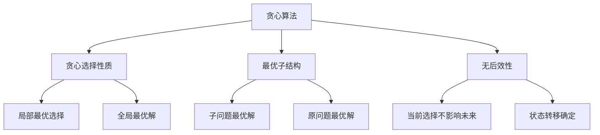

# 贪心算法

## 📖 核心概念

**贪心算法**是一种在每一步选择中都采取在当前状态下最好或最优的选择，从而希望导致结果是最好或最优的算法。贪心算法通常用于解决优化问题。

### 🏗️ 贪心算法特征



## 🔧 贪心算法实现

### 活动选择问题

```cpp
class ActivitySelection {
private:
    struct Activity {
        int start;
        int finish;
        int id;
        
        Activity(int s, int f, int i) : start(s), finish(f), id(i) {}
    };
    
public:
    vector<Activity> selectActivities(vector<Activity>& activities) {
        // 按结束时间排序
        sort(activities.begin(), activities.end(), 
             [](const Activity& a, const Activity& b) {
                 return a.finish < b.finish;
             });
        
        vector<Activity> selected;
        selected.push_back(activities[0]);
        
        int lastFinish = activities[0].finish;
        
        for (int i = 1; i < activities.size(); ++i) {
            if (activities[i].start >= lastFinish) {
                selected.push_back(activities[i]);
                lastFinish = activities[i].finish;
            }
        }
        
        return selected;
    }
    
    void displayActivities(const vector<Activity>& activities) {
        cout << "Selected Activities:" << endl;
        for (const auto& activity : activities) {
            cout << "Activity " << activity.id << ": " 
                 << activity.start << " - " << activity.finish << endl;
        }
    }
};
```

### 霍夫曼编码

```cpp
class HuffmanCoding {
private:
    struct Node {
        char data;
        int frequency;
        Node* left;
        Node* right;
        
        Node(char d, int freq) : data(d), frequency(freq), left(nullptr), right(nullptr) {}
    };
    
    struct Compare {
        bool operator()(Node* a, Node* b) {
            return a->frequency > b->frequency;
        }
    };
    
    void generateCodes(Node* root, string code, map<char, string>& codes) {
        if (!root) return;
        
        if (root->data != '\0') {
            codes[root->data] = code;
            return;
        }
        
        generateCodes(root->left, code + "0", codes);
        generateCodes(root->right, code + "1", codes);
    }
    
public:
    map<char, string> buildHuffmanTree(map<char, int>& frequencies) {
        priority_queue<Node*, vector<Node*>, Compare> pq;
        
        for (const auto& pair : frequencies) {
            pq.push(new Node(pair.first, pair.second));
        }
        
        while (pq.size() > 1) {
            Node* left = pq.top();
            pq.pop();
            
            Node* right = pq.top();
            pq.pop();
            
            Node* merged = new Node('\0', left->frequency + right->frequency);
            merged->left = left;
            merged->right = right;
            
            pq.push(merged);
        }
        
        Node* root = pq.top();
        map<char, string> codes;
        generateCodes(root, "", codes);
        
        return codes;
    }
    
    string encode(string text, map<char, string>& codes) {
        string encoded = "";
        for (char c : text) {
            encoded += codes[c];
        }
        return encoded;
    }
    
    void displayCodes(map<char, string>& codes) {
        cout << "Huffman Codes:" << endl;
        for (const auto& pair : codes) {
            cout << pair.first << ": " << pair.second << endl;
        }
    }
};
```

### 最小生成树 - Kruskal算法

```cpp
class KruskalMST {
private:
    struct Edge {
        int src, dest, weight;
        
        Edge(int s, int d, int w) : src(s), dest(d), weight(w) {}
    };
    
    struct UnionFind {
        vector<int> parent, rank;
        
        UnionFind(int n) : parent(n), rank(n, 0) {
            for (int i = 0; i < n; ++i) {
                parent[i] = i;
            }
        }
        
        int find(int x) {
            if (parent[x] != x) {
                parent[x] = find(parent[x]);
            }
            return parent[x];
        }
        
        void unite(int x, int y) {
            int px = find(x);
            int py = find(y);
            
            if (px == py) return;
            
            if (rank[px] < rank[py]) {
                parent[px] = py;
            } else if (rank[px] > rank[py]) {
                parent[py] = px;
            } else {
                parent[py] = px;
                rank[px]++;
            }
        }
    };
    
public:
    vector<Edge> findMST(vector<Edge>& edges, int vertices) {
        // 按权重排序
        sort(edges.begin(), edges.end(), 
             [](const Edge& a, const Edge& b) {
                 return a.weight < b.weight;
             });
        
        UnionFind uf(vertices);
        vector<Edge> mst;
        
        for (const Edge& edge : edges) {
            if (uf.find(edge.src) != uf.find(edge.dest)) {
                mst.push_back(edge);
                uf.unite(edge.src, edge.dest);
            }
        }
        
        return mst;
    }
    
    void displayMST(const vector<Edge>& mst) {
        cout << "Minimum Spanning Tree:" << endl;
        int totalWeight = 0;
        
        for (const Edge& edge : mst) {
            cout << edge.src << " - " << edge.dest << " : " << edge.weight << endl;
            totalWeight += edge.weight;
        }
        
        cout << "Total Weight: " << totalWeight << endl;
    }
};
```

## 🎯 贪心算法应用

### 找零问题

```cpp
class CoinChange {
private:
    vector<int> coins;
    
public:
    CoinChange(const vector<int>& coinValues) : coins(coinValues) {
        sort(coins.begin(), coins.end(), greater<int>());
    }
    
    map<int, int> makeChange(int amount) {
        map<int, int> change;
        
        for (int coin : coins) {
            if (amount >= coin) {
                int count = amount / coin;
                change[coin] = count;
                amount -= count * coin;
            }
        }
        
        return change;
    }
    
    void displayChange(const map<int, int>& change) {
        cout << "Coin Change:" << endl;
        for (const auto& pair : change) {
            cout << pair.first << " cents: " << pair.second << " coins" << endl;
        }
    }
};
```

### 区间调度问题

```cpp
class IntervalScheduling {
private:
    struct Interval {
        int start;
        int end;
        int weight;
        
        Interval(int s, int e, int w) : start(s), end(e), weight(w) {}
    };
    
public:
    vector<Interval> selectIntervals(vector<Interval>& intervals) {
        // 按结束时间排序
        sort(intervals.begin(), intervals.end(), 
             [](const Interval& a, const Interval& b) {
                 return a.end < b.end;
             });
        
        vector<Interval> selected;
        selected.push_back(intervals[0]);
        
        int lastEnd = intervals[0].end;
        
        for (int i = 1; i < intervals.size(); ++i) {
            if (intervals[i].start >= lastEnd) {
                selected.push_back(intervals[i]);
                lastEnd = intervals[i].end;
            }
        }
        
        return selected;
    }
    
    void displayIntervals(const vector<Interval>& intervals) {
        cout << "Selected Intervals:" << endl;
        for (const auto& interval : intervals) {
            cout << "[" << interval.start << ", " << interval.end 
                 << "] weight: " << interval.weight << endl;
        }
    }
};
```

### 分数背包问题

```cpp
class FractionalKnapsack {
private:
    struct Item {
        int weight;
        int value;
        double ratio;
        
        Item(int w, int v) : weight(w), value(v), ratio((double)v / w) {}
    };
    
public:
    double solveKnapsack(vector<Item>& items, int capacity) {
        // 按价值密度排序
        sort(items.begin(), items.end(), 
             [](const Item& a, const Item& b) {
                 return a.ratio > b.ratio;
             });
        
        double totalValue = 0.0;
        int remainingCapacity = capacity;
        
        for (const Item& item : items) {
            if (remainingCapacity >= item.weight) {
                totalValue += item.value;
                remainingCapacity -= item.weight;
            } else {
                totalValue += item.ratio * remainingCapacity;
                break;
            }
        }
        
        return totalValue;
    }
    
    void displayItems(const vector<Item>& items) {
        cout << "Items (sorted by value density):" << endl;
        for (const auto& item : items) {
            cout << "Weight: " << item.weight << ", Value: " << item.value 
                 << ", Ratio: " << item.ratio << endl;
        }
    }
};
```

## 📊 贪心算法分析

### 正确性证明

```cpp
class GreedyAlgorithmProof {
public:
    static void proveActivitySelection() {
        cout << "Activity Selection Greedy Algorithm Proof:" << endl;
        cout << "=========================================" << endl;
        
        cout << "1. Greedy Choice Property:" << endl;
        cout << "   - Always select the activity with earliest finish time" << endl;
        cout << "   - This choice is safe because it leaves maximum room for other activities" << endl;
        
        cout << "2. Optimal Substructure:" << endl;
        cout << "   - After making the greedy choice, the remaining problem is to select" << endl;
        cout << "     activities from the remaining compatible activities" << endl;
        cout << "   - The optimal solution to the subproblem plus the greedy choice" << endl;
        cout << "     gives the optimal solution to the original problem" << endl;
        
        cout << "3. Proof by Contradiction:" << endl;
        cout << "   - Assume there exists an optimal solution that doesn't include" << endl;
        cout << "     the activity with earliest finish time" << endl;
        cout << "   - We can replace the first activity in the optimal solution" << endl;
        cout << "     with the activity having earliest finish time" << endl;
        cout << "   - This gives a solution with at least as many activities" << endl;
        cout << "   - Contradiction!" << endl;
    }
    
    static void proveHuffmanCoding() {
        cout << "Huffman Coding Greedy Algorithm Proof:" << endl;
        cout << "=====================================" << endl;
        
        cout << "1. Greedy Choice Property:" << endl;
        cout << "   - Always merge the two characters with lowest frequencies" << endl;
        cout << "   - This choice is safe because it minimizes the total cost" << endl;
        
        cout << "2. Optimal Substructure:" << endl;
        cout << "   - After merging two characters, the remaining problem is to" << endl;
        cout << "     build a Huffman tree for the remaining characters" << endl;
        cout << "   - The optimal solution to the subproblem plus the greedy choice" << endl;
        cout << "     gives the optimal solution to the original problem" << endl;
        
        cout << "3. Proof by Exchange Argument:" << endl;
        cout << "   - Any optimal solution can be transformed to use the greedy choice" << endl;
        cout << "   - without increasing the total cost" << endl;
    }
};
```

### 贪心算法局限性

```cpp
class GreedyAlgorithmLimitations {
public:
    static void demonstrateLimitations() {
        cout << "Greedy Algorithm Limitations:" << endl;
        cout << "=============================" << endl;
        
        cout << "1. 0/1 Knapsack Problem:" << endl;
        cout << "   - Greedy by value density fails" << endl;
        cout << "   - Example: items (10, 60), (20, 100), (30, 120), capacity 50" << endl;
        cout << "   - Greedy choice: (20, 100) + (30, 120) = 220" << endl;
        cout << "   - Optimal choice: (10, 60) + (30, 120) = 180" << endl;
        cout << "   - But (10, 60) + (20, 100) = 160 is better!" << endl;
        
        cout << "2. Traveling Salesman Problem:" << endl;
        cout << "   - Nearest neighbor heuristic fails" << endl;
        cout << "   - May get stuck in local optima" << endl;
        cout << "   - No guarantee of optimal solution" << endl;
        
        cout << "3. Graph Coloring:" << endl;
        cout << "   - Greedy coloring may use more colors than necessary" << endl;
        cout << "   - Example: bipartite graph with odd cycle" << endl;
        cout << "   - Greedy may use 3 colors when 2 suffice" << endl;
    }
    
    static void whenToUseGreedy() {
        cout << "When to Use Greedy Algorithms:" << endl;
        cout << "=============================" << endl;
        
        cout << "1. Problems with Greedy Choice Property:" << endl;
        cout << "   - Activity selection" << endl;
        cout << "   - Fractional knapsack" << endl;
        cout << "   - Minimum spanning tree" << endl;
        
        cout << "2. Problems with Optimal Substructure:" << endl;
        cout << "   - Shortest path in DAG" << endl;
        cout << "   - Huffman coding" << endl;
        cout << "   - Task scheduling" << endl;
        
        cout << "3. Problems where Greedy is Optimal:" << endl;
        cout << "   - Prim's algorithm for MST" << endl;
        cout << "   - Kruskal's algorithm for MST" << endl;
        cout << "   - Dijkstra's algorithm for shortest path" << endl;
    }
};
```

## 🎮 贪心算法应用

### 1. 贪心算法测试

```cpp
class GreedyAlgorithmTest {
public:
    static void testActivitySelection() {
        cout << "Testing Activity Selection:" << endl;
        cout << "=========================" << endl;
        
        vector<ActivitySelection::Activity> activities = {
            {1, 4}, {3, 5}, {0, 6}, {5, 7}, {8, 9}, {5, 9}
        };
        
        ActivitySelection activitySelection;
        vector<ActivitySelection::Activity> selected = activitySelection.selectActivities(activities);
        
        activitySelection.displayActivities(selected);
    }
    
    static void testHuffmanCoding() {
        cout << "Testing Huffman Coding:" << endl;
        cout << "=====================" << endl;
        
        map<char, int> frequencies = {
            {'a', 5}, {'b', 9}, {'c', 12}, {'d', 13}, {'e', 16}, {'f', 45}
        };
        
        HuffmanCoding huffman;
        map<char, string> codes = huffman.buildHuffmanTree(frequencies);
        
        huffman.displayCodes(codes);
        
        string text = "abcdef";
        string encoded = huffman.encode(text, codes);
        cout << "Encoded text: " << encoded << endl;
    }
    
    static void testKruskalMST() {
        cout << "Testing Kruskal MST:" << endl;
        cout << "===================" << endl;
        
        vector<KruskalMST::Edge> edges = {
            {0, 1, 10}, {0, 2, 6}, {0, 3, 5}, {1, 3, 15}, {2, 3, 4}
        };
        
        KruskalMST kruskal;
        vector<KruskalMST::Edge> mst = kruskal.findMST(edges, 4);
        
        kruskal.displayMST(mst);
    }
    
    static void testCoinChange() {
        cout << "Testing Coin Change:" << endl;
        cout << "===================" << endl;
        
        vector<int> coins = {1, 5, 10, 25};
        CoinChange coinChange(coins);
        
        int amount = 67;
        map<int, int> change = coinChange.makeChange(amount);
        
        coinChange.displayChange(change);
    }
    
    static void testFractionalKnapsack() {
        cout << "Testing Fractional Knapsack:" << endl;
        cout << "===========================" << endl;
        
        vector<FractionalKnapsack::Item> items = {
            {10, 60}, {20, 100}, {30, 120}
        };
        
        FractionalKnapsack knapsack;
        double maxValue = knapsack.solveKnapsack(items, 50);
        
        cout << "Maximum value: " << maxValue << endl;
    }
};
```

### 2. 贪心算法性能测试

```cpp
class GreedyAlgorithmPerformanceTest {
public:
    static void performanceTest() {
        cout << "Greedy Algorithm Performance Test:" << endl;
        cout << "=================================" << endl;
        
        vector<int> sizes = {1000, 5000, 10000};
        
        for (int size : sizes) {
            cout << "Testing with " << size << " activities:" << endl;
            
            vector<ActivitySelection::Activity> activities;
            for (int i = 0; i < size; ++i) {
                int start = rand() % 100;
                int end = start + rand() % 50 + 1;
                activities.push_back(ActivitySelection::Activity(start, end, i));
            }
            
            ActivitySelection activitySelection;
            auto start = chrono::high_resolution_clock::now();
            vector<ActivitySelection::Activity> selected = activitySelection.selectActivities(activities);
            auto end = chrono::high_resolution_clock::now();
            auto duration = chrono::duration_cast<chrono::microseconds>(end - start);
            
            cout << "Activity Selection: " << duration.count() << " microseconds" << endl;
            cout << "Selected activities: " << selected.size() << endl;
            cout << endl;
        }
    }
};
```

## 🔗 相关链接

- [[01-算法思想|算法思想]]
- [[02-分治策略|分治策略]]
- [[04-动态规划思想|动态规划思想]]

## 💡 贪心算法要点

1. **贪心选择性质**: 局部最优选择导致全局最优解
2. **最优子结构**: 问题的最优解包含子问题的最优解
3. **无后效性**: 当前选择不影响未来的选择
4. **局限性**: 不是所有问题都适合贪心算法

---

*📝 贪心提示：贪心算法简单高效，但需要证明其正确性，适用于特定类型的问题*
