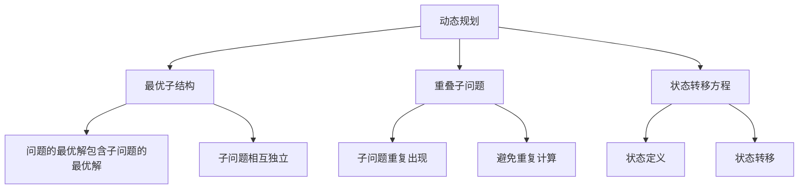

# 动态规划思想

## 📖 核心概念

**动态规划**是一种通过把原问题分解为相对简单的子问题的方式求解复杂问题的方法。动态规划常常适用于有重叠子问题和最优子结构性质的问题。

### 🏗️ 动态规划特征



## 🔧 动态规划实现

### 斐波那契数列

```cpp
class FibonacciDP {
private:
    map<int, long long> memo;
    
public:
    // 自顶向下（记忆化递归）
    long long fibonacciMemo(int n) {
        if (n <= 1) return n;
        
        if (memo.find(n) != memo.end()) {
            return memo[n];
        }
        
        memo[n] = fibonacciMemo(n - 1) + fibonacciMemo(n - 2);
        return memo[n];
    }
    
    // 自底向上（迭代）
    long long fibonacciIterative(int n) {
        if (n <= 1) return n;
        
        long long prev2 = 0, prev1 = 1;
        for (int i = 2; i <= n; ++i) {
            long long current = prev1 + prev2;
            prev2 = prev1;
            prev1 = current;
        }
        
        return prev1;
    }
    
    // 空间优化的迭代版本
    long long fibonacciOptimized(int n) {
        if (n <= 1) return n;
        
        long long a = 0, b = 1;
        for (int i = 2; i <= n; ++i) {
            long long temp = a + b;
            a = b;
            b = temp;
        }
        
        return b;
    }
    
    void displaySequence(int n) {
        cout << "Fibonacci sequence up to " << n << ":" << endl;
        for (int i = 0; i <= n; ++i) {
            cout << "F(" << i << ") = " << fibonacciOptimized(i) << endl;
        }
    }
};
```

### 最长公共子序列

```cpp
class LongestCommonSubsequence {
private:
    vector<vector<int>> dp;
    
public:
    int lcsLength(string& text1, string& text2) {
        int m = text1.length();
        int n = text2.length();
        
        dp.resize(m + 1, vector<int>(n + 1, 0));
        
        for (int i = 1; i <= m; ++i) {
            for (int j = 1; j <= n; ++j) {
                if (text1[i - 1] == text2[j - 1]) {
                    dp[i][j] = dp[i - 1][j - 1] + 1;
                } else {
                    dp[i][j] = max(dp[i - 1][j], dp[i][j - 1]);
                }
            }
        }
        
        return dp[m][n];
    }
    
    string lcsString(string& text1, string& text2) {
        int m = text1.length();
        int n = text2.length();
        
        lcsLength(text1, text2);
        
        string result = "";
        int i = m, j = n;
        
        while (i > 0 && j > 0) {
            if (text1[i - 1] == text2[j - 1]) {
                result = text1[i - 1] + result;
                i--;
                j--;
            } else if (dp[i - 1][j] > dp[i][j - 1]) {
                i--;
            } else {
                j--;
            }
        }
        
        return result;
    }
    
    void displayDPTable(string& text1, string& text2) {
        lcsLength(text1, text2);
        
        cout << "DP Table:" << endl;
        cout << "  ";
        for (char c : text2) {
            cout << c << " ";
        }
        cout << endl;
        
        for (int i = 0; i <= text1.length(); ++i) {
            if (i > 0) cout << text1[i - 1] << " ";
            else cout << "  ";
            
            for (int j = 0; j <= text2.length(); ++j) {
                cout << dp[i][j] << " ";
            }
            cout << endl;
        }
    }
};
```

### 编辑距离

```cpp
class EditDistance {
private:
    vector<vector<int>> dp;
    
public:
    int minDistance(string word1, string word2) {
        int m = word1.length();
        int n = word2.length();
        
        dp.resize(m + 1, vector<int>(n + 1, 0));
        
        // 初始化
        for (int i = 0; i <= m; ++i) {
            dp[i][0] = i;
        }
        for (int j = 0; j <= n; ++j) {
            dp[0][j] = j;
        }
        
        // 填充DP表
        for (int i = 1; i <= m; ++i) {
            for (int j = 1; j <= n; ++j) {
                if (word1[i - 1] == word2[j - 1]) {
                    dp[i][j] = dp[i - 1][j - 1];
                } else {
                    dp[i][j] = min({
                        dp[i - 1][j] + 1,      // 删除
                        dp[i][j - 1] + 1,      // 插入
                        dp[i - 1][j - 1] + 1   // 替换
                    });
                }
            }
        }
        
        return dp[m][n];
    }
    
    void displayOperations(string word1, string word2) {
        int m = word1.length();
        int n = word2.length();
        
        minDistance(word1, word2);
        
        cout << "Edit Operations:" << endl;
        int i = m, j = n;
        
        while (i > 0 || j > 0) {
            if (i > 0 && j > 0 && word1[i - 1] == word2[j - 1]) {
                cout << "Keep: " << word1[i - 1] << endl;
                i--;
                j--;
            } else if (i > 0 && dp[i][j] == dp[i - 1][j] + 1) {
                cout << "Delete: " << word1[i - 1] << endl;
                i--;
            } else if (j > 0 && dp[i][j] == dp[i][j - 1] + 1) {
                cout << "Insert: " << word2[j - 1] << endl;
                j--;
            } else {
                cout << "Replace: " << word1[i - 1] << " -> " << word2[j - 1] << endl;
                i--;
                j--;
            }
        }
    }
};
```

## 🎯 动态规划应用

### 背包问题

```cpp
class KnapsackDP {
private:
    vector<vector<int>> dp;
    
public:
    int knapsack01(vector<int>& weights, vector<int>& values, int capacity) {
        int n = weights.size();
        dp.resize(n + 1, vector<int>(capacity + 1, 0));
        
        for (int i = 1; i <= n; ++i) {
            for (int w = 1; w <= capacity; ++w) {
                if (weights[i - 1] <= w) {
                    dp[i][w] = max(
                        dp[i - 1][w],  // 不选择当前物品
                        dp[i - 1][w - weights[i - 1]] + values[i - 1]  // 选择当前物品
                    );
                } else {
                    dp[i][w] = dp[i - 1][w];
                }
            }
        }
        
        return dp[n][capacity];
    }
    
    vector<int> getSelectedItems(vector<int>& weights, vector<int>& values, int capacity) {
        int n = weights.size();
        vector<int> selected;
        
        int i = n, w = capacity;
        while (i > 0 && w > 0) {
            if (dp[i][w] != dp[i - 1][w]) {
                selected.push_back(i - 1);
                w -= weights[i - 1];
            }
            i--;
        }
        
        reverse(selected.begin(), selected.end());
        return selected;
    }
    
    void displayDPTable(vector<int>& weights, vector<int>& values, int capacity) {
        knapsack01(weights, values, capacity);
        
        cout << "DP Table:" << endl;
        cout << "  ";
        for (int w = 0; w <= capacity; ++w) {
            cout << w << " ";
        }
        cout << endl;
        
        for (int i = 0; i <= weights.size(); ++i) {
            cout << i << " ";
            for (int w = 0; w <= capacity; ++w) {
                cout << dp[i][w] << " ";
            }
            cout << endl;
        }
    }
};
```

### 最长递增子序列

```cpp
class LongestIncreasingSubsequence {
private:
    vector<int> dp;
    vector<int> parent;
    
public:
    int lengthOfLIS(vector<int>& nums) {
        int n = nums.size();
        dp.resize(n, 1);
        parent.resize(n, -1);
        
        int maxLength = 1;
        int maxIndex = 0;
        
        for (int i = 1; i < n; ++i) {
            for (int j = 0; j < i; ++j) {
                if (nums[j] < nums[i] && dp[j] + 1 > dp[i]) {
                    dp[i] = dp[j] + 1;
                    parent[i] = j;
                }
            }
            
            if (dp[i] > maxLength) {
                maxLength = dp[i];
                maxIndex = i;
            }
        }
        
        return maxLength;
    }
    
    vector<int> getLIS(vector<int>& nums) {
        int n = nums.size();
        lengthOfLIS(nums);
        
        int maxLength = 0;
        int maxIndex = 0;
        
        for (int i = 0; i < n; ++i) {
            if (dp[i] > maxLength) {
                maxLength = dp[i];
                maxIndex = i;
            }
        }
        
        vector<int> lis;
        int current = maxIndex;
        
        while (current != -1) {
            lis.push_back(nums[current]);
            current = parent[current];
        }
        
        reverse(lis.begin(), lis.end());
        return lis;
    }
    
    void displayLIS(vector<int>& nums) {
        vector<int> lis = getLIS(nums);
        
        cout << "Longest Increasing Subsequence:" << endl;
        cout << "Length: " << lis.size() << endl;
        cout << "Sequence: ";
        for (int num : lis) {
            cout << num << " ";
        }
        cout << endl;
    }
};
```

### 股票买卖问题

```cpp
class StockTradingDP {
private:
    vector<vector<int>> dp;
    
public:
    int maxProfit(vector<int>& prices) {
        int n = prices.size();
        if (n <= 1) return 0;
        
        dp.resize(n, vector<int>(2, 0));
        
        // dp[i][0] = 第i天不持有股票的最大利润
        // dp[i][1] = 第i天持有股票的最大利润
        
        dp[0][0] = 0;
        dp[0][1] = -prices[0];
        
        for (int i = 1; i < n; ++i) {
            dp[i][0] = max(dp[i - 1][0], dp[i - 1][1] + prices[i]);
            dp[i][1] = max(dp[i - 1][1], dp[i - 1][0] - prices[i]);
        }
        
        return dp[n - 1][0];
    }
    
    int maxProfitWithCooldown(vector<int>& prices) {
        int n = prices.size();
        if (n <= 1) return 0;
        
        dp.resize(n, vector<int>(3, 0));
        
        // dp[i][0] = 第i天不持有股票（非冷冻期）
        // dp[i][1] = 第i天持有股票
        // dp[i][2] = 第i天不持有股票（冷冻期）
        
        dp[0][0] = 0;
        dp[0][1] = -prices[0];
        dp[0][2] = 0;
        
        for (int i = 1; i < n; ++i) {
            dp[i][0] = max(dp[i - 1][0], dp[i - 1][2]);
            dp[i][1] = max(dp[i - 1][1], dp[i - 1][0] - prices[i]);
            dp[i][2] = dp[i - 1][1] + prices[i];
        }
        
        return max(dp[n - 1][0], dp[n - 1][2]);
    }
    
    void displayTradingStrategy(vector<int>& prices) {
        int n = prices.size();
        maxProfit(prices);
        
        cout << "Trading Strategy:" << endl;
        for (int i = 0; i < n; ++i) {
            cout << "Day " << i << " (Price: " << prices[i] << "): ";
            if (dp[i][1] > dp[i][0]) {
                cout << "Hold" << endl;
            } else {
                cout << "Sell" << endl;
            }
        }
    }
};
```

## 📊 动态规划分析

### 时间复杂度分析

```cpp
class DynamicProgrammingAnalysis {
public:
    static void analyzeTimeComplexity() {
        cout << "Dynamic Programming Time Complexity Analysis:" << endl;
        cout << "===========================================" << endl;
        
        cout << "1. Fibonacci:" << endl;
        cout << "   - Naive Recursion: O(2^n)" << endl;
        cout << "   - Memoization: O(n)" << endl;
        cout << "   - Iterative: O(n)" << endl;
        
        cout << "2. Longest Common Subsequence:" << endl;
        cout << "   - Time Complexity: O(m * n)" << endl;
        cout << "   - Space Complexity: O(m * n)" << endl;
        
        cout << "3. Edit Distance:" << endl;
        cout << "   - Time Complexity: O(m * n)" << endl;
        cout << "   - Space Complexity: O(m * n)" << endl;
        
        cout << "4. 0/1 Knapsack:" << endl;
        cout << "   - Time Complexity: O(n * W)" << endl;
        cout << "   - Space Complexity: O(n * W)" << endl;
        
        cout << "5. Longest Increasing Subsequence:" << endl;
        cout << "   - Time Complexity: O(n²)" << endl;
        cout << "   - Space Complexity: O(n)" << endl;
    }
    
    static void analyzeSpaceComplexity() {
        cout << "Dynamic Programming Space Complexity Analysis:" << endl;
        cout << "=============================================" << endl;
        
        cout << "1. Space Optimization Techniques:" << endl;
        cout << "   - Rolling Array: Reduce 2D to 1D" << endl;
        cout << "   - State Compression: Use bit manipulation" << endl;
        cout << "   - Memoization: Only store necessary states" << endl;
        
        cout << "2. Space-Time Tradeoff:" << endl;
        cout << "   - More space for less time" << endl;
        cout << "   - Less space for more time" << endl;
        cout << "   - Choose based on constraints" << endl;
    }
};
```

### 动态规划优化

```cpp
class DynamicProgrammingOptimization {
public:
    static void optimizeSpace(vector<int>& weights, vector<int>& values, int capacity) {
        int n = weights.size();
        vector<int> dp(capacity + 1, 0);
        
        for (int i = 0; i < n; ++i) {
            for (int w = capacity; w >= weights[i]; --w) {
                dp[w] = max(dp[w], dp[w - weights[i]] + values[i]);
            }
        }
        
        cout << "Optimized Space Knapsack Result: " << dp[capacity] << endl;
    }
    
    static void optimizeTime(vector<int>& nums) {
        int n = nums.size();
        vector<int> tails;
        
        for (int num : nums) {
            auto it = lower_bound(tails.begin(), tails.end(), num);
            if (it == tails.end()) {
                tails.push_back(num);
            } else {
                *it = num;
            }
        }
        
        cout << "Optimized Time LIS Length: " << tails.size() << endl;
    }
    
    static void displayOptimizationTips() {
        cout << "Dynamic Programming Optimization Tips:" << endl;
        cout << "=====================================" << endl;
        
        cout << "1. Space Optimization:" << endl;
        cout << "   - Use rolling arrays" << endl;
        cout << "   - Compress states" << endl;
        cout << "   - Use memoization" << endl;
        
        cout << "2. Time Optimization:" << endl;
        cout << "   - Use binary search" << endl;
        cout << "   - Optimize state transitions" << endl;
        cout << "   - Use data structures" << endl;
        
        cout << "3. General Tips:" << endl;
        cout << "   - Identify overlapping subproblems" << endl;
        cout << "   - Define clear state transitions" << endl;
        cout << "   - Use bottom-up approach when possible" << endl;
    }
};
```

## 🎮 动态规划应用

### 1. 动态规划测试

```cpp
class DynamicProgrammingTest {
public:
    static void testFibonacci() {
        cout << "Testing Fibonacci:" << endl;
        cout << "=================" << endl;
        
        FibonacciDP fib;
        int n = 10;
        
        cout << "Fibonacci(" << n << ") = " << fib.fibonacciOptimized(n) << endl;
        fib.displaySequence(n);
    }
    
    static void testLCS() {
        cout << "Testing Longest Common Subsequence:" << endl;
        cout << "==================================" << endl;
        
        string text1 = "ABCDGH";
        string text2 = "AEDFHR";
        
        LongestCommonSubsequence lcs;
        int length = lcs.lcsLength(text1, text2);
        string sequence = lcs.lcsString(text1, text2);
        
        cout << "LCS Length: " << length << endl;
        cout << "LCS Sequence: " << sequence << endl;
    }
    
    static void testEditDistance() {
        cout << "Testing Edit Distance:" << endl;
        cout << "====================" << endl;
        
        string word1 = "kitten";
        string word2 = "sitting";
        
        EditDistance ed;
        int distance = ed.minDistance(word1, word2);
        
        cout << "Edit Distance: " << distance << endl;
        ed.displayOperations(word1, word2);
    }
    
    static void testKnapsack() {
        cout << "Testing 0/1 Knapsack:" << endl;
        cout << "====================" << endl;
        
        vector<int> weights = {10, 20, 30};
        vector<int> values = {60, 100, 120};
        int capacity = 50;
        
        KnapsackDP knapsack;
        int maxValue = knapsack.knapsack01(weights, values, capacity);
        vector<int> selected = knapsack.getSelectedItems(weights, values, capacity);
        
        cout << "Maximum Value: " << maxValue << endl;
        cout << "Selected Items: ";
        for (int item : selected) {
            cout << item << " ";
        }
        cout << endl;
    }
    
    static void testLIS() {
        cout << "Testing Longest Increasing Subsequence:" << endl;
        cout << "=====================================" << endl;
        
        vector<int> nums = {10, 9, 2, 5, 3, 7, 101, 18};
        
        LongestIncreasingSubsequence lis;
        int length = lis.lengthOfLIS(nums);
        lis.displayLIS(nums);
    }
};
```

### 2. 动态规划性能测试

```cpp
class DynamicProgrammingPerformanceTest {
public:
    static void performanceTest() {
        cout << "Dynamic Programming Performance Test:" << endl;
        cout << "===================================" << endl;
        
        vector<int> sizes = {100, 500, 1000};
        
        for (int size : sizes) {
            cout << "Testing with " << size << " elements:" << endl;
            
            vector<int> nums(size);
            for (int i = 0; i < size; ++i) {
                nums[i] = rand() % 1000;
            }
            
            LongestIncreasingSubsequence lis;
            auto start = chrono::high_resolution_clock::now();
            int length = lis.lengthOfLIS(nums);
            auto end = chrono::high_resolution_clock::now();
            auto duration = chrono::duration_cast<chrono::microseconds>(end - start);
            
            cout << "LIS Length: " << length << endl;
            cout << "Execution Time: " << duration.count() << " microseconds" << endl;
            cout << endl;
        }
    }
};
```

## 🔗 相关链接

- [[01-算法思想|算法思想]]
- [[02-分治策略|分治策略]]
- [[03-贪心算法|贪心算法]]

## 💡 动态规划要点

1. **最优子结构**: 问题的最优解包含子问题的最优解
2. **重叠子问题**: 子问题重复出现，需要避免重复计算
3. **状态转移方程**: 定义状态之间的转移关系
4. **空间优化**: 通过滚动数组等技术减少空间复杂度

---

*📝 动态规划提示：动态规划是解决复杂优化问题的重要方法，需要仔细分析问题结构*
