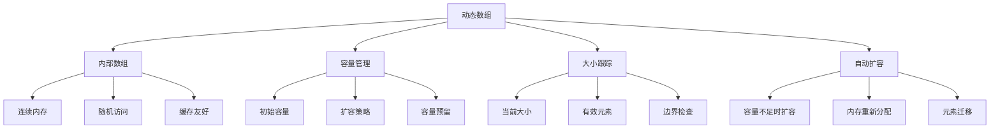

# 动态数组实现

## 📖 核心概念

**动态数组**是一种可以自动调整大小的数组数据结构。它结合了数组的随机访问优势和链表的动态大小特性，是现代编程语言中最重要的数据结构之一。

### 🏗️ 动态数组组成要素



## 🔧 核心实现

### 基础动态数组类

```cpp
template<typename T>
class DynamicArray {
private:
    T* data;           // 内部数组指针
    size_t capacity;   // 当前容量
    size_t size;       // 当前大小
    
    // 扩容策略
    void resize(size_t newCapacity) {
        T* newData = new T[newCapacity];
        
        // 迁移现有元素
        for (size_t i = 0; i < size; ++i) {
            newData[i] = std::move(data[i]);
        }
        
        // 清理旧内存
        delete[] data;
        data = newData;
        capacity = newCapacity;
    }
    
    // 确保容量足够
    void ensureCapacity(size_t minCapacity) {
        if (minCapacity > capacity) {
            size_t newCapacity = max(capacity * 2, minCapacity);
            resize(newCapacity);
        }
    }
    
public:
    // 构造函数
    DynamicArray() : data(nullptr), capacity(0), size(0) {}
    
    DynamicArray(size_t initialCapacity) 
        : capacity(initialCapacity), size(0) {
        data = new T[capacity];
    }
    
    // 析构函数
    ~DynamicArray() {
        delete[] data;
    }
    
    // 拷贝构造函数
    DynamicArray(const DynamicArray& other) 
        : capacity(other.capacity), size(other.size) {
        data = new T[capacity];
        for (size_t i = 0; i < size; ++i) {
            data[i] = other.data[i];
        }
    }
    
    // 赋值操作符
    DynamicArray& operator=(const DynamicArray& other) {
        if (this != &other) {
            delete[] data;
            capacity = other.capacity;
            size = other.size;
            data = new T[capacity];
            for (size_t i = 0; i < size; ++i) {
                data[i] = other.data[i];
            }
        }
        return *this;
    }
    
    // 移动构造函数
    DynamicArray(DynamicArray&& other) noexcept
        : data(other.data), capacity(other.capacity), size(other.size) {
        other.data = nullptr;
        other.capacity = 0;
        other.size = 0;
    }
    
    // 移动赋值操作符
    DynamicArray& operator=(DynamicArray&& other) noexcept {
        if (this != &other) {
            delete[] data;
            data = other.data;
            capacity = other.capacity;
            size = other.size;
            
            other.data = nullptr;
            other.capacity = 0;
            other.size = 0;
        }
        return *this;
    }
};
```

### 核心操作方法

```cpp
    // 添加元素到末尾
    void push_back(const T& value) {
        ensureCapacity(size + 1);
        data[size++] = value;
    }
    
    void push_back(T&& value) {
        ensureCapacity(size + 1);
        data[size++] = std::move(value);
    }
    
    // 在指定位置插入元素
    void insert(size_t index, const T& value) {
        if (index > size) {
            throw std::out_of_range("Index out of range");
        }
        
        ensureCapacity(size + 1);
        
        // 向后移动元素
        for (size_t i = size; i > index; --i) {
            data[i] = std::move(data[i - 1]);
        }
        
        data[index] = value;
        size++;
    }
    
    // 删除末尾元素
    void pop_back() {
        if (size > 0) {
            size--;
        }
    }
    
    // 删除指定位置的元素
    void erase(size_t index) {
        if (index >= size) {
            throw std::out_of_range("Index out of range");
        }
        
        // 向前移动元素
        for (size_t i = index; i < size - 1; ++i) {
            data[i] = std::move(data[i + 1]);
        }
        
        size--;
    }
    
    // 访问元素
    T& operator[](size_t index) {
        if (index >= size) {
            throw std::out_of_range("Index out of range");
        }
        return data[index];
    }
    
    const T& operator[](size_t index) const {
        if (index >= size) {
            throw std::out_of_range("Index out of range");
        }
        return data[index];
    }
    
    // 安全访问
    T& at(size_t index) {
        if (index >= size) {
            throw std::out_of_range("Index out of range");
        }
        return data[index];
    }
    
    const T& at(size_t index) const {
        if (index >= size) {
            throw std::out_of_range("Index out of range");
        }
        return data[index];
    }
    
    // 获取首尾元素
    T& front() {
        if (size == 0) {
            throw std::runtime_error("Array is empty");
        }
        return data[0];
    }
    
    const T& front() const {
        if (size == 0) {
            throw std::runtime_error("Array is empty");
        }
        return data[0];
    }
    
    T& back() {
        if (size == 0) {
            throw std::runtime_error("Array is empty");
        }
        return data[size - 1];
    }
    
    const T& back() const {
        if (size == 0) {
            throw std::runtime_error("Array is empty");
        }
        return data[size - 1];
    }
    
    // 状态查询
    size_t getSize() const { return size; }
    size_t getCapacity() const { return capacity; }
    bool isEmpty() const { return size == 0; }
    
    // 容量管理
    void reserve(size_t newCapacity) {
        if (newCapacity > capacity) {
            resize(newCapacity);
        }
    }
    
    void shrink_to_fit() {
        if (size < capacity) {
            resize(size);
        }
    }
    
    // 清空数组
    void clear() {
        size = 0;
    }
};
```

## 📊 性能分析

### 时间复杂度

| 操作 | 平均情况 | 最坏情况 | 说明 |
|------|----------|----------|------|
| **访问** | O(1) | O(1) | 随机访问 |
| **插入末尾** | O(1) | O(n) | 扩容时需要O(n) |
| **插入中间** | O(n) | O(n) | 需要移动元素 |
| **删除末尾** | O(1) | O(1) | 直接减少大小 |
| **删除中间** | O(n) | O(n) | 需要移动元素 |
| **查找** | O(n) | O(n) | 线性搜索 |

### 空间复杂度

| 情况 | 空间复杂度 | 说明 |
|------|------------|------|
| **存储** | O(n) | n个元素 |
| **额外空间** | O(1) | 常数个变量 |
| **扩容时** | O(n) | 临时需要2倍空间 |

## 🎯 优化策略

### 1. 扩容策略优化

```cpp
class OptimizedDynamicArray {
private:
    static constexpr size_t INITIAL_CAPACITY = 4;
    static constexpr double GROWTH_FACTOR = 1.5;
    
    void smartResize(size_t minCapacity) {
        size_t newCapacity;
        
        if (capacity == 0) {
            newCapacity = INITIAL_CAPACITY;
        } else {
            // 使用1.5倍增长因子，平衡内存使用和性能
            newCapacity = static_cast<size_t>(capacity * GROWTH_FACTOR);
        }
        
        // 确保新容量足够
        newCapacity = max(newCapacity, minCapacity);
        resize(newCapacity);
    }
};
```

### 2. 内存池优化

```cpp
class PooledDynamicArray {
private:
    struct MemoryPool {
        T* memory;
        size_t size;
        bool inUse;
        
        MemoryPool(size_t s) : size(s), inUse(false) {
            memory = new T[size];
        }
        
        ~MemoryPool() {
            delete[] memory;
        }
    };
    
    vector<unique_ptr<MemoryPool>> pools;
    
    T* allocateFromPool(size_t size) {
        // 查找合适的空闲池
        for (auto& pool : pools) {
            if (!pool->inUse && pool->size >= size) {
                pool->inUse = true;
                return pool->memory;
            }
        }
        
        // 创建新池
        auto newPool = make_unique<MemoryPool>(size);
        newPool->inUse = true;
        pools.push_back(std::move(newPool));
        return pools.back()->memory;
    }
};
```

### 3. 异常安全优化

```cpp
class ExceptionSafeDynamicArray {
private:
    void safeResize(size_t newCapacity) {
        T* newData = nullptr;
        
        try {
            newData = new T[newCapacity];
            
            // 使用RAII确保异常安全
            for (size_t i = 0; i < size; ++i) {
                new (newData + i) T(std::move(data[i]));
            }
            
        } catch (...) {
            // 清理已分配的内存
            if (newData) {
                for (size_t i = 0; i < size; ++i) {
                    newData[i].~T();
                }
                delete[] newData;
            }
            throw;
        }
        
        // 清理旧数据
        for (size_t i = 0; i < size; ++i) {
            data[i].~T();
        }
        delete[] data;
        
        data = newData;
        capacity = newCapacity;
    }
};
```

## 🔗 相关链接

- [[01-数组基础|数组基础]]
- [[03-多维数组|多维数组]]
- [[04-数组应用案例|数组应用]]

## 💡 动态数组要点

1. **自动扩容**：容量不足时自动扩展
2. **随机访问**：支持O(1)时间复杂度的元素访问
3. **内存效率**：连续存储，缓存友好
4. **异常安全**：提供强异常安全保证

---

*📝 实现提示：动态数组是现代C++中vector的基础，掌握其实现原理有助于理解STL容器*
