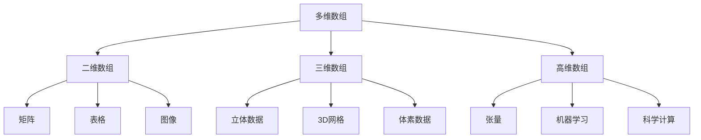

# 多维数组

## 📖 核心概念

**多维数组**是数组的扩展，可以表示二维、三维或更高维度的数据结构。它在科学计算、图像处理、游戏开发等领域有广泛应用。

### 🏗️ 多维数组结构



## 🔧 二维数组实现

### 基础二维数组类

```cpp
template<typename T>
class Matrix2D {
private:
    T* data;           // 一维数组存储
    size_t rows;       // 行数
    size_t cols;       // 列数
    size_t totalSize;  // 总元素数
    
    // 计算一维索引
    size_t getIndex(size_t row, size_t col) const {
        return row * cols + col;
    }
    
    // 边界检查
    void checkBounds(size_t row, size_t col) const {
        if (row >= rows || col >= cols) {
            throw std::out_of_range("Index out of bounds");
        }
    }
    
public:
    // 构造函数
    Matrix2D(size_t rows, size_t cols) 
        : rows(rows), cols(cols), totalSize(rows * cols) {
        data = new T[totalSize];
        // 初始化为零
        std::fill(data, data + totalSize, T{});
    }
    
    // 拷贝构造函数
    Matrix2D(const Matrix2D& other) 
        : rows(other.rows), cols(other.cols), totalSize(other.totalSize) {
        data = new T[totalSize];
        std::copy(other.data, other.data + totalSize, data);
    }
    
    // 析构函数
    ~Matrix2D() {
        delete[] data;
    }
    
    // 赋值操作符
    Matrix2D& operator=(const Matrix2D& other) {
        if (this != &other) {
            delete[] data;
            rows = other.rows;
            cols = other.cols;
            totalSize = other.totalSize;
            data = new T[totalSize];
            std::copy(other.data, other.data + totalSize, data);
        }
        return *this;
    }
    
    // 访问元素
    T& operator()(size_t row, size_t col) {
        checkBounds(row, col);
        return data[getIndex(row, col)];
    }
    
    const T& operator()(size_t row, size_t col) const {
        checkBounds(row, col);
        return data[getIndex(row, col)];
    }
    
    // 获取维度
    size_t getRows() const { return rows; }
    size_t getCols() const { return cols; }
    size_t getTotalSize() const { return totalSize; }
    
    // 矩阵运算
    Matrix2D operator+(const Matrix2D& other) const {
        if (rows != other.rows || cols != other.cols) {
            throw std::invalid_argument("Matrix dimensions must match");
        }
        
        Matrix2D result(rows, cols);
        for (size_t i = 0; i < totalSize; ++i) {
            result.data[i] = data[i] + other.data[i];
        }
        return result;
    }
    
    Matrix2D operator*(const Matrix2D& other) const {
        if (cols != other.rows) {
            throw std::invalid_argument("Matrix dimensions incompatible for multiplication");
        }
        
        Matrix2D result(rows, other.cols);
        for (size_t i = 0; i < rows; ++i) {
            for (size_t j = 0; j < other.cols; ++j) {
                T sum = T{};
                for (size_t k = 0; k < cols; ++k) {
                    sum += (*this)(i, k) * other(k, j);
                }
                result(i, j) = sum;
            }
        }
        return result;
    }
    
    // 转置
    Matrix2D transpose() const {
        Matrix2D result(cols, rows);
        for (size_t i = 0; i < rows; ++i) {
            for (size_t j = 0; j < cols; ++j) {
                result(j, i) = (*this)(i, j);
            }
        }
        return result;
    }
    
    // 打印矩阵
    void print() const {
        for (size_t i = 0; i < rows; ++i) {
            for (size_t j = 0; j < cols; ++j) {
                std::cout << (*this)(i, j) << " ";
            }
            std::cout << std::endl;
        }
    }
};
```

### 动态二维数组

```cpp
template<typename T>
class DynamicMatrix2D {
private:
    vector<vector<T>> data;
    size_t rows;
    size_t cols;
    
public:
    DynamicMatrix2D(size_t rows, size_t cols) 
        : rows(rows), cols(cols) {
        data.resize(rows);
        for (size_t i = 0; i < rows; ++i) {
            data[i].resize(cols);
        }
    }
    
    // 访问元素
    T& operator()(size_t row, size_t col) {
        return data[row][col];
    }
    
    const T& operator()(size_t row, size_t col) const {
        return data[row][col];
    }
    
    // 添加行
    void addRow(const vector<T>& row) {
        if (row.size() != cols) {
            throw std::invalid_argument("Row size must match column count");
        }
        data.push_back(row);
        rows++;
    }
    
    // 添加列
    void addColumn(const vector<T>& col) {
        if (col.size() != rows) {
            throw std::invalid_argument("Column size must match row count");
        }
        for (size_t i = 0; i < rows; ++i) {
            data[i].push_back(col[i]);
        }
        cols++;
    }
    
    // 删除行
    void removeRow(size_t rowIndex) {
        if (rowIndex >= rows) {
            throw std::out_of_range("Row index out of range");
        }
        data.erase(data.begin() + rowIndex);
        rows--;
    }
    
    // 删除列
    void removeColumn(size_t colIndex) {
        if (colIndex >= cols) {
            throw std::out_of_range("Column index out of range");
        }
        for (size_t i = 0; i < rows; ++i) {
            data[i].erase(data[i].begin() + colIndex);
        }
        cols--;
    }
    
    size_t getRows() const { return rows; }
    size_t getCols() const { return cols; }
};
```

## 🌐 三维数组实现

### 基础三维数组类

```cpp
template<typename T>
class Array3D {
private:
    T* data;
    size_t dim1, dim2, dim3;  // 三个维度的大小
    size_t totalSize;
    
    size_t getIndex(size_t i, size_t j, size_t k) const {
        return i * dim2 * dim3 + j * dim3 + k;
    }
    
    void checkBounds(size_t i, size_t j, size_t k) const {
        if (i >= dim1 || j >= dim2 || k >= dim3) {
            throw std::out_of_range("Index out of bounds");
        }
    }
    
public:
    Array3D(size_t d1, size_t d2, size_t d3) 
        : dim1(d1), dim2(d2), dim3(d3), totalSize(d1 * d2 * d3) {
        data = new T[totalSize];
        std::fill(data, data + totalSize, T{});
    }
    
    ~Array3D() {
        delete[] data;
    }
    
    T& operator()(size_t i, size_t j, size_t k) {
        checkBounds(i, j, k);
        return data[getIndex(i, j, k)];
    }
    
    const T& operator()(size_t i, size_t j, size_t k) const {
        checkBounds(i, j, k);
        return data[getIndex(i, j, k)];
    }
    
    // 获取2D切片
    Matrix2D<T> getSlice(size_t sliceIndex, size_t dimension) const {
        Matrix2D<T> slice(0, 0);
        
        switch (dimension) {
            case 0: // 沿第一个维度切片
                slice = Matrix2D<T>(dim2, dim3);
                for (size_t j = 0; j < dim2; ++j) {
                    for (size_t k = 0; k < dim3; ++k) {
                        slice(j, k) = (*this)(sliceIndex, j, k);
                    }
                }
                break;
            case 1: // 沿第二个维度切片
                slice = Matrix2D<T>(dim1, dim3);
                for (size_t i = 0; i < dim1; ++i) {
                    for (size_t k = 0; k < dim3; ++k) {
                        slice(i, k) = (*this)(i, sliceIndex, k);
                    }
                }
                break;
            case 2: // 沿第三个维度切片
                slice = Matrix2D<T>(dim1, dim2);
                for (size_t i = 0; i < dim1; ++i) {
                    for (size_t j = 0; j < dim2; ++j) {
                        slice(i, j) = (*this)(i, j, sliceIndex);
                    }
                }
                break;
        }
        
        return slice;
    }
    
    size_t getDim1() const { return dim1; }
    size_t getDim2() const { return dim2; }
    size_t getDim3() const { return dim3; }
    size_t getTotalSize() const { return totalSize; }
};
```

## 📊 性能分析

### 内存布局对比

| 存储方式 | 优点 | 缺点 | 适用场景 |
|----------|------|------|----------|
| **行主序** | 缓存友好 | 列访问慢 | 按行遍历 |
| **列主序** | 列访问快 | 行访问慢 | 按列遍历 |
| **分块存储** | 平衡性能 | 实现复杂 | 大矩阵运算 |

### 访问模式优化

```cpp
class OptimizedMatrix {
private:
    T* data;
    size_t rows, cols;
    size_t blockSize;  // 分块大小
    
public:
    // 分块矩阵乘法
    Matrix2D<T> blockMultiply(const Matrix2D<T>& other) const {
        Matrix2D<T> result(rows, other.cols);
        
        for (size_t i = 0; i < rows; i += blockSize) {
            for (size_t j = 0; j < other.cols; j += blockSize) {
                for (size_t k = 0; k < cols; k += blockSize) {
                    // 处理分块
                    size_t iEnd = min(i + blockSize, rows);
                    size_t jEnd = min(j + blockSize, other.cols);
                    size_t kEnd = min(k + blockSize, cols);
                    
                    for (size_t ii = i; ii < iEnd; ++ii) {
                        for (size_t jj = j; jj < jEnd; ++jj) {
                            T sum = result(ii, jj);
                            for (size_t kk = k; kk < kEnd; ++kk) {
                                sum += (*this)(ii, kk) * other(kk, jj);
                            }
                            result(ii, jj) = sum;
                        }
                    }
                }
            }
        }
        
        return result;
    }
};
```

## 🎯 应用场景

### 1. 图像处理

```cpp
class ImageProcessor {
private:
    Matrix2D<unsigned char> image;
    
public:
    ImageProcessor(size_t height, size_t width) 
        : image(height, width) {}
    
    // 灰度转换
    void convertToGrayscale() {
        for (size_t i = 0; i < image.getRows(); ++i) {
            for (size_t j = 0; j < image.getCols(); ++j) {
                // 简单的灰度转换公式
                unsigned char gray = static_cast<unsigned char>(
                    0.299 * image(i, j) + 0.587 * image(i, j) + 0.114 * image(i, j)
                );
                image(i, j) = gray;
            }
        }
    }
    
    // 边缘检测
    Matrix2D<unsigned char> edgeDetection() {
        Matrix2D<unsigned char> edges(image.getRows(), image.getCols());
        
        // Sobel算子
        int sobelX[3][3] = {{-1, 0, 1}, {-2, 0, 2}, {-1, 0, 1}};
        int sobelY[3][3] = {{-1, -2, -1}, {0, 0, 0}, {1, 2, 1}};
        
        for (size_t i = 1; i < image.getRows() - 1; ++i) {
            for (size_t j = 1; j < image.getCols() - 1; ++j) {
                int gx = 0, gy = 0;
                
                for (int ki = -1; ki <= 1; ++ki) {
                    for (int kj = -1; kj <= 1; ++kj) {
                        gx += image(i + ki, j + kj) * sobelX[ki + 1][kj + 1];
                        gy += image(i + ki, j + kj) * sobelY[ki + 1][kj + 1];
                    }
                }
                
                int magnitude = static_cast<int>(sqrt(gx * gx + gy * gy));
                edges(i, j) = static_cast<unsigned char>(min(255, magnitude));
            }
        }
        
        return edges;
    }
};
```

### 2. 科学计算

```cpp
class ScientificComputing {
public:
    // 矩阵求逆（高斯-约当消元法）
    Matrix2D<double> matrixInverse(const Matrix2D<double>& matrix) {
        size_t n = matrix.getRows();
        if (n != matrix.getCols()) {
            throw std::invalid_argument("Matrix must be square");
        }
        
        // 创建增广矩阵 [A|I]
        Matrix2D<double> augmented(n, 2 * n);
        for (size_t i = 0; i < n; ++i) {
            for (size_t j = 0; j < n; ++j) {
                augmented(i, j) = matrix(i, j);
                augmented(i, j + n) = (i == j) ? 1.0 : 0.0;
            }
        }
        
        // 高斯-约当消元
        for (size_t i = 0; i < n; ++i) {
            // 找到主元
            size_t pivot = i;
            for (size_t k = i + 1; k < n; ++k) {
                if (abs(augmented(k, i)) > abs(augmented(pivot, i))) {
                    pivot = k;
                }
            }
            
            // 交换行
            if (pivot != i) {
                for (size_t j = 0; j < 2 * n; ++j) {
                    std::swap(augmented(i, j), augmented(pivot, j));
                }
            }
            
            // 消元
            double pivotValue = augmented(i, i);
            for (size_t j = 0; j < 2 * n; ++j) {
                augmented(i, j) /= pivotValue;
            }
            
            for (size_t k = 0; k < n; ++k) {
                if (k != i) {
                    double factor = augmented(k, i);
                    for (size_t j = 0; j < 2 * n; ++j) {
                        augmented(k, j) -= factor * augmented(i, j);
                    }
                }
            }
        }
        
        // 提取逆矩阵
        Matrix2D<double> inverse(n, n);
        for (size_t i = 0; i < n; ++i) {
            for (size_t j = 0; j < n; ++j) {
                inverse(i, j) = augmented(i, j + n);
            }
        }
        
        return inverse;
    }
};
```

## 🔗 相关链接

- [[01-数组基础|数组基础]]
- [[02-动态数组实现|动态数组]]
- [[04-数组应用案例|数组应用]]

## 💡 多维数组要点

1. **内存布局**：选择合适的内存布局提高访问效率
2. **边界检查**：确保数组访问的安全性
3. **分块处理**：大矩阵运算时使用分块技术
4. **应用优化**：根据具体应用场景优化实现

---

*📝 应用提示：多维数组是科学计算和图像处理的基础，掌握其实现有助于理解相关算法*
