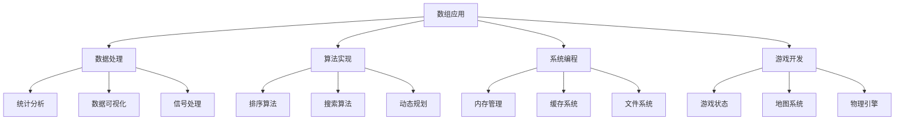

# 数组应用案例

## 📖 核心概念

**数组应用案例**展示了数组在实际编程中的广泛应用。通过具体的应用场景，我们可以更好地理解数组的优势和使用技巧。

### 🏗️ 应用领域分类



## 📊 数据处理应用

### 1. 统计分析系统

```cpp
class StatisticsAnalyzer {
private:
    vector<double> data;
    
public:
    void addData(double value) {
        data.push_back(value);
    }
    
    // 计算平均值
    double calculateMean() const {
        if (data.empty()) return 0.0;
        
        double sum = 0.0;
        for (double value : data) {
            sum += value;
        }
        return sum / data.size();
    }
    
    // 计算中位数
    double calculateMedian() const {
        if (data.empty()) return 0.0;
        
        vector<double> sortedData = data;
        sort(sortedData.begin(), sortedData.end());
        
        size_t n = sortedData.size();
        if (n % 2 == 0) {
            return (sortedData[n/2 - 1] + sortedData[n/2]) / 2.0;
        } else {
            return sortedData[n/2];
        }
    }
    
    // 计算标准差
    double calculateStandardDeviation() const {
        if (data.empty()) return 0.0;
        
        double mean = calculateMean();
        double sumSquaredDiff = 0.0;
        
        for (double value : data) {
            double diff = value - mean;
            sumSquaredDiff += diff * diff;
        }
        
        return sqrt(sumSquaredDiff / data.size());
    }
    
    // 计算分位数
    double calculatePercentile(double percentile) const {
        if (data.empty()) return 0.0;
        
        vector<double> sortedData = data;
        sort(sortedData.begin(), sortedData.end());
        
        size_t index = static_cast<size_t>(percentile * (sortedData.size() - 1));
        return sortedData[index];
    }
    
    // 生成直方图
    vector<int> generateHistogram(int bins) const {
        if (data.empty()) return vector<int>(bins, 0);
        
        double minVal = *min_element(data.begin(), data.end());
        double maxVal = *max_element(data.begin(), data.end());
        double binWidth = (maxVal - minVal) / bins;
        
        vector<int> histogram(bins, 0);
        
        for (double value : data) {
            int binIndex = static_cast<int>((value - minVal) / binWidth);
            binIndex = min(binIndex, bins - 1);  // 确保不越界
            histogram[binIndex]++;
        }
        
        return histogram;
    }
};
```

### 2. 数据可视化

```cpp
class DataVisualizer {
private:
    vector<vector<char>> canvas;
    int width, height;
    
public:
    DataVisualizer(int w, int h) : width(w), height(h) {
        canvas.resize(height, vector<char>(width, ' '));
    }
    
    // 绘制柱状图
    void drawBarChart(const vector<int>& data) {
        if (data.empty()) return;
        
        int maxValue = *max_element(data.begin(), data.end());
        int barWidth = width / data.size();
        
        for (size_t i = 0; i < data.size(); ++i) {
            int barHeight = (data[i] * height) / maxValue;
            
            for (int h = 0; h < barHeight; ++h) {
                for (int w = 0; w < barWidth - 1; ++w) {
                    int x = i * barWidth + w;
                    int y = height - 1 - h;
                    if (x < width && y >= 0) {
                        canvas[y][x] = '#';
                    }
                }
            }
        }
    }
    
    // 绘制折线图
    void drawLineChart(const vector<double>& data) {
        if (data.size() < 2) return;
        
        double minVal = *min_element(data.begin(), data.end());
        double maxVal = *max_element(data.begin(), data.end());
        double range = maxVal - minVal;
        
        if (range == 0) return;
        
        for (size_t i = 0; i < data.size() - 1; ++i) {
            int x1 = (i * width) / (data.size() - 1);
            int y1 = height - 1 - ((data[i] - minVal) * height) / range;
            
            int x2 = ((i + 1) * width) / (data.size() - 1);
            int y2 = height - 1 - ((data[i + 1] - minVal) * height) / range;
            
            drawLine(x1, y1, x2, y2);
        }
    }
    
    // 绘制散点图
    void drawScatterPlot(const vector<pair<double, double>>& points) {
        if (points.empty()) return;
        
        double minX = points[0].first, maxX = points[0].first;
        double minY = points[0].second, maxY = points[0].second;
        
        for (const auto& point : points) {
            minX = min(minX, point.first);
            maxX = max(maxX, point.first);
            minY = min(minY, point.second);
            maxY = max(maxY, point.second);
        }
        
        double rangeX = maxX - minX;
        double rangeY = maxY - minY;
        
        for (const auto& point : points) {
            int x = ((point.first - minX) * width) / rangeX;
            int y = height - 1 - ((point.second - minY) * height) / rangeY;
            
            if (x >= 0 && x < width && y >= 0 && y < height) {
                canvas[y][x] = '*';
            }
        }
    }
    
    void display() const {
        for (const auto& row : canvas) {
            for (char c : row) {
                cout << c;
            }
            cout << endl;
        }
    }
    
private:
    void drawLine(int x1, int y1, int x2, int y2) {
        int dx = abs(x2 - x1);
        int dy = abs(y2 - y1);
        int sx = (x1 < x2) ? 1 : -1;
        int sy = (y1 < y2) ? 1 : -1;
        int err = dx - dy;
        
        int x = x1, y = y1;
        
        while (true) {
            if (x >= 0 && x < width && y >= 0 && y < height) {
                canvas[y][x] = '*';
            }
            
            if (x == x2 && y == y2) break;
            
            int e2 = 2 * err;
            if (e2 > -dy) {
                err -= dy;
                x += sx;
            }
            if (e2 < dx) {
                err += dx;
                y += sy;
            }
        }
    }
};
```

## 🎮 游戏开发应用

### 1. 游戏状态管理

```cpp
class GameState {
private:
    vector<vector<int>> gameBoard;
    int boardSize;
    
public:
    GameState(int size) : boardSize(size) {
        gameBoard.resize(size, vector<int>(size, 0));
    }
    
    // 初始化游戏板
    void initializeBoard() {
        for (int i = 0; i < boardSize; ++i) {
            for (int j = 0; j < boardSize; ++j) {
                gameBoard[i][j] = 0;  // 0表示空位
            }
        }
        
        // 随机放置初始棋子
        placeRandomPiece();
        placeRandomPiece();
    }
    
    // 放置随机棋子
    void placeRandomPiece() {
        vector<pair<int, int>> emptyCells;
        
        for (int i = 0; i < boardSize; ++i) {
            for (int j = 0; j < boardSize; ++j) {
                if (gameBoard[i][j] == 0) {
                    emptyCells.push_back({i, j});
                }
            }
        }
        
        if (!emptyCells.empty()) {
            int randomIndex = rand() % emptyCells.size();
            int value = (rand() % 2 + 1) * 2;  // 2或4
            gameBoard[emptyCells[randomIndex].first][emptyCells[randomIndex].second] = value;
        }
    }
    
    // 移动操作
    bool moveLeft() {
        bool moved = false;
        
        for (int i = 0; i < boardSize; ++i) {
            vector<int> row;
            
            // 收集非零元素
            for (int j = 0; j < boardSize; ++j) {
                if (gameBoard[i][j] != 0) {
                    row.push_back(gameBoard[i][j]);
                }
            }
            
            // 合并相同元素
            vector<int> merged;
            for (size_t j = 0; j < row.size(); ++j) {
                if (j + 1 < row.size() && row[j] == row[j + 1]) {
                    merged.push_back(row[j] * 2);
                    ++j;  // 跳过下一个元素
                } else {
                    merged.push_back(row[j]);
                }
            }
            
            // 更新游戏板
            for (int j = 0; j < boardSize; ++j) {
                int oldValue = gameBoard[i][j];
                gameBoard[i][j] = (j < merged.size()) ? merged[j] : 0;
                
                if (oldValue != gameBoard[i][j]) {
                    moved = true;
                }
            }
        }
        
        return moved;
    }
    
    // 检查游戏是否结束
    bool isGameOver() const {
        // 检查是否有空位
        for (int i = 0; i < boardSize; ++i) {
            for (int j = 0; j < boardSize; ++j) {
                if (gameBoard[i][j] == 0) {
                    return false;
                }
            }
        }
        
        // 检查是否可以合并
        for (int i = 0; i < boardSize; ++i) {
            for (int j = 0; j < boardSize; ++j) {
                int current = gameBoard[i][j];
                
                // 检查右边
                if (j + 1 < boardSize && gameBoard[i][j + 1] == current) {
                    return false;
                }
                
                // 检查下边
                if (i + 1 < boardSize && gameBoard[i + 1][j] == current) {
                    return false;
                }
            }
        }
        
        return true;
    }
    
    // 计算分数
    int calculateScore() const {
        int score = 0;
        for (int i = 0; i < boardSize; ++i) {
            for (int j = 0; j < boardSize; ++j) {
                score += gameBoard[i][j];
            }
        }
        return score;
    }
    
    void display() const {
        for (int i = 0; i < boardSize; ++i) {
            for (int j = 0; j < boardSize; ++j) {
                cout << gameBoard[i][j] << "\t";
            }
            cout << endl;
        }
    }
};
```

### 2. 地图系统

```cpp
class GameMap {
private:
    vector<vector<int>> map;
    int width, height;
    
    enum TileType {
        EMPTY = 0,
        WALL = 1,
        DOOR = 2,
        TREASURE = 3,
        ENEMY = 4
    };
    
public:
    GameMap(int w, int h) : width(w), height(h) {
        map.resize(height, vector<int>(width, EMPTY));
    }
    
    // 生成随机地图
    void generateRandomMap() {
        // 生成墙壁
        for (int i = 0; i < height; ++i) {
            for (int j = 0; j < width; ++j) {
                if (i == 0 || i == height - 1 || j == 0 || j == width - 1) {
                    map[i][j] = WALL;
                } else if (rand() % 10 < 2) {  // 20%概率生成墙壁
                    map[i][j] = WALL;
                }
            }
        }
        
        // 放置门
        placeDoors();
        
        // 放置宝藏
        placeTreasures();
        
        // 放置敌人
        placeEnemies();
    }
    
    // 路径查找（A*算法简化版）
    vector<pair<int, int>> findPath(pair<int, int> start, pair<int, int> goal) {
        vector<vector<bool>> visited(height, vector<bool>(width, false));
        vector<vector<pair<int, int>>> parent(height, vector<pair<int, int>>(width, {-1, -1}));
        
        queue<pair<int, int>> queue;
        queue.push(start);
        visited[start.first][start.second] = true;
        
        int dx[] = {-1, 1, 0, 0};
        int dy[] = {0, 0, -1, 1};
        
        while (!queue.empty()) {
            pair<int, int> current = queue.front();
            queue.pop();
            
            if (current == goal) {
                // 重构路径
                vector<pair<int, int>> path;
                pair<int, int> node = goal;
                
                while (node != make_pair(-1, -1)) {
                    path.push_back(node);
                    node = parent[node.first][node.second];
                }
                
                reverse(path.begin(), path.end());
                return path;
            }
            
            for (int i = 0; i < 4; ++i) {
                int newX = current.first + dx[i];
                int newY = current.second + dy[i];
                
                if (isValidPosition(newX, newY) && !visited[newX][newY] && map[newX][newY] != WALL) {
                    visited[newX][newY] = true;
                    parent[newX][newY] = current;
                    queue.push({newX, newY});
                }
            }
        }
        
        return {};  // 没有找到路径
    }
    
    // 检查位置是否有效
    bool isValidPosition(int x, int y) const {
        return x >= 0 && x < height && y >= 0 && y < width;
    }
    
    // 获取地图信息
    int getTile(int x, int y) const {
        if (isValidPosition(x, y)) {
            return map[x][y];
        }
        return WALL;
    }
    
    void setTile(int x, int y, int tileType) {
        if (isValidPosition(x, y)) {
            map[x][y] = tileType;
        }
    }
    
private:
    void placeDoors() {
        int doorCount = 3;
        for (int i = 0; i < doorCount; ++i) {
            int x, y;
            do {
                x = rand() % height;
                y = rand() % width;
            } while (map[x][y] != EMPTY);
            
            map[x][y] = DOOR;
        }
    }
    
    void placeTreasures() {
        int treasureCount = 5;
        for (int i = 0; i < treasureCount; ++i) {
            int x, y;
            do {
                x = rand() % height;
                y = rand() % width;
            } while (map[x][y] != EMPTY);
            
            map[x][y] = TREASURE;
        }
    }
    
    void placeEnemies() {
        int enemyCount = 3;
        for (int i = 0; i < enemyCount; ++i) {
            int x, y;
            do {
                x = rand() % height;
                y = rand() % width;
            } while (map[x][y] != EMPTY);
            
            map[x][y] = ENEMY;
        }
    }
};
```

## 🔧 系统编程应用

### 1. 内存池管理

```cpp
class MemoryPool {
private:
    char* pool;
    size_t poolSize;
    vector<bool> used;
    size_t blockSize;
    
public:
    MemoryPool(size_t size, size_t block) 
        : poolSize(size), blockSize(block) {
        pool = new char[poolSize];
        used.resize(poolSize / blockSize, false);
    }
    
    ~MemoryPool() {
        delete[] pool;
    }
    
    // 分配内存块
    void* allocate() {
        for (size_t i = 0; i < used.size(); ++i) {
            if (!used[i]) {
                used[i] = true;
                return pool + i * blockSize;
            }
        }
        return nullptr;  // 没有可用块
    }
    
    // 释放内存块
    void deallocate(void* ptr) {
        if (ptr >= pool && ptr < pool + poolSize) {
            size_t index = (static_cast<char*>(ptr) - pool) / blockSize;
            if (index < used.size()) {
                used[index] = false;
            }
        }
    }
    
    // 获取使用统计
    size_t getUsedBlocks() const {
        size_t count = 0;
        for (bool isUsed : used) {
            if (isUsed) count++;
        }
        return count;
    }
    
    size_t getFreeBlocks() const {
        return used.size() - getUsedBlocks();
    }
};
```

### 2. 缓存系统

```cpp
template<typename K, typename V>
class LRUCache {
private:
    struct Node {
        K key;
        V value;
        Node* prev;
        Node* next;
        
        Node(K k, V v) : key(k), value(v), prev(nullptr), next(nullptr) {}
    };
    
    unordered_map<K, Node*> cache;
    Node* head;
    Node* tail;
    size_t capacity;
    
    void addToHead(Node* node) {
        node->prev = head;
        node->next = head->next;
        head->next->prev = node;
        head->next = node;
    }
    
    void removeNode(Node* node) {
        node->prev->next = node->next;
        node->next->prev = node->prev;
    }
    
    void moveToHead(Node* node) {
        removeNode(node);
        addToHead(node);
    }
    
    Node* removeTail() {
        Node* lastNode = tail->prev;
        removeNode(lastNode);
        return lastNode;
    }
    
public:
    LRUCache(size_t cap) : capacity(cap) {
        head = new Node(K{}, V{});
        tail = new Node(K{}, V{});
        head->next = tail;
        tail->prev = head;
    }
    
    ~LRUCache() {
        Node* current = head;
        while (current) {
            Node* next = current->next;
            delete current;
            current = next;
        }
    }
    
    V get(K key) {
        if (cache.find(key) != cache.end()) {
            Node* node = cache[key];
            moveToHead(node);
            return node->value;
        }
        return V{};  // 返回默认值
    }
    
    void put(K key, V value) {
        if (cache.find(key) != cache.end()) {
            Node* node = cache[key];
            node->value = value;
            moveToHead(node);
        } else {
            Node* newNode = new Node(key, value);
            
            if (cache.size() >= capacity) {
                Node* tailNode = removeTail();
                cache.erase(tailNode->key);
                delete tailNode;
            }
            
            cache[key] = newNode;
            addToHead(newNode);
        }
    }
    
    size_t size() const {
        return cache.size();
    }
    
    bool contains(K key) const {
        return cache.find(key) != cache.end();
    }
};
```

## 🔗 相关链接

- [[01-数组基础|数组基础]]
- [[02-动态数组实现|动态数组]]
- [[03-多维数组|多维数组]]

## 💡 数组应用要点

1. **性能优化**：利用数组的连续内存特性提高性能
2. **算法实现**：数组是许多经典算法的基础数据结构
3. **系统编程**：在底层系统编程中广泛使用
4. **应用场景**：根据具体需求选择合适的数组实现

---

*📝 应用提示：数组是最基础的数据结构，掌握其应用有助于理解更复杂的数据结构*
