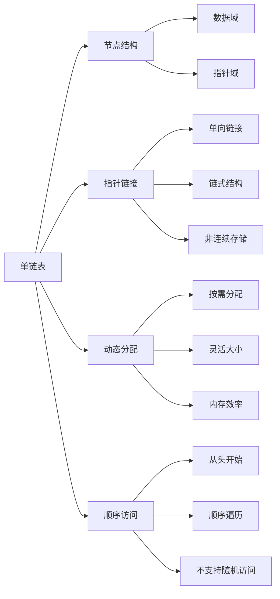

# 🔗 单链表实现

## 🎯 核心定义

**单链表**是一种线性数据结构，由节点组成，每个节点包含数据和指向下一个节点的指针。

### 🔍 本质理解
单链表 = 节点 + 指针链接 + 动态分配



---

## 🏗️ 链表节点结构

### 📊 节点定义

#### 💻 C++实现
```cpp
template<typename T>
struct ListNode {
    T data;                    // 数据域
    ListNode<T>* next;         // 指针域
    
    // 构造函数
    ListNode() : next(nullptr) {}
    ListNode(const T& value) : data(value), next(nullptr) {}
    ListNode(const T& value, ListNode<T>* nextNode) 
        : data(value), next(nextNode) {}
};
```

#### 🎯 节点特性
| 特性 | 描述 | 优势 | 劣势 |
|------|------|------|------|
| **数据域** | 存储实际数据 | 类型灵活 | 额外空间开销 |
| **指针域** | 指向下一个节点 | 动态链接 | 指针开销 |
| **动态分配** | 运行时分配内存 | 大小灵活 | 内存管理复杂 |

### 🎯 链表结构

#### 📊 链表表示
```
head -> [10] -> [20] -> [30] -> [40] -> nullptr
         ↑       ↑       ↑       ↑
       节点1    节点2    节点3    节点4
```

#### 💻 链表类定义
```cpp
template<typename T>
class LinkedList {
private:
    ListNode<T>* head;         // 头指针
    int size;                 // 链表大小
    
public:
    // 构造和析构
    LinkedList();
    ~LinkedList();
    
    // 基本操作
    void insertAtHead(const T& value);
    void insertAtTail(const T& value);
    void insertAtPosition(int position, const T& value);
    void deleteAtHead();
    void deleteAtTail();
    void deleteAtPosition(int position);
    void deleteByValue(const T& value);
    
    // 查询操作
    bool isEmpty() const;
    int getSize() const;
    T getValue(int position) const;
    int findPosition(const T& value) const;
    bool contains(const T& value) const;
    
    // 工具操作
    void display() const;
    void clear();
    void reverse();
};
```

---

## 💻 链表操作实现

### 🔧 基本操作

#### 📋 构造和析构
```cpp
template<typename T>
LinkedList<T>::LinkedList() : head(nullptr), size(0) {}

template<typename T>
LinkedList<T>::~LinkedList() {
    clear();
}

template<typename T>
void LinkedList<T>::clear() {
    while (head != nullptr) {
        ListNode<T>* temp = head;
        head = head->next;
        delete temp;
    }
    size = 0;
}
```

#### ➕ 插入操作

##### 🎯 头插法
```cpp
template<typename T>
void LinkedList<T>::insertAtHead(const T& value) {
    ListNode<T>* newNode = new ListNode<T>(value);
    newNode->next = head;
    head = newNode;
    size++;
}
```

##### 🎯 尾插法
```cpp
template<typename T>
void LinkedList<T>::insertAtTail(const T& value) {
    ListNode<T>* newNode = new ListNode<T>(value);
    
    if (head == nullptr) {
        head = newNode;
    } else {
        ListNode<T>* current = head;
        while (current->next != nullptr) {
            current = current->next;
        }
        current->next = newNode;
    }
    size++;
}
```

##### 🎯 指定位置插入
```cpp
template<typename T>
void LinkedList<T>::insertAtPosition(int position, const T& value) {
    if (position < 0 || position > size) {
        throw std::out_of_range("Position out of range");
    }
    
    if (position == 0) {
        insertAtHead(value);
        return;
    }
    
    ListNode<T>* newNode = new ListNode<T>(value);
    ListNode<T>* current = head;
    
    // 移动到插入位置的前一个节点
    for (int i = 0; i < position - 1; i++) {
        current = current->next;
    }
    
    newNode->next = current->next;
    current->next = newNode;
    size++;
}
```

#### ➖ 删除操作

##### 🎯 删除头节点
```cpp
template<typename T>
void LinkedList<T>::deleteAtHead() {
    if (head == nullptr) {
        throw std::runtime_error("List is empty");
    }
    
    ListNode<T>* temp = head;
    head = head->next;
    delete temp;
    size--;
}
```

##### 🎯 删除尾节点
```cpp
template<typename T>
void LinkedList<T>::deleteAtTail() {
    if (head == nullptr) {
        throw std::runtime_error("List is empty");
    }
    
    if (head->next == nullptr) {
        delete head;
        head = nullptr;
    } else {
        ListNode<T>* current = head;
        while (current->next->next != nullptr) {
            current = current->next;
        }
        delete current->next;
        current->next = nullptr;
    }
    size--;
}
```

##### 🎯 删除指定位置
```cpp
template<typename T>
void LinkedList<T>::deleteAtPosition(int position) {
    if (position < 0 || position >= size) {
        throw std::out_of_range("Position out of range");
    }
    
    if (position == 0) {
        deleteAtHead();
        return;
    }
    
    ListNode<T>* current = head;
    for (int i = 0; i < position - 1; i++) {
        current = current->next;
    }
    
    ListNode<T>* temp = current->next;
    current->next = temp->next;
    delete temp;
    size--;
}
```

#### 🔍 查询操作

##### 🎯 查找元素
```cpp
template<typename T>
int LinkedList<T>::findPosition(const T& value) const {
    ListNode<T>* current = head;
    int position = 0;
    
    while (current != nullptr) {
        if (current->data == value) {
            return position;
        }
        current = current->next;
        position++;
    }
    
    return -1;  // 未找到
}

template<typename T>
bool LinkedList<T>::contains(const T& value) const {
    return findPosition(value) != -1;
}
```

##### 🎯 获取元素
```cpp
template<typename T>
T LinkedList<T>::getValue(int position) const {
    if (position < 0 || position >= size) {
        throw std::out_of_range("Position out of range");
    }
    
    ListNode<T>* current = head;
    for (int i = 0; i < position; i++) {
        current = current->next;
    }
    
    return current->data;
}
```

---

## 📊 链表操作复杂度分析

### ⏱️ 时间复杂度分析

| 操作 | 时间复杂度 | 说明 | 示例 |
|------|------------|------|------|
| **访问** | O(n) | 需要从头遍历 | 获取第i个元素 |
| **搜索** | O(n) | 需要遍历查找 | 查找指定值 |
| **插入** | O(1) | 头插法 | 在头部插入 |
| **插入** | O(n) | 尾插法 | 在尾部插入 |
| **删除** | O(1) | 删除头节点 | 删除第一个元素 |
| **删除** | O(n) | 删除尾节点 | 删除最后一个元素 |

### 💾 空间复杂度分析

| 方面 | 空间复杂度 | 说明 |
|------|------------|------|
| **存储空间** | O(n) | n个节点需要n个存储单元 |
| **额外空间** | O(1) | 除存储空间外无额外开销 |
| **指针开销** | O(n) | 每个节点需要一个指针 |

---

## 🎯 链表应用场景

### 📋 适用场景

#### ✅ 适合使用链表的情况
1. **频繁插入删除**：中间位置插入删除效率高
2. **大小不确定**：数据量变化较大
3. **内存碎片敏感**：不需要连续内存
4. **实现栈和队列**：链表是栈和队列的理想实现

#### ❌ 不适合使用链表的情况
1. **随机访问频繁**：不支持随机访问
2. **内存效率要求高**：指针开销较大
3. **缓存友好要求**：非连续存储影响缓存
4. **简单数据结构**：数组更简单高效

### 🎯 典型应用

#### 📚 栈和队列实现
- **栈**：使用头插法实现LIFO
- **队列**：使用头尾指针实现FIFO
- **双端队列**：使用双向链表实现

#### 🔄 动态数据结构
- **动态数组**：链表实现动态数组
- **稀疏矩阵**：链表存储稀疏数据
- **多项式**：链表存储多项式系数

#### 🎮 游戏开发
- **游戏对象链表**：管理游戏中的对象
- **事件系统**：链表管理事件队列
- **资源管理**：链表管理资源引用

---

## 🔄 链表变种

### 📊 带头节点的链表

#### 🎯 定义
在链表头部添加一个不存储数据的节点，简化操作。

#### 💻 实现
```cpp
template<typename T>
class LinkedListWithDummy {
private:
    ListNode<T>* dummyHead;    // 虚拟头节点
    
public:
    LinkedListWithDummy() {
        dummyHead = new ListNode<T>();
    }
    
    void insertAtHead(const T& value) {
        ListNode<T>* newNode = new ListNode<T>(value);
        newNode->next = dummyHead->next;
        dummyHead->next = newNode;
    }
    
    void deleteAtHead() {
        if (dummyHead->next != nullptr) {
            ListNode<T>* temp = dummyHead->next;
            dummyHead->next = temp->next;
            delete temp;
        }
    }
};
```

### 📊 循环链表

#### 🎯 定义
最后一个节点的指针指向第一个节点，形成循环。

#### 💻 实现
```cpp
template<typename T>
class CircularLinkedList {
private:
    ListNode<T>* head;
    
public:
    void insertAtHead(const T& value) {
        ListNode<T>* newNode = new ListNode<T>(value);
        
        if (head == nullptr) {
            head = newNode;
            head->next = head;  // 自循环
        } else {
            newNode->next = head;
            // 找到尾节点
            ListNode<T>* tail = head;
            while (tail->next != head) {
                tail = tail->next;
            }
            tail->next = newNode;
            head = newNode;
        }
    }
};
```

---

## 🧠 学习策略

### 📚 理解层次

#### 🔴 认识层次
- 知道链表的基本概念
- 了解链表与数组的区别
- 识别链表的应用场景

#### 🟡 理解层次
- 理解链表的内存结构
- 掌握链表操作的实现
- 分析链表的优缺点

#### 🟢 应用层次
- 能实现链表的基本操作
- 会选择合适的链表类型
- 能解决链表相关问题

#### 🔵 创新层次
- 能设计链表的变种
- 会优化链表操作
- 能组合链表与其他结构

### 🎯 学习建议

1. **从简单到复杂**：单链表 → 双链表 → 循环链表
2. **理论与实践结合**：概念理解 + 代码实现
3. **对比学习**：链表 vs 数组的优缺点
4. **应用驱动**：从实际问题出发学习链表

### 🔍 常见错误

#### ❌ 常见错误
1. **内存泄漏**：忘记释放节点内存
2. **空指针访问**：访问空指针
3. **循环引用**：指针形成循环
4. **边界处理**：头尾节点处理不当

#### ✅ 最佳实践
1. **内存管理**：及时释放动态分配的内存
2. **边界检查**：检查指针是否为空
3. **异常处理**：处理链表操作异常
4. **代码复用**：提取公共操作函数

---

## 🔗 相关链接

### 📖 深入学习
- [[02-双链表与循环链表|双链表与循环链表]]
- [[03-链表算法技巧|链表算法技巧]]
- [[04-链表应用题解|链表应用题解]]

### 🛠️ 实践应用
- [[02-线性世界/01-序列结构[数组]/01-数组基础|数组基础]]
- [[02-线性世界/03-受限结构[栈队列]/01-栈Stack详解|栈实现]]
- [[02-线性世界/03-受限结构[栈队列]/02-队列Queue详解|队列实现]]

### 🎯 检测学习
- [[00-学习枢纽/📋-知识点检测清单|知识点检测清单]]
- [[00-学习枢纽/📊-学习进度跟踪|学习进度跟踪]]

---
*💡 链表是动态数据结构的基础，掌握链表是学习高级数据结构的关键！*
