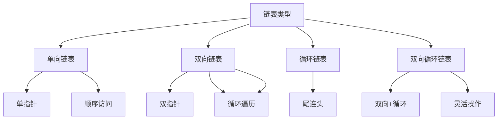

# 链表基础

## 📖 核心概念

**链表**是一种动态数据结构，通过指针将节点连接起来。链表不需要连续的内存空间，可以动态分配和释放。

### 🏗️ 链表类型



## 🔧 链表实现

### 单向链表

```cpp
class SinglyLinkedList {
private:
    struct Node {
        int data;
        Node* next;
        
        Node(int d) : data(d), next(nullptr) {}
    };
    
    Node* head;
    int size;
    
public:
    SinglyLinkedList() : head(nullptr), size(0) {}
    
    ~SinglyLinkedList() {
        while (head) {
            Node* temp = head;
            head = head->next;
            delete temp;
        }
    }
    
    void insertAtHead(int value) {
        Node* newNode = new Node(value);
        newNode->next = head;
        head = newNode;
        size++;
    }
    
    void insertAtTail(int value) {
        Node* newNode = new Node(value);
        
        if (!head) {
            head = newNode;
        } else {
            Node* current = head;
            while (current->next) {
                current = current->next;
            }
            current->next = newNode;
        }
        size++;
    }
    
    bool remove(int value) {
        if (!head) return false;
        
        if (head->data == value) {
            Node* temp = head;
            head = head->next;
            delete temp;
            size--;
            return true;
        }
        
        Node* current = head;
        while (current->next) {
            if (current->next->data == value) {
                Node* temp = current->next;
                current->next = current->next->next;
                delete temp;
                size--;
                return true;
            }
            current = current->next;
        }
        
        return false;
    }
    
    bool search(int value) {
        Node* current = head;
        while (current) {
            if (current->data == value) {
                return true;
            }
            current = current->next;
        }
        return false;
    }
    
    void display() {
        Node* current = head;
        while (current) {
            cout << current->data << " ";
            current = current->next;
        }
        cout << endl;
    }
};
```

### 双向链表

```cpp
class DoublyLinkedList {
private:
    struct Node {
        int data;
        Node* prev;
        Node* next;
        
        Node(int d) : data(d), prev(nullptr), next(nullptr) {}
    };
    
    Node* head;
    Node* tail;
    int size;
    
public:
    DoublyLinkedList() : head(nullptr), tail(nullptr), size(0) {}
    
    ~DoublyLinkedList() {
        while (head) {
            Node* temp = head;
            head = head->next;
            delete temp;
        }
    }
    
    void insertAtHead(int value) {
        Node* newNode = new Node(value);
        
        if (!head) {
            head = tail = newNode;
        } else {
            newNode->next = head;
            head->prev = newNode;
            head = newNode;
        }
        size++;
    }
    
    void insertAtTail(int value) {
        Node* newNode = new Node(value);
        
        if (!tail) {
            head = tail = newNode;
        } else {
            tail->next = newNode;
            newNode->prev = tail;
            tail = newNode;
        }
        size++;
    }
    
    bool remove(int value) {
        Node* current = head;
        
        while (current) {
            if (current->data == value) {
                if (current->prev) {
                    current->prev->next = current->next;
                } else {
                    head = current->next;
                }
                
                if (current->next) {
                    current->next->prev = current->prev;
                } else {
                    tail = current->prev;
                }
                
                delete current;
                size--;
                return true;
            }
            current = current->next;
        }
        
        return false;
    }
    
    void displayForward() {
        Node* current = head;
        while (current) {
            cout << current->data << " ";
            current = current->next;
        }
        cout << endl;
    }
    
    void displayBackward() {
        Node* current = tail;
        while (current) {
            cout << current->data << " ";
            current = current->prev;
        }
        cout << endl;
    }
};
```

## 🎯 链表操作

### 基本操作

```cpp
class LinkedListOperations {
public:
    // 反转链表
    static ListNode* reverseList(ListNode* head) {
        ListNode* prev = nullptr;
        ListNode* current = head;
        
        while (current) {
            ListNode* next = current->next;
            current->next = prev;
            prev = current;
            current = next;
        }
        
        return prev;
    }
    
    // 检测环
    static bool hasCycle(ListNode* head) {
        if (!head || !head->next) return false;
        
        ListNode* slow = head;
        ListNode* fast = head->next;
        
        while (fast && fast->next) {
            if (slow == fast) return true;
            slow = slow->next;
            fast = fast->next->next;
        }
        
        return false;
    }
    
    // 合并两个有序链表
    static ListNode* mergeTwoLists(ListNode* list1, ListNode* list2) {
        ListNode dummy(0);
        ListNode* current = &dummy;
        
        while (list1 && list2) {
            if (list1->val <= list2->val) {
                current->next = list1;
                list1 = list1->next;
            } else {
                current->next = list2;
                list2 = list2->next;
            }
            current = current->next;
        }
        
        current->next = list1 ? list1 : list2;
        return dummy.next;
    }
    
    // 删除倒数第n个节点
    static ListNode* removeNthFromEnd(ListNode* head, int n) {
        ListNode dummy(0);
        dummy.next = head;
        
        ListNode* first = &dummy;
        ListNode* second = &dummy;
        
        for (int i = 0; i <= n; ++i) {
            first = first->next;
        }
        
        while (first) {
            first = first->next;
            second = second->next;
        }
        
        second->next = second->next->next;
        return dummy.next;
    }
};
```

## 📊 链表应用

### 1. LRU缓存

```cpp
class LRUCache {
private:
    struct Node {
        int key, value;
        Node* prev, *next;
        Node(int k, int v) : key(k), value(v), prev(nullptr), next(nullptr) {}
    };
    
    unordered_map<int, Node*> cache;
    Node* head, *tail;
    int capacity;
    
    void addToHead(Node* node) {
        node->prev = head;
        node->next = head->next;
        head->next->prev = node;
        head->next = node;
    }
    
    void removeNode(Node* node) {
        node->prev->next = node->next;
        node->next->prev = node->prev;
    }
    
    void moveToHead(Node* node) {
        removeNode(node);
        addToHead(node);
    }
    
    Node* removeTail() {
        Node* lastNode = tail->prev;
        removeNode(lastNode);
        return lastNode;
    }
    
public:
    LRUCache(int cap) : capacity(cap) {
        head = new Node(0, 0);
        tail = new Node(0, 0);
        head->next = tail;
        tail->prev = head;
    }
    
    int get(int key) {
        if (cache.find(key) != cache.end()) {
            Node* node = cache[key];
            moveToHead(node);
            return node->value;
        }
        return -1;
    }
    
    void put(int key, int value) {
        if (cache.find(key) != cache.end()) {
            Node* node = cache[key];
            node->value = value;
            moveToHead(node);
        } else {
            Node* newNode = new Node(key, value);
            
            if (cache.size() >= capacity) {
                Node* tailNode = removeTail();
                cache.erase(tailNode->key);
                delete tailNode;
            }
            
            cache[key] = newNode;
            addToHead(newNode);
        }
    }
};
```

## 🔗 相关链接

- [[01-数组基础|数组基础]]
- [[03-栈与队列|栈与队列]]
- [[04-字符串处理|字符串处理]]

## 💡 链表要点

1. **动态分配**：链表节点可以动态分配和释放
2. **非连续存储**：节点在内存中不需要连续存储
3. **顺序访问**：只能顺序访问链表中的元素
4. **灵活插入删除**：在任意位置插入和删除都很高效

---

*📝 基础提示：链表是动态数据结构的基础，掌握链表操作是学习其他动态结构的前提*
