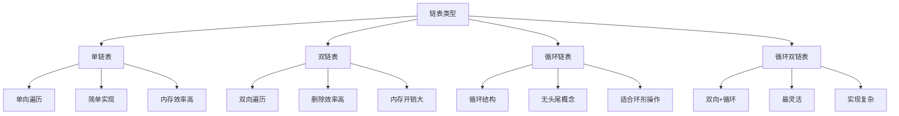

# 双链表与循环链表

## 📖 核心概念

**双链表与循环链表**是单链表的扩展形式。双链表支持双向遍历，循环链表形成闭环结构，它们在不同场景下各有优势。

### 🏗️ 链表类型对比



## 🔧 双链表实现

### 基础双链表类

```cpp
template<typename T>
class DoublyLinkedList {
private:
    struct Node {
        T data;
        Node* prev;
        Node* next;
        
        Node(const T& value) : data(value), prev(nullptr), next(nullptr) {}
    };
    
    Node* head;
    Node* tail;
    size_t size;
    
public:
    DoublyLinkedList() : head(nullptr), tail(nullptr), size(0) {}
    
    ~DoublyLinkedList() {
        clear();
    }
    
    // 拷贝构造函数
    DoublyLinkedList(const DoublyLinkedList& other) 
        : head(nullptr), tail(nullptr), size(0) {
        Node* current = other.head;
        while (current) {
            push_back(current->data);
            current = current->next;
        }
    }
    
    // 赋值操作符
    DoublyLinkedList& operator=(const DoublyLinkedList& other) {
        if (this != &other) {
            clear();
            Node* current = other.head;
            while (current) {
                push_back(current->data);
                current = current->next;
            }
        }
        return *this;
    }
    
    // 移动构造函数
    DoublyLinkedList(DoublyLinkedList&& other) noexcept
        : head(other.head), tail(other.tail), size(other.size) {
        other.head = nullptr;
        other.tail = nullptr;
        other.size = 0;
    }
    
    // 移动赋值操作符
    DoublyLinkedList& operator=(DoublyLinkedList&& other) noexcept {
        if (this != &other) {
            clear();
            head = other.head;
            tail = other.tail;
            size = other.size;
            
            other.head = nullptr;
            other.tail = nullptr;
            other.size = 0;
        }
        return *this;
    }
    
    // 在头部插入
    void push_front(const T& value) {
        Node* newNode = new Node(value);
        
        if (head == nullptr) {
            head = tail = newNode;
        } else {
            newNode->next = head;
            head->prev = newNode;
            head = newNode;
        }
        size++;
    }
    
    // 在尾部插入
    void push_back(const T& value) {
        Node* newNode = new Node(value);
        
        if (tail == nullptr) {
            head = tail = newNode;
        } else {
            tail->next = newNode;
            newNode->prev = tail;
            tail = newNode;
        }
        size++;
    }
    
    // 在指定位置插入
    void insert(size_t index, const T& value) {
        if (index > size) {
            throw std::out_of_range("Index out of range");
        }
        
        if (index == 0) {
            push_front(value);
        } else if (index == size) {
            push_back(value);
        } else {
            Node* current = getNodeAt(index);
            Node* newNode = new Node(value);
            
            newNode->prev = current->prev;
            newNode->next = current;
            current->prev->next = newNode;
            current->prev = newNode;
            
            size++;
        }
    }
    
    // 删除头部元素
    void pop_front() {
        if (head == nullptr) return;
        
        Node* temp = head;
        head = head->next;
        
        if (head) {
            head->prev = nullptr;
        } else {
            tail = nullptr;
        }
        
        delete temp;
        size--;
    }
    
    // 删除尾部元素
    void pop_back() {
        if (tail == nullptr) return;
        
        Node* temp = tail;
        tail = tail->prev;
        
        if (tail) {
            tail->next = nullptr;
        } else {
            head = nullptr;
        }
        
        delete temp;
        size--;
    }
    
    // 删除指定位置的元素
    void erase(size_t index) {
        if (index >= size) {
            throw std::out_of_range("Index out of range");
        }
        
        Node* nodeToDelete = getNodeAt(index);
        
        if (nodeToDelete->prev) {
            nodeToDelete->prev->next = nodeToDelete->next;
        } else {
            head = nodeToDelete->next;
        }
        
        if (nodeToDelete->next) {
            nodeToDelete->next->prev = nodeToDelete->prev;
        } else {
            tail = nodeToDelete->prev;
        }
        
        delete nodeToDelete;
        size--;
    }
    
    // 删除指定值的元素
    bool remove(const T& value) {
        Node* current = head;
        while (current) {
            if (current->data == value) {
                if (current->prev) {
                    current->prev->next = current->next;
                } else {
                    head = current->next;
                }
                
                if (current->next) {
                    current->next->prev = current->prev;
                } else {
                    tail = current->prev;
                }
                
                Node* temp = current;
                current = current->next;
                delete temp;
                size--;
                return true;
            } else {
                current = current->next;
            }
        }
        return false;
    }
    
    // 访问元素
    T& operator[](size_t index) {
        return getNodeAt(index)->data;
    }
    
    const T& operator[](size_t index) const {
        return getNodeAt(index)->data;
    }
    
    // 获取首尾元素
    T& front() {
        if (head == nullptr) {
            throw std::runtime_error("List is empty");
        }
        return head->data;
    }
    
    const T& front() const {
        if (head == nullptr) {
            throw std::runtime_error("List is empty");
        }
        return head->data;
    }
    
    T& back() {
        if (tail == nullptr) {
            throw std::runtime_error("List is empty");
        }
        return tail->data;
    }
    
    const T& back() const {
        if (tail == nullptr) {
            throw std::runtime_error("List is empty");
        }
        return tail->data;
    }
    
    // 状态查询
    size_t getSize() const { return size; }
    bool isEmpty() const { return head == nullptr; }
    
    // 查找元素
    bool contains(const T& value) const {
        Node* current = head;
        while (current) {
            if (current->data == value) {
                return true;
            }
            current = current->next;
        }
        return false;
    }
    
    // 查找元素位置
    size_t find(const T& value) const {
        Node* current = head;
        size_t index = 0;
        
        while (current) {
            if (current->data == value) {
                return index;
            }
            current = current->next;
            index++;
        }
        
        return size;  // 未找到
    }
    
    // 清空链表
    void clear() {
        while (head) {
            Node* temp = head;
            head = head->next;
            delete temp;
        }
        head = tail = nullptr;
        size = 0;
    }
    
    // 反转链表
    void reverse() {
        Node* current = head;
        Node* temp = nullptr;
        
        while (current) {
            temp = current->prev;
            current->prev = current->next;
            current->next = temp;
            current = current->prev;
        }
        
        if (temp) {
            head = temp->prev;
        }
        
        // 更新tail
        current = head;
        while (current && current->next) {
            current = current->next;
        }
        tail = current;
    }
    
    // 打印链表
    void print() const {
        Node* current = head;
        while (current) {
            std::cout << current->data << " ";
            current = current->next;
        }
        std::cout << std::endl;
    }
    
    // 反向打印链表
    void printReverse() const {
        Node* current = tail;
        while (current) {
            std::cout << current->data << " ";
            current = current->prev;
        }
        std::cout << std::endl;
    }
    
private:
    Node* getNodeAt(size_t index) const {
        if (index >= size) {
            throw std::out_of_range("Index out of range");
        }
        
        Node* current = head;
        for (size_t i = 0; i < index; ++i) {
            current = current->next;
        }
        return current;
    }
};
```

## 🔄 循环链表实现

### 基础循环链表类

```cpp
template<typename T>
class CircularLinkedList {
private:
    struct Node {
        T data;
        Node* next;
        
        Node(const T& value) : data(value), next(nullptr) {}
    };
    
    Node* head;
    size_t size;
    
public:
    CircularLinkedList() : head(nullptr), size(0) {}
    
    ~CircularLinkedList() {
        clear();
    }
    
    // 在头部插入
    void push_front(const T& value) {
        Node* newNode = new Node(value);
        
        if (head == nullptr) {
            head = newNode;
            head->next = head;  // 指向自己
        } else {
            Node* tail = getTail();
            newNode->next = head;
            head = newNode;
            tail->next = head;
        }
        size++;
    }
    
    // 在尾部插入
    void push_back(const T& value) {
        Node* newNode = new Node(value);
        
        if (head == nullptr) {
            head = newNode;
            head->next = head;
        } else {
            Node* tail = getTail();
            tail->next = newNode;
            newNode->next = head;
        }
        size++;
    }
    
    // 删除头部元素
    void pop_front() {
        if (head == nullptr) return;
        
        if (size == 1) {
            delete head;
            head = nullptr;
        } else {
            Node* tail = getTail();
            Node* temp = head;
            head = head->next;
            tail->next = head;
            delete temp;
        }
        size--;
    }
    
    // 删除指定值的元素
    bool remove(const T& value) {
        if (head == nullptr) return false;
        
        Node* current = head;
        Node* prev = nullptr;
        
        do {
            if (current->data == value) {
                if (size == 1) {
                    delete head;
                    head = nullptr;
                } else {
                    if (prev) {
                        prev->next = current->next;
                    } else {
                        // 删除头节点
                        Node* tail = getTail();
                        head = head->next;
                        tail->next = head;
                    }
                    delete current;
                }
                size--;
                return true;
            }
            prev = current;
            current = current->next;
        } while (current != head);
        
        return false;
    }
    
    // 查找元素
    bool contains(const T& value) const {
        if (head == nullptr) return false;
        
        Node* current = head;
        do {
            if (current->data == value) {
                return true;
            }
            current = current->next;
        } while (current != head);
        
        return false;
    }
    
    // 获取指定位置的元素
    T& get(size_t index) {
        if (index >= size) {
            throw std::out_of_range("Index out of range");
        }
        
        Node* current = head;
        for (size_t i = 0; i < index; ++i) {
            current = current->next;
        }
        return current->data;
    }
    
    // 状态查询
    size_t getSize() const { return size; }
    bool isEmpty() const { return head == nullptr; }
    
    // 清空链表
    void clear() {
        if (head == nullptr) return;
        
        Node* current = head;
        do {
            Node* temp = current;
            current = current->next;
            delete temp;
        } while (current != head);
        
        head = nullptr;
        size = 0;
    }
    
    // 打印链表
    void print() const {
        if (head == nullptr) return;
        
        Node* current = head;
        do {
            std::cout << current->data << " ";
            current = current->next;
        } while (current != head);
        std::cout << std::endl;
    }
    
    // 约瑟夫环问题
    vector<T> josephusProblem(int k) {
        vector<T> result;
        if (head == nullptr || k <= 0) return result;
        
        Node* current = head;
        
        while (size > 0) {
            // 移动到第k-1个节点
            for (int i = 0; i < k - 1; ++i) {
                current = current->next;
            }
            
            // 记录要删除的节点
            Node* toDelete = current;
            result.push_back(toDelete->data);
            
            // 移动到下一个节点
            current = current->next;
            
            // 删除节点
            remove(toDelete->data);
        }
        
        return result;
    }
    
private:
    Node* getTail() const {
        if (head == nullptr) return nullptr;
        
        Node* current = head;
        while (current->next != head) {
            current = current->next;
        }
        return current;
    }
};
```

## 🔗 循环双链表实现

### 循环双链表类

```cpp
template<typename T>
class CircularDoublyLinkedList {
private:
    struct Node {
        T data;
        Node* prev;
        Node* next;
        
        Node(const T& value) : data(value), prev(nullptr), next(nullptr) {}
    };
    
    Node* head;
    size_t size;
    
public:
    CircularDoublyLinkedList() : head(nullptr), size(0) {}
    
    ~CircularDoublyLinkedList() {
        clear();
    }
    
    // 在头部插入
    void push_front(const T& value) {
        Node* newNode = new Node(value);
        
        if (head == nullptr) {
            head = newNode;
            head->next = head;
            head->prev = head;
        } else {
            Node* tail = head->prev;
            newNode->next = head;
            newNode->prev = tail;
            head->prev = newNode;
            tail->next = newNode;
            head = newNode;
        }
        size++;
    }
    
    // 在尾部插入
    void push_back(const T& value) {
        Node* newNode = new Node(value);
        
        if (head == nullptr) {
            head = newNode;
            head->next = head;
            head->prev = head;
        } else {
            Node* tail = head->prev;
            newNode->next = head;
            newNode->prev = tail;
            tail->next = newNode;
            head->prev = newNode;
        }
        size++;
    }
    
    // 删除头部元素
    void pop_front() {
        if (head == nullptr) return;
        
        if (size == 1) {
            delete head;
            head = nullptr;
        } else {
            Node* tail = head->prev;
            Node* temp = head;
            head = head->next;
            head->prev = tail;
            tail->next = head;
            delete temp;
        }
        size--;
    }
    
    // 删除尾部元素
    void pop_back() {
        if (head == nullptr) return;
        
        if (size == 1) {
            delete head;
            head = nullptr;
        } else {
            Node* tail = head->prev;
            Node* newTail = tail->prev;
            newTail->next = head;
            head->prev = newTail;
            delete tail;
        }
        size--;
    }
    
    // 顺时针遍历
    void traverseClockwise() const {
        if (head == nullptr) return;
        
        Node* current = head;
        do {
            std::cout << current->data << " ";
            current = current->next;
        } while (current != head);
        std::cout << std::endl;
    }
    
    // 逆时针遍历
    void traverseCounterClockwise() const {
        if (head == nullptr) return;
        
        Node* current = head;
        do {
            std::cout << current->data << " ";
            current = current->prev;
        } while (current != head);
        std::cout << std::endl;
    }
    
    // 状态查询
    size_t getSize() const { return size; }
    bool isEmpty() const { return head == nullptr; }
    
    // 清空链表
    void clear() {
        if (head == nullptr) return;
        
        Node* current = head;
        do {
            Node* temp = current;
            current = current->next;
            delete temp;
        } while (current != head);
        
        head = nullptr;
        size = 0;
    }
};
```

## 📊 性能对比

### 时间复杂度对比

| 操作 | 单链表 | 双链表 | 循环链表 | 循环双链表 |
|------|--------|--------|----------|------------|
| **头部插入** | O(1) | O(1) | O(1) | O(1) |
| **尾部插入** | O(n) | O(1) | O(1) | O(1) |
| **中间插入** | O(n) | O(n) | O(n) | O(n) |
| **头部删除** | O(1) | O(1) | O(1) | O(1) |
| **尾部删除** | O(n) | O(1) | O(1) | O(1) |
| **中间删除** | O(n) | O(1) | O(n) | O(1) |
| **查找** | O(n) | O(n) | O(n) | O(n) |

### 空间复杂度对比

| 链表类型 | 额外空间 | 内存效率 | 实现复杂度 |
|----------|----------|----------|------------|
| **单链表** | O(1) | 高 | 简单 |
| **双链表** | O(1) | 中 | 中等 |
| **循环链表** | O(1) | 高 | 中等 |
| **循环双链表** | O(1) | 低 | 复杂 |

## 🔗 相关链接

- [[01-单链表实现|单链表实现]]
- [[03-链表算法技巧|算法技巧]]
- [[04-链表应用题解|应用案例]]

## 💡 链表选择要点

1. **单链表**：简单高效，适合单向操作
2. **双链表**：支持双向遍历，删除效率高
3. **循环链表**：适合环形操作，无头尾概念
4. **循环双链表**：最灵活，但实现复杂

---

*📝 实现提示：选择合适的链表类型可以提高算法效率，双链表在删除操作中优势明显*
