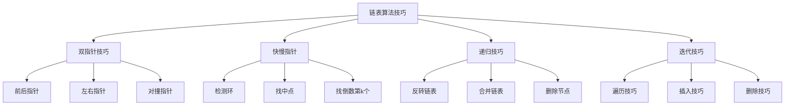

# 链表算法技巧

## 📖 核心概念

**链表算法技巧**是解决链表相关问题的关键方法。掌握这些技巧能够高效解决各种链表操作和算法问题。

### 🏗️ 算法技巧分类



## 🎯 双指针技巧

### 1. 快慢指针

```cpp
struct ListNode {
    int val;
    ListNode* next;
    ListNode(int x) : val(x), next(nullptr) {}
};

class LinkedListAlgorithms {
public:
    // 检测链表是否有环
    bool hasCycle(ListNode* head) {
        if (!head || !head->next) return false;
        
        ListNode* slow = head;
        ListNode* fast = head->next;
        
        while (fast && fast->next) {
            if (slow == fast) return true;
            slow = slow->next;
            fast = fast->next->next;
        }
        
        return false;
    }
    
    // 找到环的起始节点
    ListNode* detectCycle(ListNode* head) {
        if (!head || !head->next) return nullptr;
        
        ListNode* slow = head;
        ListNode* fast = head;
        
        // 第一阶段：检测是否有环
        while (fast && fast->next) {
            slow = slow->next;
            fast = fast->next->next;
            if (slow == fast) break;
        }
        
        if (!fast || !fast->next) return nullptr;
        
        // 第二阶段：找到环的起始点
        slow = head;
        while (slow != fast) {
            slow = slow->next;
            fast = fast->next;
        }
        
        return slow;
    }
    
    // 找到链表的中间节点
    ListNode* findMiddle(ListNode* head) {
        if (!head) return nullptr;
        
        ListNode* slow = head;
        ListNode* fast = head;
        
        while (fast && fast->next) {
            slow = slow->next;
            fast = fast->next->next;
        }
        
        return slow;
    }
    
    // 找到倒数第k个节点
    ListNode* findKthFromEnd(ListNode* head, int k) {
        if (!head || k <= 0) return nullptr;
        
        ListNode* first = head;
        ListNode* second = head;
        
        // 先移动first指针k步
        for (int i = 0; i < k; ++i) {
            if (!first) return nullptr;
            first = first->next;
        }
        
        // 同时移动两个指针
        while (first) {
            first = first->next;
            second = second->next;
        }
        
        return second;
    }
};
```

### 2. 前后指针

```cpp
    // 删除倒数第n个节点
    ListNode* removeNthFromEnd(ListNode* head, int n) {
        ListNode* dummy = new ListNode(0);
        dummy->next = head;
        
        ListNode* first = dummy;
        ListNode* second = dummy;
        
        // 先移动first指针n+1步
        for (int i = 0; i <= n; ++i) {
            first = first->next;
        }
        
        // 同时移动两个指针
        while (first) {
            first = first->next;
            second = second->next;
        }
        
        // 删除节点
        ListNode* toDelete = second->next;
        second->next = second->next->next;
        delete toDelete;
        
        ListNode* result = dummy->next;
        delete dummy;
        return result;
    }
    
    // 删除链表中的重复元素
    ListNode* deleteDuplicates(ListNode* head) {
        if (!head) return nullptr;
        
        ListNode* current = head;
        while (current && current->next) {
            if (current->val == current->next->val) {
                ListNode* duplicate = current->next;
                current->next = current->next->next;
                delete duplicate;
            } else {
                current = current->next;
            }
        }
        
        return head;
    }
```

## 🔄 递归技巧

### 1. 反转链表

```cpp
    // 递归反转链表
    ListNode* reverseListRecursive(ListNode* head) {
        if (!head || !head->next) return head;
        
        ListNode* newHead = reverseListRecursive(head->next);
        head->next->next = head;
        head->next = nullptr;
        
        return newHead;
    }
    
    // 迭代反转链表
    ListNode* reverseListIterative(ListNode* head) {
        ListNode* prev = nullptr;
        ListNode* current = head;
        
        while (current) {
            ListNode* next = current->next;
            current->next = prev;
            prev = current;
            current = next;
        }
        
        return prev;
    }
    
    // 反转链表的一部分
    ListNode* reverseBetween(ListNode* head, int left, int right) {
        if (!head || left == right) return head;
        
        ListNode* dummy = new ListNode(0);
        dummy->next = head;
        
        ListNode* prev = dummy;
        for (int i = 0; i < left - 1; ++i) {
            prev = prev->next;
        }
        
        ListNode* current = prev->next;
        for (int i = 0; i < right - left; ++i) {
            ListNode* next = current->next;
            current->next = next->next;
            next->next = prev->next;
            prev->next = next;
        }
        
        ListNode* result = dummy->next;
        delete dummy;
        return result;
    }
```

### 2. 合并链表

```cpp
    // 合并两个有序链表
    ListNode* mergeTwoLists(ListNode* list1, ListNode* list2) {
        ListNode* dummy = new ListNode(0);
        ListNode* current = dummy;
        
        while (list1 && list2) {
            if (list1->val <= list2->val) {
                current->next = list1;
                list1 = list1->next;
            } else {
                current->next = list2;
                list2 = list2->next;
            }
            current = current->next;
        }
        
        current->next = list1 ? list1 : list2;
        
        ListNode* result = dummy->next;
        delete dummy;
        return result;
    }
    
    // 递归合并两个有序链表
    ListNode* mergeTwoListsRecursive(ListNode* list1, ListNode* list2) {
        if (!list1) return list2;
        if (!list2) return list1;
        
        if (list1->val <= list2->val) {
            list1->next = mergeTwoListsRecursive(list1->next, list2);
            return list1;
        } else {
            list2->next = mergeTwoListsRecursive(list1, list2->next);
            return list2;
        }
    }
    
    // 合并k个有序链表
    ListNode* mergeKLists(vector<ListNode*>& lists) {
        if (lists.empty()) return nullptr;
        
        while (lists.size() > 1) {
            vector<ListNode*> mergedLists;
            
            for (size_t i = 0; i < lists.size(); i += 2) {
                ListNode* l1 = lists[i];
                ListNode* l2 = (i + 1 < lists.size()) ? lists[i + 1] : nullptr;
                mergedLists.push_back(mergeTwoLists(l1, l2));
            }
            
            lists = mergedLists;
        }
        
        return lists[0];
    }
```

## 🔧 高级技巧

### 1. 链表排序

```cpp
    // 链表归并排序
    ListNode* sortList(ListNode* head) {
        if (!head || !head->next) return head;
        
        // 找到中点
        ListNode* slow = head;
        ListNode* fast = head->next;
        
        while (fast && fast->next) {
            slow = slow->next;
            fast = fast->next->next;
        }
        
        ListNode* mid = slow->next;
        slow->next = nullptr;
        
        // 递归排序
        ListNode* left = sortList(head);
        ListNode* right = sortList(mid);
        
        // 合并
        return mergeTwoLists(left, right);
    }
    
    // 链表快速排序
    ListNode* quickSortList(ListNode* head) {
        if (!head || !head->next) return head;
        
        ListNode* pivot = head;
        ListNode* smaller = nullptr;
        ListNode* equal = nullptr;
        ListNode* larger = nullptr;
        
        ListNode* current = head;
        while (current) {
            ListNode* next = current->next;
            current->next = nullptr;
            
            if (current->val < pivot->val) {
                current->next = smaller;
                smaller = current;
            } else if (current->val == pivot->val) {
                current->next = equal;
                equal = current;
            } else {
                current->next = larger;
                larger = current;
            }
            
            current = next;
        }
        
        // 递归排序
        smaller = quickSortList(smaller);
        larger = quickSortList(larger);
        
        // 连接结果
        return concatenate(smaller, equal, larger);
    }
    
private:
    ListNode* concatenate(ListNode* smaller, ListNode* equal, ListNode* larger) {
        ListNode* result = nullptr;
        ListNode* tail = nullptr;
        
        // 连接smaller
        if (smaller) {
            result = smaller;
            tail = getTail(smaller);
        }
        
        // 连接equal
        if (equal) {
            if (!result) {
                result = equal;
            } else {
                tail->next = equal;
            }
            tail = getTail(equal);
        }
        
        // 连接larger
        if (larger) {
            if (!result) {
                result = larger;
            } else {
                tail->next = larger;
            }
        }
        
        return result;
    }
    
    ListNode* getTail(ListNode* head) {
        while (head && head->next) {
            head = head->next;
        }
        return head;
    }
```

### 2. 链表重排

```cpp
    // 重排链表：L0→Ln→L1→Ln-1→L2→Ln-2→...
    void reorderList(ListNode* head) {
        if (!head || !head->next) return;
        
        // 找到中点
        ListNode* slow = head;
        ListNode* fast = head;
        
        while (fast && fast->next) {
            slow = slow->next;
            fast = fast->next->next;
        }
        
        // 反转后半部分
        ListNode* secondHalf = reverseListIterative(slow->next);
        slow->next = nullptr;
        
        // 交替连接
        ListNode* first = head;
        ListNode* second = secondHalf;
        
        while (second) {
            ListNode* temp1 = first->next;
            ListNode* temp2 = second->next;
            
            first->next = second;
            second->next = temp1;
            
            first = temp1;
            second = temp2;
        }
    }
    
    // 奇偶链表重排
    ListNode* oddEvenList(ListNode* head) {
        if (!head || !head->next) return head;
        
        ListNode* odd = head;
        ListNode* even = head->next;
        ListNode* evenHead = even;
        
        while (even && even->next) {
            odd->next = even->next;
            odd = odd->next;
            even->next = odd->next;
            even = even->next;
        }
        
        odd->next = evenHead;
        return head;
    }
    
    // 交换相邻节点
    ListNode* swapPairs(ListNode* head) {
        if (!head || !head->next) return head;
        
        ListNode* dummy = new ListNode(0);
        dummy->next = head;
        
        ListNode* prev = dummy;
        
        while (prev->next && prev->next->next) {
            ListNode* first = prev->next;
            ListNode* second = prev->next->next;
            
            prev->next = second;
            first->next = second->next;
            second->next = first;
            
            prev = first;
        }
        
        ListNode* result = dummy->next;
        delete dummy;
        return result;
    }
```

## 🎯 实用技巧

### 1. 链表操作模板

```cpp
    // 通用链表操作模板
    template<typename Func>
    ListNode* processList(ListNode* head, Func func) {
        ListNode* dummy = new ListNode(0);
        dummy->next = head;
        
        ListNode* current = dummy;
        while (current->next) {
            if (func(current->next)) {
                ListNode* toDelete = current->next;
                current->next = current->next->next;
                delete toDelete;
            } else {
                current = current->next;
            }
        }
        
        ListNode* result = dummy->next;
        delete dummy;
        return result;
    }
    
    // 删除满足条件的节点
    ListNode* removeIf(ListNode* head, function<bool(ListNode*)> condition) {
        return processList(head, condition);
    }
    
    // 链表分割
    pair<ListNode*, ListNode*> partition(ListNode* head, int x) {
        ListNode* smaller = new ListNode(0);
        ListNode* larger = new ListNode(0);
        ListNode* smallerTail = smaller;
        ListNode* largerTail = larger;
        
        while (head) {
            if (head->val < x) {
                smallerTail->next = head;
                smallerTail = smallerTail->next;
            } else {
                largerTail->next = head;
                largerTail = largerTail->next;
            }
            head = head->next;
        }
        
        smallerTail->next = nullptr;
        largerTail->next = nullptr;
        
        return {smaller->next, larger->next};
    }
```

## 🔗 相关链接

- [[01-单链表实现|单链表实现]]
- [[02-双链表与循环链表|双链表循环链表]]
- [[04-链表应用题解|应用案例]]

## 💡 算法技巧要点

1. **双指针**：解决环检测、找中点、删除节点等问题
2. **递归**：优雅地解决反转、合并等操作
3. **迭代**：高效地处理链表遍历和修改
4. **模板**：建立通用的链表操作模式

---

*📝 技巧提示：掌握这些算法技巧是解决链表问题的关键，多练习提高熟练度*
