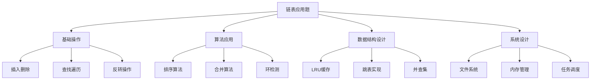

# 链表应用题解

## 📖 核心概念

**链表应用题解**展示了链表在实际编程问题中的应用。通过具体的题目和解决方案，我们可以更好地理解链表的操作技巧和算法思想。

### 🏗️ 应用题目分类



## 🎯 经典题目解析

### 1. LRU缓存实现

```cpp
class LRUCache {
private:
    struct Node {
        int key;
        int value;
        Node* prev;
        Node* next;
        
        Node(int k, int v) : key(k), value(v), prev(nullptr), next(nullptr) {}
    };
    
    unordered_map<int, Node*> cache;
    Node* head;
    Node* tail;
    int capacity;
    
    void addToHead(Node* node) {
        node->prev = head;
        node->next = head->next;
        head->next->prev = node;
        head->next = node;
    }
    
    void removeNode(Node* node) {
        node->prev->next = node->next;
        node->next->prev = node->prev;
    }
    
    void moveToHead(Node* node) {
        removeNode(node);
        addToHead(node);
    }
    
    Node* removeTail() {
        Node* lastNode = tail->prev;
        removeNode(lastNode);
        return lastNode;
    }
    
public:
    LRUCache(int cap) : capacity(cap) {
        head = new Node(0, 0);
        tail = new Node(0, 0);
        head->next = tail;
        tail->prev = head;
    }
    
    ~LRUCache() {
        Node* current = head;
        while (current) {
            Node* next = current->next;
            delete current;
            current = next;
        }
    }
    
    int get(int key) {
        if (cache.find(key) != cache.end()) {
            Node* node = cache[key];
            moveToHead(node);
            return node->value;
        }
        return -1;
    }
    
    void put(int key, int value) {
        if (cache.find(key) != cache.end()) {
            Node* node = cache[key];
            node->value = value;
            moveToHead(node);
        } else {
            Node* newNode = new Node(key, value);
            
            if (cache.size() >= capacity) {
                Node* tailNode = removeTail();
                cache.erase(tailNode->key);
                delete tailNode;
            }
            
            cache[key] = newNode;
            addToHead(newNode);
        }
    }
};
```

### 2. 复制带随机指针的链表

```cpp
struct RandomListNode {
    int label;
    RandomListNode* next;
    RandomListNode* random;
    
    RandomListNode(int x) : label(x), next(nullptr), random(nullptr) {}
};

class RandomListCopy {
public:
    // 方法1：使用哈希表
    RandomListNode* copyRandomList(RandomListNode* head) {
        if (!head) return nullptr;
        
        unordered_map<RandomListNode*, RandomListNode*> nodeMap;
        
        // 第一遍：创建所有节点
        RandomListNode* current = head;
        while (current) {
            nodeMap[current] = new RandomListNode(current->label);
            current = current->next;
        }
        
        // 第二遍：设置next和random指针
        current = head;
        while (current) {
            nodeMap[current]->next = nodeMap[current->next];
            nodeMap[current]->random = nodeMap[current->random];
            current = current->next;
        }
        
        return nodeMap[head];
    }
    
    // 方法2：原地复制
    RandomListNode* copyRandomListInPlace(RandomListNode* head) {
        if (!head) return nullptr;
        
        // 第一遍：在每个节点后插入复制节点
        RandomListNode* current = head;
        while (current) {
            RandomListNode* copy = new RandomListNode(current->label);
            copy->next = current->next;
            current->next = copy;
            current = copy->next;
        }
        
        // 第二遍：设置random指针
        current = head;
        while (current) {
            if (current->random) {
                current->next->random = current->random->next;
            }
            current = current->next->next;
        }
        
        // 第三遍：分离两个链表
        RandomListNode* newHead = head->next;
        current = head;
        while (current) {
            RandomListNode* copy = current->next;
            current->next = copy->next;
            if (copy->next) {
                copy->next = copy->next->next;
            }
            current = current->next;
        }
        
        return newHead;
    }
};
```

### 3. 链表加法

```cpp
class ListAddition {
public:
    // 两数相加（数字以链表形式存储，逆序）
    ListNode* addTwoNumbers(ListNode* l1, ListNode* l2) {
        ListNode* dummy = new ListNode(0);
        ListNode* current = dummy;
        int carry = 0;
        
        while (l1 || l2 || carry) {
            int sum = carry;
            if (l1) {
                sum += l1->val;
                l1 = l1->next;
            }
            if (l2) {
                sum += l2->val;
                l2 = l2->next;
            }
            
            carry = sum / 10;
            current->next = new ListNode(sum % 10);
            current = current->next;
        }
        
        ListNode* result = dummy->next;
        delete dummy;
        return result;
    }
    
    // 两数相加（数字以链表形式存储，正序）
    ListNode* addTwoNumbersForward(ListNode* l1, ListNode* l2) {
        // 反转链表
        l1 = reverseList(l1);
        l2 = reverseList(l2);
        
        // 相加
        ListNode* result = addTwoNumbers(l1, l2);
        
        // 反转结果
        return reverseList(result);
    }
    
private:
    ListNode* reverseList(ListNode* head) {
        ListNode* prev = nullptr;
        ListNode* current = head;
        
        while (current) {
            ListNode* next = current->next;
            current->next = prev;
            prev = current;
            current = next;
        }
        
        return prev;
    }
};
```

## 🔧 高级应用

### 1. 跳表实现

```cpp
class SkipList {
private:
    struct Node {
        int key;
        int value;
        vector<Node*> next;
        
        Node(int k, int v, int level) : key(k), value(v) {
            next.resize(level + 1, nullptr);
        }
    };
    
    Node* head;
    int maxLevel;
    int currentLevel;
    
    int randomLevel() {
        int level = 0;
        while (rand() % 2 == 0 && level < maxLevel) {
            level++;
        }
        return level;
    }
    
public:
    SkipList(int maxLvl = 16) : maxLevel(maxLvl), currentLevel(0) {
        head = new Node(INT_MIN, 0, maxLevel);
    }
    
    ~SkipList() {
        Node* current = head;
        while (current) {
            Node* next = current->next[0];
            delete current;
            current = next;
        }
    }
    
    int search(int key) {
        Node* current = head;
        
        for (int i = currentLevel; i >= 0; i--) {
            while (current->next[i] && current->next[i]->key < key) {
                current = current->next[i];
            }
        }
        
        current = current->next[0];
        if (current && current->key == key) {
            return current->value;
        }
        
        return -1;
    }
    
    void insert(int key, int value) {
        vector<Node*> update(maxLevel + 1);
        Node* current = head;
        
        for (int i = currentLevel; i >= 0; i--) {
            while (current->next[i] && current->next[i]->key < key) {
                current = current->next[i];
            }
            update[i] = current;
        }
        
        current = current->next[0];
        
        if (current && current->key == key) {
            current->value = value;
            return;
        }
        
        int newLevel = randomLevel();
        
        if (newLevel > currentLevel) {
            for (int i = currentLevel + 1; i <= newLevel; i++) {
                update[i] = head;
            }
            currentLevel = newLevel;
        }
        
        Node* newNode = new Node(key, value, newLevel);
        
        for (int i = 0; i <= newLevel; i++) {
            newNode->next[i] = update[i]->next[i];
            update[i]->next[i] = newNode;
        }
    }
    
    void remove(int key) {
        vector<Node*> update(maxLevel + 1);
        Node* current = head;
        
        for (int i = currentLevel; i >= 0; i--) {
            while (current->next[i] && current->next[i]->key < key) {
                current = current->next[i];
            }
            update[i] = current;
        }
        
        current = current->next[0];
        
        if (current && current->key == key) {
            for (int i = 0; i <= currentLevel; i++) {
                if (update[i]->next[i] != current) {
                    break;
                }
                update[i]->next[i] = current->next[i];
            }
            
            delete current;
            
            while (currentLevel > 0 && head->next[currentLevel] == nullptr) {
                currentLevel--;
            }
        }
    }
};
```

### 2. 并查集实现

```cpp
class UnionFind {
private:
    vector<int> parent;
    vector<int> rank;
    
public:
    UnionFind(int n) : parent(n), rank(n, 0) {
        for (int i = 0; i < n; i++) {
            parent[i] = i;
        }
    }
    
    int find(int x) {
        if (parent[x] != x) {
            parent[x] = find(parent[x]);  // 路径压缩
        }
        return parent[x];
    }
    
    void unite(int x, int y) {
        int rootX = find(x);
        int rootY = find(y);
        
        if (rootX != rootY) {
            if (rank[rootX] < rank[rootY]) {
                parent[rootX] = rootY;
            } else if (rank[rootX] > rank[rootY]) {
                parent[rootY] = rootX;
            } else {
                parent[rootY] = rootX;
                rank[rootX]++;
            }
        }
    }
    
    bool connected(int x, int y) {
        return find(x) == find(y);
    }
};
```

## 🎮 实际应用场景

### 1. 文件系统目录结构

```cpp
class FileSystem {
private:
    struct FileNode {
        string name;
        bool isDirectory;
        string content;
        FileNode* parent;
        vector<FileNode*> children;
        
        FileNode(string n, bool isDir, FileNode* p = nullptr) 
            : name(n), isDirectory(isDir), parent(p) {}
    };
    
    FileNode* root;
    FileNode* current;
    
public:
    FileSystem() {
        root = new FileNode("/", true);
        current = root;
    }
    
    ~FileSystem() {
        deleteTree(root);
    }
    
    void mkdir(string path) {
        vector<string> parts = splitPath(path);
        FileNode* target = navigateToParent(parts);
        
        if (target) {
            string dirName = parts.back();
            FileNode* newDir = new FileNode(dirName, true, target);
            target->children.push_back(newDir);
        }
    }
    
    void createFile(string path, string content) {
        vector<string> parts = splitPath(path);
        FileNode* parent = navigateToParent(parts);
        
        if (parent) {
            string fileName = parts.back();
            FileNode* newFile = new FileNode(fileName, false, parent);
            newFile->content = content;
            parent->children.push_back(newFile);
        }
    }
    
    string readFile(string path) {
        FileNode* file = findNode(path);
        if (file && !file->isDirectory) {
            return file->content;
        }
        return "";
    }
    
    void listDirectory(string path = "") {
        FileNode* target = path.empty() ? current : findNode(path);
        
        if (target && target->isDirectory) {
            for (FileNode* child : target->children) {
                cout << (child->isDirectory ? "[DIR] " : "[FILE] ") 
                     << child->name << endl;
            }
        }
    }
    
private:
    vector<string> splitPath(string path) {
        vector<string> parts;
        stringstream ss(path);
        string part;
        
        while (getline(ss, part, '/')) {
            if (!part.empty()) {
                parts.push_back(part);
            }
        }
        
        return parts;
    }
    
    FileNode* navigateToParent(vector<string>& parts) {
        if (parts.empty()) return nullptr;
        
        FileNode* current = root;
        
        for (size_t i = 0; i < parts.size() - 1; i++) {
            bool found = false;
            for (FileNode* child : current->children) {
                if (child->name == parts[i] && child->isDirectory) {
                    current = child;
                    found = true;
                    break;
                }
            }
            if (!found) return nullptr;
        }
        
        return current;
    }
    
    FileNode* findNode(string path) {
        vector<string> parts = splitPath(path);
        FileNode* current = root;
        
        for (string part : parts) {
            bool found = false;
            for (FileNode* child : current->children) {
                if (child->name == part) {
                    current = child;
                    found = true;
                    break;
                }
            }
            if (!found) return nullptr;
        }
        
        return current;
    }
    
    void deleteTree(FileNode* node) {
        if (!node) return;
        
        for (FileNode* child : node->children) {
            deleteTree(child);
        }
        
        delete node;
    }
};
```

## 🔗 相关链接

- [[01-单链表实现|单链表实现]]
- [[02-双链表与循环链表|双链表循环链表]]
- [[03-链表算法技巧|算法技巧]]

## 💡 应用要点

1. **LRU缓存**：结合哈希表和双向链表实现高效缓存
2. **跳表**：平衡查找效率和实现复杂度
3. **并查集**：解决连通性问题
4. **文件系统**：树形结构在系统设计中的应用

---

*📝 应用提示：链表是许多高级数据结构的基础，掌握其应用有助于解决复杂问题*
