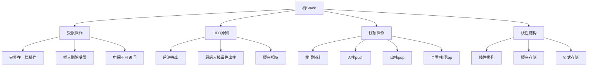

# 📚 栈Stack详解

## 🎯 核心定义

**栈（Stack）**是一种后进先出（LIFO - Last In First Out）的线性数据结构，只能在栈顶进行插入和删除操作。

### 🔍 本质理解
栈 = 受限的线性表 + LIFO原则 + 栈顶操作



---

## 🏗️ 栈的基本特性

### 📊 特性分析表

| 特性 | 描述 | 优势 | 劣势 |
|------|------|------|------|
| **LIFO原则** | 后进先出 | 操作简单、逻辑清晰 | 访问受限 |
| **受限操作** | 只能在栈顶操作 | 防止误操作 | 灵活性受限 |
| **动态大小** | 大小可变化 | 内存效率高 | 需要动态管理 |
| **快速操作** | O(1)时间复杂度 | 操作高效 | 功能受限 |

### 🎯 栈的操作

#### 📋 基本操作
| 操作 | 描述 | 时间复杂度 | 说明 |
|------|------|------------|------|
| **push(x)** | 入栈，将x压入栈顶 | O(1) | 在栈顶插入元素 |
| **pop()** | 出栈，删除栈顶元素 | O(1) | 删除并返回栈顶元素 |
| **top()** | 查看栈顶元素 | O(1) | 返回但不删除栈顶元素 |
| **isEmpty()** | 判断栈是否为空 | O(1) | 检查栈的状态 |
| **size()** | 返回栈中元素个数 | O(1) | 获取栈的大小 |

#### 🎯 栈的状态
```
空栈:     []
入栈10:   [10]
入栈20:   [10, 20]
入栈30:   [10, 20, 30]
出栈:     [10, 20]     (返回30)
出栈:     [10]         (返回20)
出栈:     []           (返回10)
```

---

## 💻 栈的实现

### 🔧 数组实现

#### 📋 类定义
```cpp
template<typename T>
class ArrayStack {
private:
    T* data;           // 数据数组
    int capacity;      // 栈容量
    int topIndex;      // 栈顶索引
    
public:
    // 构造和析构
    ArrayStack(int capacity = 100);
    ~ArrayStack();
    
    // 基本操作
    void push(const T& value);
    T pop();
    T top() const;
    bool isEmpty() const;
    int size() const;
    
    // 工具操作
    void display() const;
    void clear();
};
```

#### 🎯 核心操作实现

##### 📖 构造和析构
```cpp
template<typename T>
ArrayStack<T>::ArrayStack(int capacity) 
    : capacity(capacity), topIndex(-1) {
    data = new T[capacity];
}

template<typename T>
ArrayStack<T>::~ArrayStack() {
    delete[] data;
}
```

##### ➕ 入栈操作
```cpp
template<typename T>
void ArrayStack<T>::push(const T& value) {
    if (topIndex >= capacity - 1) {
        throw std::overflow_error("Stack overflow");
    }
    data[++topIndex] = value;
}
```

##### ➖ 出栈操作
```cpp
template<typename T>
T ArrayStack<T>::pop() {
    if (isEmpty()) {
        throw std::underflow_error("Stack underflow");
    }
    return data[topIndex--];
}
```

##### 🔍 查看栈顶
```cpp
template<typename T>
T ArrayStack<T>::top() const {
    if (isEmpty()) {
        throw std::underflow_error("Stack is empty");
    }
    return data[topIndex];
}
```

### 🔧 链表实现

#### 📋 节点定义
```cpp
template<typename T>
struct StackNode {
    T data;
    StackNode<T>* next;
    
    StackNode(const T& value) : data(value), next(nullptr) {}
};
```

#### 📋 类定义
```cpp
template<typename T>
class LinkedStack {
private:
    StackNode<T>* topNode;    // 栈顶节点
    int stackSize;            // 栈大小
    
public:
    // 构造和析构
    LinkedStack();
    ~LinkedStack();
    
    // 基本操作
    void push(const T& value);
    T pop();
    T top() const;
    bool isEmpty() const;
    int size() const;
    
    // 工具操作
    void display() const;
    void clear();
};
```

#### 🎯 核心操作实现

##### ➕ 入栈操作
```cpp
template<typename T>
void LinkedStack<T>::push(const T& value) {
    StackNode<T>* newNode = new StackNode<T>(value);
    newNode->next = topNode;
    topNode = newNode;
    stackSize++;
}
```

##### ➖ 出栈操作
```cpp
template<typename T>
T LinkedStack<T>::pop() {
    if (isEmpty()) {
        throw std::underflow_error("Stack is empty");
    }
    
    StackNode<T>* temp = topNode;
    T value = temp->data;
    topNode = topNode->next;
    delete temp;
    stackSize--;
    
    return value;
}
```

---

## 📊 实现方式对比

### 📋 对比分析表

| 方面 | 数组实现 | 链表实现 | 推荐场景 |
|------|----------|----------|----------|
| **空间效率** | 固定空间，可能浪费 | 动态分配，无浪费 | 大小确定用数组 |
| **时间效率** | 所有操作O(1) | 所有操作O(1) | 性能要求高用数组 |
| **内存管理** | 简单，自动管理 | 复杂，手动管理 | 简单应用用数组 |
| **灵活性** | 大小固定 | 大小可变 | 大小变化用链表 |
| **缓存友好** | 连续内存，友好 | 非连续内存，不友好 | 性能敏感用数组 |

### 🎯 选择建议

#### ✅ 选择数组实现的情况
1. **栈大小确定**：知道最大元素数量
2. **性能要求高**：需要最佳性能
3. **内存充足**：不介意空间浪费
4. **简单应用**：不需要复杂的内存管理

#### ✅ 选择链表实现的情况
1. **栈大小不确定**：元素数量变化较大
2. **内存敏感**：需要精确的内存使用
3. **复杂应用**：需要灵活的内存管理
4. **学习目的**：理解指针和动态内存

---

## 🎯 栈的应用场景

### 📋 典型应用

#### 🔄 函数调用
- **调用栈**：存储函数调用信息
- **局部变量**：存储函数局部变量
- **返回地址**：存储函数返回地址
- **参数传递**：存储函数参数

```cpp
void functionA() {
    // 函数A的局部变量
    int a = 10;
    functionB();  // 调用函数B
    // 函数A继续执行
}

void functionB() {
    // 函数B的局部变量
    int b = 20;
    functionC();  // 调用函数C
    // 函数B继续执行
}
```

#### 🔍 表达式求值
- **中缀转后缀**：将中缀表达式转为后缀
- **后缀表达式求值**：计算后缀表达式的值
- **括号匹配**：检查括号是否匹配

```cpp
// 中缀表达式: (3 + 4) * 5
// 后缀表达式: 3 4 + 5 *
int evaluatePostfix(const string& expression) {
    stack<int> st;
    
    for (char c : expression) {
        if (isdigit(c)) {
            st.push(c - '0');
        } else if (c == '+') {
            int b = st.top(); st.pop();
            int a = st.top(); st.pop();
            st.push(a + b);
        } else if (c == '*') {
            int b = st.top(); st.pop();
            int a = st.top(); st.pop();
            st.push(a * b);
        }
    }
    
    return st.top();
}
```

#### 🔄 撤销操作
- **编辑器撤销**：撤销文本编辑操作
- **图形撤销**：撤销图形绘制操作
- **游戏撤销**：撤销游戏中的操作

```cpp
class TextEditor {
private:
    stack<string> undoStack;  // 撤销栈
    string currentText;       // 当前文本
    
public:
    void insertText(const string& text) {
        undoStack.push(currentText);  // 保存当前状态
        currentText += text;          // 执行插入操作
    }
    
    void undo() {
        if (!undoStack.empty()) {
            currentText = undoStack.top();
            undoStack.pop();
        }
    }
};
```

#### 🎯 深度优先搜索
- **图遍历**：DFS算法使用栈
- **树遍历**：非递归树遍历
- **回溯算法**：回溯搜索使用栈

```cpp
void dfsIterative(vector<vector<int>>& graph, int start) {
    stack<int> st;
    vector<bool> visited(graph.size(), false);
    
    st.push(start);
    
    while (!st.empty()) {
        int node = st.top();
        st.pop();
        
        if (!visited[node]) {
            visited[node] = true;
            cout << node << " ";
            
            // 将邻居节点入栈
            for (int neighbor : graph[node]) {
                if (!visited[neighbor]) {
                    st.push(neighbor);
                }
            }
        }
    }
}
```

---

## 🧠 学习策略

### 📚 理解层次

#### 🔴 认识层次
- 知道栈的基本概念
- 了解LIFO原则
- 识别栈的应用场景

#### 🟡 理解层次
- 理解栈的操作原理
- 掌握栈的实现方法
- 分析栈的优缺点

#### 🟢 应用层次
- 能实现栈的基本操作
- 会选择合适的实现方式
- 能解决栈相关问题

#### 🔵 创新层次
- 能设计栈的变种
- 会优化栈操作
- 能组合栈与其他结构

### 🎯 学习建议

1. **从简单到复杂**：基本操作 → 应用场景 → 高级应用
2. **理论与实践结合**：概念理解 + 代码实现
3. **对比学习**：数组实现 vs 链表实现
4. **应用驱动**：从实际问题出发学习栈

### 🔍 常见错误

#### ❌ 常见错误
1. **栈溢出**：入栈时超出容量限制
2. **栈下溢**：空栈时执行出栈操作
3. **内存泄漏**：链表实现忘记释放内存
4. **逻辑错误**：混淆LIFO和FIFO

#### ✅ 最佳实践
1. **边界检查**：检查栈的状态
2. **异常处理**：处理栈操作异常
3. **内存管理**：及时释放动态内存
4. **代码复用**：提取公共操作

---

## 🔗 相关链接

### 📖 深入学习
- [[02-队列Queue详解|队列Queue详解]]
- [[03-双端队列与优先队列|双端队列与优先队列]]
- [[04-栈队列应用场景|栈队列应用场景]]

### 🛠️ 实践应用
- [[02-线性世界/01-序列结构[数组]/01-数组基础|数组基础]]
- [[02-线性世界/02-链式结构[链表]/01-单链表实现|链表实现]]
- [[04-算法武器库/03-图论算法/01-BFS与DFS详解|DFS算法]]

### 🎯 检测学习
- [[00-学习枢纽/📋-知识点检测清单|知识点检测清单]]
- [[00-学习枢纽/📊-学习进度跟踪|学习进度跟踪]]

---
*💡 栈是计算机科学的基础数据结构，掌握栈是理解递归和算法的重要基础！*
