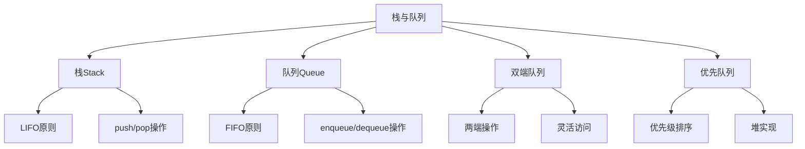

# 栈与队列

## 📖 核心概念

**栈和队列**是两种重要的线性数据结构。栈遵循LIFO（后进先出）原则，队列遵循FIFO（先进先出）原则。

### 🏗️ 结构特性



## 🔧 栈实现

### 数组实现栈

```cpp
class ArrayStack {
private:
    int* data;
    int top;
    int capacity;
    
public:
    ArrayStack(int cap) : capacity(cap), top(-1) {
        data = new int[capacity];
    }
    
    ~ArrayStack() {
        delete[] data;
    }
    
    void push(int value) {
        if (top < capacity - 1) {
            data[++top] = value;
        }
    }
    
    int pop() {
        if (top >= 0) {
            return data[top--];
        }
        return -1;
    }
    
    int peek() {
        if (top >= 0) {
            return data[top];
        }
        return -1;
    }
    
    bool isEmpty() {
        return top == -1;
    }
    
    bool isFull() {
        return top == capacity - 1;
    }
};
```

### 链表实现栈

```cpp
class LinkedStack {
private:
    struct Node {
        int data;
        Node* next;
        Node(int d) : data(d), next(nullptr) {}
    };
    
    Node* top;
    
public:
    LinkedStack() : top(nullptr) {}
    
    ~LinkedStack() {
        while (top) {
            Node* temp = top;
            top = top->next;
            delete temp;
        }
    }
    
    void push(int value) {
        Node* newNode = new Node(value);
        newNode->next = top;
        top = newNode;
    }
    
    int pop() {
        if (top) {
            int value = top->data;
            Node* temp = top;
            top = top->next;
            delete temp;
            return value;
        }
        return -1;
    }
    
    int peek() {
        return top ? top->data : -1;
    }
    
    bool isEmpty() {
        return top == nullptr;
    }
};
```

## 🎯 队列实现

### 数组实现队列

```cpp
class ArrayQueue {
private:
    int* data;
    int front;
    int rear;
    int capacity;
    int size;
    
public:
    ArrayQueue(int cap) : capacity(cap), front(0), rear(-1), size(0) {
        data = new int[capacity];
    }
    
    ~ArrayQueue() {
        delete[] data;
    }
    
    void enqueue(int value) {
        if (size < capacity) {
            rear = (rear + 1) % capacity;
            data[rear] = value;
            size++;
        }
    }
    
    int dequeue() {
        if (size > 0) {
            int value = data[front];
            front = (front + 1) % capacity;
            size--;
            return value;
        }
        return -1;
    }
    
    int peek() {
        return size > 0 ? data[front] : -1;
    }
    
    bool isEmpty() {
        return size == 0;
    }
    
    bool isFull() {
        return size == capacity;
    }
};
```

### 链表实现队列

```cpp
class LinkedQueue {
private:
    struct Node {
        int data;
        Node* next;
        Node(int d) : data(d), next(nullptr) {}
    };
    
    Node* front;
    Node* rear;
    
public:
    LinkedQueue() : front(nullptr), rear(nullptr) {}
    
    ~LinkedQueue() {
        while (front) {
            Node* temp = front;
            front = front->next;
            delete temp;
        }
    }
    
    void enqueue(int value) {
        Node* newNode = new Node(value);
        
        if (!rear) {
            front = rear = newNode;
        } else {
            rear->next = newNode;
            rear = newNode;
        }
    }
    
    int dequeue() {
        if (front) {
            int value = front->data;
            Node* temp = front;
            front = front->next;
            
            if (!front) {
                rear = nullptr;
            }
            
            delete temp;
            return value;
        }
        return -1;
    }
    
    int peek() {
        return front ? front->data : -1;
    }
    
    bool isEmpty() {
        return front == nullptr;
    }
};
```

## 📊 栈应用

### 1. 括号匹配

```cpp
class BracketMatching {
public:
    static bool isValid(string s) {
        stack<char> stk;
        
        for (char c : s) {
            if (c == '(' || c == '[' || c == '{') {
                stk.push(c);
            } else {
                if (stk.empty()) return false;
                
                char top = stk.top();
                stk.pop();
                
                if ((c == ')' && top != '(') ||
                    (c == ']' && top != '[') ||
                    (c == '}' && top != '{')) {
                    return false;
                }
            }
        }
        
        return stk.empty();
    }
};
```

### 2. 表达式求值

```cpp
class ExpressionEvaluation {
public:
    static int evaluate(string expression) {
        stack<int> operands;
        stack<char> operators;
        
        for (char c : expression) {
            if (isdigit(c)) {
                operands.push(c - '0');
            } else if (c == '+' || c == '-' || c == '*' || c == '/') {
                while (!operators.empty() && precedence(operators.top()) >= precedence(c)) {
                    int b = operands.top(); operands.pop();
                    int a = operands.top(); operands.pop();
                    char op = operators.top(); operators.pop();
                    operands.push(applyOperation(a, b, op));
                }
                operators.push(c);
            }
        }
        
        while (!operators.empty()) {
            int b = operands.top(); operands.pop();
            int a = operands.top(); operands.pop();
            char op = operators.top(); operators.pop();
            operands.push(applyOperation(a, b, op));
        }
        
        return operands.top();
    }
    
private:
    static int precedence(char op) {
        if (op == '+' || op == '-') return 1;
        if (op == '*' || op == '/') return 2;
        return 0;
    }
    
    static int applyOperation(int a, int b, char op) {
        switch (op) {
            case '+': return a + b;
            case '-': return a - b;
            case '*': return a * b;
            case '/': return a / b;
            default: return 0;
        }
    }
};
```

## 🎮 队列应用

### 1. 广度优先搜索

```cpp
class BFS {
public:
    static vector<int> bfs(vector<vector<int>>& graph, int start) {
        vector<int> result;
        vector<bool> visited(graph.size(), false);
        queue<int> q;
        
        q.push(start);
        visited[start] = true;
        
        while (!q.empty()) {
            int node = q.front();
            q.pop();
            result.push_back(node);
            
            for (int neighbor : graph[node]) {
                if (!visited[neighbor]) {
                    visited[neighbor] = true;
                    q.push(neighbor);
                }
            }
        }
        
        return result;
    }
};
```

### 2. 滑动窗口最大值

```cpp
class SlidingWindowMaximum {
public:
    static vector<int> maxSlidingWindow(vector<int>& nums, int k) {
        vector<int> result;
        deque<int> dq;
        
        for (int i = 0; i < nums.size(); ++i) {
            while (!dq.empty() && dq.front() <= i - k) {
                dq.pop_front();
            }
            
            while (!dq.empty() && nums[dq.back()] <= nums[i]) {
                dq.pop_back();
            }
            
            dq.push_back(i);
            
            if (i >= k - 1) {
                result.push_back(nums[dq.front()]);
            }
        }
        
        return result;
    }
};
```

## 🔗 相关链接

- [[01-数组基础|数组基础]]
- [[02-链表基础|链表基础]]
- [[04-字符串处理|字符串处理]]

## 💡 栈与队列要点

1. **栈特性**：LIFO原则，适合递归和回溯
2. **队列特性**：FIFO原则，适合BFS和任务调度
3. **实现方式**：数组和链表都可以实现
4. **应用场景**：表达式求值、括号匹配、BFS等

---

*📝 基础提示：栈和队列是重要的线性数据结构，掌握它们有助于理解更复杂的算法*
