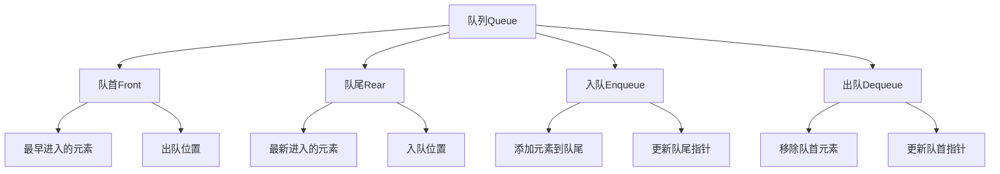

# 队列Queue详解

## 📖 核心概念

**队列（Queue）**是一种先进先出（FIFO）的线性数据结构。队列在计算机科学中有广泛应用，如任务调度、缓冲区管理、广度优先搜索等。

### 🏗️ 队列组成要素



## 🔧 队列实现

### 基于数组的队列

```cpp
template<typename T>
class ArrayQueue {
private:
    T* data;
    size_t capacity;
    size_t front;
    size_t rear;
    size_t size;
    
    void resize(size_t newCapacity) {
        T* newData = new T[newCapacity];
        
        for (size_t i = 0; i < size; ++i) {
            newData[i] = data[(front + i) % capacity];
        }
        
        delete[] data;
        data = newData;
        capacity = newCapacity;
        front = 0;
        rear = size;
    }
    
public:
    ArrayQueue(size_t initialCapacity = 8) 
        : capacity(initialCapacity), front(0), rear(0), size(0) {
        data = new T[capacity];
    }
    
    ~ArrayQueue() {
        delete[] data;
    }
    
    void enqueue(const T& value) {
        if (size >= capacity) {
            resize(capacity * 2);
        }
        
        data[rear] = value;
        rear = (rear + 1) % capacity;
        size++;
    }
    
    void dequeue() {
        if (isEmpty()) {
            throw std::runtime_error("Queue is empty");
        }
        
        front = (front + 1) % capacity;
        size--;
        
        if (size > 0 && size <= capacity / 4) {
            resize(capacity / 2);
        }
    }
    
    T& frontElement() {
        if (isEmpty()) {
            throw std::runtime_error("Queue is empty");
        }
        return data[front];
    }
    
    const T& frontElement() const {
        if (isEmpty()) {
            throw std::runtime_error("Queue is empty");
        }
        return data[front];
    }
    
    bool isEmpty() const {
        return size == 0;
    }
    
    size_t getSize() const {
        return size;
    }
    
    size_t getCapacity() const {
        return capacity;
    }
};
```

### 基于链表的队列

```cpp
template<typename T>
class LinkedQueue {
private:
    struct Node {
        T data;
        Node* next;
        
        Node(const T& value) : data(value), next(nullptr) {}
    };
    
    Node* front;
    Node* rear;
    size_t size;
    
public:
    LinkedQueue() : front(nullptr), rear(nullptr), size(0) {}
    
    ~LinkedQueue() {
        clear();
    }
    
    void enqueue(const T& value) {
        Node* newNode = new Node(value);
        
        if (isEmpty()) {
            front = rear = newNode;
        } else {
            rear->next = newNode;
            rear = newNode;
        }
        
        size++;
    }
    
    void dequeue() {
        if (isEmpty()) {
            throw std::runtime_error("Queue is empty");
        }
        
        Node* temp = front;
        front = front->next;
        
        if (front == nullptr) {
            rear = nullptr;
        }
        
        delete temp;
        size--;
    }
    
    T& frontElement() {
        if (isEmpty()) {
            throw std::runtime_error("Queue is empty");
        }
        return front->data;
    }
    
    const T& frontElement() const {
        if (isEmpty()) {
            throw std::runtime_error("Queue is empty");
        }
        return front->data;
    }
    
    bool isEmpty() const {
        return front == nullptr;
    }
    
    size_t getSize() const {
        return size;
    }
    
    void clear() {
        while (!isEmpty()) {
            dequeue();
        }
    }
};
```

## 🎯 队列应用

### 1. 广度优先搜索

```cpp
class BFS {
public:
    vector<vector<int>> directions = {{-1, 0}, {1, 0}, {0, -1}, {0, 1}};
    
    int shortestPath(vector<vector<int>>& grid, pair<int, int> start, pair<int, int> end) {
        if (grid.empty() || grid[0].empty()) return -1;
        
        int rows = grid.size();
        int cols = grid[0].size();
        
        queue<pair<int, int>> q;
        vector<vector<bool>> visited(rows, vector<bool>(cols, false));
        vector<vector<int>> distance(rows, vector<int>(cols, 0));
        
        q.push(start);
        visited[start.first][start.second] = true;
        
        while (!q.empty()) {
            pair<int, int> current = q.front();
            q.pop();
            
            if (current == end) {
                return distance[current.first][current.second];
            }
            
            for (auto& dir : directions) {
                int newRow = current.first + dir[0];
                int newCol = current.second + dir[1];
                
                if (isValid(newRow, newCol, rows, cols) && 
                    !visited[newRow][newCol] && 
                    grid[newRow][newCol] != 1) {
                    
                    visited[newRow][newCol] = true;
                    distance[newRow][newCol] = distance[current.first][current.second] + 1;
                    q.push({newRow, newCol});
                }
            }
        }
        
        return -1;
    }
    
private:
    bool isValid(int row, int col, int rows, int cols) {
        return row >= 0 && row < rows && col >= 0 && col < cols;
    }
};
```

### 2. 任务调度系统

```cpp
class TaskScheduler {
private:
    struct Task {
        int id;
        int priority;
        string description;
        chrono::system_clock::time_point submitTime;
        
        Task(int i, int p, string desc) 
            : id(i), priority(p), description(desc), 
              submitTime(chrono::system_clock::now()) {}
    };
    
    queue<Task> taskQueue;
    mutex queueMutex;
    condition_variable cv;
    bool shutdown = false;
    
public:
    void submitTask(int id, int priority, string description) {
        lock_guard<mutex> lock(queueMutex);
        taskQueue.push(Task(id, priority, description));
        cv.notify_one();
    }
    
    void processTasks() {
        while (true) {
            unique_lock<mutex> lock(queueMutex);
            cv.wait(lock, [this] { return !taskQueue.empty() || shutdown; });
            
            if (shutdown && taskQueue.empty()) {
                break;
            }
            
            if (!taskQueue.empty()) {
                Task task = taskQueue.front();
                taskQueue.pop();
                lock.unlock();
                
                executeTask(task);
            }
        }
    }
    
    void shutdown() {
        {
            lock_guard<mutex> lock(queueMutex);
            shutdown = true;
        }
        cv.notify_all();
    }
    
private:
    void executeTask(const Task& task) {
        cout << "Executing task " << task.id << ": " << task.description << endl;
        this_thread::sleep_for(chrono::milliseconds(100));
        cout << "Task " << task.id << " completed" << endl;
    }
};
```

## 🔗 相关链接

- [[01-栈Stack详解|栈Stack详解]]
- [[03-双端队列与优先队列|双端队列优先队列]]
- [[04-栈队列应用场景|应用场景]]

## 💡 队列要点

1. **FIFO原则**：先进先出是队列的核心特性
2. **实现选择**：数组实现适合固定大小，链表实现适合动态大小
3. **应用广泛**：BFS、任务调度、缓冲区管理等
4. **线程安全**：多线程环境下需要同步机制

---

*📝 实现提示：队列是BFS算法的基础，掌握其实现有助于理解图算法*
