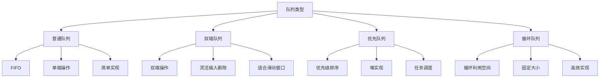

# 双端队列与优先队列

## 📖 核心概念

**双端队列（Deque）**和**优先队列（Priority Queue）**是队列的扩展形式。双端队列支持两端操作，优先队列按优先级排序。

### 🏗️ 队列类型对比



## 🔧 双端队列实现

### 基于数组的双端队列

```cpp
template<typename T>
class ArrayDeque {
private:
    T* data;
    size_t capacity;
    size_t front;
    size_t rear;
    size_t size;
    
    void resize(size_t newCapacity) {
        T* newData = new T[newCapacity];
        
        for (size_t i = 0; i < size; ++i) {
            newData[i] = data[(front + i) % capacity];
        }
        
        delete[] data;
        data = newData;
        capacity = newCapacity;
        front = 0;
        rear = size;
    }
    
public:
    ArrayDeque(size_t initialCapacity = 8) 
        : capacity(initialCapacity), front(0), rear(0), size(0) {
        data = new T[capacity];
    }
    
    ~ArrayDeque() {
        delete[] data;
    }
    
    // 前端操作
    void push_front(const T& value) {
        if (size >= capacity) {
            resize(capacity * 2);
        }
        
        front = (front - 1 + capacity) % capacity;
        data[front] = value;
        size++;
    }
    
    void pop_front() {
        if (isEmpty()) {
            throw std::runtime_error("Deque is empty");
        }
        
        front = (front + 1) % capacity;
        size--;
        
        if (size > 0 && size <= capacity / 4) {
            resize(capacity / 2);
        }
    }
    
    // 后端操作
    void push_back(const T& value) {
        if (size >= capacity) {
            resize(capacity * 2);
        }
        
        data[rear] = value;
        rear = (rear + 1) % capacity;
        size++;
    }
    
    void pop_back() {
        if (isEmpty()) {
            throw std::runtime_error("Deque is empty");
        }
        
        rear = (rear - 1 + capacity) % capacity;
        size--;
        
        if (size > 0 && size <= capacity / 4) {
            resize(capacity / 2);
        }
    }
    
    // 访问元素
    T& frontElement() {
        if (isEmpty()) {
            throw std::runtime_error("Deque is empty");
        }
        return data[front];
    }
    
    const T& frontElement() const {
        if (isEmpty()) {
            throw std::runtime_error("Deque is empty");
        }
        return data[front];
    }
    
    T& backElement() {
        if (isEmpty()) {
            throw std::runtime_error("Deque is empty");
        }
        return data[(rear - 1 + capacity) % capacity];
    }
    
    const T& backElement() const {
        if (isEmpty()) {
            throw std::runtime_error("Deque is empty");
        }
        return data[(rear - 1 + capacity) % capacity];
    }
    
    // 状态查询
    bool isEmpty() const {
        return size == 0;
    }
    
    size_t getSize() const {
        return size;
    }
    
    size_t getCapacity() const {
        return capacity;
    }
};
```

## 🎯 优先队列实现

### 基于堆的优先队列

```cpp
template<typename T>
class PriorityQueue {
private:
    vector<T> heap;
    
    void heapifyUp(size_t index) {
        while (index > 0) {
            size_t parent = (index - 1) / 2;
            if (heap[index] <= heap[parent]) {
                break;
            }
            swap(heap[index], heap[parent]);
            index = parent;
        }
    }
    
    void heapifyDown(size_t index) {
        size_t leftChild, rightChild, largest;
        
        while (true) {
            leftChild = 2 * index + 1;
            rightChild = 2 * index + 2;
            largest = index;
            
            if (leftChild < heap.size() && heap[leftChild] > heap[largest]) {
                largest = leftChild;
            }
            
            if (rightChild < heap.size() && heap[rightChild] > heap[largest]) {
                largest = rightChild;
            }
            
            if (largest == index) {
                break;
            }
            
            swap(heap[index], heap[largest]);
            index = largest;
        }
    }
    
public:
    PriorityQueue() {}
    
    void push(const T& value) {
        heap.push_back(value);
        heapifyUp(heap.size() - 1);
    }
    
    void pop() {
        if (isEmpty()) {
            throw std::runtime_error("Priority queue is empty");
        }
        
        heap[0] = heap.back();
        heap.pop_back();
        
        if (!isEmpty()) {
            heapifyDown(0);
        }
    }
    
    const T& top() const {
        if (isEmpty()) {
            throw std::runtime_error("Priority queue is empty");
        }
        return heap[0];
    }
    
    bool isEmpty() const {
        return heap.empty();
    }
    
    size_t size() const {
        return heap.size();
    }
    
    void clear() {
        heap.clear();
    }
};
```

## 🎮 应用场景

### 1. 滑动窗口最大值

```cpp
class SlidingWindowMaximum {
public:
    vector<int> maxSlidingWindow(vector<int>& nums, int k) {
        vector<int> result;
        deque<int> dq;  // 存储索引
        
        for (int i = 0; i < nums.size(); ++i) {
            // 移除窗口外的元素
            while (!dq.empty() && dq.front() <= i - k) {
                dq.pop_front();
            }
            
            // 移除比当前元素小的元素
            while (!dq.empty() && nums[dq.back()] <= nums[i]) {
                dq.pop_back();
            }
            
            dq.push_back(i);
            
            // 窗口形成后记录最大值
            if (i >= k - 1) {
                result.push_back(nums[dq.front()]);
            }
        }
        
        return result;
    }
};
```

### 2. 任务调度器

```cpp
class TaskScheduler {
private:
    struct Task {
        int id;
        int priority;
        string description;
        chrono::system_clock::time_point deadline;
        
        Task(int i, int p, string desc, chrono::system_clock::time_point dl) 
            : id(i), priority(p), description(desc), deadline(dl) {}
        
        bool operator<(const Task& other) const {
            // 优先级高的先执行，同优先级按截止时间排序
            if (priority != other.priority) {
                return priority < other.priority;
            }
            return deadline > other.deadline;
        }
    };
    
    PriorityQueue<Task> taskQueue;
    mutex queueMutex;
    
public:
    void submitTask(int id, int priority, string description, 
                   chrono::system_clock::time_point deadline) {
        lock_guard<mutex> lock(queueMutex);
        taskQueue.push(Task(id, priority, description, deadline));
    }
    
    Task getNextTask() {
        lock_guard<mutex> lock(queueMutex);
        if (taskQueue.isEmpty()) {
            throw std::runtime_error("No tasks available");
        }
        
        Task task = taskQueue.top();
        taskQueue.pop();
        return task;
    }
    
    bool hasTasks() const {
        lock_guard<mutex> lock(queueMutex);
        return !taskQueue.isEmpty();
    }
};
```

### 3. 合并k个有序链表

```cpp
class MergeKSortedLists {
public:
    ListNode* mergeKLists(vector<ListNode*>& lists) {
        PriorityQueue<ListNode*> pq;
        
        // 将所有链表的头节点加入优先队列
        for (ListNode* list : lists) {
            if (list) {
                pq.push(list);
            }
        }
        
        ListNode* dummy = new ListNode(0);
        ListNode* current = dummy;
        
        while (!pq.isEmpty()) {
            ListNode* node = pq.top();
            pq.pop();
            
            current->next = node;
            current = current->next;
            
            if (node->next) {
                pq.push(node->next);
            }
        }
        
        ListNode* result = dummy->next;
        delete dummy;
        return result;
    }
    
private:
    struct ListNodeComparator {
        bool operator()(ListNode* a, ListNode* b) {
            return a->val > b->val;  // 最小堆
        }
    };
};
```

## 📊 性能对比

### 时间复杂度对比

| 操作 | 普通队列 | 双端队列 | 优先队列 |
|------|----------|----------|----------|
| **入队** | O(1) | O(1) | O(log n) |
| **出队** | O(1) | O(1) | O(log n) |
| **查看队首** | O(1) | O(1) | O(1) |
| **查看队尾** | O(n) | O(1) | O(n) |
| **随机访问** | O(n) | O(n) | O(n) |

### 空间复杂度对比

| 队列类型 | 空间复杂度 | 额外空间 | 适用场景 |
|----------|------------|----------|----------|
| **普通队列** | O(n) | O(1) | 简单FIFO |
| **双端队列** | O(n) | O(1) | 滑动窗口 |
| **优先队列** | O(n) | O(1) | 任务调度 |

## 🔗 相关链接

- [[01-栈Stack详解|栈Stack详解]]
- [[02-队列Queue详解|队列Queue详解]]
- [[04-栈队列应用场景|应用场景]]

## 💡 队列扩展要点

1. **双端队列**：支持两端操作，适合滑动窗口问题
2. **优先队列**：基于堆实现，适合任务调度
3. **应用选择**：根据具体需求选择合适的队列类型
4. **性能考虑**：优先队列的插入删除复杂度较高

---

*📝 实现提示：双端队列和优先队列是队列的重要扩展，掌握其实现有助于解决复杂问题*
