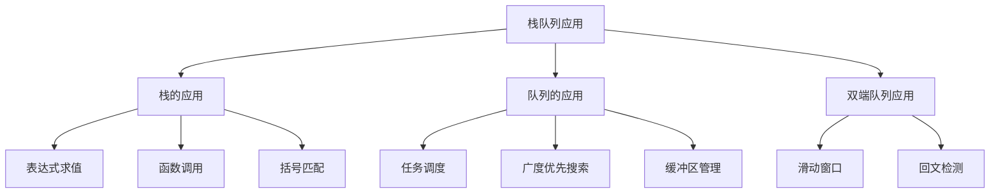

# 栈队列应用场景

## 📖 核心概念

**栈和队列**是两种重要的线性数据结构，在计算机科学中有广泛的应用场景。理解它们的应用场景有助于更好地掌握这些数据结构。

### 🏗️ 应用场景分类



## 🔧 栈的应用场景

### 表达式求值

```cpp
class ExpressionEvaluator {
private:
    stack<int> operands;
    stack<char> operators;
    
    int precedence(char op) {
        if (op == '+' || op == '-') return 1;
        if (op == '*' || op == '/') return 2;
        return 0;
    }
    
    int applyOperation(int a, int b, char op) {
        switch (op) {
            case '+': return a + b;
            case '-': return a - b;
            case '*': return a * b;
            case '/': return a / b;
            default: return 0;
        }
    }
    
public:
    int evaluateInfix(string expression) {
        for (int i = 0; i < expression.length(); ++i) {
            char c = expression[i];
            
            if (c == ' ') continue;
            
            if (isdigit(c)) {
                int num = 0;
                while (i < expression.length() && isdigit(expression[i])) {
                    num = num * 10 + (expression[i] - '0');
                    i++;
                }
                i--;
                operands.push(num);
            } else if (c == '(') {
                operators.push(c);
            } else if (c == ')') {
                while (!operators.empty() && operators.top() != '(') {
                    int b = operands.top(); operands.pop();
                    int a = operands.top(); operands.pop();
                    char op = operators.top(); operators.pop();
                    operands.push(applyOperation(a, b, op));
                }
                operators.pop();
            } else if (c == '+' || c == '-' || c == '*' || c == '/') {
                while (!operators.empty() && precedence(operators.top()) >= precedence(c)) {
                    int b = operands.top(); operands.pop();
                    int a = operands.top(); operands.pop();
                    char op = operators.top(); operators.pop();
                    operands.push(applyOperation(a, b, op));
                }
                operators.push(c);
            }
        }
        
        while (!operators.empty()) {
            int b = operands.top(); operands.pop();
            int a = operands.top(); operands.pop();
            char op = operators.top(); operators.pop();
            operands.push(applyOperation(a, b, op));
        }
        
        return operands.top();
    }
    
    int evaluatePostfix(string expression) {
        for (char c : expression) {
            if (c == ' ') continue;
            
            if (isdigit(c)) {
                operands.push(c - '0');
            } else {
                int b = operands.top(); operands.pop();
                int a = operands.top(); operands.pop();
                operands.push(applyOperation(a, b, c));
            }
        }
        
        return operands.top();
    }
    
    void displayEvaluation(string expression) {
        cout << "Expression: " << expression << endl;
        cout << "Result: " << evaluateInfix(expression) << endl;
    }
};
```

### 括号匹配

```cpp
class BracketMatcher {
private:
    stack<char> brackets;
    
    bool isOpeningBracket(char c) {
        return c == '(' || c == '[' || c == '{';
    }
    
    bool isClosingBracket(char c) {
        return c == ')' || c == ']' || c == '}';
    }
    
    bool isMatchingPair(char open, char close) {
        return (open == '(' && close == ')') ||
               (open == '[' && close == ']') ||
               (open == '{' && close == '}');
    }
    
public:
    bool isValid(string s) {
        for (char c : s) {
            if (isOpeningBracket(c)) {
                brackets.push(c);
            } else if (isClosingBracket(c)) {
                if (brackets.empty() || !isMatchingPair(brackets.top(), c)) {
                    return false;
                }
                brackets.pop();
            }
        }
        
        return brackets.empty();
    }
    
    void displayValidation(string s) {
        cout << "String: " << s << endl;
        cout << "Valid: " << (isValid(s) ? "Yes" : "No") << endl;
    }
};
```

### 函数调用栈

```cpp
class FunctionCallStack {
private:
    struct FunctionCall {
        string functionName;
        int lineNumber;
        time_t timestamp;
        
        FunctionCall(string name, int line) : functionName(name), lineNumber(line) {
            timestamp = time(nullptr);
        }
    };
    
    stack<FunctionCall> callStack;
    
public:
    void enterFunction(string functionName, int lineNumber) {
        FunctionCall call(functionName, lineNumber);
        callStack.push(call);
        
        cout << "Entering function: " << functionName << " at line " << lineNumber << endl;
        displayCallStack();
    }
    
    void exitFunction() {
        if (!callStack.empty()) {
            FunctionCall call = callStack.top();
            callStack.pop();
            
            cout << "Exiting function: " << call.functionName << endl;
            displayCallStack();
        }
    }
    
    void displayCallStack() {
        cout << "Call Stack:" << endl;
        stack<FunctionCall> temp = callStack;
        int level = 0;
        
        while (!temp.empty()) {
            FunctionCall call = temp.top();
            temp.pop();
            
            for (int i = 0; i < level; ++i) {
                cout << "  ";
            }
            cout << level << ": " << call.functionName << " (line " << call.lineNumber << ")" << endl;
            level++;
        }
        cout << endl;
    }
};
```

## 🎯 队列的应用场景

### 任务调度

```cpp
class TaskScheduler {
private:
    struct Task {
        int id;
        string name;
        int priority;
        int executionTime;
        
        Task(int i, string n, int p, int t) : id(i), name(n), priority(p), executionTime(t) {}
    };
    
    queue<Task> taskQueue;
    priority_queue<Task, vector<Task>, function<bool(const Task&, const Task&)>> priorityQueue;
    
public:
    TaskScheduler() : priorityQueue([](const Task& a, const Task& b) {
        return a.priority < b.priority;  // 高优先级在前
    }) {}
    
    void addTask(int id, string name, int priority, int executionTime) {
        Task task(id, name, priority, executionTime);
        taskQueue.push(task);
        priorityQueue.push(task);
        
        cout << "Added task: " << name << " (ID: " << id << ", Priority: " << priority << ")" << endl;
    }
    
    void executeFIFO() {
        cout << "Executing tasks in FIFO order:" << endl;
        
        while (!taskQueue.empty()) {
            Task task = taskQueue.front();
            taskQueue.pop();
            
            cout << "Executing: " << task.name << " (Time: " << task.executionTime << "s)" << endl;
            this_thread::sleep_for(chrono::milliseconds(task.executionTime * 100));
        }
    }
    
    void executePriority() {
        cout << "Executing tasks in priority order:" << endl;
        
        while (!priorityQueue.empty()) {
            Task task = priorityQueue.top();
            priorityQueue.pop();
            
            cout << "Executing: " << task.name << " (Priority: " << task.priority << ", Time: " << task.executionTime << "s)" << endl;
            this_thread::sleep_for(chrono::milliseconds(task.executionTime * 100));
        }
    }
    
    void displayQueue() {
        cout << "Task Queue:" << endl;
        queue<Task> temp = taskQueue;
        int position = 1;
        
        while (!temp.empty()) {
            Task task = temp.front();
            temp.pop();
            
            cout << position << ". " << task.name << " (ID: " << task.id << ", Priority: " << task.priority << ")" << endl;
            position++;
        }
    }
};
```

### 广度优先搜索

```cpp
class BFS {
private:
    vector<vector<int>> graph;
    vector<bool> visited;
    
public:
    BFS(int vertices) {
        graph.resize(vertices);
        visited.resize(vertices, false);
    }
    
    void addEdge(int u, int v) {
        graph[u].push_back(v);
        graph[v].push_back(u);
    }
    
    void bfs(int start) {
        queue<int> q;
        q.push(start);
        visited[start] = true;
        
        cout << "BFS traversal starting from " << start << ":" << endl;
        
        while (!q.empty()) {
            int current = q.front();
            q.pop();
            
            cout << current << " ";
            
            for (int neighbor : graph[current]) {
                if (!visited[neighbor]) {
                    visited[neighbor] = true;
                    q.push(neighbor);
                }
            }
        }
        cout << endl;
    }
    
    void shortestPath(int start, int end) {
        vector<int> parent(graph.size(), -1);
        vector<bool> visited(graph.size(), false);
        queue<int> q;
        
        q.push(start);
        visited[start] = true;
        
        while (!q.empty()) {
            int current = q.front();
            q.pop();
            
            if (current == end) {
                break;
            }
            
            for (int neighbor : graph[current]) {
                if (!visited[neighbor]) {
                    visited[neighbor] = true;
                    parent[neighbor] = current;
                    q.push(neighbor);
                }
            }
        }
        
        if (parent[end] != -1 || start == end) {
            cout << "Shortest path from " << start << " to " << end << ": ";
            vector<int> path;
            int current = end;
            
            while (current != -1) {
                path.push_back(current);
                current = parent[current];
            }
            
            reverse(path.begin(), path.end());
            for (int i = 0; i < path.size(); ++i) {
                cout << path[i];
                if (i < path.size() - 1) cout << " -> ";
            }
            cout << endl;
        } else {
            cout << "No path found from " << start << " to " << end << endl;
        }
    }
};
```

### 缓冲区管理

```cpp
class BufferManager {
private:
    queue<string> buffer;
    int maxSize;
    int currentSize;
    
public:
    BufferManager(int size) : maxSize(size), currentSize(0) {}
    
    bool addData(string data) {
        if (currentSize >= maxSize) {
            cout << "Buffer full, cannot add data: " << data << endl;
            return false;
        }
        
        buffer.push(data);
        currentSize++;
        
        cout << "Added data: " << data << " (Buffer size: " << currentSize << "/" << maxSize << ")" << endl;
        return true;
    }
    
    string removeData() {
        if (buffer.empty()) {
            cout << "Buffer empty, cannot remove data" << endl;
            return "";
        }
        
        string data = buffer.front();
        buffer.pop();
        currentSize--;
        
        cout << "Removed data: " << data << " (Buffer size: " << currentSize << "/" << maxSize << ")" << endl;
        return data;
    }
    
    void displayBuffer() {
        cout << "Buffer contents:" << endl;
        queue<string> temp = buffer;
        int position = 1;
        
        while (!temp.empty()) {
            cout << position << ". " << temp.front() << endl;
            temp.pop();
            position++;
        }
        
        cout << "Buffer size: " << currentSize << "/" << maxSize << endl;
    }
    
    void clearBuffer() {
        while (!buffer.empty()) {
            buffer.pop();
        }
        currentSize = 0;
        cout << "Buffer cleared" << endl;
    }
};
```

## 📊 双端队列应用

### 滑动窗口

```cpp
class SlidingWindow {
private:
    deque<int> window;
    int windowSize;
    
public:
    SlidingWindow(int size) : windowSize(size) {}
    
    void addElement(int element) {
        // 移除超出窗口大小的元素
        while (!window.empty() && window.front() <= element - windowSize) {
            window.pop_front();
        }
        
        // 移除比当前元素小的元素（保持递减顺序）
        while (!window.empty() && window.back() < element) {
            window.pop_back();
        }
        
        window.push_back(element);
    }
    
    int getMax() {
        if (window.empty()) return -1;
        return window.front();
    }
    
    void displayWindow() {
        cout << "Window contents: ";
        for (int element : window) {
            cout << element << " ";
        }
        cout << endl;
    }
};
```

### 回文检测

```cpp
class PalindromeChecker {
private:
    deque<char> characters;
    
public:
    bool isPalindrome(string s) {
        characters.clear();
        
        // 添加字符到双端队列
        for (char c : s) {
            if (isalnum(c)) {
                characters.push_back(tolower(c));
            }
        }
        
        // 从两端比较
        while (characters.size() > 1) {
            if (characters.front() != characters.back()) {
                return false;
            }
            characters.pop_front();
            characters.pop_back();
        }
        
        return true;
    }
    
    void displayPalindromeCheck(string s) {
        cout << "String: " << s << endl;
        cout << "Is Palindrome: " << (isPalindrome(s) ? "Yes" : "No") << endl;
    }
};
```

## 🎮 应用场景测试

### 1. 栈应用测试

```cpp
class StackApplicationTest {
public:
    static void testExpressionEvaluator() {
        cout << "Testing Expression Evaluator:" << endl;
        cout << "===========================" << endl;
        
        ExpressionEvaluator evaluator;
        
        string expressions[] = {
            "2 + 3 * 4",
            "(2 + 3) * 4",
            "2 * (3 + 4)",
            "10 / 2 + 3 * 4"
        };
        
        for (string expr : expressions) {
            evaluator.displayEvaluation(expr);
            cout << endl;
        }
    }
    
    static void testBracketMatcher() {
        cout << "Testing Bracket Matcher:" << endl;
        cout << "=======================" << endl;
        
        BracketMatcher matcher;
        
        string testCases[] = {
            "()",
            "()[]{}",
            "(]",
            "([)]",
            "{[]}",
            "((()))",
            "([{}])"
        };
        
        for (string testCase : testCases) {
            matcher.displayValidation(testCase);
        }
    }
    
    static void testFunctionCallStack() {
        cout << "Testing Function Call Stack:" << endl;
        cout << "==========================" << endl;
        
        FunctionCallStack callStack;
        
        callStack.enterFunction("main", 10);
        callStack.enterFunction("functionA", 15);
        callStack.enterFunction("functionB", 20);
        callStack.exitFunction();
        callStack.exitFunction();
        callStack.exitFunction();
    }
};
```

### 2. 队列应用测试

```cpp
class QueueApplicationTest {
public:
    static void testTaskScheduler() {
        cout << "Testing Task Scheduler:" << endl;
        cout << "======================" << endl;
        
        TaskScheduler scheduler;
        
        scheduler.addTask(1, "Task A", 3, 2);
        scheduler.addTask(2, "Task B", 1, 3);
        scheduler.addTask(3, "Task C", 2, 1);
        
        scheduler.displayQueue();
        cout << endl;
        
        scheduler.executePriority();
    }
    
    static void testBFS() {
        cout << "Testing BFS:" << endl;
        cout << "===========" << endl;
        
        BFS bfs(6);
        bfs.addEdge(0, 1);
        bfs.addEdge(0, 2);
        bfs.addEdge(1, 3);
        bfs.addEdge(2, 4);
        bfs.addEdge(3, 5);
        
        bfs.bfs(0);
        bfs.shortestPath(0, 5);
    }
    
    static void testBufferManager() {
        cout << "Testing Buffer Manager:" << endl;
        cout << "======================" << endl;
        
        BufferManager buffer(5);
        
        buffer.addData("Data 1");
        buffer.addData("Data 2");
        buffer.addData("Data 3");
        buffer.displayBuffer();
        
        buffer.removeData();
        buffer.displayBuffer();
        
        buffer.addData("Data 4");
        buffer.addData("Data 5");
        buffer.addData("Data 6");
        buffer.displayBuffer();
    }
};
```

### 3. 双端队列应用测试

```cpp
class DequeApplicationTest {
public:
    static void testSlidingWindow() {
        cout << "Testing Sliding Window:" << endl;
        cout << "======================" << endl;
        
        SlidingWindow window(3);
        
        vector<int> data = {1, 3, -1, -3, 5, 3, 6, 7};
        
        for (int i = 0; i < data.size(); ++i) {
            window.addElement(i);
            cout << "Max in window ending at " << i << ": " << window.getMax() << endl;
        }
    }
    
    static void testPalindromeChecker() {
        cout << "Testing Palindrome Checker:" << endl;
        cout << "==========================" << endl;
        
        PalindromeChecker checker;
        
        string testCases[] = {
            "racecar",
            "hello",
            "A man a plan a canal Panama",
            "race a car",
            "Was it a car or a cat I saw?"
        };
        
        for (string testCase : testCases) {
            checker.displayPalindromeCheck(testCase);
        }
    }
};
```

## 🔗 相关链接

- [[01-栈与队列|栈与队列]]
- [[02-字符串处理|字符串处理]]

## 💡 栈队列应用要点

1. **栈的应用**: 表达式求值、函数调用、括号匹配
2. **队列的应用**: 任务调度、BFS、缓冲区管理
3. **双端队列**: 滑动窗口、回文检测
4. **实际应用**: 理解应用场景有助于更好地使用数据结构

---

*📝 应用提示：栈和队列的应用场景广泛，掌握这些应用有助于解决实际问题*
