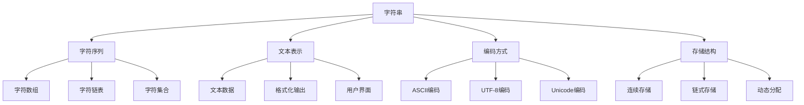

# 📝 字符串基础与存储

## 🎯 核心定义

**字符串**是由字符组成的序列，是计算机中表示文本数据的基本方式。

### 🔍 本质理解
字符串 = 字符序列 + 文本表示 + 编码方式



---

## 🏗️ 字符串的基本特性

### 📊 特性分析表

| 特性 | 描述 | 优势 | 劣势 |
|------|------|------|------|
| **字符序列** | 由字符组成的线性序列 | 顺序访问、易于理解 | 不支持随机访问 |
| **文本表示** | 人类可读的文本形式 | 直观、易用 | 存储效率较低 |
| **编码依赖** | 依赖字符编码方式 | 支持多语言 | 编码转换复杂 |
| **动态长度** | 长度可以变化 | 灵活性高 | 内存管理复杂 |

### 🎯 字符串操作

#### 📋 基本操作
| 操作 | 描述 | 时间复杂度 | 说明 |
|------|------|------------|------|
| **length()** | 获取字符串长度 | O(1) | 返回字符个数 |
| **at(index)** | 访问指定位置字符 | O(1) | 返回第index个字符 |
| **substr(start, len)** | 提取子字符串 | O(len) | 返回子字符串 |
| **find(pattern)** | 查找子字符串 | O(n*m) | 返回首次出现位置 |
| **replace(old, new)** | 替换子字符串 | O(n) | 替换所有匹配 |

---

## 💻 字符串存储方式

### 🔧 固定长度存储

#### 📋 特点
- **固定大小**：字符串长度固定
- **连续存储**：字符在内存中连续存放
- **简单实现**：实现简单，访问快速

#### 💻 实现
```cpp
class FixedString {
private:
    char data[256];    // 固定大小数组
    int length;        // 实际长度
    
public:
    FixedString() : length(0) {
        data[0] = '\0';
    }
    
    void setString(const char* str) {
        int i = 0;
        while (str[i] != '\0' && i < 255) {
            data[i] = str[i];
            i++;
        }
        data[i] = '\0';
        length = i;
    }
    
    char at(int index) const {
        if (index >= 0 && index < length) {
            return data[index];
        }
        throw std::out_of_range("Index out of range");
    }
    
    int getLength() const {
        return length;
    }
};
```

### 🔧 动态长度存储

#### 📋 特点
- **动态大小**：字符串长度可变
- **内存管理**：需要动态分配和释放内存
- **灵活实现**：支持任意长度字符串

#### 💻 实现
```cpp
class DynamicString {
private:
    char* data;        // 动态分配的内存
    int length;        // 实际长度
    int capacity;      // 分配容量
    
public:
    DynamicString() : data(nullptr), length(0), capacity(0) {}
    
    DynamicString(const char* str) {
        length = strlen(str);
        capacity = length + 1;
        data = new char[capacity];
        strcpy(data, str);
    }
    
    ~DynamicString() {
        delete[] data;
    }
    
    void append(char c) {
        if (length + 1 >= capacity) {
            resize();
        }
        data[length] = c;
        data[++length] = '\0';
    }
    
    void resize() {
        capacity = capacity == 0 ? 2 : capacity * 2;
        char* newData = new char[capacity];
        if (data) {
            strcpy(newData, data);
            delete[] data;
        }
        data = newData;
    }
};
```

### 🔧 链式存储

#### 📋 特点
- **节点存储**：每个字符存储在一个节点中
- **动态链接**：通过指针链接节点
- **内存分散**：内存不连续，但灵活

#### 💻 实现
```cpp
struct CharNode {
    char data;
    CharNode* next;
    
    CharNode(char c) : data(c), next(nullptr) {}
};

class LinkedString {
private:
    CharNode* head;
    int length;
    
public:
    LinkedString() : head(nullptr), length(0) {}
    
    void append(char c) {
        CharNode* newNode = new CharNode(c);
        if (head == nullptr) {
            head = newNode;
        } else {
            CharNode* current = head;
            while (current->next != nullptr) {
                current = current->next;
            }
            current->next = newNode;
        }
        length++;
    }
    
    char at(int index) const {
        if (index < 0 || index >= length) {
            throw std::out_of_range("Index out of range");
        }
        
        CharNode* current = head;
        for (int i = 0; i < index; i++) {
            current = current->next;
        }
        return current->data;
    }
};
```

---

## 📊 存储方式对比

### 📋 对比分析表

| 方面 | 固定长度 | 动态长度 | 链式存储 | 推荐场景 |
|------|----------|----------|----------|----------|
| **空间效率** | 可能浪费 | 精确分配 | 指针开销 | 长度确定用固定 |
| **时间效率** | 访问O(1) | 访问O(1) | 访问O(n) | 频繁访问用动态 |
| **内存管理** | 简单 | 复杂 | 复杂 | 简单应用用固定 |
| **灵活性** | 长度固定 | 长度可变 | 长度可变 | 长度变化用动态 |
| **实现复杂度** | 简单 | 中等 | 复杂 | 学习目的用链式 |

### 🎯 选择建议

#### ✅ 选择固定长度的情况
1. **长度确定**：字符串长度固定
2. **性能要求高**：需要最佳性能
3. **简单应用**：不需要复杂的内存管理
4. **嵌入式系统**：内存受限的环境

#### ✅ 选择动态长度的情况
1. **长度变化**：字符串长度不确定
2. **内存敏感**：需要精确的内存使用
3. **通用应用**：需要支持任意长度
4. **标准库**：作为标准字符串实现

#### ✅ 选择链式存储的情况
1. **学习目的**：理解指针和动态内存
2. **特殊需求**：需要特殊的插入删除操作
3. **内存碎片**：内存碎片严重的情况
4. **研究用途**：研究不同的存储方式

---

## 🎯 字符串应用场景

### 📋 典型应用

#### 📝 文本处理
- **文本编辑器**：编辑和处理文本
- **文档处理**：处理各种文档格式
- **代码编辑器**：编辑源代码
- **日志分析**：分析日志文件

```cpp
class TextProcessor {
private:
    string content;
    
public:
    void loadText(const string& text) {
        content = text;
    }
    
    int countWords() {
        int count = 0;
        bool inWord = false;
        
        for (char c : content) {
            if (isalpha(c)) {
                if (!inWord) {
                    count++;
                    inWord = true;
                }
            } else {
                inWord = false;
            }
        }
        
        return count;
    }
    
    string toUpperCase() {
        string result = content;
        for (char& c : result) {
            c = toupper(c);
        }
        return result;
    }
};
```

#### 🔍 模式匹配
- **文本搜索**：在文本中搜索模式
- **数据验证**：验证数据格式
- **正则表达式**：使用正则表达式匹配
- **字符串替换**：替换文本中的模式

```cpp
class PatternMatcher {
public:
    vector<int> findPattern(const string& text, const string& pattern) {
        vector<int> positions;
        int textLen = text.length();
        int patternLen = pattern.length();
        
        for (int i = 0; i <= textLen - patternLen; i++) {
            bool match = true;
            for (int j = 0; j < patternLen; j++) {
                if (text[i + j] != pattern[j]) {
                    match = false;
                    break;
                }
            }
            if (match) {
                positions.push_back(i);
            }
        }
        
        return positions;
    }
    
    string replaceAll(const string& text, const string& oldPattern, const string& newPattern) {
        string result = text;
        size_t pos = 0;
        
        while ((pos = result.find(oldPattern, pos)) != string::npos) {
            result.replace(pos, oldPattern.length(), newPattern);
            pos += newPattern.length();
        }
        
        return result;
    }
};
```

#### 🌐 网络通信
- **HTTP协议**：处理HTTP请求和响应
- **JSON解析**：解析JSON数据
- **URL处理**：处理URL字符串
- **数据序列化**：序列化和反序列化数据

```cpp
class HttpProcessor {
public:
    string parseUrl(const string& url) {
        size_t protocolPos = url.find("://");
        if (protocolPos == string::npos) {
            throw invalid_argument("Invalid URL");
        }
        
        string protocol = url.substr(0, protocolPos);
        string remaining = url.substr(protocolPos + 3);
        
        size_t pathPos = remaining.find('/');
        string host = remaining.substr(0, pathPos);
        string path = pathPos == string::npos ? "/" : remaining.substr(pathPos);
        
        return "Protocol: " + protocol + ", Host: " + host + ", Path: " + path;
    }
    
    string formatJson(const map<string, string>& data) {
        string json = "{";
        bool first = true;
        
        for (const auto& pair : data) {
            if (!first) {
                json += ",";
            }
            json += "\"" + pair.first + "\":\"" + pair.second + "\"";
            first = false;
        }
        
        json += "}";
        return json;
    }
};
```

---

## 🧠 学习策略

### 📚 理解层次

#### 🔴 认识层次
- 知道字符串的基本概念
- 了解字符串的存储方式
- 识别字符串的应用场景

#### 🟡 理解层次
- 理解字符串的操作原理
- 掌握字符串的实现方法
- 分析字符串的优缺点

#### 🟢 应用层次
- 能实现字符串的基本操作
- 会选择合适的存储方式
- 能解决字符串相关问题

#### 🔵 创新层次
- 能设计字符串的变种
- 会优化字符串操作
- 能组合字符串与其他结构

### 🎯 学习建议

1. **从基础到高级**：基本操作 → 存储方式 → 高级应用
2. **理论与实践结合**：概念理解 + 代码实现
3. **对比学习**：不同存储方式的优缺点
4. **应用驱动**：从实际问题出发学习字符串

### 🔍 常见错误

#### ❌ 常见错误
1. **越界访问**：访问超出字符串范围的索引
2. **内存泄漏**：动态字符串忘记释放内存
3. **编码问题**：混淆不同字符编码
4. **空指针**：访问空字符串指针

#### ✅ 最佳实践
1. **边界检查**：始终检查字符串边界
2. **内存管理**：及时释放动态分配的内存
3. **编码统一**：使用统一的字符编码
4. **异常处理**：处理字符串操作异常

---

## 🔗 相关链接

### 📖 深入学习
- [[02-字符串匹配算法|字符串匹配算法]]
- [[03-KMP算法详解|KMP算法详解]]
- [[04-字符串处理技巧|字符串处理技巧]]

### 🛠️ 实践应用
- [[02-线性世界/01-序列结构[数组]/01-数组基础|数组基础]]
- [[02-线性世界/02-链式结构[链表]/01-单链表实现|链表实现]]
- [[04-算法武器库/01-搜索技术/01-线性搜索详解|线性搜索]]

### 🎯 检测学习
- [[00-学习枢纽/📋-知识点检测清单|知识点检测清单]]
- [[00-学习枢纽/📊-学习进度跟踪|学习进度跟踪]]

---
*💡 字符串是文本处理的基础，掌握字符串是处理文本数据的关键！*
