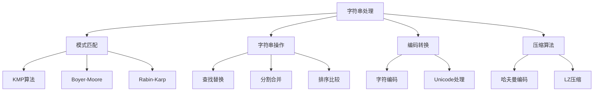

# 字符串处理

## 📖 核心概念

**字符串处理**是计算机科学中的重要领域。字符串是字符的序列，需要特殊的算法和数据结构来高效处理。

### 🏗️ 处理技术



## 🔧 模式匹配

### KMP算法

```cpp
class KMPAlgorithm {
public:
    static vector<int> kmpSearch(string text, string pattern) {
        vector<int> result;
        vector<int> lps = computeLPS(pattern);
        
        int i = 0, j = 0;
        while (i < text.length()) {
            if (pattern[j] == text[i]) {
                i++;
                j++;
            }
            
            if (j == pattern.length()) {
                result.push_back(i - j);
                j = lps[j - 1];
            } else if (i < text.length() && pattern[j] != text[i]) {
                if (j != 0) {
                    j = lps[j - 1];
                } else {
                    i++;
                }
            }
        }
        
        return result;
    }
    
private:
    static vector<int> computeLPS(string pattern) {
        vector<int> lps(pattern.length());
        int len = 0;
        int i = 1;
        
        while (i < pattern.length()) {
            if (pattern[i] == pattern[len]) {
                len++;
                lps[i] = len;
                i++;
            } else {
                if (len != 0) {
                    len = lps[len - 1];
                } else {
                    lps[i] = 0;
                    i++;
                }
            }
        }
        
        return lps;
    }
};
```

### Boyer-Moore算法

```cpp
class BoyerMooreAlgorithm {
public:
    static vector<int> boyerMooreSearch(string text, string pattern) {
        vector<int> result;
        vector<int> badChar = buildBadCharTable(pattern);
        vector<int> goodSuffix = buildGoodSuffixTable(pattern);
        
        int i = 0;
        while (i <= text.length() - pattern.length()) {
            int j = pattern.length() - 1;
            
            while (j >= 0 && pattern[j] == text[i + j]) {
                j--;
            }
            
            if (j < 0) {
                result.push_back(i);
                i += goodSuffix[0];
            } else {
                i += max(badChar[text[i + j]], goodSuffix[j]);
            }
        }
        
        return result;
    }
    
private:
    static vector<int> buildBadCharTable(string pattern) {
        vector<int> badChar(256, -1);
        
        for (int i = 0; i < pattern.length(); ++i) {
            badChar[pattern[i]] = i;
        }
        
        return badChar;
    }
    
    static vector<int> buildGoodSuffixTable(string pattern) {
        int m = pattern.length();
        vector<int> goodSuffix(m);
        vector<int> suffix(m);
        
        // 计算后缀数组
        suffix[m - 1] = m;
        int i = m - 2;
        
        while (i >= 0) {
            int j = i;
            while (j >= 0 && pattern[j] == pattern[m - 1 - i + j]) {
                j--;
            }
            suffix[i] = i - j;
            i--;
        }
        
        // 计算好后缀表
        for (int i = 0; i < m; ++i) {
            goodSuffix[i] = m;
        }
        
        int j = 0;
        for (int i = m - 1; i >= 0; --i) {
            if (suffix[i] == i + 1) {
                while (j < m - 1 - i) {
                    if (goodSuffix[j] == m) {
                        goodSuffix[j] = m - 1 - i;
                    }
                    j++;
                }
            }
        }
        
        for (int i = 0; i < m - 1; ++i) {
            goodSuffix[m - 1 - suffix[i]] = m - 1 - i;
        }
        
        return goodSuffix;
    }
};
```

## 🎯 字符串操作

### 基本操作

```cpp
class StringOperations {
public:
    // 字符串反转
    static string reverseString(string s) {
        int left = 0, right = s.length() - 1;
        while (left < right) {
            swap(s[left], s[right]);
            left++;
            right--;
        }
        return s;
    }
    
    // 字符串分割
    static vector<string> split(string s, char delimiter) {
        vector<string> result;
        string current;
        
        for (char c : s) {
            if (c == delimiter) {
                if (!current.empty()) {
                    result.push_back(current);
                    current.clear();
                }
            } else {
                current += c;
            }
        }
        
        if (!current.empty()) {
            result.push_back(current);
        }
        
        return result;
    }
    
    // 字符串去重
    static string removeDuplicates(string s) {
        string result;
        unordered_set<char> seen;
        
        for (char c : s) {
            if (seen.find(c) == seen.end()) {
                seen.insert(c);
                result += c;
            }
        }
        
        return result;
    }
    
    // 最长公共子序列
    static int longestCommonSubsequence(string text1, string text2) {
        int m = text1.length(), n = text2.length();
        vector<vector<int>> dp(m + 1, vector<int>(n + 1));
        
        for (int i = 1; i <= m; ++i) {
            for (int j = 1; j <= n; ++j) {
                if (text1[i - 1] == text2[j - 1]) {
                    dp[i][j] = dp[i - 1][j - 1] + 1;
                } else {
                    dp[i][j] = max(dp[i - 1][j], dp[i][j - 1]);
                }
            }
        }
        
        return dp[m][n];
    }
};
```

### 高级操作

```cpp
class AdvancedStringOperations {
public:
    // 字符串编辑距离
    static int editDistance(string word1, string word2) {
        int m = word1.length(), n = word2.length();
        vector<vector<int>> dp(m + 1, vector<int>(n + 1));
        
        for (int i = 0; i <= m; ++i) {
            dp[i][0] = i;
        }
        
        for (int j = 0; j <= n; ++j) {
            dp[0][j] = j;
        }
        
        for (int i = 1; i <= m; ++i) {
            for (int j = 1; j <= n; ++j) {
                if (word1[i - 1] == word2[j - 1]) {
                    dp[i][j] = dp[i - 1][j - 1];
                } else {
                    dp[i][j] = min({dp[i - 1][j], dp[i][j - 1], dp[i - 1][j - 1]}) + 1;
                }
            }
        }
        
        return dp[m][n];
    }
    
    // 最长回文子串
    static string longestPalindrome(string s) {
        if (s.empty()) return "";
        
        int start = 0, maxLen = 1;
        
        for (int i = 0; i < s.length(); ++i) {
            // 检查奇数长度回文
            int len1 = expandAroundCenter(s, i, i);
            // 检查偶数长度回文
            int len2 = expandAroundCenter(s, i, i + 1);
            
            int len = max(len1, len2);
            if (len > maxLen) {
                maxLen = len;
                start = i - (len - 1) / 2;
            }
        }
        
        return s.substr(start, maxLen);
    }
    
    // 字符串压缩
    static string compressString(string s) {
        if (s.empty()) return "";
        
        string compressed;
        int count = 1;
        
        for (int i = 1; i < s.length(); ++i) {
            if (s[i] == s[i - 1]) {
                count++;
            } else {
                compressed += s[i - 1] + to_string(count);
                count = 1;
            }
        }
        
        compressed += s.back() + to_string(count);
        
        return compressed.length() < s.length() ? compressed : s;
    }
    
private:
    static int expandAroundCenter(string s, int left, int right) {
        while (left >= 0 && right < s.length() && s[left] == s[right]) {
            left--;
            right++;
        }
        return right - left - 1;
    }
};
```

## 📊 字符串应用

### 1. 文本搜索

```cpp
class TextSearch {
public:
    static vector<int> searchAll(string text, string pattern) {
        vector<int> positions;
        size_t pos = 0;
        
        while ((pos = text.find(pattern, pos)) != string::npos) {
            positions.push_back(pos);
            pos += pattern.length();
        }
        
        return positions;
    }
    
    static string replaceAll(string text, string oldStr, string newStr) {
        size_t pos = 0;
        while ((pos = text.find(oldStr, pos)) != string::npos) {
            text.replace(pos, oldStr.length(), newStr);
            pos += newStr.length();
        }
        return text;
    }
};
```

### 2. 字符串验证

```cpp
class StringValidation {
public:
    static bool isValidEmail(string email) {
        regex emailRegex(R"([a-zA-Z0-9._%+-]+@[a-zA-Z0-9.-]+\.[a-zA-Z]{2,})");
        return regex_match(email, emailRegex);
    }
    
    static bool isValidPhone(string phone) {
        regex phoneRegex(R"(\d{3}-\d{3}-\d{4})");
        return regex_match(phone, phoneRegex);
    }
    
    static bool isPalindrome(string s) {
        string cleaned;
        for (char c : s) {
            if (isalnum(c)) {
                cleaned += tolower(c);
            }
        }
        
        int left = 0, right = cleaned.length() - 1;
        while (left < right) {
            if (cleaned[left] != cleaned[right]) {
                return false;
            }
            left++;
            right--;
        }
        
        return true;
    }
};
```

## 🔗 相关链接

- [[01-数组基础|数组基础]]
- [[02-链表基础|链表基础]]
- [[03-栈与队列|栈与队列]]

## 💡 字符串处理要点

1. **模式匹配**：KMP、Boyer-Moore等高效算法
2. **字符串操作**：反转、分割、去重等基本操作
3. **动态规划**：编辑距离、最长公共子序列等
4. **正则表达式**：复杂的模式匹配和验证

---

*📝 处理提示：字符串处理是编程中的常见任务，掌握高效算法很重要*
