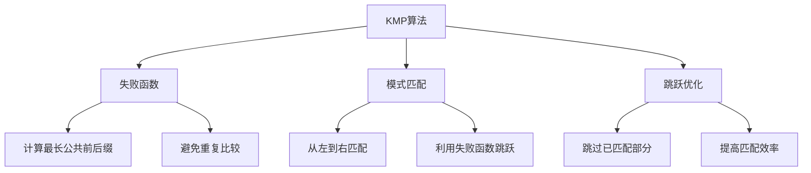

# KMP算法详解

## 📖 核心概念

**KMP算法**（Knuth-Morris-Pratt算法）是一种高效的字符串匹配算法，通过预处理模式串来避免不必要的字符比较，将时间复杂度从O(mn)降低到O(m+n)。

### 🏗️ KMP算法原理



## 🔧 KMP算法实现

### 失败函数计算

```cpp
class KMPAlgorithm {
private:
    vector<int> computeFailureFunction(string pattern) {
        int m = pattern.length();
        vector<int> failure(m, 0);
        
        int j = 0;
        for (int i = 1; i < m; ++i) {
            // 如果字符不匹配，回退到前一个匹配位置
            while (j > 0 && pattern[i] != pattern[j]) {
                j = failure[j - 1];
            }
            
            // 如果字符匹配，增加匹配长度
            if (pattern[i] == pattern[j]) {
                j++;
            }
            
            failure[i] = j;
        }
        
        return failure;
    }
    
public:
    void displayFailureFunction(string pattern) {
        vector<int> failure = computeFailureFunction(pattern);
        
        cout << "Pattern: " << pattern << endl;
        cout << "Index:   ";
        for (int i = 0; i < pattern.length(); ++i) {
            cout << i << " ";
        }
        cout << endl;
        
        cout << "Failure: ";
        for (int i = 0; i < failure.size(); ++i) {
            cout << failure[i] << " ";
        }
        cout << endl;
        
        // 解释失败函数
        cout << "Explanation:" << endl;
        for (int i = 0; i < pattern.length(); ++i) {
            cout << "failure[" << i << "] = " << failure[i] 
                 << " (longest proper prefix that is also a suffix)" << endl;
        }
    }
    
    vector<int> search(string text, string pattern) {
        vector<int> positions;
        int n = text.length();
        int m = pattern.length();
        
        if (m == 0) return positions;
        
        vector<int> failure = computeFailureFunction(pattern);
        
        int j = 0; // 模式串的索引
        for (int i = 0; i < n; ++i) { // 文本串的索引
            // 如果字符不匹配，利用失败函数跳跃
            while (j > 0 && text[i] != pattern[j]) {
                j = failure[j - 1];
            }
            
            // 如果字符匹配，继续下一个字符
            if (text[i] == pattern[j]) {
                j++;
            }
            
            // 如果完全匹配，记录位置
            if (j == m) {
                positions.push_back(i - m + 1);
                j = failure[j - 1]; // 继续寻找下一个匹配
            }
        }
        
        return positions;
    }
    
    void displaySearch(string text, string pattern) {
        vector<int> positions = search(text, pattern);
        
        cout << "Text: " << text << endl;
        cout << "Pattern: " << pattern << endl;
        cout << "Found at positions: ";
        
        for (int pos : positions) {
            cout << pos << " ";
        }
        
        if (positions.empty()) {
            cout << "Not found";
        }
        cout << endl;
    }
};
```

### KMP算法优化

```cpp
class OptimizedKMP {
private:
    vector<int> computeOptimizedFailureFunction(string pattern) {
        int m = pattern.length();
        vector<int> failure(m, 0);
        
        int j = 0;
        for (int i = 1; i < m; ++i) {
            while (j > 0 && pattern[i] != pattern[j]) {
                j = failure[j - 1];
            }
            
            if (pattern[i] == pattern[j]) {
                j++;
            }
            
            // 优化：如果下一个字符也相同，可以进一步跳跃
            if (i + 1 < m && pattern[i + 1] == pattern[j]) {
                failure[i] = failure[j];
            } else {
                failure[i] = j;
            }
        }
        
        return failure;
    }
    
public:
    vector<int> optimizedSearch(string text, string pattern) {
        vector<int> positions;
        int n = text.length();
        int m = pattern.length();
        
        if (m == 0) return positions;
        
        vector<int> failure = computeOptimizedFailureFunction(pattern);
        
        int j = 0;
        for (int i = 0; i < n; ++i) {
            while (j > 0 && text[i] != pattern[j]) {
                j = failure[j - 1];
            }
            
            if (text[i] == pattern[j]) {
                j++;
            }
            
            if (j == m) {
                positions.push_back(i - m + 1);
                j = failure[j - 1];
            }
        }
        
        return positions;
    }
    
    void displayOptimization(string pattern) {
        cout << "KMP Algorithm Optimization:" << endl;
        cout << "=========================" << endl;
        
        vector<int> standardFailure = computeFailureFunction(pattern);
        vector<int> optimizedFailure = computeOptimizedFailureFunction(pattern);
        
        cout << "Pattern: " << pattern << endl;
        cout << "Standard failure function: ";
        for (int i = 0; i < standardFailure.size(); ++i) {
            cout << standardFailure[i] << " ";
        }
        cout << endl;
        
        cout << "Optimized failure function: ";
        for (int i = 0; i < optimizedFailure.size(); ++i) {
            cout << optimizedFailure[i] << " ";
        }
        cout << endl;
    }
    
private:
    vector<int> computeFailureFunction(string pattern) {
        int m = pattern.length();
        vector<int> failure(m, 0);
        
        int j = 0;
        for (int i = 1; i < m; ++i) {
            while (j > 0 && pattern[i] != pattern[j]) {
                j = failure[j - 1];
            }
            
            if (pattern[i] == pattern[j]) {
                j++;
            }
            
            failure[i] = j;
        }
        
        return failure;
    }
};
```

## 🎯 KMP算法应用

### 多模式匹配

```cpp
class MultiPatternKMP {
private:
    struct Pattern {
        string pattern;
        vector<int> failure;
        int id;
        
        Pattern(string p, int i) : pattern(p), id(i) {
            failure = computeFailureFunction(p);
        }
        
        vector<int> computeFailureFunction(string pattern) {
            int m = pattern.length();
            vector<int> failure(m, 0);
            
            int j = 0;
            for (int i = 1; i < m; ++i) {
                while (j > 0 && pattern[i] != pattern[j]) {
                    j = failure[j - 1];
                }
                
                if (pattern[i] == pattern[j]) {
                    j++;
                }
                
                failure[i] = j;
            }
            
            return failure;
        }
    };
    
    vector<Pattern> patterns;
    
public:
    void addPattern(string pattern, int id) {
        patterns.push_back(Pattern(pattern, id));
    }
    
    vector<pair<int, int>> searchAll(string text) {
        vector<pair<int, int>> results; // (pattern_id, position)
        
        for (Pattern& pattern : patterns) {
            int n = text.length();
            int m = pattern.pattern.length();
            
            if (m == 0) continue;
            
            int j = 0;
            for (int i = 0; i < n; ++i) {
                while (j > 0 && text[i] != pattern.pattern[j]) {
                    j = pattern.failure[j - 1];
                }
                
                if (text[i] == pattern.pattern[j]) {
                    j++;
                }
                
                if (j == m) {
                    results.push_back({pattern.id, i - m + 1});
                    j = pattern.failure[j - 1];
                }
            }
        }
        
        return results;
    }
    
    void displayMultiPatternSearch(string text) {
        vector<pair<int, int>> results = searchAll(text);
        
        cout << "Text: " << text << endl;
        cout << "Multi-pattern search results:" << endl;
        
        if (results.empty()) {
            cout << "No matches found." << endl;
            return;
        }
        
        for (auto result : results) {
            int patternId = result.first;
            int position = result.second;
            
            cout << "Pattern " << patternId << " found at position " << position << endl;
        }
    }
};
```

### 字符串周期检测

```cpp
class StringPeriodDetection {
private:
    vector<int> computeFailureFunction(string pattern) {
        int m = pattern.length();
        vector<int> failure(m, 0);
        
        int j = 0;
        for (int i = 1; i < m; ++i) {
            while (j > 0 && pattern[i] != pattern[j]) {
                j = failure[j - 1];
            }
            
            if (pattern[i] == pattern[j]) {
                j++;
            }
            
            failure[i] = j;
        }
        
        return failure;
    }
    
public:
    int findPeriod(string s) {
        int n = s.length();
        vector<int> failure = computeFailureFunction(s);
        
        int period = n - failure[n - 1];
        
        // 验证是否为周期
        if (n % period == 0) {
            return period;
        }
        
        return n; // 无周期
    }
    
    bool isPeriodic(string s) {
        int period = findPeriod(s);
        return period < s.length();
    }
    
    void displayPeriodAnalysis(string s) {
        cout << "String: " << s << endl;
        
        int period = findPeriod(s);
        
        if (period < s.length()) {
            cout << "Period: " << period << endl;
            cout << "Is periodic: Yes" << endl;
            
            string base = s.substr(0, period);
            cout << "Base pattern: " << base << endl;
            
            int repetitions = s.length() / period;
            cout << "Repetitions: " << repetitions << endl;
        } else {
            cout << "Is periodic: No" << endl;
        }
    }
    
    vector<string> findRepeatingSubstrings(string s) {
        vector<string> repeating;
        int n = s.length();
        
        for (int len = 1; len <= n / 2; ++len) {
            string pattern = s.substr(0, len);
            
            if (isPeriodic(pattern + s)) {
                repeating.push_back(pattern);
            }
        }
        
        return repeating;
    }
};
```

### 最长公共子串

```cpp
class LongestCommonSubstring {
private:
    vector<int> computeFailureFunction(string pattern) {
        int m = pattern.length();
        vector<int> failure(m, 0);
        
        int j = 0;
        for (int i = 1; i < m; ++i) {
            while (j > 0 && pattern[i] != pattern[j]) {
                j = failure[j - 1];
            }
            
            if (pattern[i] == pattern[j]) {
                j++;
            }
            
            failure[i] = j;
        }
        
        return failure;
    }
    
public:
    string findLongestCommonSubstring(string s1, string s2) {
        string result = "";
        int maxLength = 0;
        
        // 尝试所有可能的子串
        for (int i = 0; i < s1.length(); ++i) {
            for (int j = i; j < s1.length(); ++j) {
                string pattern = s1.substr(i, j - i + 1);
                
                // 使用KMP算法在s2中搜索
                vector<int> failure = computeFailureFunction(pattern);
                int m = pattern.length();
                int n = s2.length();
                
                int k = 0;
                for (int l = 0; l < n; ++l) {
                    while (k > 0 && s2[l] != pattern[k]) {
                        k = failure[k - 1];
                    }
                    
                    if (s2[l] == pattern[k]) {
                        k++;
                    }
                    
                    if (k == m) {
                        if (pattern.length() > maxLength) {
                            maxLength = pattern.length();
                            result = pattern;
                        }
                        break;
                    }
                }
            }
        }
        
        return result;
    }
    
    void displayLongestCommonSubstring(string s1, string s2) {
        string lcs = findLongestCommonSubstring(s1, s2);
        
        cout << "String 1: " << s1 << endl;
        cout << "String 2: " << s2 << endl;
        cout << "Longest Common Substring: " << lcs << endl;
        cout << "Length: " << lcs.length() << endl;
    }
};
```

## 📊 KMP算法分析

### 时间复杂度分析

```cpp
class KMPAnalysis {
public:
    static void analyzeTimeComplexity() {
        cout << "KMP Algorithm Time Complexity Analysis:" << endl;
        cout << "=====================================" << endl;
        
        cout << "1. Failure Function Computation:" << endl;
        cout << "   - Time Complexity: O(m)" << endl;
        cout << "   - Space Complexity: O(m)" << endl;
        cout << "   - Each character is processed at most twice" << endl;
        
        cout << "2. Pattern Matching:" << endl;
        cout << "   - Time Complexity: O(n)" << endl;
        cout << "   - Space Complexity: O(1)" << endl;
        cout << "   - Text pointer never moves backward" << endl;
        
        cout << "3. Overall Complexity:" << endl;
        cout << "   - Time Complexity: O(m + n)" << endl;
        cout << "   - Space Complexity: O(m)" << endl;
        cout << "   - Much better than naive O(mn)" << endl;
        
        cout << "4. Comparison with Other Algorithms:" << endl;
        cout << "   - Naive: O(mn) worst case" << endl;
        cout << "   - KMP: O(m + n) always" << endl;
        cout << "   - Boyer-Moore: O(m + n) average" << endl;
        cout << "   - Rabin-Karp: O(m + n) average" << endl;
    }
    
    static void analyzeSpaceComplexity() {
        cout << "KMP Algorithm Space Complexity Analysis:" << endl;
        cout << "======================================" << endl;
        
        cout << "1. Failure Function Array:" << endl;
        cout << "   - Size: O(m)" << endl;
        cout << "   - Stores longest proper prefix" << endl;
        
        cout << "2. Additional Variables:" << endl;
        cout << "   - Text pointer: O(1)" << endl;
        cout << "   - Pattern pointer: O(1)" << endl;
        cout << "   - Total: O(1)" << endl;
        
        cout << "3. Total Space Complexity:" << endl;
        cout << "   - O(m) for failure function" << endl;
        cout << "   - O(1) for additional variables" << endl;
        cout << "   - Overall: O(m)" << endl;
    }
};
```

### 性能测试

```cpp
class KMPPerformanceTest {
public:
    static void performanceTest() {
        cout << "KMP Algorithm Performance Test:" << endl;
        cout << "==============================" << endl;
        
        vector<int> textSizes = {1000, 5000, 10000};
        vector<int> patternSizes = {5, 10, 20};
        
        for (int textSize : textSizes) {
            for (int patternSize : patternSizes) {
                cout << "Text size: " << textSize << ", Pattern size: " << patternSize << endl;
                
                string text = generateRandomText(textSize);
                string pattern = generateRandomPattern(patternSize);
                
                KMPAlgorithm kmp;
                
                // 测试失败函数计算时间
                auto start = chrono::high_resolution_clock::now();
                vector<int> failure = kmp.computeFailureFunction(pattern);
                auto end = chrono::high_resolution_clock::now();
                auto failureTime = chrono::duration_cast<chrono::microseconds>(end - start);
                
                // 测试匹配时间
                start = chrono::high_resolution_clock::now();
                vector<int> positions = kmp.search(text, pattern);
                end = chrono::high_resolution_clock::now();
                auto searchTime = chrono::duration_cast<chrono::microseconds>(end - start);
                
                cout << "Failure function computation: " << failureTime.count() << " microseconds" << endl;
                cout << "Pattern matching: " << searchTime.count() << " microseconds" << endl;
                cout << "Total matches found: " << positions.size() << endl;
                cout << endl;
            }
        }
    }
    
private:
    static string generateRandomText(int length) {
        string text;
        for (int i = 0; i < length; ++i) {
            text += 'a' + rand() % 26;
        }
        return text;
    }
    
    static string generateRandomPattern(int length) {
        string pattern;
        for (int i = 0; i < length; ++i) {
            pattern += 'a' + rand() % 26;
        }
        return pattern;
    }
};
```

## 🎮 KMP算法测试

### 1. 基础功能测试

```cpp
class KMPTest {
public:
    static void testBasicFunctionality() {
        cout << "Testing KMP Basic Functionality:" << endl;
        cout << "===============================" << endl;
        
        KMPAlgorithm kmp;
        
        // 测试失败函数
        string pattern = "ABABCABAB";
        kmp.displayFailureFunction(pattern);
        cout << endl;
        
        // 测试模式匹配
        string text = "ABABDABACDABABCABAB";
        kmp.displaySearch(text, pattern);
        cout << endl;
    }
    
    static void testEdgeCases() {
        cout << "Testing KMP Edge Cases:" << endl;
        cout << "======================" << endl;
        
        KMPAlgorithm kmp;
        
        // 空模式
        string text1 = "Hello World";
        string pattern1 = "";
        kmp.displaySearch(text1, pattern1);
        
        // 空文本
        string text2 = "";
        string pattern2 = "Hello";
        kmp.displaySearch(text2, pattern2);
        
        // 模式比文本长
        string text3 = "Hi";
        string pattern3 = "Hello";
        kmp.displaySearch(text3, pattern3);
        
        // 完全匹配
        string text4 = "Hello";
        string pattern4 = "Hello";
        kmp.displaySearch(text4, pattern4);
    }
    
    static void testMultiPattern() {
        cout << "Testing Multi-Pattern KMP:" << endl;
        cout << "=========================" << endl;
        
        MultiPatternKMP multiKMP;
        multiKMP.addPattern("hello", 1);
        multiKMP.addPattern("world", 2);
        multiKMP.addPattern("test", 3);
        
        string text = "hello world test hello test world";
        multiKMP.displayMultiPatternSearch(text);
    }
    
    static void testPeriodDetection() {
        cout << "Testing String Period Detection:" << endl;
        cout << "===============================" << endl;
        
        StringPeriodDetection periodDetector;
        
        vector<string> testStrings = {
            "abcabcabc",
            "hello",
            "aaaa",
            "ababab",
            "abcdef"
        };
        
        for (string s : testStrings) {
            periodDetector.displayPeriodAnalysis(s);
            cout << endl;
        }
    }
    
    static void testLongestCommonSubstring() {
        cout << "Testing Longest Common Substring:" << endl;
        cout << "===============================" << endl;
        
        LongestCommonSubstring lcs;
        
        vector<pair<string, string>> testCases = {
            {"hello", "world"},
            {"abcdef", "defghi"},
            {"programming", "program"},
            {"computer", "computing"}
        };
        
        for (auto testCase : testCases) {
            lcs.displayLongestCommonSubstring(testCase.first, testCase.second);
            cout << endl;
        }
    }
};
```

## 🔗 相关链接

- [[01-字符串基础|字符串基础]]
- [[02-字符串匹配算法|字符串匹配算法]]
- [[04-字符串处理技巧|字符串处理技巧]]

## 💡 KMP算法要点

1. **失败函数**: 核心思想，避免重复比较
2. **时间复杂度**: O(m+n)，比朴素算法更高效
3. **空间复杂度**: O(m)，需要存储失败函数
4. **应用场景**: 文本搜索、模式匹配、字符串分析

---

*📝 KMP提示：KMP算法是字符串匹配的重要算法，理解失败函数是关键*
