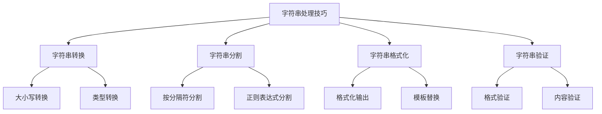

# 字符串处理技巧

## 📖 核心概念

**字符串处理技巧**是编程中的重要技能，包括字符串的转换、分割、合并、格式化等操作。掌握这些技巧能够提高代码的效率和可读性。

### 🏗️ 字符串处理分类



## 🔧 字符串处理实现

### 字符串转换

```cpp
class StringConverter {
public:
    // 大小写转换
    string toUpperCase(string str) {
        for (char& c : str) {
            c = toupper(c);
        }
        return str;
    }
    
    string toLowerCase(string str) {
        for (char& c : str) {
            c = tolower(c);
        }
        return str;
    }
    
    string capitalize(string str) {
        if (!str.empty()) {
            str[0] = toupper(str[0]);
            for (int i = 1; i < str.length(); ++i) {
                str[i] = tolower(str[i]);
            }
        }
        return str;
    }
    
    // 类型转换
    string intToString(int num) {
        return to_string(num);
    }
    
    string doubleToString(double num, int precision = 2) {
        stringstream ss;
        ss << fixed << setprecision(precision) << num;
        return ss.str();
    }
    
    int stringToInt(string str) {
        try {
            return stoi(str);
        } catch (const exception& e) {
            return 0;
        }
    }
    
    double stringToDouble(string str) {
        try {
            return stod(str);
        } catch (const exception& e) {
            return 0.0;
        }
    }
    
    // 进制转换
    string intToBinary(int num) {
        string binary = "";
        while (num > 0) {
            binary = (num % 2 == 0 ? "0" : "1") + binary;
            num /= 2;
        }
        return binary.empty() ? "0" : binary;
    }
    
    string intToHex(int num) {
        stringstream ss;
        ss << hex << num;
        return ss.str();
    }
    
    int binaryToInt(string binary) {
        int result = 0;
        int power = 1;
        
        for (int i = binary.length() - 1; i >= 0; --i) {
            if (binary[i] == '1') {
                result += power;
            }
            power *= 2;
        }
        
        return result;
    }
    
    void displayConversions() {
        cout << "String Conversion Examples:" << endl;
        cout << "=========================" << endl;
        
        string str = "Hello World";
        cout << "Original: " << str << endl;
        cout << "Uppercase: " << toUpperCase(str) << endl;
        cout << "Lowercase: " << toLowerCase(str) << endl;
        cout << "Capitalize: " << capitalize(str) << endl;
        
        int num = 42;
        cout << "Int to String: " << intToString(num) << endl;
        cout << "Int to Binary: " << intToBinary(num) << endl;
        cout << "Int to Hex: " << intToHex(num) << endl;
        
        string binary = "101010";
        cout << "Binary to Int: " << binaryToInt(binary) << endl;
    }
};
```

### 字符串分割

```cpp
class StringSplitter {
public:
    // 按分隔符分割
    vector<string> split(string str, char delimiter) {
        vector<string> result;
        stringstream ss(str);
        string item;
        
        while (getline(ss, item, delimiter)) {
            result.push_back(item);
        }
        
        return result;
    }
    
    vector<string> split(string str, string delimiter) {
        vector<string> result;
        size_t start = 0;
        size_t end = str.find(delimiter);
        
        while (end != string::npos) {
            result.push_back(str.substr(start, end - start));
            start = end + delimiter.length();
            end = str.find(delimiter, start);
        }
        
        result.push_back(str.substr(start));
        return result;
    }
    
    // 按多个分隔符分割
    vector<string> splitMultiple(string str, string delimiters) {
        vector<string> result;
        string current = "";
        
        for (char c : str) {
            if (delimiters.find(c) != string::npos) {
                if (!current.empty()) {
                    result.push_back(current);
                    current = "";
                }
            } else {
                current += c;
            }
        }
        
        if (!current.empty()) {
            result.push_back(current);
        }
        
        return result;
    }
    
    // 按空格分割（处理多个空格）
    vector<string> splitBySpaces(string str) {
        vector<string> result;
        stringstream ss(str);
        string word;
        
        while (ss >> word) {
            result.push_back(word);
        }
        
        return result;
    }
    
    void displaySplitting() {
        cout << "String Splitting Examples:" << endl;
        cout << "========================" << endl;
        
        string str1 = "apple,banana,orange,grape";
        vector<string> result1 = split(str1, ',');
        cout << "Split by comma: ";
        for (string item : result1) {
            cout << item << " ";
        }
        cout << endl;
        
        string str2 = "hello world test";
        vector<string> result2 = splitBySpaces(str2);
        cout << "Split by spaces: ";
        for (string item : result2) {
            cout << item << " ";
        }
        cout << endl;
        
        string str3 = "a,b;c:d e";
        vector<string> result3 = splitMultiple(str3, ",;: ");
        cout << "Split by multiple delimiters: ";
        for (string item : result3) {
            cout << item << " ";
        }
        cout << endl;
    }
};
```

### 字符串格式化

```cpp
class StringFormatter {
public:
    // 字符串格式化
    string format(string template_str, map<string, string> variables) {
        string result = template_str;
        
        for (auto pair : variables) {
            string placeholder = "{" + pair.first + "}";
            size_t pos = result.find(placeholder);
            
            while (pos != string::npos) {
                result.replace(pos, placeholder.length(), pair.second);
                pos = result.find(placeholder, pos + pair.second.length());
            }
        }
        
        return result;
    }
    
    // 数字格式化
    string formatNumber(int num, int width = 0, char fill = ' ') {
        stringstream ss;
        ss << setw(width) << setfill(fill) << num;
        return ss.str();
    }
    
    string formatDecimal(double num, int precision = 2) {
        stringstream ss;
        ss << fixed << setprecision(precision) << num;
        return ss.str();
    }
    
    string formatPercentage(double num, int precision = 1) {
        stringstream ss;
        ss << fixed << setprecision(precision) << (num * 100) << "%";
        return ss.str();
    }
    
    // 字符串对齐
    string leftAlign(string str, int width, char fill = ' ') {
        if (str.length() >= width) return str;
        return str + string(width - str.length(), fill);
    }
    
    string rightAlign(string str, int width, char fill = ' ') {
        if (str.length() >= width) return str;
        return string(width - str.length(), fill) + str;
    }
    
    string centerAlign(string str, int width, char fill = ' ') {
        if (str.length() >= width) return str;
        
        int leftPadding = (width - str.length()) / 2;
        int rightPadding = width - str.length() - leftPadding;
        
        return string(leftPadding, fill) + str + string(rightPadding, fill);
    }
    
    void displayFormatting() {
        cout << "String Formatting Examples:" << endl;
        cout << "==========================" << endl;
        
        // 模板格式化
        string template_str = "Hello {name}, you have {count} messages.";
        map<string, string> variables = {
            {"name", "Alice"},
            {"count", "5"}
        };
        cout << "Template: " << template_str << endl;
        cout << "Formatted: " << format(template_str, variables) << endl;
        
        // 数字格式化
        cout << "Number formatting:" << endl;
        cout << "Formatted number: " << formatNumber(42, 5, '0') << endl;
        cout << "Formatted decimal: " << formatDecimal(3.14159, 3) << endl;
        cout << "Formatted percentage: " << formatPercentage(0.75, 1) << endl;
        
        // 字符串对齐
        cout << "String alignment:" << endl;
        cout << "Left align: '" << leftAlign("Hello", 10, '-') << "'" << endl;
        cout << "Right align: '" << rightAlign("Hello", 10, '-') << "'" << endl;
        cout << "Center align: '" << centerAlign("Hello", 10, '-') << "'" << endl;
    }
};
```

### 字符串验证

```cpp
class StringValidator {
public:
    // 格式验证
    bool isValidEmail(string email) {
        size_t atPos = email.find('@');
        if (atPos == string::npos || atPos == 0 || atPos == email.length() - 1) {
            return false;
        }
        
        string local = email.substr(0, atPos);
        string domain = email.substr(atPos + 1);
        
        // 检查本地部分
        if (local.empty() || local.length() > 64) return false;
        for (char c : local) {
            if (!isalnum(c) && c != '.' && c != '_' && c != '-') {
                return false;
            }
        }
        
        // 检查域名部分
        if (domain.empty() || domain.length() > 255) return false;
        if (domain.find('.') == string::npos) return false;
        
        return true;
    }
    
    bool isValidPhoneNumber(string phone) {
        // 简单的手机号验证（11位数字）
        if (phone.length() != 11) return false;
        
        for (char c : phone) {
            if (!isdigit(c)) return false;
        }
        
        return phone[0] == '1'; // 中国手机号以1开头
    }
    
    bool isValidIPAddress(string ip) {
        vector<string> parts = StringSplitter().split(ip, '.');
        if (parts.size() != 4) return false;
        
        for (string part : parts) {
            if (part.empty() || part.length() > 3) return false;
            
            for (char c : part) {
                if (!isdigit(c)) return false;
            }
            
            int num = stoi(part);
            if (num < 0 || num > 255) return false;
        }
        
        return true;
    }
    
    // 内容验证
    bool isPalindrome(string str) {
        int left = 0, right = str.length() - 1;
        
        while (left < right) {
            if (tolower(str[left]) != tolower(str[right])) {
                return false;
            }
            left++;
            right--;
        }
        
        return true;
    }
    
    bool isNumeric(string str) {
        if (str.empty()) return false;
        
        bool hasDecimal = false;
        for (int i = 0; i < str.length(); ++i) {
            if (str[i] == '.') {
                if (hasDecimal) return false;
                hasDecimal = true;
            } else if (!isdigit(str[i])) {
                return false;
            }
        }
        
        return true;
    }
    
    bool isAlpha(string str) {
        for (char c : str) {
            if (!isalpha(c)) return false;
        }
        return true;
    }
    
    bool isAlphaNumeric(string str) {
        for (char c : str) {
            if (!isalnum(c)) return false;
        }
        return true;
    }
    
    void displayValidation() {
        cout << "String Validation Examples:" << endl;
        cout << "=========================" << endl;
        
        vector<string> emails = {
            "user@example.com",
            "invalid.email",
            "test@domain.co.uk",
            "@invalid.com"
        };
        
        cout << "Email validation:" << endl;
        for (string email : emails) {
            cout << email << ": " << (isValidEmail(email) ? "Valid" : "Invalid") << endl;
        }
        
        vector<string> phones = {
            "13812345678",
            "12345678901",
            "1381234567",
            "138123456789"
        };
        
        cout << "Phone validation:" << endl;
        for (string phone : phones) {
            cout << phone << ": " << (isValidPhoneNumber(phone) ? "Valid" : "Invalid") << endl;
        }
        
        vector<string> palindromes = {
            "racecar",
            "hello",
            "A man a plan a canal Panama",
            "race a car"
        };
        
        cout << "Palindrome validation:" << endl;
        for (string str : palindromes) {
            cout << str << ": " << (isPalindrome(str) ? "Yes" : "No") << endl;
        }
    }
};
```

## 🎯 字符串处理应用

### 文本处理工具

```cpp
class TextProcessor {
private:
    string text;
    
public:
    TextProcessor(string content) : text(content) {}
    
    // 文本统计
    map<string, int> getWordFrequency() {
        map<string, int> frequency;
        vector<string> words = StringSplitter().splitBySpaces(text);
        
        for (string word : words) {
            // 转换为小写并移除标点
            string cleanWord = cleanWord(word);
            if (!cleanWord.empty()) {
                frequency[cleanWord]++;
            }
        }
        
        return frequency;
    }
    
    int getCharacterCount() {
        return text.length();
    }
    
    int getWordCount() {
        vector<string> words = StringSplitter().splitBySpaces(text);
        return words.size();
    }
    
    int getLineCount() {
        return StringSplitter().split(text, '\n').size();
    }
    
    // 文本清理
    string cleanWord(string word) {
        string result = "";
        for (char c : word) {
            if (isalnum(c)) {
                result += tolower(c);
            }
        }
        return result;
    }
    
    string removeExtraSpaces() {
        string result = "";
        bool inSpace = false;
        
        for (char c : text) {
            if (c == ' ') {
                if (!inSpace) {
                    result += c;
                    inSpace = true;
                }
            } else {
                result += c;
                inSpace = false;
            }
        }
        
        return result;
    }
    
    string removePunctuation() {
        string result = "";
        for (char c : text) {
            if (isalnum(c) || c == ' ') {
                result += c;
            }
        }
        return result;
    }
    
    // 文本转换
    string toTitleCase() {
        vector<string> words = StringSplitter().splitBySpaces(text);
        string result = "";
        
        for (int i = 0; i < words.size(); ++i) {
            if (i > 0) result += " ";
            result += StringConverter().capitalize(words[i]);
        }
        
        return result;
    }
    
    string reverseWords() {
        vector<string> words = StringSplitter().splitBySpaces(text);
        reverse(words.begin(), words.end());
        
        string result = "";
        for (int i = 0; i < words.size(); ++i) {
            if (i > 0) result += " ";
            result += words[i];
        }
        
        return result;
    }
    
    void displayTextStats() {
        cout << "Text Statistics:" << endl;
        cout << "===============" << endl;
        cout << "Character count: " << getCharacterCount() << endl;
        cout << "Word count: " << getWordCount() << endl;
        cout << "Line count: " << getLineCount() << endl;
        
        map<string, int> frequency = getWordFrequency();
        cout << "Most frequent words:" << endl;
        
        vector<pair<string, int>> sortedWords;
        for (auto pair : frequency) {
            sortedWords.push_back(pair);
        }
        
        sort(sortedWords.begin(), sortedWords.end(), 
             [](const pair<string, int>& a, const pair<string, int>& b) {
                 return a.second > b.second;
             });
        
        for (int i = 0; i < min(5, (int)sortedWords.size()); ++i) {
            cout << sortedWords[i].first << ": " << sortedWords[i].second << endl;
        }
    }
};
```

### 字符串工具类

```cpp
class StringUtils {
public:
    // 字符串操作
    static string trim(string str) {
        size_t start = str.find_first_not_of(" \t\n\r");
        if (start == string::npos) return "";
        
        size_t end = str.find_last_not_of(" \t\n\r");
        return str.substr(start, end - start + 1);
    }
    
    static string ltrim(string str) {
        size_t start = str.find_first_not_of(" \t\n\r");
        if (start == string::npos) return "";
        return str.substr(start);
    }
    
    static string rtrim(string str) {
        size_t end = str.find_last_not_of(" \t\n\r");
        if (end == string::npos) return "";
        return str.substr(0, end + 1);
    }
    
    static string replace(string str, string from, string to) {
        size_t pos = 0;
        while ((pos = str.find(from, pos)) != string::npos) {
            str.replace(pos, from.length(), to);
            pos += to.length();
        }
        return str;
    }
    
    static string reverse(string str) {
        reverse(str.begin(), str.end());
        return str;
    }
    
    static bool startsWith(string str, string prefix) {
        return str.length() >= prefix.length() && 
               str.substr(0, prefix.length()) == prefix;
    }
    
    static bool endsWith(string str, string suffix) {
        return str.length() >= suffix.length() && 
               str.substr(str.length() - suffix.length()) == suffix;
    }
    
    static bool contains(string str, string substr) {
        return str.find(substr) != string::npos;
    }
    
    static int countOccurrences(string str, string substr) {
        int count = 0;
        size_t pos = 0;
        while ((pos = str.find(substr, pos)) != string::npos) {
            count++;
            pos += substr.length();
        }
        return count;
    }
    
    static void displayUtils() {
        cout << "String Utils Examples:" << endl;
        cout << "=====================" << endl;
        
        string str = "  Hello World  ";
        cout << "Original: '" << str << "'" << endl;
        cout << "Trimmed: '" << trim(str) << "'" << endl;
        cout << "Left trimmed: '" << ltrim(str) << "'" << endl;
        cout << "Right trimmed: '" << rtrim(str) << "'" << endl;
        
        string text = "Hello World Hello";
        cout << "Replace 'Hello' with 'Hi': " << replace(text, "Hello", "Hi") << endl;
        cout << "Reverse: " << reverse(text) << endl;
        cout << "Starts with 'Hello': " << (startsWith(text, "Hello") ? "Yes" : "No") << endl;
        cout << "Ends with 'World': " << (endsWith(text, "World") ? "Yes" : "No") << endl;
        cout << "Contains 'World': " << (contains(text, "World") ? "Yes" : "No") << endl;
        cout << "Count of 'Hello': " << countOccurrences(text, "Hello") << endl;
    }
};
```

## 🎮 字符串处理测试

### 1. 基础功能测试

```cpp
class StringProcessingTest {
public:
    static void testStringConverter() {
        cout << "Testing String Converter:" << endl;
        cout << "========================" << endl;
        
        StringConverter converter;
        converter.displayConversions();
    }
    
    static void testStringSplitter() {
        cout << "Testing String Splitter:" << endl;
        cout << "=======================" << endl;
        
        StringSplitter splitter;
        splitter.displaySplitting();
    }
    
    static void testStringFormatter() {
        cout << "Testing String Formatter:" << endl;
        cout << "========================" << endl;
        
        StringFormatter formatter;
        formatter.displayFormatting();
    }
    
    static void testStringValidator() {
        cout << "Testing String Validator:" << endl;
        cout << "=======================" << endl;
        
        StringValidator validator;
        validator.displayValidation();
    }
    
    static void testTextProcessor() {
        cout << "Testing Text Processor:" << endl;
        cout << "======================" << endl;
        
        string content = "Hello world! This is a test. Hello again!";
        TextProcessor processor(content);
        processor.displayTextStats();
    }
    
    static void testStringUtils() {
        cout << "Testing String Utils:" << endl;
        cout << "====================" << endl;
        
        StringUtils::displayUtils();
    }
};
```

## 🔗 相关链接

- [[01-字符串基础|字符串基础]]
- [[02-字符串匹配算法|字符串匹配算法]]
- [[03-KMP算法详解|KMP算法详解]]

## 💡 字符串处理要点

1. **转换技巧**: 掌握各种类型转换方法
2. **分割方法**: 灵活使用不同的分割策略
3. **格式化**: 了解各种格式化需求
4. **验证**: 确保输入数据的有效性

---

*📝 处理提示：字符串处理是编程的基础技能，掌握这些技巧能提高代码质量*
