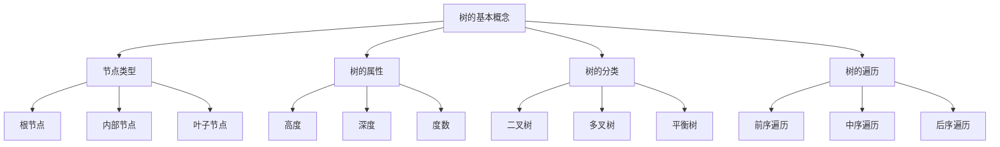

# 树形基础

## 📖 核心概念

**树**是一种重要的非线性数据结构，由节点和边组成。树具有层次结构，每个节点最多有一个父节点，可以有多个子节点。

### 🏗️ 树的基本概念



## 🔧 树的基本实现

### 树节点定义

```cpp
class TreeNode {
public:
    int data;
    vector<TreeNode*> children;
    
    TreeNode(int value) : data(value) {}
    
    void addChild(TreeNode* child) {
        children.push_back(child);
    }
    
    void removeChild(TreeNode* child) {
        children.erase(remove(children.begin(), children.end(), child), children.end());
    }
    
    bool isLeaf() {
        return children.empty();
    }
    
    int getDegree() {
        return children.size();
    }
};
```

### 树的基本操作

```cpp
class Tree {
private:
    TreeNode* root;
    
public:
    Tree() : root(nullptr) {}
    
    ~Tree() {
        clear();
    }
    
    void setRoot(TreeNode* node) {
        root = node;
    }
    
    TreeNode* getRoot() {
        return root;
    }
    
    // 计算树的高度
    int getHeight(TreeNode* node) {
        if (!node) return 0;
        
        int maxChildHeight = 0;
        for (TreeNode* child : node->children) {
            maxChildHeight = max(maxChildHeight, getHeight(child));
        }
        
        return 1 + maxChildHeight;
    }
    
    // 计算树的节点数
    int getNodeCount(TreeNode* node) {
        if (!node) return 0;
        
        int count = 1;
        for (TreeNode* child : node->children) {
            count += getNodeCount(child);
        }
        
        return count;
    }
    
    // 查找节点
    TreeNode* findNode(TreeNode* node, int value) {
        if (!node) return nullptr;
        
        if (node->data == value) {
            return node;
        }
        
        for (TreeNode* child : node->children) {
            TreeNode* result = findNode(child, value);
            if (result) return result;
        }
        
        return nullptr;
    }
    
    // 前序遍历
    void preorderTraversal(TreeNode* node) {
        if (!node) return;
        
        cout << node->data << " ";
        for (TreeNode* child : node->children) {
            preorderTraversal(child);
        }
    }
    
    // 后序遍历
    void postorderTraversal(TreeNode* node) {
        if (!node) return;
        
        for (TreeNode* child : node->children) {
            postorderTraversal(child);
        }
        cout << node->data << " ";
    }
    
    // 层序遍历
    void levelOrderTraversal(TreeNode* node) {
        if (!node) return;
        
        queue<TreeNode*> q;
        q.push(node);
        
        while (!q.empty()) {
            TreeNode* current = q.front();
            q.pop();
            
            cout << current->data << " ";
            
            for (TreeNode* child : current->children) {
                q.push(child);
            }
        }
    }
    
    // 清空树
    void clear() {
        clearHelper(root);
        root = nullptr;
    }
    
private:
    void clearHelper(TreeNode* node) {
        if (!node) return;
        
        for (TreeNode* child : node->children) {
            clearHelper(child);
        }
        
        delete node;
    }
};
```

## 🎯 二叉树实现

### 二叉树节点

```cpp
class BinaryTreeNode {
public:
    int data;
    BinaryTreeNode* left;
    BinaryTreeNode* right;
    
    BinaryTreeNode(int value) : data(value), left(nullptr), right(nullptr) {}
};
```

### 二叉树操作

```cpp
class BinaryTree {
private:
    BinaryTreeNode* root;
    
public:
    BinaryTree() : root(nullptr) {}
    
    ~BinaryTree() {
        clear();
    }
    
    void setRoot(BinaryTreeNode* node) {
        root = node;
    }
    
    BinaryTreeNode* getRoot() {
        return root;
    }
    
    // 插入节点
    void insert(int value) {
        root = insertHelper(root, value);
    }
    
    BinaryTreeNode* insertHelper(BinaryTreeNode* node, int value) {
        if (!node) {
            return new BinaryTreeNode(value);
        }
        
        if (value < node->data) {
            node->left = insertHelper(node->left, value);
        } else if (value > node->data) {
            node->right = insertHelper(node->right, value);
        }
        
        return node;
    }
    
    // 查找节点
    BinaryTreeNode* search(int value) {
        return searchHelper(root, value);
    }
    
    BinaryTreeNode* searchHelper(BinaryTreeNode* node, int value) {
        if (!node || node->data == value) {
            return node;
        }
        
        if (value < node->data) {
            return searchHelper(node->left, value);
        } else {
            return searchHelper(node->right, value);
        }
    }
    
    // 删除节点
    bool remove(int value) {
        root = removeHelper(root, value);
        return root != nullptr;
    }
    
    BinaryTreeNode* removeHelper(BinaryTreeNode* node, int value) {
        if (!node) return nullptr;
        
        if (value < node->data) {
            node->left = removeHelper(node->left, value);
        } else if (value > node->data) {
            node->right = removeHelper(node->right, value);
        } else {
            if (!node->left) {
                BinaryTreeNode* temp = node->right;
                delete node;
                return temp;
            } else if (!node->right) {
                BinaryTreeNode* temp = node->left;
                delete node;
                return temp;
            }
            
            BinaryTreeNode* minNode = findMin(node->right);
            node->data = minNode->data;
            node->right = removeHelper(node->right, minNode->data);
        }
        
        return node;
    }
    
    BinaryTreeNode* findMin(BinaryTreeNode* node) {
        while (node->left) {
            node = node->left;
        }
        return node;
    }
    
    // 中序遍历
    void inorderTraversal(BinaryTreeNode* node) {
        if (!node) return;
        
        inorderTraversal(node->left);
        cout << node->data << " ";
        inorderTraversal(node->right);
    }
    
    // 计算高度
    int getHeight(BinaryTreeNode* node) {
        if (!node) return 0;
        
        int leftHeight = getHeight(node->left);
        int rightHeight = getHeight(node->right);
        
        return 1 + max(leftHeight, rightHeight);
    }
    
    // 计算节点数
    int getNodeCount(BinaryTreeNode* node) {
        if (!node) return 0;
        
        return 1 + getNodeCount(node->left) + getNodeCount(node->right);
    }
    
    // 检查是否为完全二叉树
    bool isComplete(BinaryTreeNode* node) {
        if (!node) return true;
        
        queue<BinaryTreeNode*> q;
        q.push(node);
        bool foundNull = false;
        
        while (!q.empty()) {
            BinaryTreeNode* current = q.front();
            q.pop();
            
            if (!current) {
                foundNull = true;
            } else {
                if (foundNull) return false;
                
                q.push(current->left);
                q.push(current->right);
            }
        }
        
        return true;
    }
    
    // 清空树
    void clear() {
        clearHelper(root);
        root = nullptr;
    }
    
private:
    void clearHelper(BinaryTreeNode* node) {
        if (!node) return;
        
        clearHelper(node->left);
        clearHelper(node->right);
        delete node;
    }
};
```

## 📊 树的应用

### 1. 文件系统

```cpp
class FileSystem {
private:
    struct FileNode {
        string name;
        bool isDirectory;
        vector<FileNode*> children;
        FileNode* parent;
        
        FileNode(string n, bool isDir) : name(n), isDirectory(isDir), parent(nullptr) {}
    };
    
    FileNode* root;
    
public:
    FileSystem() {
        root = new FileNode("/", true);
    }
    
    void createDirectory(string path) {
        vector<string> parts = splitPath(path);
        FileNode* current = root;
        
        for (const string& part : parts) {
            FileNode* child = findChild(current, part);
            if (!child) {
                child = new FileNode(part, true);
                child->parent = current;
                current->children.push_back(child);
            }
            current = child;
        }
    }
    
    void createFile(string path) {
        vector<string> parts = splitPath(path);
        string fileName = parts.back();
        parts.pop_back();
        
        FileNode* current = root;
        for (const string& part : parts) {
            FileNode* child = findChild(current, part);
            if (!child) {
                child = new FileNode(part, true);
                child->parent = current;
                current->children.push_back(child);
            }
            current = child;
        }
        
        FileNode* file = new FileNode(fileName, false);
        file->parent = current;
        current->children.push_back(file);
    }
    
    void listDirectory(string path) {
        FileNode* node = findNode(path);
        if (node && node->isDirectory) {
            for (FileNode* child : node->children) {
                cout << (child->isDirectory ? "[DIR] " : "[FILE] ") << child->name << endl;
            }
        }
    }
    
private:
    vector<string> splitPath(string path) {
        vector<string> parts;
        string current;
        
        for (char c : path) {
            if (c == '/') {
                if (!current.empty()) {
                    parts.push_back(current);
                    current.clear();
                }
            } else {
                current += c;
            }
        }
        
        if (!current.empty()) {
            parts.push_back(current);
        }
        
        return parts;
    }
    
    FileNode* findChild(FileNode* parent, string name) {
        for (FileNode* child : parent->children) {
            if (child->name == name) {
                return child;
            }
        }
        return nullptr;
    }
    
    FileNode* findNode(string path) {
        vector<string> parts = splitPath(path);
        FileNode* current = root;
        
        for (const string& part : parts) {
            current = findChild(current, part);
            if (!current) return nullptr;
        }
        
        return current;
    }
};
```

### 2. 表达式树

```cpp
class ExpressionTree {
private:
    struct ExprNode {
        string value;
        ExprNode* left;
        ExprNode* right;
        
        ExprNode(string v) : value(v), left(nullptr), right(nullptr) {}
    };
    
    ExprNode* root;
    
public:
    ExpressionTree() : root(nullptr) {}
    
    void buildFromPostfix(vector<string> postfix) {
        stack<ExprNode*> stk;
        
        for (const string& token : postfix) {
            if (isOperator(token)) {
                ExprNode* right = stk.top(); stk.pop();
                ExprNode* left = stk.top(); stk.pop();
                
                ExprNode* node = new ExprNode(token);
                node->left = left;
                node->right = right;
                
                stk.push(node);
            } else {
                stk.push(new ExprNode(token));
            }
        }
        
        root = stk.top();
    }
    
    double evaluate() {
        return evaluateHelper(root);
    }
    
    void printInfix() {
        printInfixHelper(root);
        cout << endl;
    }
    
private:
    bool isOperator(string token) {
        return token == "+" || token == "-" || token == "*" || token == "/";
    }
    
    double evaluateHelper(ExprNode* node) {
        if (!node) return 0;
        
        if (!isOperator(node->value)) {
            return stod(node->value);
        }
        
        double left = evaluateHelper(node->left);
        double right = evaluateHelper(node->right);
        
        if (node->value == "+") return left + right;
        if (node->value == "-") return left - right;
        if (node->value == "*") return left * right;
        if (node->value == "/") return left / right;
        
        return 0;
    }
    
    void printInfixHelper(ExprNode* node) {
        if (!node) return;
        
        if (isOperator(node->value)) {
            cout << "(";
            printInfixHelper(node->left);
            cout << node->value;
            printInfixHelper(node->right);
            cout << ")";
        } else {
            cout << node->value;
        }
    }
};
```

## 🔗 相关链接

- [[02-二叉树王国|二叉树王国]]
- [[03-堆与优先|堆与优先]]
- [[04-图论天地|图论天地]]

## 💡 树形基础要点

1. **基本概念**：根节点、叶子节点、高度、深度等
2. **树的遍历**：前序、中序、后序、层序遍历
3. **二叉树**：特殊的树结构，每个节点最多有两个子节点
4. **应用场景**：文件系统、表达式树、决策树等

---

*📝 基础提示：树是重要的非线性数据结构，掌握树的基础概念是学习更复杂树结构的前提*
