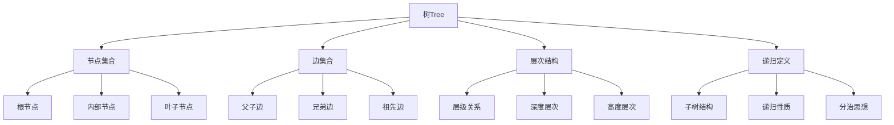

# 🌲 树的基本概念

## 🎯 核心定义

**树（Tree）**是一种层次性的非线性数据结构，由节点和边组成，具有层次结构和递归特性。

### 🔍 本质理解
树 = 节点集合 + 边集合 + 层次结构 + 递归定义



---

## 🏗️ 树的基本术语

### 📊 术语定义表

| 术语 | 定义 | 示例 | 说明 |
|------|------|------|------|
| **根节点** | 树的顶层节点 | 节点A | 没有父节点的节点 |
| **叶子节点** | 没有子节点的节点 | 节点D、E、F | 树的末端节点 |
| **内部节点** | 有子节点的节点 | 节点B、C | 非根非叶的节点 |
| **父节点** | 直接上级节点 | B是D的父节点 | 直接连接的上级 |
| **子节点** | 直接下级节点 | D、E是B的子节点 | 直接连接的下级 |
| **兄弟节点** | 同一父节点的节点 | D、E是兄弟节点 | 同级的节点 |
| **祖先节点** | 从根到该节点的路径 | A、B是D的祖先 | 路径上的所有节点 |
| **后代节点** | 该节点下的所有节点 | D、E是B的后代 | 子树中的所有节点 |

### 🎯 树的层次结构

#### 📊 树的表示
```
        A (根节点)
       / \
      B   C (内部节点)
     / \   \
    D   E   F (叶子节点)
```

#### 🔍 层次分析
- **第0层**：A（根节点）
- **第1层**：B、C（A的子节点）
- **第2层**：D、E、F（叶子节点）

---

## 🌳 树的基本性质

### 📊 性质分析表

| 性质 | 描述 | 数学表达 | 应用 |
|------|------|----------|------|
| **连通性** | 任意两节点间有路径 | 路径存在 | 确保树连通 |
| **无环性** | 不存在环路 | 无环图 | 避免循环依赖 |
| **唯一路径** | 任意两节点间路径唯一 | 路径唯一 | 简化路径查找 |
| **n-1条边** | n个节点有n-1条边 | |E| = |V| - 1 | 最小连通图 |

### 🎯 树的分类

#### 📊 按度数分类
| 类型 | 定义 | 特点 | 示例 |
|------|------|------|------|
| **二叉树** | 每个节点最多2个子节点 | 结构简单、操作高效 | 二叉搜索树 |
| **多叉树** | 每个节点可以有多个子节点 | 结构灵活、表示复杂 | 文件系统 |
| **n叉树** | 每个节点最多n个子节点 | 平衡性好、查找高效 | B树 |

#### 📊 按结构分类
| 类型 | 定义 | 特点 | 应用 |
|------|------|------|------|
| **完全二叉树** | 除最后一层外完全填充 | 数组存储、计算简单 | 堆结构 |
| **满二叉树** | 所有层都完全填充 | 节点数最多、结构规整 | 完美平衡 |
| **平衡树** | 左右子树高度差≤1 | 查找效率高、操作稳定 | AVL树、红黑树 |

---

## 💻 树的存储结构

### 🔧 链式存储

#### 📋 节点定义
```cpp
template<typename T>
struct TreeNode {
    T data;                    // 数据域
    TreeNode<T>* left;         // 左子节点
    TreeNode<T>* right;        // 右子节点
    
    // 构造函数
    TreeNode() : left(nullptr), right(nullptr) {}
    TreeNode(const T& value) : data(value), left(nullptr), right(nullptr) {}
    TreeNode(const T& value, TreeNode<T>* leftChild, TreeNode<T>* rightChild)
        : data(value), left(leftChild), right(rightChild) {}
};
```

#### 🎯 链式存储特点
- **动态分配**：节点按需分配内存
- **灵活结构**：支持任意树结构
- **指针开销**：每个节点需要指针空间
- **非连续存储**：内存不连续，缓存不友好

### 🔧 数组存储

#### 📋 完全二叉树数组存储
```cpp
template<typename T>
class ArrayTree {
private:
    T* data;           // 数据数组
    int capacity;      // 数组容量
    int size;          // 实际大小
    
public:
    ArrayTree(int capacity) : capacity(capacity), size(0) {
        data = new T[capacity];
    }
    
    ~ArrayTree() {
        delete[] data;
    }
    
    // 获取父节点索引
    int getParent(int index) const {
        if (index <= 0) return -1;
        return (index - 1) / 2;
    }
    
    // 获取左子节点索引
    int getLeftChild(int index) const {
        int leftChild = 2 * index + 1;
        return leftChild < size ? leftChild : -1;
    }
    
    // 获取右子节点索引
    int getRightChild(int index) const {
        int rightChild = 2 * index + 2;
        return rightChild < size ? rightChild : -1;
    }
    
    // 插入节点
    void insert(const T& value) {
        if (size >= capacity) {
            throw std::overflow_error("Tree is full");
        }
        data[size++] = value;
    }
};
```

#### 🎯 数组存储特点
- **连续存储**：内存连续，缓存友好
- **计算简单**：通过索引计算父子关系
- **空间固定**：大小固定，可能浪费空间
- **只适用完全二叉树**：其他结构不适用

---

## 🔍 树的基本操作

### 📋 操作分类表

| 操作类型 | 具体操作 | 时间复杂度 | 说明 |
|----------|----------|------------|------|
| **遍历操作** | 前序、中序、后序遍历 | O(n) | 访问所有节点 |
| **查找操作** | 查找指定节点 | O(n) | 遍历查找 |
| **插入操作** | 插入新节点 | O(1) | 在指定位置插入 |
| **删除操作** | 删除指定节点 | O(1) | 删除指定节点 |
| **计算操作** | 计算高度、节点数 | O(n) | 遍历计算 |

### 🎯 遍历操作

#### 📊 遍历方式
| 遍历方式 | 访问顺序 | 应用场景 | 示例 |
|----------|----------|----------|------|
| **前序遍历** | 根→左→右 | 复制树结构 | 1→2→4→5→3→6 |
| **中序遍历** | 左→根→右 | 有序输出 | 4→2→5→1→3→6 |
| **后序遍历** | 左→右→根 | 删除树结构 | 4→5→2→6→3→1 |
| **层序遍历** | 逐层访问 | 广度优先搜索 | 1→2→3→4→5→6 |

#### 💻 递归实现
```cpp
template<typename T>
class TreeTraversal {
public:
    // 前序遍历
    void preOrder(TreeNode<T>* root) {
        if (root == nullptr) return;
        
        cout << root->data << " ";  // 访问根节点
        preOrder(root->left);       // 遍历左子树
        preOrder(root->right);      // 遍历右子树
    }
    
    // 中序遍历
    void inOrder(TreeNode<T>* root) {
        if (root == nullptr) return;
        
        inOrder(root->left);        // 遍历左子树
        cout << root->data << " ";  // 访问根节点
        inOrder(root->right);       // 遍历右子树
    }
    
    // 后序遍历
    void postOrder(TreeNode<T>* root) {
        if (root == nullptr) return;
        
        postOrder(root->left);      // 遍历左子树
        postOrder(root->right);     // 遍历右子树
        cout << root->data << " ";  // 访问根节点
    }
    
    // 层序遍历
    void levelOrder(TreeNode<T>* root) {
        if (root == nullptr) return;
        
        queue<TreeNode<T>*> q;
        q.push(root);
        
        while (!q.empty()) {
            TreeNode<T>* node = q.front();
            q.pop();
            
            cout << node->data << " ";
            
            if (node->left) q.push(node->left);
            if (node->right) q.push(node->right);
        }
    }
};
```

---

## 🎯 树的应用场景

### 📋 典型应用

#### 🌳 文件系统
- **目录结构**：文件系统的层次结构
- **路径查找**：查找文件路径
- **权限管理**：目录权限继承
- **空间管理**：磁盘空间分配

```cpp
class FileSystem {
private:
    struct FileNode {
        string name;
        bool isDirectory;
        vector<FileNode*> children;
        FileNode* parent;
        
        FileNode(string n, bool isDir) : name(n), isDirectory(isDir), parent(nullptr) {}
    };
    
    FileNode* root;
    
public:
    FileSystem() {
        root = new FileNode("/", true);
    }
    
    void createDirectory(const string& path) {
        vector<string> parts = splitPath(path);
        FileNode* current = root;
        
        for (const string& part : parts) {
            FileNode* child = findChild(current, part);
            if (child == nullptr) {
                child = new FileNode(part, true);
                child->parent = current;
                current->children.push_back(child);
            }
            current = child;
        }
    }
    
    string getFullPath(FileNode* node) {
        if (node == root) return "/";
        
        string path = node->name;
        FileNode* current = node->parent;
        
        while (current != root) {
            path = current->name + "/" + path;
            current = current->parent;
        }
        
        return "/" + path;
    }
};
```

#### 🎯 决策树
- **机器学习**：决策树算法
- **规则系统**：基于规则的决策
- **游戏AI**：游戏中的决策逻辑
- **专家系统**：专家知识表示

```cpp
class DecisionTree {
private:
    struct DecisionNode {
        string question;
        string answer;
        DecisionNode* yes;
        DecisionNode* no;
        
        DecisionNode(string q) : question(q), answer(""), yes(nullptr), no(nullptr) {}
    };
    
    DecisionNode* root;
    
public:
    DecisionTree() {
        root = new DecisionNode("Is it a mammal?");
        root->yes = new DecisionNode("Does it live in water?");
        root->no = new DecisionNode("Does it fly?");
        
        // 构建决策树
        buildTree();
    }
    
    string makeDecision() {
        DecisionNode* current = root;
        
        while (current->yes != nullptr && current->no != nullptr) {
            cout << current->question << " (y/n): ";
            char answer;
            cin >> answer;
            
            if (answer == 'y') {
                current = current->yes;
            } else {
                current = current->no;
            }
        }
        
        return current->answer;
    }
};
```

#### 🌐 网络拓扑
- **网络结构**：计算机网络拓扑
- **路由算法**：网络路由计算
- **负载均衡**：网络负载分配
- **故障检测**：网络故障诊断

```cpp
class NetworkTopology {
private:
    struct NetworkNode {
        int id;
        string name;
        vector<NetworkNode*> neighbors;
        bool isActive;
        
        NetworkNode(int i, string n) : id(i), name(n), isActive(true) {}
    };
    
    vector<NetworkNode*> nodes;
    
public:
    void addNode(int id, const string& name) {
        NetworkNode* node = new NetworkNode(id, name);
        nodes.push_back(node);
    }
    
    void addConnection(int from, int to) {
        NetworkNode* fromNode = findNode(from);
        NetworkNode* toNode = findNode(to);
        
        if (fromNode && toNode) {
            fromNode->neighbors.push_back(toNode);
            toNode->neighbors.push_back(fromNode);
        }
    }
    
    vector<int> findPath(int start, int end) {
        queue<pair<NetworkNode*, vector<int>>> q;
        set<int> visited;
        
        NetworkNode* startNode = findNode(start);
        if (!startNode) return {};
        
        q.push({startNode, {start}});
        visited.insert(start);
        
        while (!q.empty()) {
            auto [current, path] = q.front();
            q.pop();
            
            if (current->id == end) {
                return path;
            }
            
            for (NetworkNode* neighbor : current->neighbors) {
                if (visited.find(neighbor->id) == visited.end()) {
                    visited.insert(neighbor->id);
                    vector<int> newPath = path;
                    newPath.push_back(neighbor->id);
                    q.push({neighbor, newPath});
                }
            }
        }
        
        return {};  // 无路径
    }
};
```

---

## 🧠 学习策略

### 📚 理解层次

#### 🔴 认识层次
- 知道树的基本概念
- 了解树的基本术语
- 识别树的应用场景

#### 🟡 理解层次
- 理解树的结构特性
- 掌握树的存储方式
- 分析树的优缺点

#### 🟢 应用层次
- 能实现树的基本操作
- 会选择合适的存储方式
- 能解决树相关问题

#### 🔵 创新层次
- 能设计树的变种
- 会优化树操作
- 能组合树与其他结构

### 🎯 学习建议

1. **从基础到高级**：基本概念 → 存储方式 → 操作实现 → 应用场景
2. **理论与实践结合**：概念理解 + 代码实现
3. **对比学习**：不同存储方式的优缺点
4. **应用驱动**：从实际问题出发学习树

### 🔍 常见错误

#### ❌ 常见错误
1. **空指针访问**：访问空节点
2. **循环引用**：节点间形成循环
3. **内存泄漏**：忘记释放节点内存
4. **逻辑错误**：混淆树的层次关系

#### ✅ 最佳实践
1. **边界检查**：检查节点是否为空
2. **内存管理**：及时释放动态内存
3. **递归终止**：确保递归有终止条件
4. **异常处理**：处理树操作异常

---

## 🔗 相关链接

### 📖 深入学习
- [[02-树的遍历算法|树的遍历算法]]
- [[03-树的表示方法|树的表示方法]]
- [[04-树的应用案例|树的应用案例]]

### 🛠️ 实践应用
- [[03-层次宇宙/02-二叉树王国/01-二叉树基础|二叉树基础]]
- [[03-层次宇宙/03-堆与优先/01-堆Heap基础|堆基础]]
- [[03-层次宇宙/04-图论天地/01-图的基本概念|图论基础]]

### 🎯 检测学习
- [[00-学习枢纽/📋-知识点检测清单|知识点检测清单]]
- [[00-学习枢纽/📊-学习进度跟踪|学习进度跟踪]]

---
*💡 树是层次结构的基础，掌握树是理解复杂数据结构的关键！*
