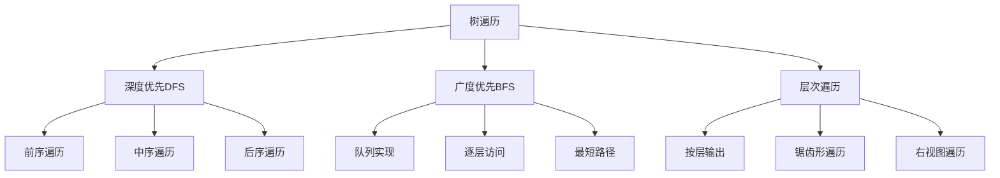

# 树的遍历算法

## 📖 核心概念

**树的遍历算法**是访问树中每个节点的重要方法。不同的遍历方式会产生不同的访问顺序，适用于不同的应用场景。

### 🏗️ 遍历方式分类



## 🔧 深度优先遍历

### 递归实现

```cpp
struct TreeNode {
    int val;
    TreeNode* left;
    TreeNode* right;
    TreeNode(int x) : val(x), left(nullptr), right(nullptr) {}
};

class TreeTraversal {
public:
    // 前序遍历：根-左-右
    vector<int> preorderTraversal(TreeNode* root) {
        vector<int> result;
        preorderHelper(root, result);
        return result;
    }
    
    void preorderHelper(TreeNode* node, vector<int>& result) {
        if (!node) return;
        
        result.push_back(node->val);  // 访问根节点
        preorderHelper(node->left, result);   // 遍历左子树
        preorderHelper(node->right, result);  // 遍历右子树
    }
    
    // 中序遍历：左-根-右
    vector<int> inorderTraversal(TreeNode* root) {
        vector<int> result;
        inorderHelper(root, result);
        return result;
    }
    
    void inorderHelper(TreeNode* node, vector<int>& result) {
        if (!node) return;
        
        inorderHelper(node->left, result);    // 遍历左子树
        result.push_back(node->val);         // 访问根节点
        inorderHelper(node->right, result);  // 遍历右子树
    }
    
    // 后序遍历：左-右-根
    vector<int> postorderTraversal(TreeNode* root) {
        vector<int> result;
        postorderHelper(root, result);
        return result;
    }
    
    void postorderHelper(TreeNode* node, vector<int>& result) {
        if (!node) return;
        
        postorderHelper(node->left, result);   // 遍历左子树
        postorderHelper(node->right, result);  // 遍历右子树
        result.push_back(node->val);          // 访问根节点
    }
};
```

### 迭代实现

```cpp
    // 前序遍历迭代实现
    vector<int> preorderTraversalIterative(TreeNode* root) {
        vector<int> result;
        if (!root) return result;
        
        stack<TreeNode*> stk;
        stk.push(root);
        
        while (!stk.empty()) {
            TreeNode* node = stk.top();
            stk.pop();
            
            result.push_back(node->val);
            
            // 先压入右子树，再压入左子树
            if (node->right) stk.push(node->right);
            if (node->left) stk.push(node->left);
        }
        
        return result;
    }
    
    // 中序遍历迭代实现
    vector<int> inorderTraversalIterative(TreeNode* root) {
        vector<int> result;
        stack<TreeNode*> stk;
        TreeNode* current = root;
        
        while (current || !stk.empty()) {
            // 一直向左走到底
            while (current) {
                stk.push(current);
                current = current->left;
            }
            
            // 访问节点
            current = stk.top();
            stk.pop();
            result.push_back(current->val);
            
            // 转向右子树
            current = current->right;
        }
        
        return result;
    }
    
    // 后序遍历迭代实现
    vector<int> postorderTraversalIterative(TreeNode* root) {
        vector<int> result;
        if (!root) return result;
        
        stack<TreeNode*> stk;
        TreeNode* lastVisited = nullptr;
        TreeNode* current = root;
        
        while (current || !stk.empty()) {
            if (current) {
                stk.push(current);
                current = current->left;
            } else {
                TreeNode* peekNode = stk.top();
                
                // 如果右子树存在且未被访问
                if (peekNode->right && lastVisited != peekNode->right) {
                    current = peekNode->right;
                } else {
                    result.push_back(peekNode->val);
                    lastVisited = stk.top();
                    stk.pop();
                }
            }
        }
        
        return result;
    }
```

## 🌊 广度优先遍历

### 层次遍历

```cpp
    // 层次遍历
    vector<vector<int>> levelOrder(TreeNode* root) {
        vector<vector<int>> result;
        if (!root) return result;
        
        queue<TreeNode*> q;
        q.push(root);
        
        while (!q.empty()) {
            int levelSize = q.size();
            vector<int> level;
            
            for (int i = 0; i < levelSize; ++i) {
                TreeNode* node = q.front();
                q.pop();
                
                level.push_back(node->val);
                
                if (node->left) q.push(node->left);
                if (node->right) q.push(node->right);
            }
            
            result.push_back(level);
        }
        
        return result;
    }
    
    // 锯齿形层次遍历
    vector<vector<int>> zigzagLevelOrder(TreeNode* root) {
        vector<vector<int>> result;
        if (!root) return result;
        
        queue<TreeNode*> q;
        q.push(root);
        bool leftToRight = true;
        
        while (!q.empty()) {
            int levelSize = q.size();
            vector<int> level(levelSize);
            
            for (int i = 0; i < levelSize; ++i) {
                TreeNode* node = q.front();
                q.pop();
                
                int index = leftToRight ? i : levelSize - 1 - i;
                level[index] = node->val;
                
                if (node->left) q.push(node->left);
                if (node->right) q.push(node->right);
            }
            
            result.push_back(level);
            leftToRight = !leftToRight;
        }
        
        return result;
    }
    
    // 右视图遍历
    vector<int> rightSideView(TreeNode* root) {
        vector<int> result;
        if (!root) return result;
        
        queue<TreeNode*> q;
        q.push(root);
        
        while (!q.empty()) {
            int levelSize = q.size();
            
            for (int i = 0; i < levelSize; ++i) {
                TreeNode* node = q.front();
                q.pop();
                
                // 每层的最后一个节点
                if (i == levelSize - 1) {
                    result.push_back(node->val);
                }
                
                if (node->left) q.push(node->left);
                if (node->right) q.push(node->right);
            }
        }
        
        return result;
    }
```

## 🎯 特殊遍历

### 1. 垂直遍历

```cpp
    // 垂直遍历
    vector<vector<int>> verticalTraversal(TreeNode* root) {
        vector<vector<int>> result;
        if (!root) return result;
        
        map<int, vector<pair<int, int>>> columnMap;  // column -> [(row, val)]
        
        verticalTraversalHelper(root, 0, 0, columnMap);
        
        for (auto& [col, nodes] : columnMap) {
            sort(nodes.begin(), nodes.end());
            vector<int> column;
            for (auto& [row, val] : nodes) {
                column.push_back(val);
            }
            result.push_back(column);
        }
        
        return result;
    }
    
    void verticalTraversalHelper(TreeNode* node, int row, int col, 
                                map<int, vector<pair<int, int>>>& columnMap) {
        if (!node) return;
        
        columnMap[col].push_back({row, node->val});
        
        verticalTraversalHelper(node->left, row + 1, col - 1, columnMap);
        verticalTraversalHelper(node->right, row + 1, col + 1, columnMap);
    }
```

### 2. 边界遍历

```cpp
    // 边界遍历
    vector<int> boundaryTraversal(TreeNode* root) {
        vector<int> result;
        if (!root) return result;
        
        result.push_back(root->val);
        
        // 左边界
        leftBoundary(root->left, result);
        
        // 叶子节点
        leaves(root, result);
        
        // 右边界
        rightBoundary(root->right, result);
        
        return result;
    }
    
    void leftBoundary(TreeNode* node, vector<int>& result) {
        if (!node || (!node->left && !node->right)) return;
        
        result.push_back(node->val);
        
        if (node->left) {
            leftBoundary(node->left, result);
        } else {
            leftBoundary(node->right, result);
        }
    }
    
    void rightBoundary(TreeNode* node, vector<int>& result) {
        if (!node || (!node->left && !node->right)) return;
        
        if (node->right) {
            rightBoundary(node->right, result);
        } else {
            rightBoundary(node->left, result);
        }
        
        result.push_back(node->val);
    }
    
    void leaves(TreeNode* node, vector<int>& result) {
        if (!node) return;
        
        if (!node->left && !node->right) {
            result.push_back(node->val);
            return;
        }
        
        leaves(node->left, result);
        leaves(node->right, result);
    }
```

## 📊 遍历应用

### 1. 路径和问题

```cpp
    // 路径总和
    bool hasPathSum(TreeNode* root, int targetSum) {
        if (!root) return false;
        
        if (!root->left && !root->right) {
            return root->val == targetSum;
        }
        
        int remainingSum = targetSum - root->val;
        return hasPathSum(root->left, remainingSum) || 
               hasPathSum(root->right, remainingSum);
    }
    
    // 路径总和II
    vector<vector<int>> pathSum(TreeNode* root, int targetSum) {
        vector<vector<int>> result;
        vector<int> path;
        pathSumHelper(root, targetSum, path, result);
        return result;
    }
    
    void pathSumHelper(TreeNode* node, int targetSum, vector<int>& path, 
                      vector<vector<int>>& result) {
        if (!node) return;
        
        path.push_back(node->val);
        
        if (!node->left && !node->right && node->val == targetSum) {
            result.push_back(path);
        }
        
        pathSumHelper(node->left, targetSum - node->val, path, result);
        pathSumHelper(node->right, targetSum - node->val, path, result);
        
        path.pop_back();
    }
```

### 2. 树的最大深度

```cpp
    // 最大深度
    int maxDepth(TreeNode* root) {
        if (!root) return 0;
        
        int leftDepth = maxDepth(root->left);
        int rightDepth = maxDepth(root->right);
        
        return max(leftDepth, rightDepth) + 1;
    }
    
    // 最小深度
    int minDepth(TreeNode* root) {
        if (!root) return 0;
        
        if (!root->left && !root->right) return 1;
        
        int leftDepth = root->left ? minDepth(root->left) : INT_MAX;
        int rightDepth = root->right ? minDepth(root->right) : INT_MAX;
        
        return min(leftDepth, rightDepth) + 1;
    }
```

## 🔗 相关链接

- [[01-树的基本概念|树的基本概念]]
- [[03-树的表示方法|树的表示方法]]
- [[04-树的应用案例|树的应用案例]]

## 💡 遍历要点

1. **递归实现**：代码简洁，易于理解
2. **迭代实现**：避免栈溢出，性能更好
3. **应用场景**：不同遍历方式适用于不同问题
4. **复杂度**：时间复杂度O(n)，空间复杂度O(h)

---

*📝 遍历提示：掌握树的遍历是理解树算法的基础，多练习提高熟练度*
