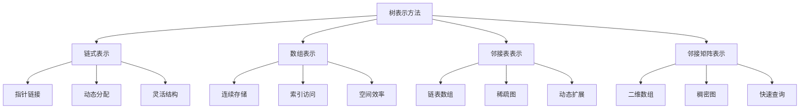

# 树的表示方法

## 📖 核心概念

**树的表示方法**是存储和操作树结构的基础。不同的表示方法适用于不同的应用场景，各有优缺点。

### 🏗️ 表示方法分类



## 🔧 链式表示

### 基础节点结构

```cpp
// 二叉树节点
struct BinaryTreeNode {
    int data;
    BinaryTreeNode* left;
    BinaryTreeNode* right;
    
    BinaryTreeNode(int val) : data(val), left(nullptr), right(nullptr) {}
};

// 多叉树节点
struct MultiTreeNode {
    int data;
    vector<MultiTreeNode*> children;
    
    MultiTreeNode(int val) : data(val) {}
};

// 带父指针的节点
struct TreeNodeWithParent {
    int data;
    TreeNodeWithParent* left;
    TreeNodeWithParent* right;
    TreeNodeWithParent* parent;
    
    TreeNodeWithParent(int val) : data(val), left(nullptr), right(nullptr), parent(nullptr) {}
};
```

### 链式树操作

```cpp
class LinkedTree {
private:
    BinaryTreeNode* root;
    
public:
    LinkedTree() : root(nullptr) {}
    
    ~LinkedTree() {
        clear(root);
    }
    
    // 插入节点
    void insert(int value) {
        root = insertHelper(root, value);
    }
    
    BinaryTreeNode* insertHelper(BinaryTreeNode* node, int value) {
        if (!node) {
            return new BinaryTreeNode(value);
        }
        
        if (value < node->data) {
            node->left = insertHelper(node->left, value);
        } else if (value > node->data) {
            node->right = insertHelper(node->right, value);
        }
        
        return node;
    }
    
    // 查找节点
    BinaryTreeNode* search(int value) {
        return searchHelper(root, value);
    }
    
    BinaryTreeNode* searchHelper(BinaryTreeNode* node, int value) {
        if (!node || node->data == value) {
            return node;
        }
        
        if (value < node->data) {
            return searchHelper(node->left, value);
        } else {
            return searchHelper(node->right, value);
        }
    }
    
    // 删除节点
    void remove(int value) {
        root = removeHelper(root, value);
    }
    
    BinaryTreeNode* removeHelper(BinaryTreeNode* node, int value) {
        if (!node) return nullptr;
        
        if (value < node->data) {
            node->left = removeHelper(node->left, value);
        } else if (value > node->data) {
            node->right = removeHelper(node->right, value);
        } else {
            if (!node->left) {
                BinaryTreeNode* temp = node->right;
                delete node;
                return temp;
            } else if (!node->right) {
                BinaryTreeNode* temp = node->left;
                delete node;
                return temp;
            }
            
            BinaryTreeNode* minNode = findMin(node->right);
            node->data = minNode->data;
            node->right = removeHelper(node->right, minNode->data);
        }
        
        return node;
    }
    
    BinaryTreeNode* findMin(BinaryTreeNode* node) {
        while (node && node->left) {
            node = node->left;
        }
        return node;
    }
    
    void clear(BinaryTreeNode* node) {
        if (node) {
            clear(node->left);
            clear(node->right);
            delete node;
        }
    }
};
```

## 📊 数组表示

### 完全二叉树数组表示

```cpp
class ArrayTree {
private:
    vector<int> tree;
    
public:
    ArrayTree() {}
    
    // 插入节点
    void insert(int value) {
        tree.push_back(value);
    }
    
    // 获取父节点索引
    int getParent(int index) {
        if (index <= 0) return -1;
        return (index - 1) / 2;
    }
    
    // 获取左子节点索引
    int getLeftChild(int index) {
        int leftIndex = 2 * index + 1;
        return (leftIndex < tree.size()) ? leftIndex : -1;
    }
    
    // 获取右子节点索引
    int getRightChild(int index) {
        int rightIndex = 2 * index + 2;
        return (rightIndex < tree.size()) ? rightIndex : -1;
    }
    
    // 获取节点值
    int getValue(int index) {
        if (index < 0 || index >= tree.size()) {
            throw std::out_of_range("Index out of range");
        }
        return tree[index];
    }
    
    // 设置节点值
    void setValue(int index, int value) {
        if (index < 0 || index >= tree.size()) {
            throw std::out_of_range("Index out of range");
        }
        tree[index] = value;
    }
    
    // 堆化操作
    void heapifyUp(int index) {
        while (index > 0) {
            int parent = getParent(index);
            if (tree[index] <= tree[parent]) {
                break;
            }
            swap(tree[index], tree[parent]);
            index = parent;
        }
    }
    
    void heapifyDown(int index) {
        while (true) {
            int leftChild = getLeftChild(index);
            int rightChild = getRightChild(index);
            int largest = index;
            
            if (leftChild != -1 && tree[leftChild] > tree[largest]) {
                largest = leftChild;
            }
            
            if (rightChild != -1 && tree[rightChild] > tree[largest]) {
                largest = rightChild;
            }
            
            if (largest == index) {
                break;
            }
            
            swap(tree[index], tree[largest]);
            index = largest;
        }
    }
    
    // 构建堆
    void buildHeap() {
        for (int i = tree.size() / 2 - 1; i >= 0; --i) {
            heapifyDown(i);
        }
    }
    
    size_t size() const {
        return tree.size();
    }
    
    bool empty() const {
        return tree.empty();
    }
};
```

## 🌐 邻接表表示

### 图树表示

```cpp
class AdjacencyListTree {
private:
    vector<vector<int>> adjacencyList;
    int numNodes;
    
public:
    AdjacencyListTree(int n) : numNodes(n) {
        adjacencyList.resize(n);
    }
    
    // 添加边
    void addEdge(int from, int to) {
        if (from >= 0 && from < numNodes && to >= 0 && to < numNodes) {
            adjacencyList[from].push_back(to);
        }
    }
    
    // 删除边
    void removeEdge(int from, int to) {
        if (from >= 0 && from < numNodes) {
            auto it = find(adjacencyList[from].begin(), adjacencyList[from].end(), to);
            if (it != adjacencyList[from].end()) {
                adjacencyList[from].erase(it);
            }
        }
    }
    
    // 获取邻接节点
    vector<int> getNeighbors(int node) {
        if (node >= 0 && node < numNodes) {
            return adjacencyList[node];
        }
        return {};
    }
    
    // 深度优先搜索
    void dfs(int start, vector<bool>& visited) {
        visited[start] = true;
        cout << start << " ";
        
        for (int neighbor : adjacencyList[start]) {
            if (!visited[neighbor]) {
                dfs(neighbor, visited);
            }
        }
    }
    
    // 广度优先搜索
    void bfs(int start) {
        vector<bool> visited(numNodes, false);
        queue<int> q;
        
        visited[start] = true;
        q.push(start);
        
        while (!q.empty()) {
            int node = q.front();
            q.pop();
            cout << node << " ";
            
            for (int neighbor : adjacencyList[node]) {
                if (!visited[neighbor]) {
                    visited[neighbor] = true;
                    q.push(neighbor);
                }
            }
        }
    }
    
    // 检查是否为树
    bool isTree() {
        if (numNodes == 0) return true;
        
        vector<bool> visited(numNodes, false);
        
        // 检查连通性
        dfs(0, visited);
        for (bool v : visited) {
            if (!v) return false;
        }
        
        // 检查是否有环
        vector<bool> recStack(numNodes, false);
        return !hasCycle(0, visited, recStack);
    }
    
private:
    bool hasCycle(int node, vector<bool>& visited, vector<bool>& recStack) {
        visited[node] = true;
        recStack[node] = true;
        
        for (int neighbor : adjacencyList[node]) {
            if (!visited[neighbor]) {
                if (hasCycle(neighbor, visited, recStack)) {
                    return true;
                }
            } else if (recStack[neighbor]) {
                return true;
            }
        }
        
        recStack[node] = false;
        return false;
    }
};
```

## 🔗 邻接矩阵表示

### 矩阵树表示

```cpp
class AdjacencyMatrixTree {
private:
    vector<vector<int>> matrix;
    int numNodes;
    
public:
    AdjacencyMatrixTree(int n) : numNodes(n) {
        matrix.resize(n, vector<int>(n, 0));
    }
    
    // 添加边
    void addEdge(int from, int to, int weight = 1) {
        if (from >= 0 && from < numNodes && to >= 0 && to < numNodes) {
            matrix[from][to] = weight;
        }
    }
    
    // 删除边
    void removeEdge(int from, int to) {
        if (from >= 0 && from < numNodes && to >= 0 && to < numNodes) {
            matrix[from][to] = 0;
        }
    }
    
    // 检查边是否存在
    bool hasEdge(int from, int to) {
        if (from >= 0 && from < numNodes && to >= 0 && to < numNodes) {
            return matrix[from][to] != 0;
        }
        return false;
    }
    
    // 获取边的权重
    int getWeight(int from, int to) {
        if (from >= 0 && from < numNodes && to >= 0 && to < numNodes) {
            return matrix[from][to];
        }
        return 0;
    }
    
    // 获取所有邻接节点
    vector<int> getNeighbors(int node) {
        vector<int> neighbors;
        if (node >= 0 && node < numNodes) {
            for (int i = 0; i < numNodes; ++i) {
                if (matrix[node][i] != 0) {
                    neighbors.push_back(i);
                }
            }
        }
        return neighbors;
    }
    
    // 计算节点度数
    int getDegree(int node) {
        int degree = 0;
        if (node >= 0 && node < numNodes) {
            for (int i = 0; i < numNodes; ++i) {
                if (matrix[node][i] != 0) degree++;
                if (matrix[i][node] != 0) degree++;
            }
        }
        return degree;
    }
    
    // 打印矩阵
    void printMatrix() {
        for (int i = 0; i < numNodes; ++i) {
            for (int j = 0; j < numNodes; ++j) {
                cout << matrix[i][j] << " ";
            }
            cout << endl;
        }
    }
    
    // 转置矩阵
    void transpose() {
        for (int i = 0; i < numNodes; ++i) {
            for (int j = i + 1; j < numNodes; ++j) {
                swap(matrix[i][j], matrix[j][i]);
            }
        }
    }
};
```

## 📊 表示方法对比

### 性能对比表

| 表示方法 | 空间复杂度 | 查找边 | 添加边 | 删除边 | 遍历邻接点 | 适用场景 |
|----------|------------|--------|--------|--------|------------|----------|
| **链式表示** | O(n) | O(h) | O(h) | O(h) | O(1) | 二叉树、搜索树 |
| **数组表示** | O(n) | O(1) | O(1) | O(1) | O(1) | 完全二叉树、堆 |
| **邻接表** | O(V+E) | O(V) | O(1) | O(V) | O(degree) | 稀疏图、树 |
| **邻接矩阵** | O(V²) | O(1) | O(1) | O(1) | O(V) | 稠密图、小图 |

### 选择建议

```cpp
class TreeRepresentationSelector {
public:
    string selectRepresentation(int numNodes, int numEdges, bool isBinaryTree) {
        if (isBinaryTree) {
            return "链式表示";  // 二叉树最适合链式表示
        }
        
        if (numNodes < 100) {
            return "邻接矩阵";  // 小图用矩阵
        }
        
        double density = (double)numEdges / (numNodes * (numNodes - 1));
        if (density > 0.5) {
            return "邻接矩阵";  // 稠密图用矩阵
        } else {
            return "邻接表";    // 稀疏图用邻接表
        }
    }
};
```

## 🔗 相关链接

- [[01-树的基本概念|树的基本概念]]
- [[02-树的遍历算法|树的遍历]]
- [[04-树的应用案例|树的应用]]

## 💡 表示方法要点

1. **链式表示**：适合二叉树，操作灵活
2. **数组表示**：适合完全二叉树，访问快速
3. **邻接表**：适合稀疏图，空间效率高
4. **邻接矩阵**：适合稠密图，操作简单

---

*📝 选择提示：根据具体应用场景选择合适的树表示方法，平衡空间和时间效率*
