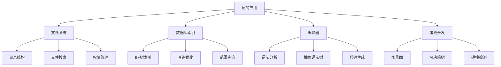

# 树的应用案例

## 📖 核心概念

**树的应用案例**展示了树结构在实际编程中的广泛应用。通过具体的应用场景，我们可以更好地理解树的优势和实现技巧。

### 🏗️ 应用领域分类



## 📁 文件系统实现

### 目录树结构

```cpp
class FileSystem {
private:
    struct FileNode {
        string name;
        bool isDirectory;
        string content;
        FileNode* parent;
        map<string, FileNode*> children;
        time_t createTime;
        time_t modifyTime;
        
        FileNode(string n, bool isDir, FileNode* p = nullptr) 
            : name(n), isDirectory(isDir), parent(p) {
            createTime = modifyTime = time(nullptr);
        }
    };
    
    FileNode* root;
    FileNode* current;
    
public:
    FileSystem() {
        root = new FileNode("/", true);
        current = root;
    }
    
    ~FileSystem() {
        deleteTree(root);
    }
    
    // 创建目录
    bool mkdir(string path) {
        vector<string> parts = splitPath(path);
        FileNode* parent = navigateToParent(parts);
        
        if (!parent) return false;
        
        string dirName = parts.back();
        if (parent->children.find(dirName) != parent->children.end()) {
            return false;  // 目录已存在
        }
        
        FileNode* newDir = new FileNode(dirName, true, parent);
        parent->children[dirName] = newDir;
        parent->modifyTime = time(nullptr);
        
        return true;
    }
    
    // 创建文件
    bool createFile(string path, string content) {
        vector<string> parts = splitPath(path);
        FileNode* parent = navigateToParent(parts);
        
        if (!parent) return false;
        
        string fileName = parts.back();
        if (parent->children.find(fileName) != parent->children.end()) {
            return false;  // 文件已存在
        }
        
        FileNode* newFile = new FileNode(fileName, false, parent);
        newFile->content = content;
        parent->children[fileName] = newFile;
        parent->modifyTime = time(nullptr);
        
        return true;
    }
    
    // 读取文件
    string readFile(string path) {
        FileNode* file = findNode(path);
        if (file && !file->isDirectory) {
            return file->content;
        }
        return "";
    }
    
    // 写入文件
    bool writeFile(string path, string content) {
        FileNode* file = findNode(path);
        if (file && !file->isDirectory) {
            file->content = content;
            file->modifyTime = time(nullptr);
            return true;
        }
        return false;
    }
    
    // 列出目录内容
    vector<string> listDirectory(string path = "") {
        vector<string> result;
        FileNode* target = path.empty() ? current : findNode(path);
        
        if (target && target->isDirectory) {
            for (auto& [name, node] : target->children) {
                result.push_back(name);
            }
        }
        
        return result;
    }
    
    // 删除文件或目录
    bool remove(string path) {
        FileNode* node = findNode(path);
        if (!node || node == root) return false;
        
        FileNode* parent = node->parent;
        parent->children.erase(node->name);
        parent->modifyTime = time(nullptr);
        
        deleteTree(node);
        return true;
    }
    
    // 移动文件或目录
    bool move(string fromPath, string toPath) {
        FileNode* source = findNode(fromPath);
        FileNode* targetParent = navigateToParent(splitPath(toPath));
        
        if (!source || !targetParent || source == root) return false;
        
        string newName = splitPath(toPath).back();
        
        // 从原位置删除
        source->parent->children.erase(source->name);
        
        // 添加到新位置
        source->name = newName;
        source->parent = targetParent;
        targetParent->children[newName] = source;
        
        return true;
    }
    
    // 搜索文件
    vector<string> search(string pattern) {
        vector<string> result;
        searchHelper(root, pattern, "", result);
        return result;
    }
    
private:
    vector<string> splitPath(string path) {
        vector<string> parts;
        stringstream ss(path);
        string part;
        
        while (getline(ss, part, '/')) {
            if (!part.empty()) {
                parts.push_back(part);
            }
        }
        
        return parts;
    }
    
    FileNode* navigateToParent(vector<string>& parts) {
        if (parts.empty()) return nullptr;
        
        FileNode* current = root;
        
        for (size_t i = 0; i < parts.size() - 1; i++) {
            auto it = current->children.find(parts[i]);
            if (it == current->children.end() || !it->second->isDirectory) {
                return nullptr;
            }
            current = it->second;
        }
        
        return current;
    }
    
    FileNode* findNode(string path) {
        vector<string> parts = splitPath(path);
        FileNode* current = root;
        
        for (string part : parts) {
            auto it = current->children.find(part);
            if (it == current->children.end()) {
                return nullptr;
            }
            current = it->second;
        }
        
        return current;
    }
    
    void searchHelper(FileNode* node, string pattern, string currentPath, vector<string>& result) {
        if (!node) return;
        
        string fullPath = currentPath + "/" + node->name;
        
        if (node->name.find(pattern) != string::npos) {
            result.push_back(fullPath);
        }
        
        for (auto& [name, child] : node->children) {
            searchHelper(child, pattern, fullPath, result);
        }
    }
    
    void deleteTree(FileNode* node) {
        if (!node) return;
        
        for (auto& [name, child] : node->children) {
            deleteTree(child);
        }
        
        delete node;
    }
};
```

## 🗄️ 数据库索引实现

### B+树索引

```cpp
class BPlusTree {
private:
    struct Node {
        bool isLeaf;
        vector<int> keys;
        vector<Node*> children;  // 非叶子节点
        vector<string> values;   // 叶子节点
        Node* next;              // 叶子节点链表
        Node* parent;
        
        Node(bool leaf = false) : isLeaf(leaf), next(nullptr), parent(nullptr) {}
    };
    
    Node* root;
    int order;  // 树的阶数
    
public:
    BPlusTree(int o = 3) : root(nullptr), order(o) {}
    
    ~BPlusTree() {
        deleteTree(root);
    }
    
    // 插入键值对
    void insert(int key, string value) {
        if (!root) {
            root = new Node(true);
            root->keys.push_back(key);
            root->values.push_back(value);
            return;
        }
        
        Node* leaf = findLeaf(key);
        insertIntoLeaf(leaf, key, value);
        
        if (leaf->keys.size() > order) {
            splitLeaf(leaf);
        }
    }
    
    // 查找值
    string search(int key) {
        Node* leaf = findLeaf(key);
        
        for (size_t i = 0; i < leaf->keys.size(); ++i) {
            if (leaf->keys[i] == key) {
                return leaf->values[i];
            }
        }
        
        return "";
    }
    
    // 范围查询
    vector<string> rangeQuery(int startKey, int endKey) {
        vector<string> result;
        Node* leaf = findLeaf(startKey);
        
        while (leaf) {
            for (size_t i = 0; i < leaf->keys.size(); ++i) {
                if (leaf->keys[i] >= startKey && leaf->keys[i] <= endKey) {
                    result.push_back(leaf->values[i]);
                } else if (leaf->keys[i] > endKey) {
                    return result;
                }
            }
            leaf = leaf->next;
        }
        
        return result;
    }
    
    // 删除键
    bool remove(int key) {
        Node* leaf = findLeaf(key);
        
        for (size_t i = 0; i < leaf->keys.size(); ++i) {
            if (leaf->keys[i] == key) {
                leaf->keys.erase(leaf->keys.begin() + i);
                leaf->values.erase(leaf->values.begin() + i);
                
                if (leaf != root && leaf->keys.size() < (order + 1) / 2) {
                    mergeOrBorrow(leaf);
                }
                
                return true;
            }
        }
        
        return false;
    }
    
private:
    Node* findLeaf(int key) {
        Node* current = root;
        
        while (!current->isLeaf) {
            size_t i = 0;
            while (i < current->keys.size() && key >= current->keys[i]) {
                ++i;
            }
            current = current->children[i];
        }
        
        return current;
    }
    
    void insertIntoLeaf(Node* leaf, int key, string value) {
        size_t i = 0;
        while (i < leaf->keys.size() && leaf->keys[i] < key) {
            ++i;
        }
        
        leaf->keys.insert(leaf->keys.begin() + i, key);
        leaf->values.insert(leaf->values.begin() + i, value);
    }
    
    void splitLeaf(Node* leaf) {
        Node* newLeaf = new Node(true);
        int mid = leaf->keys.size() / 2;
        
        // 移动后半部分到新节点
        newLeaf->keys.assign(leaf->keys.begin() + mid, leaf->keys.end());
        newLeaf->values.assign(leaf->values.begin() + mid, leaf->values.end());
        
        leaf->keys.erase(leaf->keys.begin() + mid, leaf->keys.end());
        leaf->values.erase(leaf->values.begin() + mid, leaf->values.end());
        
        // 更新链表
        newLeaf->next = leaf->next;
        leaf->next = newLeaf;
        newLeaf->parent = leaf->parent;
        
        // 更新父节点
        if (leaf->parent) {
            insertIntoInternal(leaf->parent, newLeaf->keys[0], newLeaf);
        } else {
            Node* newRoot = new Node(false);
            newRoot->keys.push_back(newLeaf->keys[0]);
            newRoot->children.push_back(leaf);
            newRoot->children.push_back(newLeaf);
            leaf->parent = newRoot;
            newLeaf->parent = newRoot;
            root = newRoot;
        }
    }
    
    void insertIntoInternal(Node* node, int key, Node* child) {
        size_t i = 0;
        while (i < node->keys.size() && node->keys[i] < key) {
            ++i;
        }
        
        node->keys.insert(node->keys.begin() + i, key);
        node->children.insert(node->children.begin() + i + 1, child);
        child->parent = node;
        
        if (node->keys.size() > order) {
            splitInternal(node);
        }
    }
    
    void splitInternal(Node* node) {
        Node* newInternal = new Node(false);
        int mid = node->keys.size() / 2;
        
        // 移动后半部分到新节点
        newInternal->keys.assign(node->keys.begin() + mid + 1, node->keys.end());
        newInternal->children.assign(node->children.begin() + mid + 1, node->children.end());
        
        int promoteKey = node->keys[mid];
        node->keys.erase(node->keys.begin() + mid, node->keys.end());
        node->children.erase(node->children.begin() + mid + 1, node->children.end());
        
        // 更新子节点的父指针
        for (Node* child : newInternal->children) {
            child->parent = newInternal;
        }
        
        // 更新父节点
        if (node->parent) {
            insertIntoInternal(node->parent, promoteKey, newInternal);
        } else {
            Node* newRoot = new Node(false);
            newRoot->keys.push_back(promoteKey);
            newRoot->children.push_back(node);
            newRoot->children.push_back(newInternal);
            node->parent = newRoot;
            newInternal->parent = newRoot;
            root = newRoot;
        }
    }
    
    void mergeOrBorrow(Node* leaf) {
        // 简化的合并和借用逻辑
        // 实际实现需要处理更多边界情况
    }
    
    void deleteTree(Node* node) {
        if (!node) return;
        
        if (!node->isLeaf) {
            for (Node* child : node->children) {
                deleteTree(child);
            }
        }
        
        delete node;
    }
};
```

## 🎮 游戏开发应用

### 场景图管理

```cpp
class SceneGraph {
private:
    struct SceneNode {
        string name;
        Vector3 position;
        Vector3 rotation;
        Vector3 scale;
        SceneNode* parent;
        vector<SceneNode*> children;
        bool visible;
        
        SceneNode(string n) : name(n), position(0, 0, 0), rotation(0, 0, 0), 
                             scale(1, 1, 1), parent(nullptr), visible(true) {}
    };
    
    SceneNode* root;
    
public:
    SceneGraph() {
        root = new SceneNode("Root");
    }
    
    ~SceneGraph() {
        deleteTree(root);
    }
    
    // 添加节点
    SceneNode* addNode(string name, SceneNode* parent = nullptr) {
        if (!parent) parent = root;
        
        SceneNode* newNode = new SceneNode(name);
        newNode->parent = parent;
        parent->children.push_back(newNode);
        
        return newNode;
    }
    
    // 移除节点
    bool removeNode(string name) {
        SceneNode* node = findNode(name);
        if (!node || node == root) return false;
        
        // 从父节点中移除
        auto& siblings = node->parent->children;
        siblings.erase(remove(siblings.begin(), siblings.end(), node), siblings.end());
        
        deleteTree(node);
        return true;
    }
    
    // 查找节点
    SceneNode* findNode(string name) {
        return findNodeHelper(root, name);
    }
    
    // 更新变换矩阵
    Matrix4 getWorldMatrix(SceneNode* node) {
        Matrix4 matrix = Matrix4::Identity();
        
        while (node && node != root) {
            Matrix4 localMatrix = Matrix4::Translation(node->position) *
                                 Matrix4::Rotation(node->rotation) *
                                 Matrix4::Scale(node->scale);
            matrix = localMatrix * matrix;
            node = node->parent;
        }
        
        return matrix;
    }
    
    // 渲染场景
    void render() {
        renderNode(root, Matrix4::Identity());
    }
    
    // 碰撞检测
    vector<SceneNode*> collisionDetection(Vector3 point, float radius) {
        vector<SceneNode*> result;
        collisionDetectionHelper(root, point, radius, result);
        return result;
    }
    
private:
    SceneNode* findNodeHelper(SceneNode* node, string name) {
        if (node->name == name) return node;
        
        for (SceneNode* child : node->children) {
            SceneNode* found = findNodeHelper(child, name);
            if (found) return found;
        }
        
        return nullptr;
    }
    
    void renderNode(SceneNode* node, Matrix4 parentMatrix) {
        if (!node->visible) return;
        
        Matrix4 worldMatrix = getWorldMatrix(node) * parentMatrix;
        
        // 渲染当前节点
        renderObject(node, worldMatrix);
        
        // 渲染子节点
        for (SceneNode* child : node->children) {
            renderNode(child, worldMatrix);
        }
    }
    
    void renderObject(SceneNode* node, Matrix4 matrix) {
        // 实际的渲染逻辑
        cout << "Rendering " << node->name << " at matrix " << matrix.toString() << endl;
    }
    
    void collisionDetectionHelper(SceneNode* node, Vector3 point, float radius, 
                                 vector<SceneNode*>& result) {
        if (!node->visible) return;
        
        // 简化的碰撞检测
        Vector3 nodePos = getWorldPosition(node);
        float distance = (point - nodePos).length();
        
        if (distance <= radius) {
            result.push_back(node);
        }
        
        for (SceneNode* child : node->children) {
            collisionDetectionHelper(child, point, radius, result);
        }
    }
    
    Vector3 getWorldPosition(SceneNode* node) {
        Vector3 position = node->position;
        SceneNode* parent = node->parent;
        
        while (parent && parent != root) {
            position = parent->position + position;
            parent = parent->parent;
        }
        
        return position;
    }
    
    void deleteTree(SceneNode* node) {
        if (!node) return;
        
        for (SceneNode* child : node->children) {
            deleteTree(child);
        }
        
        delete node;
    }
};

// 简化的向量和矩阵类
struct Vector3 {
    float x, y, z;
    Vector3(float x = 0, float y = 0, float z = 0) : x(x), y(y), z(z) {}
    
    Vector3 operator+(const Vector3& other) const {
        return Vector3(x + other.x, y + other.y, z + other.z);
    }
    
    Vector3 operator-(const Vector3& other) const {
        return Vector3(x - other.x, y - other.y, z - other.z);
    }
    
    float length() const {
        return sqrt(x * x + y * y + z * z);
    }
};

struct Matrix4 {
    float data[16];
    
    Matrix4() {
        for (int i = 0; i < 16; ++i) {
            data[i] = (i % 5 == 0) ? 1.0f : 0.0f;
        }
    }
    
    static Matrix4 Identity() {
        return Matrix4();
    }
    
    static Matrix4 Translation(const Vector3& pos) {
        Matrix4 m = Identity();
        m.data[12] = pos.x;
        m.data[13] = pos.y;
        m.data[14] = pos.z;
        return m;
    }
    
    static Matrix4 Rotation(const Vector3& rot) {
        // 简化的旋转矩阵
        return Identity();
    }
    
    static Matrix4 Scale(const Vector3& scale) {
        Matrix4 m = Identity();
        m.data[0] = scale.x;
        m.data[5] = scale.y;
        m.data[10] = scale.z;
        return m;
    }
    
    Matrix4 operator*(const Matrix4& other) const {
        Matrix4 result;
        for (int i = 0; i < 4; ++i) {
            for (int j = 0; j < 4; ++j) {
                result.data[i * 4 + j] = 0;
                for (int k = 0; k < 4; ++k) {
                    result.data[i * 4 + j] += data[i * 4 + k] * other.data[k * 4 + j];
                }
            }
        }
        return result;
    }
    
    string toString() const {
        return "Matrix4";
    }
};
```

## 🔗 相关链接

- [[01-树的基本概念|树的基本概念]]
- [[02-树的遍历算法|树的遍历]]
- [[03-树的表示方法|树的表示]]

## 💡 应用要点

1. **文件系统**：树结构天然适合层次化组织
2. **数据库索引**：B+树提供高效的范围查询
3. **场景图**：树结构管理复杂的3D场景
4. **选择原则**：根据数据特性和操作需求选择树类型

---

*📝 应用提示：树结构是许多复杂系统的基础，掌握其应用有助于设计高效的系统*
