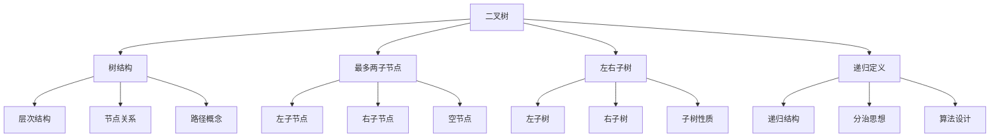

# 🌳 二叉树基础

## 🎯 核心定义

**二叉树（Binary Tree）**是每个节点最多有两个子节点的树结构，是树结构中最重要和常用的类型。

### 🔍 本质理解
二叉树 = 树结构 + 最多两子节点 + 左右子树 + 递归定义



---

## 🏗️ 二叉树的基本性质

### 📊 性质分析表

| 性质 | 描述 | 数学表达 | 应用 |
|------|------|----------|------|
| **最多两子节点** | 每个节点最多有2个子节点 | 度数 ≤ 2 | 简化结构 |
| **左右子树** | 子节点分为左子树和右子树 | 有序结构 | 支持有序操作 |
| **递归结构** | 子树也是二叉树 | 递归定义 | 递归算法 |
| **n个节点n-1条边** | 节点数与边数关系 | |E| = |V| - 1 | 树的基本性质 |

### 🎯 二叉树的类型

#### 📊 按结构分类
| 类型 | 定义 | 特点 | 应用 |
|------|------|------|------|
| **满二叉树** | 所有层都完全填充 | 节点数最多、结构规整 | 完美平衡 |
| **完全二叉树** | 除最后一层外完全填充 | 数组存储、计算简单 | 堆结构 |
| **平衡二叉树** | 左右子树高度差≤1 | 查找效率高、操作稳定 | AVL树、红黑树 |
| **二叉搜索树** | 左子树<根<右子树 | 有序结构、查找高效 | 排序、查找 |

#### 📊 按用途分类
| 类型 | 特点 | 时间复杂度 | 应用场景 |
|------|------|------------|----------|
| **普通二叉树** | 无特殊约束 | 查找O(n) | 一般树结构 |
| **二叉搜索树** | 有序结构 | 查找O(log n) | 排序、查找 |
| **堆** | 堆序性质 | 插入删除O(log n) | 优先队列 |
| **表达式树** | 表达式表示 | 计算O(n) | 表达式求值 |

---

## 💻 二叉树的实现

### 🔧 节点结构

#### 📋 基本节点定义
```cpp
template<typename T>
struct BinaryTreeNode {
    T data;                           // 数据域
    BinaryTreeNode<T>* left;          // 左子节点
    BinaryTreeNode<T>* right;         // 右子节点
    
    // 构造函数
    BinaryTreeNode() : left(nullptr), right(nullptr) {}
    BinaryTreeNode(const T& value) : data(value), left(nullptr), right(nullptr) {}
    BinaryTreeNode(const T& value, BinaryTreeNode<T>* leftChild, BinaryTreeNode<T>* rightChild)
        : data(value), left(leftChild), right(rightChild) {}
    
    // 析构函数
    ~BinaryTreeNode() {
        // 注意：这里不删除子节点，由树类管理
    }
};
```

#### 🎯 节点操作
```cpp
template<typename T>
class BinaryTreeNode {
public:
    // 检查是否为叶子节点
    bool isLeaf() const {
        return left == nullptr && right == nullptr;
    }
    
    // 检查是否有左子节点
    bool hasLeftChild() const {
        return left != nullptr;
    }
    
    // 检查是否有右子节点
    bool hasRightChild() const {
        return right != nullptr;
    }
    
    // 获取子节点数量
    int getChildCount() const {
        int count = 0;
        if (left) count++;
        if (right) count++;
        return count;
    }
};
```

### 🔧 二叉树类

#### 📋 类定义
```cpp
template<typename T>
class BinaryTree {
private:
    BinaryTreeNode<T>* root;          // 根节点
    int size;                         // 节点数量
    
public:
    // 构造和析构
    BinaryTree();
    ~BinaryTree();
    
    // 基本操作
    void insert(const T& value);
    bool remove(const T& value);
    bool contains(const T& value) const;
    T find(const T& value) const;
    
    // 遍历操作
    void preOrderTraversal() const;
    void inOrderTraversal() const;
    void postOrderTraversal() const;
    void levelOrderTraversal() const;
    
    // 查询操作
    bool isEmpty() const;
    int getSize() const;
    int getHeight() const;
    int getDepth(BinaryTreeNode<T>* node) const;
    
    // 工具操作
    void clear();
    void display() const;
    BinaryTreeNode<T>* getRoot() const;
};
```

#### 🎯 核心操作实现

##### 📖 构造和析构
```cpp
template<typename T>
BinaryTree<T>::BinaryTree() : root(nullptr), size(0) {}

template<typename T>
BinaryTree<T>::~BinaryTree() {
    clear();
}

template<typename T>
void BinaryTree<T>::clear() {
    clearHelper(root);
    root = nullptr;
    size = 0;
}

template<typename T>
void BinaryTree<T>::clearHelper(BinaryTreeNode<T>* node) {
    if (node == nullptr) return;
    
    clearHelper(node->left);
    clearHelper(node->right);
    delete node;
}
```

##### ➕ 插入操作
```cpp
template<typename T>
void BinaryTree<T>::insert(const T& value) {
    if (root == nullptr) {
        root = new BinaryTreeNode<T>(value);
        size = 1;
        return;
    }
    
    // 使用队列进行层序遍历插入
    queue<BinaryTreeNode<T>*> q;
    q.push(root);
    
    while (!q.empty()) {
        BinaryTreeNode<T>* current = q.front();
        q.pop();
        
        if (current->left == nullptr) {
            current->left = new BinaryTreeNode<T>(value);
            size++;
            return;
        } else if (current->right == nullptr) {
            current->right = new BinaryTreeNode<T>(value);
            size++;
            return;
        } else {
            q.push(current->left);
            q.push(current->right);
        }
    }
}
```

##### 🔍 查找操作
```cpp
template<typename T>
bool BinaryTree<T>::contains(const T& value) const {
    return containsHelper(root, value);
}

template<typename T>
bool BinaryTree<T>::containsHelper(BinaryTreeNode<T>* node, const T& value) const {
    if (node == nullptr) return false;
    
    if (node->data == value) return true;
    
    return containsHelper(node->left, value) || containsHelper(node->right, value);
}
```

---

## 🔍 二叉树的遍历

### 📊 遍历方式对比

| 遍历方式 | 访问顺序 | 时间复杂度 | 空间复杂度 | 应用场景 |
|----------|----------|------------|------------|----------|
| **前序遍历** | 根→左→右 | O(n) | O(h) | 复制树结构 |
| **中序遍历** | 左→根→右 | O(n) | O(h) | 有序输出 |
| **后序遍历** | 左→右→根 | O(n) | O(h) | 删除树结构 |
| **层序遍历** | 逐层访问 | O(n) | O(w) | 广度优先搜索 |

### 🎯 递归实现

#### 📋 前序遍历
```cpp
template<typename T>
void BinaryTree<T>::preOrderTraversal() const {
    preOrderHelper(root);
    cout << endl;
}

template<typename T>
void BinaryTree<T>::preOrderHelper(BinaryTreeNode<T>* node) const {
    if (node == nullptr) return;
    
    cout << node->data << " ";      // 访问根节点
    preOrderHelper(node->left);     // 遍历左子树
    preOrderHelper(node->right);    // 遍历右子树
}
```

#### 📋 中序遍历
```cpp
template<typename T>
void BinaryTree<T>::inOrderTraversal() const {
    inOrderHelper(root);
    cout << endl;
}

template<typename T>
void BinaryTree<T>::inOrderHelper(BinaryTreeNode<T>* node) const {
    if (node == nullptr) return;
    
    inOrderHelper(node->left);      // 遍历左子树
    cout << node->data << " ";      // 访问根节点
    inOrderHelper(node->right);     // 遍历右子树
}
```

#### 📋 后序遍历
```cpp
template<typename T>
void BinaryTree<T>::postOrderTraversal() const {
    postOrderHelper(root);
    cout << endl;
}

template<typename T>
void BinaryTree<T>::postOrderHelper(BinaryTreeNode<T>* node) const {
    if (node == nullptr) return;
    
    postOrderHelper(node->left);    // 遍历左子树
    postOrderHelper(node->right);   // 遍历右子树
    cout << node->data << " ";      // 访问根节点
}
```

### 🎯 迭代实现

#### 📋 前序遍历（迭代）
```cpp
template<typename T>
void BinaryTree<T>::preOrderIterative() const {
    if (root == nullptr) return;
    
    stack<BinaryTreeNode<T>*> st;
    st.push(root);
    
    while (!st.empty()) {
        BinaryTreeNode<T>* node = st.top();
        st.pop();
        
        cout << node->data << " ";
        
        // 先压入右子节点，再压入左子节点
        if (node->right) st.push(node->right);
        if (node->left) st.push(node->left);
    }
    cout << endl;
}
```

#### 📋 中序遍历（迭代）
```cpp
template<typename T>
void BinaryTree<T>::inOrderIterative() const {
    stack<BinaryTreeNode<T>*> st;
    BinaryTreeNode<T>* current = root;
    
    while (current != nullptr || !st.empty()) {
        // 一直向左走到底
        while (current != nullptr) {
            st.push(current);
            current = current->left;
        }
        
        // 弹出并访问
        current = st.top();
        st.pop();
        cout << current->data << " ";
        
        // 转向右子树
        current = current->right;
    }
    cout << endl;
}
```

#### 📋 层序遍历（迭代）
```cpp
template<typename T>
void BinaryTree<T>::levelOrderTraversal() const {
    if (root == nullptr) return;
    
    queue<BinaryTreeNode<T>*> q;
    q.push(root);
    
    while (!q.empty()) {
        BinaryTreeNode<T>* node = q.front();
        q.pop();
        
        cout << node->data << " ";
        
        if (node->left) q.push(node->left);
        if (node->right) q.push(node->right);
    }
    cout << endl;
}
```

---

## 📊 二叉树的计算操作

### 🎯 高度计算

#### 📋 递归实现
```cpp
template<typename T>
int BinaryTree<T>::getHeight() const {
    return getHeightHelper(root);
}

template<typename T>
int BinaryTree<T>::getHeightHelper(BinaryTreeNode<T>* node) const {
    if (node == nullptr) return -1;  // 空树高度为-1
    
    int leftHeight = getHeightHelper(node->left);
    int rightHeight = getHeightHelper(node->right);
    
    return max(leftHeight, rightHeight) + 1;
}
```

#### 📋 迭代实现
```cpp
template<typename T>
int BinaryTree<T>::getHeightIterative() const {
    if (root == nullptr) return -1;
    
    queue<BinaryTreeNode<T>*> q;
    q.push(root);
    int height = -1;
    
    while (!q.empty()) {
        int levelSize = q.size();
        height++;
        
        for (int i = 0; i < levelSize; i++) {
            BinaryTreeNode<T>* node = q.front();
            q.pop();
            
            if (node->left) q.push(node->left);
            if (node->right) q.push(node->right);
        }
    }
    
    return height;
}
```

### 🎯 节点计数

#### 📋 递归实现
```cpp
template<typename T>
int BinaryTree<T>::countNodes() const {
    return countNodesHelper(root);
}

template<typename T>
int BinaryTree<T>::countNodesHelper(BinaryTreeNode<T>* node) const {
    if (node == nullptr) return 0;
    
    return 1 + countNodesHelper(node->left) + countNodesHelper(node->right);
}
```

#### 📋 叶子节点计数
```cpp
template<typename T>
int BinaryTree<T>::countLeaves() const {
    return countLeavesHelper(root);
}

template<typename T>
int BinaryTree<T>::countLeavesHelper(BinaryTreeNode<T>* node) const {
    if (node == nullptr) return 0;
    
    if (node->isLeaf()) return 1;
    
    return countLeavesHelper(node->left) + countLeavesHelper(node->right);
}
```

---

## 🎯 二叉树的应用场景

### 📋 典型应用

#### 🔍 表达式树
- **表达式表示**：将表达式表示为树结构
- **表达式求值**：通过遍历计算表达式值
- **表达式转换**：中缀、前缀、后缀表达式转换

```cpp
class ExpressionTree {
private:
    BinaryTreeNode<string>* root;
    
public:
    ExpressionTree(const string& postfix) {
        root = buildFromPostfix(postfix);
    }
    
    BinaryTreeNode<string>* buildFromPostfix(const string& postfix) {
        stack<BinaryTreeNode<string>*> st;
        
        for (char c : postfix) {
            if (isdigit(c)) {
                st.push(new BinaryTreeNode<string>(string(1, c)));
            } else if (isOperator(c)) {
                BinaryTreeNode<string>* right = st.top(); st.pop();
                BinaryTreeNode<string>* left = st.top(); st.pop();
                
                BinaryTreeNode<string>* node = new BinaryTreeNode<string>(
                    string(1, c), left, right);
                st.push(node);
            }
        }
        
        return st.top();
    }
    
    double evaluate() {
        return evaluateHelper(root);
    }
    
    double evaluateHelper(BinaryTreeNode<string>* node) {
        if (node->isLeaf()) {
            return stod(node->data);
        }
        
        double left = evaluateHelper(node->left);
        double right = evaluateHelper(node->right);
        
        if (node->data == "+") return left + right;
        if (node->data == "-") return left - right;
        if (node->data == "*") return left * right;
        if (node->data == "/") return left / right;
        
        return 0;
    }
};
```

#### 🎯 决策树
- **机器学习**：决策树算法
- **规则系统**：基于规则的决策
- **游戏AI**：游戏中的决策逻辑

```cpp
class DecisionTree {
private:
    BinaryTreeNode<string>* root;
    
public:
    DecisionTree() {
        buildDecisionTree();
    }
    
    void buildDecisionTree() {
        root = new BinaryTreeNode<string>("Is it a mammal?");
        root->left = new BinaryTreeNode<string>("Does it live in water?");
        root->right = new BinaryTreeNode<string>("Does it fly?");
        
        root->left->left = new BinaryTreeNode<string>("Whale");
        root->left->right = new BinaryTreeNode<string>("Dog");
        root->right->left = new BinaryTreeNode<string>("Bat");
        root->right->right = new BinaryTreeNode<string>("Eagle");
    }
    
    string makeDecision() {
        BinaryTreeNode<string>* current = root;
        
        while (!current->isLeaf()) {
            cout << current->data << " (y/n): ";
            char answer;
            cin >> answer;
            
            if (answer == 'y') {
                current = current->left;
            } else {
                current = current->right;
            }
        }
        
        return current->data;
    }
};
```

---

## 🧠 学习策略

### 📚 理解层次

#### 🔴 认识层次
- 知道二叉树的基本概念
- 了解二叉树的基本性质
- 识别二叉树的应用场景

#### 🟡 理解层次
- 理解二叉树的结构特性
- 掌握二叉树的遍历方法
- 分析二叉树的优缺点

#### 🟢 应用层次
- 能实现二叉树的基本操作
- 会选择合适的遍历方式
- 能解决二叉树相关问题

#### 🔵 创新层次
- 能设计二叉树的变种
- 会优化二叉树操作
- 能组合二叉树与其他结构

### 🎯 学习建议

1. **从基础到高级**：基本概念 → 遍历方法 → 操作实现 → 应用场景
2. **理论与实践结合**：概念理解 + 代码实现
3. **对比学习**：递归 vs 迭代的优缺点
4. **应用驱动**：从实际问题出发学习二叉树

### 🔍 常见错误

#### ❌ 常见错误
1. **空指针访问**：访问空节点
2. **内存泄漏**：忘记释放节点内存
3. **递归终止**：递归没有正确的终止条件
4. **逻辑错误**：混淆左右子树

#### ✅ 最佳实践
1. **边界检查**：检查节点是否为空
2. **内存管理**：及时释放动态内存
3. **递归终止**：确保递归有终止条件
4. **异常处理**：处理二叉树操作异常

---

## 🔗 相关链接

### 📖 深入学习
- [[02-二叉搜索树BST|二叉搜索树BST]]
- [[03-平衡二叉树|平衡二叉树]]
- [[04-堆与优先队列|堆与优先队列]]

### 🛠️ 实践应用
- [[03-层次宇宙/01-树形基础/01-树的基本概念|树的基本概念]]
- [[03-层次宇宙/03-堆与优先/01-堆Heap基础|堆基础]]
- [[04-算法武器库/01-搜索技术/02-二分搜索算法|二分搜索算法]]

### 🎯 检测学习
- [[00-学习枢纽/📋-知识点检测清单|知识点检测清单]]
- [[00-学习枢纽/📊-学习进度跟踪|学习进度跟踪]]

---
*💡 二叉树是树结构的基础，掌握二叉树是理解高级数据结构的关键！*
