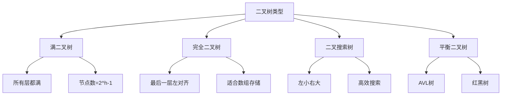

# 二叉树王国

## 📖 核心概念

**二叉树**是树结构中最重要的一种，每个节点最多有两个子节点。二叉树在计算机科学中应用广泛，是许多高级数据结构的基础。

### 🏗️ 二叉树类型



## 🔧 二叉搜索树

### BST实现

```cpp
class BinarySearchTree {
private:
    struct BSTNode {
        int data;
        BSTNode* left;
        BSTNode* right;
        
        BSTNode(int value) : data(value), left(nullptr), right(nullptr) {}
    };
    
    BSTNode* root;
    
public:
    BinarySearchTree() : root(nullptr) {}
    
    ~BinarySearchTree() {
        clear();
    }
    
    // 插入节点
    void insert(int value) {
        root = insertHelper(root, value);
    }
    
    BSTNode* insertHelper(BSTNode* node, int value) {
        if (!node) {
            return new BSTNode(value);
        }
        
        if (value < node->data) {
            node->left = insertHelper(node->left, value);
        } else if (value > node->data) {
            node->right = insertHelper(node->right, value);
        }
        
        return node;
    }
    
    // 查找节点
    bool search(int value) {
        return searchHelper(root, value);
    }
    
    bool searchHelper(BSTNode* node, int value) {
        if (!node) return false;
        
        if (value == node->data) return true;
        if (value < node->data) return searchHelper(node->left, value);
        return searchHelper(node->right, value);
    }
    
    // 删除节点
    bool remove(int value) {
        root = removeHelper(root, value);
        return root != nullptr;
    }
    
    BSTNode* removeHelper(BSTNode* node, int value) {
        if (!node) return nullptr;
        
        if (value < node->data) {
            node->left = removeHelper(node->left, value);
        } else if (value > node->data) {
            node->right = removeHelper(node->right, value);
        } else {
            if (!node->left) {
                BSTNode* temp = node->right;
                delete node;
                return temp;
            } else if (!node->right) {
                BSTNode* temp = node->left;
                delete node;
                return temp;
            }
            
            BSTNode* minNode = findMin(node->right);
            node->data = minNode->data;
            node->right = removeHelper(node->right, minNode->data);
        }
        
        return node;
    }
    
    BSTNode* findMin(BSTNode* node) {
        while (node->left) {
            node = node->left;
        }
        return node;
    }
    
    // 中序遍历（有序）
    void inorderTraversal() {
        inorderHelper(root);
        cout << endl;
    }
    
    void inorderHelper(BSTNode* node) {
        if (!node) return;
        
        inorderHelper(node->left);
        cout << node->data << " ";
        inorderHelper(node->right);
    }
    
    // 获取最小值
    int getMin() {
        BSTNode* node = root;
        while (node->left) {
            node = node->left;
        }
        return node->data;
    }
    
    // 获取最大值
    int getMax() {
        BSTNode* node = root;
        while (node->right) {
            node = node->right;
        }
        return node->data;
    }
    
    // 计算高度
    int getHeight() {
        return getHeightHelper(root);
    }
    
    int getHeightHelper(BSTNode* node) {
        if (!node) return 0;
        
        int leftHeight = getHeightHelper(node->left);
        int rightHeight = getHeightHelper(node->right);
        
        return 1 + max(leftHeight, rightHeight);
    }
    
    // 验证BST
    bool isValidBST() {
        return isValidBSTHelper(root, INT_MIN, INT_MAX);
    }
    
    bool isValidBSTHelper(BSTNode* node, int min, int max) {
        if (!node) return true;
        
        if (node->data <= min || node->data >= max) {
            return false;
        }
        
        return isValidBSTHelper(node->left, min, node->data) &&
               isValidBSTHelper(node->right, node->data, max);
    }
    
    // 清空树
    void clear() {
        clearHelper(root);
        root = nullptr;
    }
    
private:
    void clearHelper(BSTNode* node) {
        if (!node) return;
        
        clearHelper(node->left);
        clearHelper(node->right);
        delete node;
    }
};
```

## 🎯 平衡二叉树

### AVL树实现

```cpp
class AVLTree {
private:
    struct AVLNode {
        int data;
        AVLNode* left;
        AVLNode* right;
        int height;
        
        AVLNode(int value) : data(value), left(nullptr), right(nullptr), height(1) {}
    };
    
    AVLNode* root;
    
    int getHeight(AVLNode* node) {
        return node ? node->height : 0;
    }
    
    int getBalance(AVLNode* node) {
        return node ? getHeight(node->left) - getHeight(node->right) : 0;
    }
    
    AVLNode* rightRotate(AVLNode* y) {
        AVLNode* x = y->left;
        AVLNode* T2 = x->right;
        
        x->right = y;
        y->left = T2;
        
        y->height = 1 + max(getHeight(y->left), getHeight(y->right));
        x->height = 1 + max(getHeight(x->left), getHeight(x->right));
        
        return x;
    }
    
    AVLNode* leftRotate(AVLNode* x) {
        AVLNode* y = x->right;
        AVLNode* T2 = y->left;
        
        y->left = x;
        x->right = T2;
        
        x->height = 1 + max(getHeight(x->left), getHeight(x->right));
        y->height = 1 + max(getHeight(y->left), getHeight(y->right));
        
        return y;
    }
    
public:
    AVLTree() : root(nullptr) {}
    
    void insert(int value) {
        root = insertHelper(root, value);
    }
    
    AVLNode* insertHelper(AVLNode* node, int value) {
        if (!node) {
            return new AVLNode(value);
        }
        
        if (value < node->data) {
            node->left = insertHelper(node->left, value);
        } else if (value > node->data) {
            node->right = insertHelper(node->right, value);
        } else {
            return node;
        }
        
        node->height = 1 + max(getHeight(node->left), getHeight(node->right));
        
        int balance = getBalance(node);
        
        // Left Left Case
        if (balance > 1 && value < node->left->data) {
            return rightRotate(node);
        }
        
        // Right Right Case
        if (balance < -1 && value > node->right->data) {
            return leftRotate(node);
        }
        
        // Left Right Case
        if (balance > 1 && value > node->left->data) {
            node->left = leftRotate(node->left);
            return rightRotate(node);
        }
        
        // Right Left Case
        if (balance < -1 && value < node->right->data) {
            node->right = rightRotate(node->right);
            return leftRotate(node);
        }
        
        return node;
    }
    
    bool search(int value) {
        return searchHelper(root, value);
    }
    
    bool searchHelper(AVLNode* node, int value) {
        if (!node) return false;
        
        if (value == node->data) return true;
        if (value < node->data) return searchHelper(node->left, value);
        return searchHelper(node->right, value);
    }
    
    void inorderTraversal() {
        inorderHelper(root);
        cout << endl;
    }
    
    void inorderHelper(AVLNode* node) {
        if (!node) return;
        
        inorderHelper(node->left);
        cout << node->data << " ";
        inorderHelper(node->right);
    }
};
```

## 📊 二叉树应用

### 1. 表达式树

```cpp
class ExpressionTree {
private:
    struct ExprNode {
        string value;
        ExprNode* left;
        ExprNode* right;
        
        ExprNode(string v) : value(v), left(nullptr), right(nullptr) {}
    };
    
    ExprNode* root;
    
public:
    ExpressionTree() : root(nullptr) {}
    
    void buildFromInfix(string infix) {
        vector<string> postfix = infixToPostfix(infix);
        buildFromPostfix(postfix);
    }
    
    void buildFromPostfix(vector<string> postfix) {
        stack<ExprNode*> stk;
        
        for (const string& token : postfix) {
            if (isOperator(token)) {
                ExprNode* right = stk.top(); stk.pop();
                ExprNode* left = stk.top(); stk.pop();
                
                ExprNode* node = new ExprNode(token);
                node->left = left;
                node->right = right;
                
                stk.push(node);
            } else {
                stk.push(new ExprNode(token));
            }
        }
        
        root = stk.top();
    }
    
    double evaluate() {
        return evaluateHelper(root);
    }
    
    void printInfix() {
        printInfixHelper(root);
        cout << endl;
    }
    
private:
    bool isOperator(string token) {
        return token == "+" || token == "-" || token == "*" || token == "/";
    }
    
    vector<string> infixToPostfix(string infix) {
        vector<string> result;
        stack<string> stk;
        
        for (int i = 0; i < infix.length(); ++i) {
            char c = infix[i];
            
            if (isdigit(c)) {
                string num;
                while (i < infix.length() && isdigit(infix[i])) {
                    num += infix[i++];
                }
                i--;
                result.push_back(num);
            } else if (c == '(') {
                stk.push(string(1, c));
            } else if (c == ')') {
                while (!stk.empty() && stk.top() != "(") {
                    result.push_back(stk.top());
                    stk.pop();
                }
                stk.pop();
            } else if (isOperator(string(1, c))) {
                while (!stk.empty() && precedence(stk.top()) >= precedence(string(1, c))) {
                    result.push_back(stk.top());
                    stk.pop();
                }
                stk.push(string(1, c));
            }
        }
        
        while (!stk.empty()) {
            result.push_back(stk.top());
            stk.pop();
        }
        
        return result;
    }
    
    int precedence(string op) {
        if (op == "+" || op == "-") return 1;
        if (op == "*" || op == "/") return 2;
        return 0;
    }
    
    double evaluateHelper(ExprNode* node) {
        if (!node) return 0;
        
        if (!isOperator(node->value)) {
            return stod(node->value);
        }
        
        double left = evaluateHelper(node->left);
        double right = evaluateHelper(node->right);
        
        if (node->value == "+") return left + right;
        if (node->value == "-") return left - right;
        if (node->value == "*") return left * right;
        if (node->value == "/") return left / right;
        
        return 0;
    }
    
    void printInfixHelper(ExprNode* node) {
        if (!node) return;
        
        if (isOperator(node->value)) {
            cout << "(";
            printInfixHelper(node->left);
            cout << node->value;
            printInfixHelper(node->right);
            cout << ")";
        } else {
            cout << node->value;
        }
    }
};
```

### 2. 哈夫曼树

```cpp
class HuffmanTree {
private:
    struct HuffmanNode {
        char character;
        int frequency;
        HuffmanNode* left;
        HuffmanNode* right;
        
        HuffmanNode(char c, int freq) : character(c), frequency(freq), left(nullptr), right(nullptr) {}
    };
    
    HuffmanNode* root;
    map<char, string> codes;
    
    struct Compare {
        bool operator()(HuffmanNode* a, HuffmanNode* b) {
            return a->frequency > b->frequency;
        }
    };
    
public:
    HuffmanTree() : root(nullptr) {}
    
    void buildTree(map<char, int> frequencies) {
        priority_queue<HuffmanNode*, vector<HuffmanNode*>, Compare> pq;
        
        for (const auto& pair : frequencies) {
            pq.push(new HuffmanNode(pair.first, pair.second));
        }
        
        while (pq.size() > 1) {
            HuffmanNode* left = pq.top(); pq.pop();
            HuffmanNode* right = pq.top(); pq.pop();
            
            HuffmanNode* merged = new HuffmanNode('\0', left->frequency + right->frequency);
            merged->left = left;
            merged->right = right;
            
            pq.push(merged);
        }
        
        root = pq.top();
        generateCodes(root, "");
    }
    
    string encode(string text) {
        string encoded;
        for (char c : text) {
            encoded += codes[c];
        }
        return encoded;
    }
    
    string decode(string encoded) {
        string decoded;
        HuffmanNode* current = root;
        
        for (char bit : encoded) {
            if (bit == '0') {
                current = current->left;
            } else {
                current = current->right;
            }
            
            if (current->character != '\0') {
                decoded += current->character;
                current = root;
            }
        }
        
        return decoded;
    }
    
    void printCodes() {
        for (const auto& pair : codes) {
            cout << pair.first << ": " << pair.second << endl;
        }
    }
    
private:
    void generateCodes(HuffmanNode* node, string code) {
        if (!node) return;
        
        if (node->character != '\0') {
            codes[node->character] = code;
        }
        
        generateCodes(node->left, code + "0");
        generateCodes(node->right, code + "1");
    }
};
```

## 🔗 相关链接

- [[01-树形基础|树形基础]]
- [[03-堆与优先|堆与优先]]
- [[04-图论天地|图论天地]]

## 💡 二叉树王国要点

1. **二叉搜索树**：左小右大的有序结构
2. **平衡二叉树**：保持平衡的AVL树和红黑树
3. **表达式树**：用于表达式求值和转换
4. **哈夫曼树**：用于数据压缩

---

*📝 王国提示：二叉树是树结构中最重要的一种，掌握二叉树是学习高级数据结构的基础*
