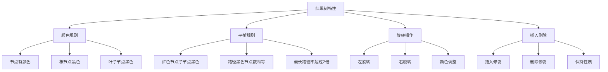

# 红黑树原理

## 📖 核心概念

**红黑树原理**是理解红黑树自平衡机制的基础。红黑树通过颜色标记和旋转操作来维持平衡，确保最坏情况下的性能。

### 🏗️ 红黑树特性



## 🔧 红黑树实现

### 节点结构

```cpp
enum Color { RED, BLACK };

template<typename T>
class RedBlackTree {
private:
    struct RBNode {
        T data;
        Color color;
        RBNode* left;
        RBNode* right;
        RBNode* parent;
        
        RBNode(const T& value, Color c = RED) 
            : data(value), color(c), left(nullptr), right(nullptr), parent(nullptr) {}
    };
    
    RBNode* root;
    RBNode* nil;  // 哨兵节点
    
    // 左旋转
    void leftRotate(RBNode* x) {
        RBNode* y = x->right;
        x->right = y->left;
        
        if (y->left != nil) {
            y->left->parent = x;
        }
        
        y->parent = x->parent;
        
        if (x->parent == nil) {
            root = y;
        } else if (x == x->parent->left) {
            x->parent->left = y;
        } else {
            x->parent->right = y;
        }
        
        y->left = x;
        x->parent = y;
    }
    
    // 右旋转
    void rightRotate(RBNode* y) {
        RBNode* x = y->left;
        y->left = x->right;
        
        if (x->right != nil) {
            x->right->parent = y;
        }
        
        x->parent = y->parent;
        
        if (y->parent == nil) {
            root = x;
        } else if (y == y->parent->left) {
            y->parent->left = x;
        } else {
            y->parent->right = x;
        }
        
        x->right = y;
        y->parent = x;
    }
    
    // 插入修复
    void insertFixup(RBNode* z) {
        while (z->parent->color == RED) {
            if (z->parent == z->parent->parent->left) {
                RBNode* y = z->parent->parent->right;
                
                if (y->color == RED) {
                    // Case 1: 叔叔节点是红色
                    z->parent->color = BLACK;
                    y->color = BLACK;
                    z->parent->parent->color = RED;
                    z = z->parent->parent;
                } else {
                    if (z == z->parent->right) {
                        // Case 2: 叔叔节点是黑色，z是右子节点
                        z = z->parent;
                        leftRotate(z);
                    }
                    // Case 3: 叔叔节点是黑色，z是左子节点
                    z->parent->color = BLACK;
                    z->parent->parent->color = RED;
                    rightRotate(z->parent->parent);
                }
            } else {
                RBNode* y = z->parent->parent->left;
                
                if (y->color == RED) {
                    // Case 1: 叔叔节点是红色
                    z->parent->color = BLACK;
                    y->color = BLACK;
                    z->parent->parent->color = RED;
                    z = z->parent->parent;
                } else {
                    if (z == z->parent->left) {
                        // Case 2: 叔叔节点是黑色，z是左子节点
                        z = z->parent;
                        rightRotate(z);
                    }
                    // Case 3: 叔叔节点是黑色，z是右子节点
                    z->parent->color = BLACK;
                    z->parent->parent->color = RED;
                    leftRotate(z->parent->parent);
                }
            }
        }
        
        root->color = BLACK;
    }
    
    // 删除修复
    void deleteFixup(RBNode* x) {
        while (x != root && x->color == BLACK) {
            if (x == x->parent->left) {
                RBNode* w = x->parent->right;
                
                if (w->color == RED) {
                    // Case 1: 兄弟节点是红色
                    w->color = BLACK;
                    x->parent->color = RED;
                    leftRotate(x->parent);
                    w = x->parent->right;
                }
                
                if (w->left->color == BLACK && w->right->color == BLACK) {
                    // Case 2: 兄弟节点的子节点都是黑色
                    w->color = RED;
                    x = x->parent;
                } else {
                    if (w->right->color == BLACK) {
                        // Case 3: 兄弟节点的右子节点是黑色
                        w->left->color = BLACK;
                        w->color = RED;
                        rightRotate(w);
                        w = x->parent->right;
                    }
                    // Case 4: 兄弟节点的右子节点是红色
                    w->color = x->parent->color;
                    x->parent->color = BLACK;
                    w->right->color = BLACK;
                    leftRotate(x->parent);
                    x = root;
                }
            } else {
                RBNode* w = x->parent->left;
                
                if (w->color == RED) {
                    w->color = BLACK;
                    x->parent->color = RED;
                    rightRotate(x->parent);
                    w = x->parent->left;
                }
                
                if (w->right->color == BLACK && w->left->color == BLACK) {
                    w->color = RED;
                    x = x->parent;
                } else {
                    if (w->left->color == BLACK) {
                        w->right->color = BLACK;
                        w->color = RED;
                        leftRotate(w);
                        w = x->parent->left;
                    }
                    w->color = x->parent->color;
                    x->parent->color = BLACK;
                    w->left->color = BLACK;
                    rightRotate(x->parent);
                    x = root;
                }
            }
        }
        
        x->color = BLACK;
    }
    
    // 查找最小节点
    RBNode* findMin(RBNode* node) {
        while (node->left != nil) {
            node = node->left;
        }
        return node;
    }
    
    // 查找最大节点
    RBNode* findMax(RBNode* node) {
        while (node->right != nil) {
            node = node->right;
        }
        return node;
    }
    
    // 查找节点
    RBNode* searchHelper(RBNode* node, const T& value) {
        if (node == nil || node->data == value) {
            return node;
        }
        
        if (value < node->data) {
            return searchHelper(node->left, value);
        } else {
            return searchHelper(node->right, value);
        }
    }
    
    // 中序遍历
    void inorderHelper(RBNode* node, vector<T>& result) {
        if (node != nil) {
            inorderHelper(node->left, result);
            result.push_back(node->data);
            inorderHelper(node->right, result);
        }
    }
    
    // 清理树
    void clearHelper(RBNode* node) {
        if (node != nil) {
            clearHelper(node->left);
            clearHelper(node->right);
            delete node;
        }
    }
    
public:
    RedBlackTree() {
        nil = new RBNode(T{}, BLACK);
        nil->left = nil->right = nil->parent = nil;
        root = nil;
    }
    
    ~RedBlackTree() {
        clear();
        delete nil;
    }
    
    // 插入元素
    void insert(const T& value) {
        RBNode* z = new RBNode(value);
        RBNode* y = nil;
        RBNode* x = root;
        
        while (x != nil) {
            y = x;
            if (z->data < x->data) {
                x = x->left;
            } else {
                x = x->right;
            }
        }
        
        z->parent = y;
        if (y == nil) {
            root = z;
        } else if (z->data < y->data) {
            y->left = z;
        } else {
            y->right = z;
        }
        
        z->left = nil;
        z->right = nil;
        z->color = RED;
        
        insertFixup(z);
    }
    
    // 删除元素
    bool remove(const T& value) {
        RBNode* z = searchHelper(root, value);
        if (z == nil) return false;
        
        RBNode* y = z;
        RBNode* x;
        Color yOriginalColor = y->color;
        
        if (z->left == nil) {
            x = z->right;
            transplant(z, z->right);
        } else if (z->right == nil) {
            x = z->left;
            transplant(z, z->left);
        } else {
            y = findMin(z->right);
            yOriginalColor = y->color;
            x = y->right;
            
            if (y->parent == z) {
                x->parent = y;
            } else {
                transplant(y, y->right);
                y->right = z->right;
                y->right->parent = y;
            }
            
            transplant(z, y);
            y->left = z->left;
            y->left->parent = y;
            y->color = z->color;
        }
        
        delete z;
        
        if (yOriginalColor == BLACK) {
            deleteFixup(x);
        }
        
        return true;
    }
    
    // 查找元素
    bool search(const T& value) {
        return searchHelper(root, value) != nil;
    }
    
    // 获取最小值
    T getMin() {
        RBNode* minNode = findMin(root);
        if (minNode == nil) {
            throw std::runtime_error("Tree is empty");
        }
        return minNode->data;
    }
    
    // 获取最大值
    T getMax() {
        RBNode* maxNode = findMax(root);
        if (maxNode == nil) {
            throw std::runtime_error("Tree is empty");
        }
        return maxNode->data;
    }
    
    // 中序遍历
    vector<T> inorderTraversal() {
        vector<T> result;
        inorderHelper(root, result);
        return result;
    }
    
    // 检查是否为空
    bool isEmpty() {
        return root == nil;
    }
    
    // 清空树
    void clear() {
        clearHelper(root);
        root = nil;
    }
    
    // 验证红黑树性质
    bool isValidRBTree() {
        if (root == nil) return true;
        
        // 检查根节点颜色
        if (root->color != BLACK) return false;
        
        // 检查每条路径的黑色节点数
        int blackCount = 0;
        return checkBlackHeight(root, blackCount);
    }
    
private:
    void transplant(RBNode* u, RBNode* v) {
        if (u->parent == nil) {
            root = v;
        } else if (u == u->parent->left) {
            u->parent->left = v;
        } else {
            u->parent->right = v;
        }
        v->parent = u->parent;
    }
    
    bool checkBlackHeight(RBNode* node, int& blackCount) {
        if (node == nil) {
            blackCount++;
            return true;
        }
        
        int leftBlackCount = 0, rightBlackCount = 0;
        
        bool leftValid = checkBlackHeight(node->left, leftBlackCount);
        bool rightValid = checkBlackHeight(node->right, rightBlackCount);
        
        if (!leftValid || !rightValid) return false;
        
        if (leftBlackCount != rightBlackCount) return false;
        
        blackCount = leftBlackCount;
        if (node->color == BLACK) {
            blackCount++;
        }
        
        return true;
    }
};
```

## 📊 红黑树性质

### 性质验证

```cpp
class RBTreeValidator {
public:
    template<typename T>
    static bool validateRedBlackTree(RedBlackTree<T>& tree) {
        // 1. 每个节点要么是红色，要么是黑色
        // 2. 根节点是黑色
        // 3. 每个叶子节点（NIL）是黑色
        // 4. 如果一个节点是红色的，那么它的两个子节点都是黑色
        // 5. 对于每个节点，从该节点到其所有后代叶子节点的简单路径上，均包含相同数目的黑色节点
        
        return tree.isValidRBTree();
    }
    
    template<typename T>
    static int getBlackHeight(typename RedBlackTree<T>::RBNode* node) {
        if (node == nullptr) return 0;
        
        int leftHeight = getBlackHeight<T>(node->left);
        int rightHeight = getBlackHeight<T>(node->right);
        
        if (leftHeight != rightHeight) {
            return -1;  // 不平衡
        }
        
        int height = leftHeight;
        if (node->color == BLACK) {
            height++;
        }
        
        return height;
    }
};
```

## 🎯 性能分析

### 时间复杂度

| 操作 | 时间复杂度 | 说明 |
|------|------------|------|
| **查找** | O(log n) | 保证树高度为O(log n) |
| **插入** | O(log n) | 最多需要3次旋转 |
| **删除** | O(log n) | 最多需要3次旋转 |
| **最小值** | O(log n) | 最左节点 |
| **最大值** | O(log n) | 最右节点 |

### 空间复杂度

| 情况 | 空间复杂度 | 说明 |
|------|------------|------|
| **存储** | O(n) | n个节点 |
| **额外空间** | O(1) | 颜色标记 |
| **递归栈** | O(log n) | 树高度 |

## 🔗 相关链接

- [[01-二叉树基础|二叉树基础]]
- [[02-二叉搜索树BST|二叉搜索树]]
- [[01-AVL树详解|AVL树]]

## 💡 红黑树要点

1. **自平衡**：通过颜色和旋转保持平衡
2. **性能保证**：最坏情况O(log n)
3. **实现复杂**：需要处理多种情况
4. **应用广泛**：C++ STL、Java TreeMap等

---

*📝 原理提示：理解红黑树的性质和修复过程是掌握其实现的关键*
