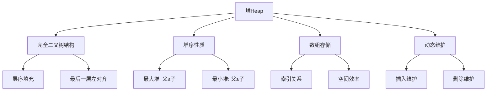

# 堆Heap详解

## 📖 核心概念

**堆（Heap）**是一种特殊的完全二叉树，满足堆序性质：父节点的值总是大于等于（最大堆）或小于等于（最小堆）其子节点的值。

### 🏗️ 堆的组成要素



## 🔍 堆的基本特征

| 特征 | 描述 | 重要性 |
|------|------|--------|
| **完全二叉树** | 除最后一层外，所有层都被完全填满，最后一层从左到右填充 | 保证数组存储的紧凑性 |
| **堆序性质** | 父节点与子节点的大小关系固定 | 核心特征，决定堆的功能 |
| **数组存储** | 使用数组按层序遍历存储节点 | 高效的索引访问 |
| **动态维护** | 插入删除后自动调整结构 | 保持堆序性质 |

## 📊 堆的类型分类

### 按堆序性质分类

| 类型 | 堆序性质 | 根节点 | 应用场景 |
|------|----------|--------|----------|
| **最大堆** | 父节点 ≥ 子节点 | 最大值 | 堆排序、优先队列 |
| **最小堆** | 父节点 ≤ 子节点 | 最小值 | Dijkstra算法、任务调度 |

### 按存储方式分类

| 类型 | 存储方式 | 优点 | 缺点 |
|------|----------|------|------|
| **数组堆** | 连续内存数组 | 缓存友好、索引高效 | 固定大小限制 |
| **动态堆** | 动态数组 | 可扩容、灵活 | 扩容开销 |

## 💻 堆的C++实现

### 基础结构定义

```cpp
template<typename T>
class MaxHeap {
private:
    vector<T> data;        // 存储堆的数组
    int capacity;          // 最大容量
    int size;              // 当前大小
    
    // 获取父节点索引
    int parent(int index) const {
        return (index - 1) / 2;
    }
    
    // 获取左子节点索引
    int leftChild(int index) const {
        return 2 * index + 1;
    }
    
    // 获取右子节点索引
    int rightChild(int index) const {
        return 2 * index + 2;
    }
    
    // 交换两个元素
    void swap(int i, int j) {
        T temp = data[i];
        data[i] = data[j];
        data[j] = temp;
    }
    
public:
    MaxHeap(int cap = 100) : capacity(cap), size(0) {
        data.reserve(capacity);
    }
    
    ~MaxHeap() = default;
    
    // 获取堆大小
    int getSize() const { return size; }
    
    // 判断是否为空
    bool isEmpty() const { return size == 0; }
    
    // 获取最大元素（不删除）
    T peek() const {
        if (isEmpty()) {
            throw std::runtime_error("Heap is empty");
        }
        return data[0];
    }
};
```

### 核心操作实现

#### 1. 插入操作（上浮）

```cpp
template<typename T>
void MaxHeap<T>::insert(const T& value) {
    if (size >= capacity) {
        throw std::overflow_error("Heap is full");
    }
    
    // 在数组末尾添加新元素
    data.push_back(value);
    size++;
    
    // 上浮调整
    heapifyUp(size - 1);
}

template<typename T>
void MaxHeap<T>::heapifyUp(int index) {
    while (index > 0) {
        int parentIndex = parent(index);
        
        // 如果当前节点大于父节点，则交换
        if (data[index] > data[parentIndex]) {
            swap(index, parentIndex);
            index = parentIndex;
        } else {
            break; // 堆序性质已满足
        }
    }
}
```

#### 2. 删除操作（下沉）

```cpp
template<typename T>
T MaxHeap<T>::extractMax() {
    if (isEmpty()) {
        throw std::runtime_error("Heap is empty");
    }
    
    T maxValue = data[0];
    
    // 将最后一个元素移到根位置
    data[0] = data[size - 1];
    data.pop_back();
    size--;
    
    // 下沉调整
    if (size > 0) {
        heapifyDown(0);
    }
    
    return maxValue;
}

template<typename T>
void MaxHeap<T>::heapifyDown(int index) {
    while (true) {
        int largest = index;
        int left = leftChild(index);
        int right = rightChild(index);
        
        // 找到最大的子节点
        if (left < size && data[left] > data[largest]) {
            largest = left;
        }
        if (right < size && data[right] > data[largest]) {
            largest = right;
        }
        
        // 如果最大子节点大于当前节点，则交换
        if (largest != index) {
            swap(index, largest);
            index = largest;
        } else {
            break; // 堆序性质已满足
        }
    }
}
```

#### 3. 堆化操作（建堆）

```cpp
template<typename T>
void MaxHeap<T>::buildHeap(const vector<T>& arr) {
    data = arr;
    size = arr.size();
    
    // 从最后一个非叶子节点开始，自底向上调整
    for (int i = parent(size - 1); i >= 0; i--) {
        heapifyDown(i);
    }
}

// 时间复杂度：O(n)
// 空间复杂度：O(1)
```

## ⚡ 复杂度分析

### 时间复杂度

| 操作 | 时间复杂度 | 说明 |
|------|------------|------|
| **插入** | O(log n) | 上浮调整最多需要log n次比较 |
| **删除** | O(log n) | 下沉调整最多需要log n次比较 |
| **查找最大值** | O(1) | 直接访问根节点 |
| **建堆** | O(n) | 自底向上调整，非O(n log n) |
| **堆排序** | O(n log n) | n次删除操作 |

### 空间复杂度

| 方面 | 空间复杂度 | 说明 |
|------|------------|------|
| **存储** | O(n) | 需要n个元素的存储空间 |
| **操作** | O(1) | 原地操作，不需要额外空间 |
| **递归** | O(log n) | 递归实现时的栈空间 |

## 🎯 堆的应用场景

### 1. 优先队列

```cpp
template<typename T>
class PriorityQueue {
private:
    MaxHeap<T> heap;
    
public:
    void enqueue(const T& item) {
        heap.insert(item);
    }
    
    T dequeue() {
        return heap.extractMax();
    }
    
    T peek() const {
        return heap.peek();
    }
    
    bool isEmpty() const {
        return heap.isEmpty();
    }
};
```

### 2. 堆排序

```cpp
template<typename T>
void heapSort(vector<T>& arr) {
    MaxHeap<T> heap;
    
    // 建堆
    heap.buildHeap(arr);
    
    // 依次取出最大值
    for (int i = arr.size() - 1; i >= 0; i--) {
        arr[i] = heap.extractMax();
    }
}
```

### 3. Top-K问题

```cpp
template<typename T>
vector<T> findTopK(const vector<T>& arr, int k) {
    MinHeap<T> minHeap; // 使用最小堆
    
    for (const T& value : arr) {
        if (minHeap.getSize() < k) {
            minHeap.insert(value);
        } else if (value > minHeap.peek()) {
            minHeap.extractMin();
            minHeap.insert(value);
        }
    }
    
    vector<T> result;
    while (!minHeap.isEmpty()) {
        result.push_back(minHeap.extractMin());
    }
    return result;
}
```

## 🔧 堆的优化技巧

### 1. 动态扩容

```cpp
template<typename T>
void MaxHeap<T>::resize() {
    capacity *= 2;
    data.reserve(capacity);
}
```

### 2. 批量插入优化

```cpp
template<typename T>
void MaxHeap<T>::insertBatch(const vector<T>& values) {
    // 先添加到数组末尾
    for (const T& value : values) {
        data.push_back(value);
        size++;
    }
    
    // 然后统一建堆
    buildHeap(data);
}
```

### 3. 索引优化

```cpp
template<typename T>
class IndexedHeap {
private:
    vector<T> data;
    vector<int> indices;  // 值到索引的映射
    
public:
    void update(int index, const T& newValue) {
        data[index] = newValue;
        heapifyUp(index);
        heapifyDown(index);
    }
};
```

## 📈 堆的性能特点

### 优势

- **高效的最大/最小值访问**：O(1)时间复杂度
- **动态维护**：插入删除后自动调整
- **空间效率**：数组存储，无指针开销
- **缓存友好**：连续内存访问

### 劣势

- **不支持随机访问**：只能访问根节点
- **不支持查找**：需要O(n)时间查找特定元素
- **固定顺序**：只能按优先级顺序访问

## 🎓 学习要点总结

### 核心理解

1. **堆序性质**：理解父节点与子节点的大小关系
2. **完全二叉树**：掌握数组索引与树结构的关系
3. **上浮下沉**：理解维护堆序性质的调整过程
4. **建堆算法**：掌握O(n)时间复杂度的建堆方法

### 实践要点

1. **索引计算**：熟练使用父子节点索引公式
2. **边界检查**：注意数组越界和空堆检查
3. **模板设计**：支持不同数据类型的堆实现
4. **异常处理**：处理堆满、堆空等异常情况

### 应用思维

1. **优先队列**：理解堆在任务调度中的应用
2. **排序算法**：掌握堆排序的原理和实现
3. **Top-K问题**：灵活运用堆解决选择问题
4. **图算法**：理解堆在图算法中的重要作用

---

**相关链接：**
- [[02-线性世界/03-受限结构[栈队列]/01-栈Stack详解|栈的实现]] - 理解LIFO结构
- [[03-层次宇宙/02-二叉树王国/01-二叉树基础|二叉树基础]] - 掌握树的基本概念
- [[04-算法武器库/02-排序艺术/01-堆排序算法|堆排序算法]] - 堆排序的详细实现
- [[05-高级结构/02-平衡树族/01-优先队列实现|优先队列实现]] - 高级优先队列结构
