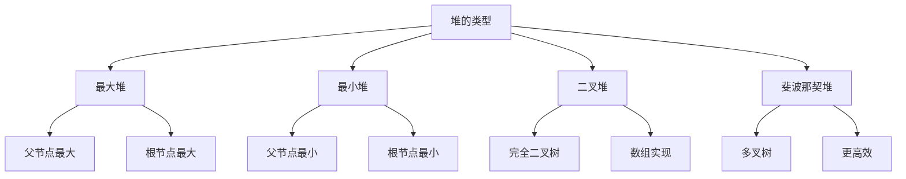

# 堆与优先

## 📖 核心概念

**堆**是一种特殊的完全二叉树，具有堆序性质。堆常用于实现优先队列，支持高效的插入、删除和查找最值操作。

### 🏗️ 堆的类型



## 🔧 二叉堆实现

### 最大堆

```cpp
class MaxHeap {
private:
    vector<int> heap;
    
    void heapifyUp(int index) {
        while (index > 0) {
            int parent = (index - 1) / 2;
            if (heap[index] <= heap[parent]) break;
            
            swap(heap[index], heap[parent]);
            index = parent;
        }
    }
    
    void heapifyDown(int index) {
        int size = heap.size();
        while (true) {
            int largest = index;
            int left = 2 * index + 1;
            int right = 2 * index + 2;
            
            if (left < size && heap[left] > heap[largest]) {
                largest = left;
            }
            
            if (right < size && heap[right] > heap[largest]) {
                largest = right;
            }
            
            if (largest == index) break;
            
            swap(heap[index], heap[largest]);
            index = largest;
        }
    }
    
public:
    MaxHeap() {}
    
    void insert(int value) {
        heap.push_back(value);
        heapifyUp(heap.size() - 1);
    }
    
    int extractMax() {
        if (heap.empty()) return -1;
        
        int max = heap[0];
        heap[0] = heap.back();
        heap.pop_back();
        
        if (!heap.empty()) {
            heapifyDown(0);
        }
        
        return max;
    }
    
    int getMax() {
        return heap.empty() ? -1 : heap[0];
    }
    
    bool isEmpty() {
        return heap.empty();
    }
    
    int size() {
        return heap.size();
    }
    
    void display() {
        for (int value : heap) {
            cout << value << " ";
        }
        cout << endl;
    }
};
```

### 最小堆

```cpp
class MinHeap {
private:
    vector<int> heap;
    
    void heapifyUp(int index) {
        while (index > 0) {
            int parent = (index - 1) / 2;
            if (heap[index] >= heap[parent]) break;
            
            swap(heap[index], heap[parent]);
            index = parent;
        }
    }
    
    void heapifyDown(int index) {
        int size = heap.size();
        while (true) {
            int smallest = index;
            int left = 2 * index + 1;
            int right = 2 * index + 2;
            
            if (left < size && heap[left] < heap[smallest]) {
                smallest = left;
            }
            
            if (right < size && heap[right] < heap[smallest]) {
                smallest = right;
            }
            
            if (smallest == index) break;
            
            swap(heap[index], heap[smallest]);
            index = smallest;
        }
    }
    
public:
    MinHeap() {}
    
    void insert(int value) {
        heap.push_back(value);
        heapifyUp(heap.size() - 1);
    }
    
    int extractMin() {
        if (heap.empty()) return -1;
        
        int min = heap[0];
        heap[0] = heap.back();
        heap.pop_back();
        
        if (!heap.empty()) {
            heapifyDown(0);
        }
        
        return min;
    }
    
    int getMin() {
        return heap.empty() ? -1 : heap[0];
    }
    
    bool isEmpty() {
        return heap.empty();
    }
    
    int size() {
        return heap.size();
    }
    
    void display() {
        for (int value : heap) {
            cout << value << " ";
        }
        cout << endl;
    }
};
```

## 🎯 优先队列

### 优先队列实现

```cpp
class PriorityQueue {
private:
    struct PQNode {
        int value;
        int priority;
        
        PQNode(int v, int p) : value(v), priority(p) {}
    };
    
    vector<PQNode> heap;
    
    void heapifyUp(int index) {
        while (index > 0) {
            int parent = (index - 1) / 2;
            if (heap[index].priority <= heap[parent].priority) break;
            
            swap(heap[index], heap[parent]);
            index = parent;
        }
    }
    
    void heapifyDown(int index) {
        int size = heap.size();
        while (true) {
            int largest = index;
            int left = 2 * index + 1;
            int right = 2 * index + 2;
            
            if (left < size && heap[left].priority > heap[largest].priority) {
                largest = left;
            }
            
            if (right < size && heap[right].priority > heap[largest].priority) {
                largest = right;
            }
            
            if (largest == index) break;
            
            swap(heap[index], heap[largest]);
            index = largest;
        }
    }
    
public:
    PriorityQueue() {}
    
    void enqueue(int value, int priority) {
        heap.push_back(PQNode(value, priority));
        heapifyUp(heap.size() - 1);
    }
    
    int dequeue() {
        if (heap.empty()) return -1;
        
        int value = heap[0].value;
        heap[0] = heap.back();
        heap.pop_back();
        
        if (!heap.empty()) {
            heapifyDown(0);
        }
        
        return value;
    }
    
    int peek() {
        return heap.empty() ? -1 : heap[0].value;
    }
    
    bool isEmpty() {
        return heap.empty();
    }
    
    int size() {
        return heap.size();
    }
    
    void display() {
        for (const PQNode& node : heap) {
            cout << "(" << node.value << "," << node.priority << ") ";
        }
        cout << endl;
    }
};
```

## 📊 堆排序

### 堆排序实现

```cpp
class HeapSort {
public:
    static void heapSort(vector<int>& arr) {
        int n = arr.size();
        
        // 构建最大堆
        for (int i = n / 2 - 1; i >= 0; --i) {
            heapify(arr, n, i);
        }
        
        // 逐个提取元素
        for (int i = n - 1; i > 0; --i) {
            swap(arr[0], arr[i]);
            heapify(arr, i, 0);
        }
    }
    
private:
    static void heapify(vector<int>& arr, int n, int i) {
        int largest = i;
        int left = 2 * i + 1;
        int right = 2 * i + 2;
        
        if (left < n && arr[left] > arr[largest]) {
            largest = left;
        }
        
        if (right < n && arr[right] > arr[largest]) {
            largest = right;
        }
        
        if (largest != i) {
            swap(arr[i], arr[largest]);
            heapify(arr, n, largest);
        }
    }
};
```

## 🎮 堆的应用

### 1. Top K问题

```cpp
class TopK {
public:
    static vector<int> findTopK(vector<int>& nums, int k) {
        MinHeap minHeap;
        
        for (int num : nums) {
            if (minHeap.size() < k) {
                minHeap.insert(num);
            } else if (num > minHeap.getMin()) {
                minHeap.extractMin();
                minHeap.insert(num);
            }
        }
        
        vector<int> result;
        while (!minHeap.isEmpty()) {
            result.push_back(minHeap.extractMin());
        }
        
        return result;
    }
    
    static vector<int> findTopKLargest(vector<int>& nums, int k) {
        MaxHeap maxHeap;
        
        for (int num : nums) {
            maxHeap.insert(num);
        }
        
        vector<int> result;
        for (int i = 0; i < k && !maxHeap.isEmpty(); ++i) {
            result.push_back(maxHeap.extractMax());
        }
        
        return result;
    }
};
```

### 2. 合并K个有序链表

```cpp
class MergeKSortedLists {
public:
    struct ListNode {
        int val;
        ListNode* next;
        ListNode(int x) : val(x), next(nullptr) {}
    };
    
    static ListNode* mergeKLists(vector<ListNode*>& lists) {
        auto compare = [](ListNode* a, ListNode* b) {
            return a->val > b->val;
        };
        
        priority_queue<ListNode*, vector<ListNode*>, decltype(compare)> pq(compare);
        
        for (ListNode* list : lists) {
            if (list) {
                pq.push(list);
            }
        }
        
        ListNode dummy(0);
        ListNode* current = &dummy;
        
        while (!pq.empty()) {
            ListNode* node = pq.top();
            pq.pop();
            
            current->next = node;
            current = current->next;
            
            if (node->next) {
                pq.push(node->next);
            }
        }
        
        return dummy.next;
    }
};
```

### 3. 中位数查找

```cpp
class MedianFinder {
private:
    MaxHeap maxHeap;  // 存储较小的一半
    MinHeap minHeap;  // 存储较大的一半
    
public:
    MedianFinder() {}
    
    void addNum(int num) {
        if (maxHeap.isEmpty() || num <= maxHeap.getMax()) {
            maxHeap.insert(num);
        } else {
            minHeap.insert(num);
        }
        
        // 平衡两个堆
        if (maxHeap.size() > minHeap.size() + 1) {
            minHeap.insert(maxHeap.extractMax());
        } else if (minHeap.size() > maxHeap.size() + 1) {
            maxHeap.insert(minHeap.extractMin());
        }
    }
    
    double findMedian() {
        if (maxHeap.size() > minHeap.size()) {
            return maxHeap.getMax();
        } else if (minHeap.size() > maxHeap.size()) {
            return minHeap.getMin();
        } else {
            return (maxHeap.getMax() + minHeap.getMin()) / 2.0;
        }
    }
};
```

## 🔗 相关链接

- [[01-树形基础|树形基础]]
- [[02-二叉树王国|二叉树王国]]
- [[04-图论天地|图论天地]]

## 💡 堆与优先要点

1. **堆性质**：最大堆和最小堆的堆序性质
2. **优先队列**：基于堆实现的高效优先队列
3. **堆排序**：O(n log n)的稳定排序算法
4. **应用场景**：Top K问题、合并有序序列、中位数查找

---

*📝 优先提示：堆是重要的数据结构，特别适合需要频繁查找最值的场景*
