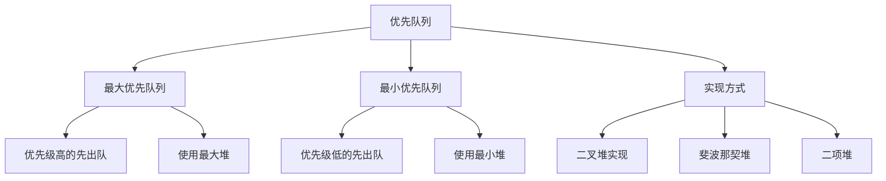

# 优先队列实现

## 📖 核心概念

**优先队列**是一种特殊的队列，其中每个元素都有一个优先级，元素按照优先级而不是插入顺序进行出队。优先队列通常使用堆来实现，支持高效的插入和删除操作。

### 🏗️ 优先队列特征



## 🔧 优先队列实现

### 最大优先队列

```cpp
class MaxPriorityQueue {
private:
    vector<int> heap;
    
    // 获取父节点索引
    int parent(int i) {
        return (i - 1) / 2;
    }
    
    // 获取左子节点索引
    int leftChild(int i) {
        return 2 * i + 1;
    }
    
    // 获取右子节点索引
    int rightChild(int i) {
        return 2 * i + 2;
    }
    
    // 向上调整（插入时使用）
    void heapifyUp(int index) {
        while (index > 0 && heap[parent(index)] < heap[index]) {
            swap(heap[parent(index)], heap[index]);
            index = parent(index);
        }
    }
    
    // 向下调整（删除时使用）
    void heapifyDown(int index) {
        int maxIndex = index;
        int left = leftChild(index);
        int right = rightChild(index);
        
        if (left < heap.size() && heap[left] > heap[maxIndex]) {
            maxIndex = left;
        }
        
        if (right < heap.size() && heap[right] > heap[maxIndex]) {
            maxIndex = right;
        }
        
        if (index != maxIndex) {
            swap(heap[index], heap[maxIndex]);
            heapifyDown(maxIndex);
        }
    }
    
public:
    // 插入元素
    void insert(int value) {
        heap.push_back(value);
        heapifyUp(heap.size() - 1);
    }
    
    // 获取最大值
    int getMax() {
        if (heap.empty()) {
            throw runtime_error("Priority queue is empty");
        }
        return heap[0];
    }
    
    // 删除最大值
    int extractMax() {
        if (heap.empty()) {
            throw runtime_error("Priority queue is empty");
        }
        
        int maxValue = heap[0];
        heap[0] = heap.back();
        heap.pop_back();
        
        if (!heap.empty()) {
            heapifyDown(0);
        }
        
        return maxValue;
    }
    
    // 修改优先级
    void changePriority(int index, int newPriority) {
        if (index < 0 || index >= heap.size()) {
            throw runtime_error("Invalid index");
        }
        
        int oldPriority = heap[index];
        heap[index] = newPriority;
        
        if (newPriority > oldPriority) {
            heapifyUp(index);
        } else {
            heapifyDown(index);
        }
    }
    
    // 删除指定元素
    void remove(int index) {
        if (index < 0 || index >= heap.size()) {
            throw runtime_error("Invalid index");
        }
        
        heap[index] = INT_MAX;
        heapifyUp(index);
        extractMax();
    }
    
    // 获取队列大小
    int size() {
        return heap.size();
    }
    
    // 检查是否为空
    bool isEmpty() {
        return heap.empty();
    }
    
    // 显示队列内容
    void display() {
        cout << "Max Priority Queue: ";
        for (int value : heap) {
            cout << value << " ";
        }
        cout << endl;
    }
    
    // 显示堆结构
    void displayHeap() {
        cout << "Heap Structure:" << endl;
        displayHeapHelper(0, 0);
    }
    
private:
    void displayHeapHelper(int index, int level) {
        if (index >= heap.size()) return;
        
        displayHeapHelper(rightChild(index), level + 1);
        
        for (int i = 0; i < level; ++i) {
            cout << "    ";
        }
        
        cout << heap[index] << endl;
        
        displayHeapHelper(leftChild(index), level + 1);
    }
};
```

### 最小优先队列

```cpp
class MinPriorityQueue {
private:
    vector<int> heap;
    
    // 获取父节点索引
    int parent(int i) {
        return (i - 1) / 2;
    }
    
    // 获取左子节点索引
    int leftChild(int i) {
        return 2 * i + 1;
    }
    
    // 获取右子节点索引
    int rightChild(int i) {
        return 2 * i + 2;
    }
    
    // 向上调整（插入时使用）
    void heapifyUp(int index) {
        while (index > 0 && heap[parent(index)] > heap[index]) {
            swap(heap[parent(index)], heap[index]);
            index = parent(index);
        }
    }
    
    // 向下调整（删除时使用）
    void heapifyDown(int index) {
        int minIndex = index;
        int left = leftChild(index);
        int right = rightChild(index);
        
        if (left < heap.size() && heap[left] < heap[minIndex]) {
            minIndex = left;
        }
        
        if (right < heap.size() && heap[right] < heap[minIndex]) {
            minIndex = right;
        }
        
        if (index != minIndex) {
            swap(heap[index], heap[minIndex]);
            heapifyDown(minIndex);
        }
    }
    
public:
    // 插入元素
    void insert(int value) {
        heap.push_back(value);
        heapifyUp(heap.size() - 1);
    }
    
    // 获取最小值
    int getMin() {
        if (heap.empty()) {
            throw runtime_error("Priority queue is empty");
        }
        return heap[0];
    }
    
    // 删除最小值
    int extractMin() {
        if (heap.empty()) {
            throw runtime_error("Priority queue is empty");
        }
        
        int minValue = heap[0];
        heap[0] = heap.back();
        heap.pop_back();
        
        if (!heap.empty()) {
            heapifyDown(0);
        }
        
        return minValue;
    }
    
    // 修改优先级
    void changePriority(int index, int newPriority) {
        if (index < 0 || index >= heap.size()) {
            throw runtime_error("Invalid index");
        }
        
        int oldPriority = heap[index];
        heap[index] = newPriority;
        
        if (newPriority < oldPriority) {
            heapifyUp(index);
        } else {
            heapifyDown(index);
        }
    }
    
    // 删除指定元素
    void remove(int index) {
        if (index < 0 || index >= heap.size()) {
            throw runtime_error("Invalid index");
        }
        
        heap[index] = INT_MIN;
        heapifyUp(index);
        extractMin();
    }
    
    // 获取队列大小
    int size() {
        return heap.size();
    }
    
    // 检查是否为空
    bool isEmpty() {
        return heap.empty();
    }
    
    // 显示队列内容
    void display() {
        cout << "Min Priority Queue: ";
        for (int value : heap) {
            cout << value << " ";
        }
        cout << endl;
    }
    
    // 显示堆结构
    void displayHeap() {
        cout << "Heap Structure:" << endl;
        displayHeapHelper(0, 0);
    }
    
private:
    void displayHeapHelper(int index, int level) {
        if (index >= heap.size()) return;
        
        displayHeapHelper(rightChild(index), level + 1);
        
        for (int i = 0; i < level; ++i) {
            cout << "    ";
        }
        
        cout << heap[index] << endl;
        
        displayHeapHelper(leftChild(index), level + 1);
    }
};
```

### 通用优先队列

```cpp
template<typename T>
class GenericPriorityQueue {
private:
    struct Node {
        T data;
        int priority;
        
        Node(T d, int p) : data(d), priority(p) {}
    };
    
    vector<Node> heap;
    
    // 获取父节点索引
    int parent(int i) {
        return (i - 1) / 2;
    }
    
    // 获取左子节点索引
    int leftChild(int i) {
        return 2 * i + 1;
    }
    
    // 获取右子节点索引
    int rightChild(int i) {
        return 2 * i + 2;
    }
    
    // 向上调整（插入时使用）
    void heapifyUp(int index) {
        while (index > 0 && heap[parent(index)].priority < heap[index].priority) {
            swap(heap[parent(index)], heap[index]);
            index = parent(index);
        }
    }
    
    // 向下调整（删除时使用）
    void heapifyDown(int index) {
        int maxIndex = index;
        int left = leftChild(index);
        int right = rightChild(index);
        
        if (left < heap.size() && heap[left].priority > heap[maxIndex].priority) {
            maxIndex = left;
        }
        
        if (right < heap.size() && heap[right].priority > heap[maxIndex].priority) {
            maxIndex = right;
        }
        
        if (index != maxIndex) {
            swap(heap[index], heap[maxIndex]);
            heapifyDown(maxIndex);
        }
    }
    
public:
    // 插入元素
    void insert(T data, int priority) {
        heap.push_back(Node(data, priority));
        heapifyUp(heap.size() - 1);
    }
    
    // 获取最高优先级元素
    T getTop() {
        if (heap.empty()) {
            throw runtime_error("Priority queue is empty");
        }
        return heap[0].data;
    }
    
    // 删除最高优先级元素
    T extractTop() {
        if (heap.empty()) {
            throw runtime_error("Priority queue is empty");
        }
        
        T topData = heap[0].data;
        heap[0] = heap.back();
        heap.pop_back();
        
        if (!heap.empty()) {
            heapifyDown(0);
        }
        
        return topData;
    }
    
    // 修改优先级
    void changePriority(int index, int newPriority) {
        if (index < 0 || index >= heap.size()) {
            throw runtime_error("Invalid index");
        }
        
        int oldPriority = heap[index].priority;
        heap[index].priority = newPriority;
        
        if (newPriority > oldPriority) {
            heapifyUp(index);
        } else {
            heapifyDown(index);
        }
    }
    
    // 获取队列大小
    int size() {
        return heap.size();
    }
    
    // 检查是否为空
    bool isEmpty() {
        return heap.empty();
    }
    
    // 显示队列内容
    void display() {
        cout << "Generic Priority Queue: ";
        for (const Node& node : heap) {
            cout << "(" << node.data << ", " << node.priority << ") ";
        }
        cout << endl;
    }
};
```

## 🎯 优先队列应用

### 任务调度

```cpp
class TaskScheduler {
private:
    struct Task {
        string name;
        int priority;
        int executionTime;
        int deadline;
        
        Task(string n, int p, int t, int d) : name(n), priority(p), executionTime(t), deadline(d) {}
    };
    
    GenericPriorityQueue<Task> taskQueue;
    
public:
    void addTask(string name, int priority, int executionTime, int deadline) {
        Task task(name, priority, executionTime, deadline);
        taskQueue.insert(task, priority);
        
        cout << "Added task: " << name << " (Priority: " << priority << ", Time: " << executionTime << ")" << endl;
    }
    
    void executeNextTask() {
        if (taskQueue.isEmpty()) {
            cout << "No tasks to execute" << endl;
            return;
        }
        
        Task task = taskQueue.extractTop();
        cout << "Executing: " << task.name << " (Priority: " << task.priority << ", Time: " << task.executionTime << ")" << endl;
        
        // 模拟任务执行
        this_thread::sleep_for(chrono::milliseconds(task.executionTime * 100));
        
        cout << "Completed: " << task.name << endl;
    }
    
    void executeAllTasks() {
        cout << "Executing all tasks:" << endl;
        cout << "==================" << endl;
        
        while (!taskQueue.isEmpty()) {
            executeNextTask();
        }
    }
    
    void displayTaskQueue() {
        cout << "Task Queue:" << endl;
        taskQueue.display();
    }
};
```

### 最短路径算法

```cpp
class DijkstraShortestPath {
private:
    struct Edge {
        int destination;
        int weight;
        
        Edge(int dest, int w) : destination(dest), weight(w) {}
    };
    
    struct Vertex {
        int id;
        int distance;
        
        Vertex(int i, int d) : id(i), distance(d) {}
    };
    
    vector<vector<Edge>> graph;
    vector<int> distances;
    vector<int> previous;
    
public:
    DijkstraShortestPath(int vertices) {
        graph.resize(vertices);
        distances.resize(vertices, INT_MAX);
        previous.resize(vertices, -1);
    }
    
    void addEdge(int source, int destination, int weight) {
        graph[source].push_back(Edge(destination, weight));
        graph[destination].push_back(Edge(source, weight)); // 无向图
    }
    
    void findShortestPath(int source) {
        distances[source] = 0;
        
        GenericPriorityQueue<Vertex> pq;
        pq.insert(Vertex(source, 0), 0);
        
        while (!pq.isEmpty()) {
            Vertex current = pq.extractTop();
            int u = current.id;
            
            for (const Edge& edge : graph[u]) {
                int v = edge.destination;
                int weight = edge.weight;
                
                if (distances[u] + weight < distances[v]) {
                    distances[v] = distances[u] + weight;
                    previous[v] = u;
                    pq.insert(Vertex(v, distances[v]), -distances[v]); // 使用负值实现最小堆
                }
            }
        }
    }
    
    void displayShortestPaths(int source) {
        cout << "Shortest paths from vertex " << source << ":" << endl;
        cout << "================================" << endl;
        
        for (int i = 0; i < distances.size(); ++i) {
            if (distances[i] == INT_MAX) {
                cout << "Vertex " << i << ": No path" << endl;
            } else {
                cout << "Vertex " << i << ": Distance = " << distances[i] << ", Path = ";
                displayPath(source, i);
                cout << endl;
            }
        }
    }
    
private:
    void displayPath(int source, int destination) {
        if (destination == source) {
            cout << source;
        } else if (previous[destination] == -1) {
            cout << "No path";
        } else {
            displayPath(source, previous[destination]);
            cout << " -> " << destination;
        }
    }
};
```

### 合并K个有序数组

```cpp
class MergeKSortedArrays {
private:
    struct Element {
        int value;
        int arrayIndex;
        int elementIndex;
        
        Element(int v, int arrIdx, int elemIdx) : value(v), arrayIndex(arrIdx), elementIndex(elemIdx) {}
    };
    
public:
    vector<int> mergeKSortedArrays(vector<vector<int>>& arrays) {
        vector<int> result;
        GenericPriorityQueue<Element> pq;
        
        // 将每个数组的第一个元素加入优先队列
        for (int i = 0; i < arrays.size(); ++i) {
            if (!arrays[i].empty()) {
                pq.insert(Element(arrays[i][0], i, 0), -arrays[i][0]); // 使用负值实现最小堆
            }
        }
        
        while (!pq.isEmpty()) {
            Element current = pq.extractTop();
            result.push_back(current.value);
            
            // 将当前元素所在数组的下一个元素加入队列
            if (current.elementIndex + 1 < arrays[current.arrayIndex].size()) {
                int nextValue = arrays[current.arrayIndex][current.elementIndex + 1];
                pq.insert(Element(nextValue, current.arrayIndex, current.elementIndex + 1), -nextValue);
            }
        }
        
        return result;
    }
    
    void displayMergeResult(vector<vector<int>>& arrays) {
        cout << "Merging K sorted arrays:" << endl;
        cout << "======================" << endl;
        
        for (int i = 0; i < arrays.size(); ++i) {
            cout << "Array " << i << ": ";
            for (int value : arrays[i]) {
                cout << value << " ";
            }
            cout << endl;
        }
        
        vector<int> result = mergeKSortedArrays(arrays);
        
        cout << "Merged result: ";
        for (int value : result) {
            cout << value << " ";
        }
        cout << endl;
    }
};
```

## 📊 优先队列分析

### 时间复杂度分析

```cpp
class PriorityQueueAnalysis {
public:
    static void analyzeTimeComplexity() {
        cout << "Priority Queue Time Complexity Analysis:" << endl;
        cout << "======================================" << endl;
        
        cout << "1. Insert Operation:" << endl;
        cout << "   - Time Complexity: O(log n)" << endl;
        cout << "   - Space Complexity: O(1)" << endl;
        cout << "   - Heapify up operation" << endl;
        
        cout << "2. Extract Max/Min:" << endl;
        cout << "   - Time Complexity: O(log n)" << endl;
        cout << "   - Space Complexity: O(1)" << endl;
        cout << "   - Heapify down operation" << endl;
        
        cout << "3. Get Max/Min:" << endl;
        cout << "   - Time Complexity: O(1)" << endl;
        cout << "   - Space Complexity: O(1)" << endl;
        cout << "   - Root element access" << endl;
        
        cout << "4. Change Priority:" << endl;
        cout << "   - Time Complexity: O(log n)" << endl;
        cout << "   - Space Complexity: O(1)" << endl;
        cout << "   - Heapify up or down" << endl;
        
        cout << "5. Remove Element:" << endl;
        cout << "   - Time Complexity: O(log n)" << endl;
        cout << "   - Space Complexity: O(1)" << endl;
        cout << "   - Change priority + extract" << endl;
    }
    
    static void analyzeSpaceComplexity() {
        cout << "Priority Queue Space Complexity Analysis:" << endl;
        cout << "=======================================" << endl;
        
        cout << "1. Heap Storage:" << endl;
        cout << "   - Space Complexity: O(n)" << endl;
        cout << "   - Array-based implementation" << endl;
        
        cout << "2. Additional Variables:" << endl;
        cout << "   - Space Complexity: O(1)" << endl;
        cout << "   - Constant space for indices" << endl;
        
        cout << "3. Total Space Complexity:" << endl;
        cout << "   - O(n) for heap storage" << endl;
        cout << "   - O(1) for additional variables" << endl;
        cout << "   - Overall: O(n)" << endl;
    }
};
```

### 性能测试

```cpp
class PriorityQueuePerformanceTest {
public:
    static void performanceTest() {
        cout << "Priority Queue Performance Test:" << endl;
        cout << "===============================" << endl;
        
        vector<int> sizes = {1000, 5000, 10000};
        
        for (int size : sizes) {
            cout << "Testing with " << size << " elements:" << endl;
            
            MaxPriorityQueue pq;
            
            // 测试插入性能
            auto start = chrono::high_resolution_clock::now();
            for (int i = 0; i < size; ++i) {
                pq.insert(rand() % 10000);
            }
            auto end = chrono::high_resolution_clock::now();
            auto insertTime = chrono::duration_cast<chrono::milliseconds>(end - start);
            
            cout << "Insert time: " << insertTime.count() << " ms" << endl;
            
            // 测试提取性能
            start = chrono::high_resolution_clock::now();
            for (int i = 0; i < size / 2; ++i) {
                pq.extractMax();
            }
            end = chrono::high_resolution_clock::now();
            auto extractTime = chrono::duration_cast<chrono::milliseconds>(end - start);
            
            cout << "Extract time: " << extractTime.count() << " ms" << endl;
            cout << "Final size: " << pq.size() << endl;
            cout << endl;
        }
    }
};
```

## 🎮 优先队列测试

### 1. 基础功能测试

```cpp
class PriorityQueueTest {
public:
    static void testMaxPriorityQueue() {
        cout << "Testing Max Priority Queue:" << endl;
        cout << "=========================" << endl;
        
        MaxPriorityQueue maxPQ;
        
        vector<int> values = {10, 20, 30, 40, 50, 25, 35};
        for (int value : values) {
            maxPQ.insert(value);
        }
        
        maxPQ.display();
        maxPQ.displayHeap();
        
        cout << "Max value: " << maxPQ.getMax() << endl;
        cout << "Extracted max: " << maxPQ.extractMax() << endl;
        maxPQ.display();
    }
    
    static void testMinPriorityQueue() {
        cout << "Testing Min Priority Queue:" << endl;
        cout << "=========================" << endl;
        
        MinPriorityQueue minPQ;
        
        vector<int> values = {50, 40, 30, 20, 10, 25, 35};
        for (int value : values) {
            minPQ.insert(value);
        }
        
        minPQ.display();
        minPQ.displayHeap();
        
        cout << "Min value: " << minPQ.getMin() << endl;
        cout << "Extracted min: " << minPQ.extractMin() << endl;
        minPQ.display();
    }
    
    static void testGenericPriorityQueue() {
        cout << "Testing Generic Priority Queue:" << endl;
        cout << "=============================" << endl;
        
        GenericPriorityQueue<string> genericPQ;
        
        genericPQ.insert("Task A", 3);
        genericPQ.insert("Task B", 1);
        genericPQ.insert("Task C", 5);
        genericPQ.insert("Task D", 2);
        
        genericPQ.display();
        
        cout << "Top task: " << genericPQ.getTop() << endl;
        cout << "Extracted top: " << genericPQ.extractTop() << endl;
        genericPQ.display();
    }
    
    static void testTaskScheduler() {
        cout << "Testing Task Scheduler:" << endl;
        cout << "=====================" << endl;
        
        TaskScheduler scheduler;
        
        scheduler.addTask("Task 1", 5, 2, 10);
        scheduler.addTask("Task 2", 3, 1, 8);
        scheduler.addTask("Task 3", 7, 3, 12);
        scheduler.addTask("Task 4", 2, 1, 6);
        
        scheduler.displayTaskQueue();
        scheduler.executeAllTasks();
    }
    
    static void testDijkstra() {
        cout << "Testing Dijkstra Shortest Path:" << endl;
        cout << "=============================" << endl;
        
        DijkstraShortestPath dijkstra(6);
        
        dijkstra.addEdge(0, 1, 4);
        dijkstra.addEdge(0, 2, 2);
        dijkstra.addEdge(1, 2, 1);
        dijkstra.addEdge(1, 3, 5);
        dijkstra.addEdge(2, 3, 8);
        dijkstra.addEdge(2, 4, 10);
        dijkstra.addEdge(3, 4, 2);
        dijkstra.addEdge(3, 5, 6);
        dijkstra.addEdge(4, 5, 3);
        
        dijkstra.findShortestPath(0);
        dijkstra.displayShortestPaths(0);
    }
    
    static void testMergeKSortedArrays() {
        cout << "Testing Merge K Sorted Arrays:" << endl;
        cout << "============================" << endl;
        
        MergeKSortedArrays merger;
        
        vector<vector<int>> arrays = {
            {1, 4, 7, 10},
            {2, 5, 8, 11},
            {3, 6, 9, 12}
        };
        
        merger.displayMergeResult(arrays);
    }
};
```

## 🔗 相关链接

- [[01-堆Heap基础|堆Heap基础]]
- [[02-堆排序算法|堆排序算法]]
- [[04-堆的应用场景|堆的应用场景]]

## 💡 优先队列要点

1. **堆实现**: 使用二叉堆实现优先队列
2. **时间复杂度**: 插入和删除都是O(log n)
3. **应用场景**: 任务调度、最短路径、合并有序数组
4. **优先级**: 支持最大优先队列和最小优先队列

---

*📝 优先队列提示：优先队列是堆的重要应用，掌握堆操作是理解优先队列的关键*
