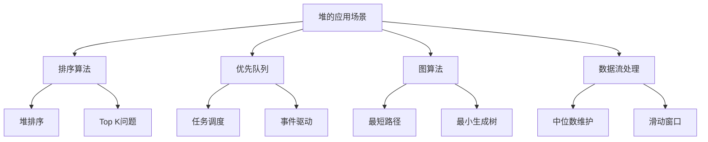

# 堆的应用场景

## 📖 核心概念

**堆的应用场景**非常广泛，从基础的排序算法到高级的数据结构，堆都发挥着重要作用。理解这些应用场景有助于更好地掌握堆的使用。

### 🏗️ 堆应用分类



## 🔧 堆应用实现

### Top K问题

```cpp
class TopKProblems {
private:
    MinPriorityQueue minHeap;
    int k;
    
public:
    TopKProblems(int k) : k(k) {}
    
    // 找出数组中最大的K个元素
    vector<int> findTopKLargest(vector<int>& nums) {
        MinPriorityQueue pq;
        
        for (int num : nums) {
            if (pq.size() < k) {
                pq.insert(num);
            } else if (num > pq.getMin()) {
                pq.extractMin();
                pq.insert(num);
            }
        }
        
        vector<int> result;
        while (!pq.isEmpty()) {
            result.push_back(pq.extractMin());
        }
        
        return result;
    }
    
    // 找出数组中最小的K个元素
    vector<int> findTopKSmallest(vector<int>& nums) {
        MaxPriorityQueue pq;
        
        for (int num : nums) {
            if (pq.size() < k) {
                pq.insert(num);
            } else if (num < pq.getMax()) {
                pq.extractMax();
                pq.insert(num);
            }
        }
        
        vector<int> result;
        while (!pq.isEmpty()) {
            result.push_back(pq.extractMax());
        }
        
        reverse(result.begin(), result.end());
        return result;
    }
    
    // 找出数组中第K大的元素
    int findKthLargest(vector<int>& nums, int k) {
        MinPriorityQueue pq;
        
        for (int num : nums) {
            if (pq.size() < k) {
                pq.insert(num);
            } else if (num > pq.getMin()) {
                pq.extractMin();
                pq.insert(num);
            }
        }
        
        return pq.getMin();
    }
    
    // 找出数组中第K小的元素
    int findKthSmallest(vector<int>& nums, int k) {
        MaxPriorityQueue pq;
        
        for (int num : nums) {
            if (pq.size() < k) {
                pq.insert(num);
            } else if (num < pq.getMax()) {
                pq.extractMax();
                pq.insert(num);
            }
        }
        
        return pq.getMax();
    }
    
    void displayTopKResults(vector<int>& nums, int k) {
        cout << "Top K Problems:" << endl;
        cout << "==============" << endl;
        
        cout << "Array: ";
        for (int num : nums) {
            cout << num << " ";
        }
        cout << endl;
        
        vector<int> topKLargest = findTopKLargest(nums);
        cout << "Top " << k << " largest: ";
        for (int num : topKLargest) {
            cout << num << " ";
        }
        cout << endl;
        
        vector<int> topKSmallest = findTopKSmallest(nums);
        cout << "Top " << k << " smallest: ";
        for (int num : topKSmallest) {
            cout << num << " ";
        }
        cout << endl;
        
        cout << k << "th largest: " << findKthLargest(nums, k) << endl;
        cout << k << "th smallest: " << findKthSmallest(nums, k) << endl;
    }
};
```

### 数据流中位数

```cpp
class MedianFinder {
private:
    MaxPriorityQueue maxHeap; // 存储较小的一半
    MinPriorityQueue minHeap; // 存储较大的一半
    
public:
    void addNum(int num) {
        if (maxHeap.isEmpty() || num <= maxHeap.getMax()) {
            maxHeap.insert(num);
        } else {
            minHeap.insert(num);
        }
        
        // 平衡两个堆
        if (maxHeap.size() > minHeap.size() + 1) {
            minHeap.insert(maxHeap.extractMax());
        } else if (minHeap.size() > maxHeap.size() + 1) {
            maxHeap.insert(minHeap.extractMin());
        }
    }
    
    double findMedian() {
        if (maxHeap.size() == minHeap.size()) {
            return (maxHeap.getMax() + minHeap.getMin()) / 2.0;
        } else if (maxHeap.size() > minHeap.size()) {
            return maxHeap.getMax();
        } else {
            return minHeap.getMin();
        }
    }
    
    void displayMedian() {
        cout << "Current median: " << findMedian() << endl;
        cout << "Max heap size: " << maxHeap.size() << endl;
        cout << "Min heap size: " << minHeap.size() << endl;
    }
    
    void processDataStream(vector<int>& data) {
        cout << "Processing data stream:" << endl;
        cout << "======================" << endl;
        
        for (int num : data) {
            addNum(num);
            cout << "Added " << num << ", ";
            displayMedian();
        }
    }
};
```

### 合并K个有序链表

```cpp
class MergeKSortedLists {
private:
    struct ListNode {
        int val;
        ListNode* next;
        
        ListNode(int x) : val(x), next(nullptr) {}
    };
    
    struct Node {
        ListNode* node;
        int value;
        
        Node(ListNode* n) : node(n), value(n->val) {}
    };
    
public:
    ListNode* mergeKLists(vector<ListNode*>& lists) {
        if (lists.empty()) return nullptr;
        
        GenericPriorityQueue<Node> pq;
        
        // 将每个链表的第一个节点加入优先队列
        for (ListNode* list : lists) {
            if (list) {
                pq.insert(Node(list), -list->val); // 使用负值实现最小堆
            }
        }
        
        ListNode* dummy = new ListNode(0);
        ListNode* current = dummy;
        
        while (!pq.isEmpty()) {
            Node minNode = pq.extractTop();
            current->next = minNode.node;
            current = current->next;
            
            // 将下一个节点加入队列
            if (minNode.node->next) {
                pq.insert(Node(minNode.node->next), -minNode.node->next->val);
            }
        }
        
        return dummy->next;
    }
    
    ListNode* createList(vector<int>& values) {
        if (values.empty()) return nullptr;
        
        ListNode* head = new ListNode(values[0]);
        ListNode* current = head;
        
        for (int i = 1; i < values.size(); ++i) {
            current->next = new ListNode(values[i]);
            current = current->next;
        }
        
        return head;
    }
    
    void displayList(ListNode* head) {
        cout << "List: ";
        while (head) {
            cout << head->val << " ";
            head = head->next;
        }
        cout << endl;
    }
    
    void displayMergeResult(vector<vector<int>>& arrays) {
        cout << "Merging K sorted lists:" << endl;
        cout << "======================" << endl;
        
        vector<ListNode*> lists;
        for (vector<int>& array : arrays) {
            lists.push_back(createList(array));
            cout << "List: ";
            for (int val : array) {
                cout << val << " ";
            }
            cout << endl;
        }
        
        ListNode* merged = mergeKLists(lists);
        displayList(merged);
    }
};
```

### 滑动窗口最大值

```cpp
class SlidingWindowMaximum {
private:
    struct Element {
        int value;
        int index;
        
        Element(int v, int i) : value(v), index(i) {}
    };
    
public:
    vector<int> maxSlidingWindow(vector<int>& nums, int k) {
        vector<int> result;
        GenericPriorityQueue<Element> pq;
        
        // 初始化第一个窗口
        for (int i = 0; i < k; ++i) {
            pq.insert(Element(nums[i], i), nums[i]);
        }
        
        result.push_back(pq.getTop().value);
        
        // 滑动窗口
        for (int i = k; i < nums.size(); ++i) {
            // 移除超出窗口的元素
            while (!pq.isEmpty() && pq.getTop().index <= i - k) {
                pq.extractTop();
            }
            
            // 添加新元素
            pq.insert(Element(nums[i], i), nums[i]);
            
            // 获取当前窗口的最大值
            result.push_back(pq.getTop().value);
        }
        
        return result;
    }
    
    void displaySlidingWindow(vector<int>& nums, int k) {
        cout << "Sliding Window Maximum:" << endl;
        cout << "=====================" << endl;
        
        cout << "Array: ";
        for (int num : nums) {
            cout << num << " ";
        }
        cout << endl;
        cout << "Window size: " << k << endl;
        
        vector<int> result = maxSlidingWindow(nums, k);
        
        cout << "Maximum values: ";
        for (int num : result) {
            cout << num << " ";
        }
        cout << endl;
    }
};
```

## 🎯 堆的高级应用

### 外部排序

```cpp
class ExternalSort {
private:
    struct FileChunk {
        int value;
        int fileIndex;
        int chunkIndex;
        
        FileChunk(int v, int f, int c) : value(v), fileIndex(f), chunkIndex(c) {}
    };
    
public:
    void externalSort(vector<vector<int>>& files) {
        cout << "External Sort using Heap:" << endl;
        cout << "========================" << endl;
        
        GenericPriorityQueue<FileChunk> pq;
        
        // 将每个文件的第一个元素加入优先队列
        for (int i = 0; i < files.size(); ++i) {
            if (!files[i].empty()) {
                pq.insert(FileChunk(files[i][0], i, 0), -files[i][0]); // 使用负值实现最小堆
            }
        }
        
        vector<int> result;
        
        while (!pq.isEmpty()) {
            FileChunk current = pq.extractTop();
            result.push_back(current.value);
            
            // 将下一个元素加入队列
            if (current.chunkIndex + 1 < files[current.fileIndex].size()) {
                int nextValue = files[current.fileIndex][current.chunkIndex + 1];
                pq.insert(FileChunk(nextValue, current.fileIndex, current.chunkIndex + 1), -nextValue);
            }
        }
        
        cout << "Sorted result: ";
        for (int num : result) {
            cout << num << " ";
        }
        cout << endl;
    }
    
    void displayExternalSort(vector<vector<int>>& files) {
        cout << "External Sort Files:" << endl;
        cout << "===================" << endl;
        
        for (int i = 0; i < files.size(); ++i) {
            cout << "File " << i << ": ";
            for (int num : files[i]) {
                cout << num << " ";
            }
            cout << endl;
        }
        
        externalSort(files);
    }
};
```

### 事件驱动模拟

```cpp
class EventDrivenSimulation {
private:
    struct Event {
        double time;
        string type;
        string description;
        
        Event(double t, string ty, string desc) : time(t), type(ty), description(desc) {}
    };
    
    GenericPriorityQueue<Event> eventQueue;
    double currentTime;
    
public:
    EventDrivenSimulation() : currentTime(0.0) {}
    
    void scheduleEvent(double time, string type, string description) {
        Event event(time, type, description);
        eventQueue.insert(event, -time); // 使用负值实现最小堆
        
        cout << "Scheduled event at time " << time << ": " << description << endl;
    }
    
    void processNextEvent() {
        if (eventQueue.isEmpty()) {
            cout << "No events to process" << endl;
            return;
        }
        
        Event event = eventQueue.extractTop();
        currentTime = event.time;
        
        cout << "Processing event at time " << currentTime << ": " << event.description << endl;
        
        // 模拟事件处理
        this_thread::sleep_for(chrono::milliseconds(100));
    }
    
    void runSimulation() {
        cout << "Running Event-Driven Simulation:" << endl;
        cout << "==============================" << endl;
        
        while (!eventQueue.isEmpty()) {
            processNextEvent();
        }
        
        cout << "Simulation completed at time " << currentTime << endl;
    }
    
    void displayEventQueue() {
        cout << "Event Queue:" << endl;
        cout << "===========" << endl;
        eventQueue.display();
    }
};
```

### 内存管理

```cpp
class MemoryManager {
private:
    struct MemoryBlock {
        int size;
        int address;
        bool isFree;
        
        MemoryBlock(int s, int addr, bool free) : size(s), address(addr), isFree(free) {}
    };
    
    GenericPriorityQueue<MemoryBlock> freeBlocks;
    vector<MemoryBlock> allocatedBlocks;
    
public:
    MemoryManager() {
        // 初始化一个大的空闲块
        freeBlocks.insert(MemoryBlock(1000, 0, true), 1000);
    }
    
    int allocate(int size) {
        if (freeBlocks.isEmpty()) {
            cout << "No free memory available" << endl;
            return -1;
        }
        
        MemoryBlock block = freeBlocks.extractTop();
        
        if (block.size < size) {
            cout << "Insufficient memory: requested " << size << ", available " << block.size << endl;
            return -1;
        }
        
        // 分配内存
        allocatedBlocks.push_back(MemoryBlock(size, block.address, false));
        
        // 如果有剩余空间，放回空闲块
        if (block.size > size) {
            freeBlocks.insert(MemoryBlock(block.size - size, block.address + size, true), block.size - size);
        }
        
        cout << "Allocated " << size << " bytes at address " << block.address << endl;
        return block.address;
    }
    
    void deallocate(int address) {
        for (auto it = allocatedBlocks.begin(); it != allocatedBlocks.end(); ++it) {
            if (it->address == address) {
                cout << "Deallocated " << it->size << " bytes at address " << address << endl;
                
                // 将内存块放回空闲块
                freeBlocks.insert(MemoryBlock(it->size, address, true), it->size);
                
                allocatedBlocks.erase(it);
                return;
            }
        }
        
        cout << "Address " << address << " not found in allocated blocks" << endl;
    }
    
    void displayMemoryStatus() {
        cout << "Memory Status:" << endl;
        cout << "=============" << endl;
        
        cout << "Allocated blocks:" << endl;
        for (const MemoryBlock& block : allocatedBlocks) {
            cout << "  Address: " << block.address << ", Size: " << block.size << endl;
        }
        
        cout << "Free blocks:" << endl;
        freeBlocks.display();
    }
};
```

## 📊 堆应用分析

### 应用场景分析

```cpp
class HeapApplicationAnalysis {
public:
    static void analyzeApplications() {
        cout << "Heap Application Analysis:" << endl;
        cout << "========================" << endl;
        
        cout << "1. Top K Problems:" << endl;
        cout << "   - Time Complexity: O(n log k)" << endl;
        cout << "   - Space Complexity: O(k)" << endl;
        cout << "   - Use min heap for largest K" << endl;
        cout << "   - Use max heap for smallest K" << endl;
        
        cout << "2. Data Stream Median:" << endl;
        cout << "   - Time Complexity: O(log n) per operation" << endl;
        cout << "   - Space Complexity: O(n)" << endl;
        cout << "   - Use two heaps: max heap + min heap" << endl;
        
        cout << "3. Merge K Sorted Lists:" << endl;
        cout << "   - Time Complexity: O(n log k)" << endl;
        cout << "   - Space Complexity: O(k)" << endl;
        cout << "   - Use min heap for comparison" << endl;
        
        cout << "4. Sliding Window Maximum:" << endl;
        cout << "   - Time Complexity: O(n log n)" << endl;
        cout << "   - Space Complexity: O(k)" << endl;
        cout << "   - Use max heap with index tracking" << endl;
        
        cout << "5. External Sort:" << endl;
        cout << "   - Time Complexity: O(n log k)" << endl;
        cout << "   - Space Complexity: O(k)" << endl;
        cout << "   - Use min heap for merge phase" << endl;
    }
    
    static void analyzePerformance() {
        cout << "Heap Application Performance:" << endl;
        cout << "===========================" << endl;
        
        cout << "1. Advantages:" << endl;
        cout << "   - Efficient priority-based operations" << endl;
        cout << "   - O(log n) insert and extract operations" << endl;
        cout << "   - Memory efficient (array-based)" << endl;
        cout << "   - Simple implementation" << endl;
        
        cout << "2. Disadvantages:" << endl;
        cout << "   - Not suitable for random access" << endl;
        cout << "   - Cache performance can be poor" << endl;
        cout << "   - Not stable for sorting" << endl;
        
        cout << "3. When to Use:" << endl;
        cout << "   - Priority-based operations" << endl;
        cout << "   - Top K problems" << endl;
        cout << "   - Data stream processing" << endl;
        cout << "   - Graph algorithms" << endl;
    }
};
```

## 🎮 堆应用测试

### 1. 基础应用测试

```cpp
class HeapApplicationTest {
public:
    static void testTopKProblems() {
        cout << "Testing Top K Problems:" << endl;
        cout << "======================" << endl;
        
        TopKProblems topK(3);
        vector<int> nums = {3, 1, 4, 1, 5, 9, 2, 6, 5, 3, 5};
        
        topK.displayTopKResults(nums, 3);
    }
    
    static void testMedianFinder() {
        cout << "Testing Median Finder:" << endl;
        cout << "====================" << endl;
        
        MedianFinder medianFinder;
        vector<int> data = {1, 2, 3, 4, 5, 6, 7, 8, 9, 10};
        
        medianFinder.processDataStream(data);
    }
    
    static void testMergeKSortedLists() {
        cout << "Testing Merge K Sorted Lists:" << endl;
        cout << "===========================" << endl;
        
        MergeKSortedLists merger;
        vector<vector<int>> arrays = {
            {1, 4, 7},
            {2, 5, 8},
            {3, 6, 9}
        };
        
        merger.displayMergeResult(arrays);
    }
    
    static void testSlidingWindowMaximum() {
        cout << "Testing Sliding Window Maximum:" << endl;
        cout << "=============================" << endl;
        
        SlidingWindowMaximum slidingWindow;
        vector<int> nums = {1, 3, -1, -3, 5, 3, 6, 7};
        int k = 3;
        
        slidingWindow.displaySlidingWindow(nums, k);
    }
    
    static void testExternalSort() {
        cout << "Testing External Sort:" << endl;
        cout << "====================" << endl;
        
        ExternalSort externalSort;
        vector<vector<int>> files = {
            {1, 4, 7, 10},
            {2, 5, 8, 11},
            {3, 6, 9, 12}
        };
        
        externalSort.displayExternalSort(files);
    }
    
    static void testEventDrivenSimulation() {
        cout << "Testing Event-Driven Simulation:" << endl;
        cout << "==============================" << endl;
        
        EventDrivenSimulation simulation;
        
        simulation.scheduleEvent(1.0, "start", "Process started");
        simulation.scheduleEvent(2.5, "update", "Process updated");
        simulation.scheduleEvent(1.5, "interrupt", "Process interrupted");
        simulation.scheduleEvent(3.0, "end", "Process ended");
        
        simulation.displayEventQueue();
        simulation.runSimulation();
    }
    
    static void testMemoryManager() {
        cout << "Testing Memory Manager:" << endl;
        cout << "=====================" << endl;
        
        MemoryManager memoryManager;
        
        int addr1 = memoryManager.allocate(100);
        int addr2 = memoryManager.allocate(200);
        int addr3 = memoryManager.allocate(150);
        
        memoryManager.displayMemoryStatus();
        
        memoryManager.deallocate(addr2);
        memoryManager.displayMemoryStatus();
    }
};
```

## 🔗 相关链接

- [[01-堆Heap基础|堆Heap基础]]
- [[02-堆排序算法|堆排序算法]]
- [[03-优先队列实现|优先队列实现]]

## 💡 堆应用要点

1. **Top K问题**: 使用堆维护前K个元素
2. **数据流处理**: 使用两个堆维护中位数
3. **合并操作**: 使用堆进行多路归并
4. **滑动窗口**: 使用堆维护窗口最值

---

*📝 堆应用提示：堆的应用场景广泛，掌握这些应用有助于解决实际问题*
