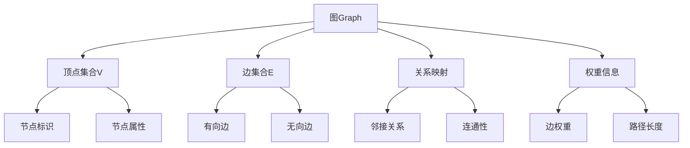

# 图Graph基础

## 📖 核心概念

**图（Graph）**是由顶点（Vertex）集合和边（Edge）集合组成的数据结构，用于表示实体之间的关系。图是描述复杂关系网络的最基本和最重要的数据结构。

### 🏗️ 图的组成要素



## 🔍 图的基本特征

| 特征 | 描述 | 重要性 |
|------|------|--------|
| **顶点集合** | 图中的所有节点，通常用V表示 | 图的基本组成单元 |
| **边集合** | 连接顶点的线段，通常用E表示 | 表示顶点间的关系 |
| **关系映射** | 顶点与边的连接关系 | 定义图的结构 |
| **权重信息** | 边的数值属性（可选） | 表示关系的强度或成本 |

## 📊 图的分类体系

### 按边的方向分类

| 类型 | 边特征 | 表示方法 | 应用场景 |
|------|--------|----------|----------|
| **有向图** | 边有方向，从起点到终点 | (u,v) ≠ (v,u) | 网页链接、任务依赖 |
| **无向图** | 边无方向，双向连通 | (u,v) = (v,u) | 社交网络、地图路径 |

### 按边的权重分类

| 类型 | 权重特征 | 表示方法 | 应用场景 |
|------|----------|----------|----------|
| **加权图** | 边有权重值 | w(u,v) = 数值 | 最短路径、网络流量 |
| **无权图** | 边无权重 | w(u,v) = 1 | 连通性、可达性 |

### 按连通性分类

| 类型 | 连通特征 | 判断标准 | 应用场景 |
|------|----------|----------|----------|
| **连通图** | 任意两点可达 | 只有一个连通分量 | 网络分析 |
| **非连通图** | 存在孤立顶点 | 多个连通分量 | 社交网络分析 |

## 💻 图的存储结构

### 1. 邻接矩阵

```cpp
template<typename T>
class AdjacencyMatrix {
private:
    vector<vector<T>> matrix;  // 邻接矩阵
    int vertexCount;           // 顶点数量
    bool isDirected;           // 是否为有向图
    
public:
    AdjacencyMatrix(int n, bool directed = false) 
        : vertexCount(n), isDirected(directed) {
        matrix.resize(n, vector<T>(n, 0));
    }
    
    // 添加边
    void addEdge(int from, int to, T weight = 1) {
        if (from < 0 || from >= vertexCount || 
            to < 0 || to >= vertexCount) {
            throw std::out_of_range("Invalid vertex index");
        }
        
        matrix[from][to] = weight;
        if (!isDirected) {
            matrix[to][from] = weight; // 无向图需要对称
        }
    }
    
    // 删除边
    void removeEdge(int from, int to) {
        if (from < 0 || from >= vertexCount || 
            to < 0 || to >= vertexCount) {
            throw std::out_of_range("Invalid vertex index");
        }
        
        matrix[from][to] = 0;
        if (!isDirected) {
            matrix[to][from] = 0;
        }
    }
    
    // 检查边是否存在
    bool hasEdge(int from, int to) const {
        return matrix[from][to] != 0;
    }
    
    // 获取边的权重
    T getWeight(int from, int to) const {
        return matrix[from][to];
    }
    
    // 获取顶点的度数
    int getDegree(int vertex) const {
        int degree = 0;
        for (int i = 0; i < vertexCount; i++) {
            if (matrix[vertex][i] != 0) degree++;
        }
        return degree;
    }
    
    // 获取所有邻接顶点
    vector<int> getNeighbors(int vertex) const {
        vector<int> neighbors;
        for (int i = 0; i < vertexCount; i++) {
            if (matrix[vertex][i] != 0) {
                neighbors.push_back(i);
            }
        }
        return neighbors;
    }
};
```

### 2. 邻接表

```cpp
template<typename T>
class AdjacencyList {
private:
    struct Edge {
        int to;
        T weight;
        Edge(int t, T w) : to(t), weight(w) {}
    };
    
    vector<vector<Edge>> adjList;  // 邻接表
    int vertexCount;               // 顶点数量
    bool isDirected;               // 是否为有向图
    
public:
    AdjacencyList(int n, bool directed = false) 
        : vertexCount(n), isDirected(directed) {
        adjList.resize(n);
    }
    
    // 添加边
    void addEdge(int from, int to, T weight = 1) {
        if (from < 0 || from >= vertexCount || 
            to < 0 || to >= vertexCount) {
            throw std::out_of_range("Invalid vertex index");
        }
        
        adjList[from].push_back(Edge(to, weight));
        if (!isDirected) {
            adjList[to].push_back(Edge(from, weight));
        }
    }
    
    // 删除边
    void removeEdge(int from, int to) {
        if (from < 0 || from >= vertexCount || 
            to < 0 || to >= vertexCount) {
            throw std::out_of_range("Invalid vertex index");
        }
        
        // 删除from到to的边
        adjList[from].erase(
            remove_if(adjList[from].begin(), adjList[from].end(),
                [to](const Edge& e) { return e.to == to; }),
            adjList[from].end()
        );
        
        if (!isDirected) {
            // 删除to到from的边
            adjList[to].erase(
                remove_if(adjList[to].begin(), adjList[to].end(),
                    [from](const Edge& e) { return e.to == from; }),
                adjList[to].end()
            );
        }
    }
    
    // 检查边是否存在
    bool hasEdge(int from, int to) const {
        for (const Edge& edge : adjList[from]) {
            if (edge.to == to) return true;
        }
        return false;
    }
    
    // 获取边的权重
    T getWeight(int from, int to) const {
        for (const Edge& edge : adjList[from]) {
            if (edge.to == to) return edge.weight;
        }
        return 0; // 边不存在
    }
    
    // 获取顶点的度数
    int getDegree(int vertex) const {
        return adjList[vertex].size();
    }
    
    // 获取所有邻接顶点
    vector<int> getNeighbors(int vertex) const {
        vector<int> neighbors;
        for (const Edge& edge : adjList[vertex]) {
            neighbors.push_back(edge.to);
        }
        return neighbors;
    }
};
```

## ⚡ 存储方式对比

### 空间复杂度

| 存储方式 | 空间复杂度 | 适用场景 |
|----------|------------|----------|
| **邻接矩阵** | O(V²) | 稠密图，频繁查询边 |
| **邻接表** | O(V + E) | 稀疏图，遍历邻接点 |

### 时间复杂度

| 操作 | 邻接矩阵 | 邻接表 |
|------|----------|--------|
| **添加边** | O(1) | O(1) |
| **删除边** | O(1) | O(degree) |
| **查询边** | O(1) | O(degree) |
| **遍历邻接点** | O(V) | O(degree) |

## 🎯 图的基本操作

### 1. 图的遍历框架

```cpp
template<typename T>
class GraphTraversal {
protected:
    vector<bool> visited;
    int vertexCount;
    
public:
    GraphTraversal(int n) : vertexCount(n) {
        visited.resize(n, false);
    }
    
    // 重置访问状态
    void reset() {
        fill(visited.begin(), visited.end(), false);
    }
    
    // 检查是否已访问
    bool isVisited(int vertex) const {
        return visited[vertex];
    }
    
    // 标记为已访问
    void markVisited(int vertex) {
        visited[vertex] = true;
    }
};
```

### 2. 深度优先搜索（DFS）

```cpp
template<typename T>
class DFS : public GraphTraversal<T> {
private:
    const AdjacencyList<T>& graph;
    
public:
    DFS(const AdjacencyList<T>& g) 
        : GraphTraversal<T>(g.getVertexCount()), graph(g) {}
    
    // 递归DFS
    void dfsRecursive(int start, vector<int>& result) {
        this->markVisited(start);
        result.push_back(start);
        
        for (const auto& edge : graph.getNeighbors(start)) {
            if (!this->isVisited(edge.to)) {
                dfsRecursive(edge.to, result);
            }
        }
    }
    
    // 迭代DFS
    void dfsIterative(int start, vector<int>& result) {
        stack<int> stk;
        stk.push(start);
        
        while (!stk.empty()) {
            int current = stk.top();
            stk.pop();
            
            if (!this->isVisited(current)) {
                this->markVisited(current);
                result.push_back(current);
                
                // 将邻接点压入栈（逆序）
                auto neighbors = graph.getNeighbors(current);
                for (auto it = neighbors.rbegin(); it != neighbors.rend(); ++it) {
                    if (!this->isVisited(*it)) {
                        stk.push(*it);
                    }
                }
            }
        }
    }
};
```

### 3. 广度优先搜索（BFS）

```cpp
template<typename T>
class BFS : public GraphTraversal<T> {
private:
    const AdjacencyList<T>& graph;
    
public:
    BFS(const AdjacencyList<T>& g) 
        : GraphTraversal<T>(g.getVertexCount()), graph(g) {}
    
    // BFS实现
    void bfs(int start, vector<int>& result) {
        queue<int> q;
        q.push(start);
        this->markVisited(start);
        
        while (!q.empty()) {
            int current = q.front();
            q.pop();
            result.push_back(current);
            
            for (const auto& edge : graph.getNeighbors(current)) {
                if (!this->isVisited(edge.to)) {
                    this->markVisited(edge.to);
                    q.push(edge.to);
                }
            }
        }
    }
    
    // 最短路径（无权图）
    vector<int> shortestPath(int start, int end) {
        vector<int> parent(this->vertexCount, -1);
        queue<int> q;
        
        q.push(start);
        this->markVisited(start);
        
        while (!q.empty()) {
            int current = q.front();
            q.pop();
            
            if (current == end) break;
            
            for (const auto& edge : graph.getNeighbors(current)) {
                if (!this->isVisited(edge.to)) {
                    this->markVisited(edge.to);
                    parent[edge.to] = current;
                    q.push(edge.to);
                }
            }
        }
        
        // 重构路径
        vector<int> path;
        if (parent[end] != -1 || start == end) {
            int current = end;
            while (current != -1) {
                path.push_back(current);
                current = parent[current];
            }
            reverse(path.begin(), path.end());
        }
        
        return path;
    }
};
```

## 🔧 图的实用工具

### 1. 连通性检测

```cpp
template<typename T>
class ConnectivityChecker {
private:
    const AdjacencyList<T>& graph;
    
public:
    ConnectivityChecker(const AdjacencyList<T>& g) : graph(g) {}
    
    // 检查图是否连通
    bool isConnected() {
        if (graph.getVertexCount() == 0) return true;
        
        DFS<T> dfs(graph);
        vector<int> result;
        dfs.dfsRecursive(0, result);
        
        return result.size() == graph.getVertexCount();
    }
    
    // 获取连通分量
    vector<vector<int>> getConnectedComponents() {
        vector<vector<int>> components;
        vector<bool> visited(graph.getVertexCount(), false);
        
        for (int i = 0; i < graph.getVertexCount(); i++) {
            if (!visited[i]) {
                vector<int> component;
                DFS<T> dfs(graph);
                dfs.dfsRecursive(i, component);
                components.push_back(component);
            }
        }
        
        return components;
    }
};
```

### 2. 环检测

```cpp
template<typename T>
class CycleDetector {
private:
    const AdjacencyList<T>& graph;
    
public:
    CycleDetector(const AdjacencyList<T>& g) : graph(g) {}
    
    // 检测无向图中的环
    bool hasCycleUndirected() {
        vector<bool> visited(graph.getVertexCount(), false);
        
        for (int i = 0; i < graph.getVertexCount(); i++) {
            if (!visited[i]) {
                if (hasCycleDFS(i, -1, visited)) {
                    return true;
                }
            }
        }
        return false;
    }
    
private:
    bool hasCycleDFS(int vertex, int parent, vector<bool>& visited) {
        visited[vertex] = true;
        
        for (const auto& edge : graph.getNeighbors(vertex)) {
            if (!visited[edge.to]) {
                if (hasCycleDFS(edge.to, vertex, visited)) {
                    return true;
                }
            } else if (edge.to != parent) {
                return true; // 发现回边
            }
        }
        return false;
    }
};
```

## 📈 图的应用场景

### 1. 社交网络分析

```cpp
class SocialNetwork {
private:
    AdjacencyList<int> graph;
    
public:
    SocialNetwork(int userCount) : graph(userCount, false) {}
    
    // 添加好友关系
    void addFriendship(int user1, int user2) {
        graph.addEdge(user1, user2);
    }
    
    // 查找共同好友
    vector<int> findCommonFriends(int user1, int user2) {
        vector<int> friends1 = graph.getNeighbors(user1);
        vector<int> friends2 = graph.getNeighbors(user2);
        
        vector<int> common;
        set_intersection(friends1.begin(), friends1.end(),
                        friends2.begin(), friends2.end(),
                        back_inserter(common));
        return common;
    }
    
    // 计算用户影响力（度数中心性）
    double calculateInfluence(int user) {
        int degree = graph.getDegree(user);
        return (double)degree / (graph.getVertexCount() - 1);
    }
};
```

### 2. 网络拓扑分析

```cpp
class NetworkTopology {
private:
    AdjacencyList<double> graph;
    
public:
    NetworkTopology(int nodeCount) : graph(nodeCount, true) {}
    
    // 添加网络连接
    void addConnection(int from, int to, double bandwidth) {
        graph.addEdge(from, to, bandwidth);
    }
    
    // 计算网络可靠性
    double calculateReliability() {
        ConnectivityChecker<double> checker(graph);
        return checker.isConnected() ? 1.0 : 0.0;
    }
    
    // 查找关键节点（高度数节点）
    vector<int> findCriticalNodes(int threshold) {
        vector<int> critical;
        for (int i = 0; i < graph.getVertexCount(); i++) {
            if (graph.getDegree(i) >= threshold) {
                critical.push_back(i);
            }
        }
        return critical;
    }
};
```

## 🎓 学习要点总结

### 核心理解

1. **图的基本概念**：理解顶点、边、权重的关系
2. **存储结构选择**：根据图的特点选择合适的存储方式
3. **遍历算法**：掌握DFS和BFS的实现和应用
4. **连通性分析**：理解图的连通性和环检测

### 实践要点

1. **邻接表实现**：熟练实现邻接表的各种操作
2. **遍历算法**：掌握递归和迭代两种实现方式
3. **路径查找**：理解最短路径的基本思想
4. **环检测**：区分有向图和无向图的环检测

### 应用思维

1. **网络分析**：理解图在网络分析中的应用
2. **社交网络**：掌握图在社交关系分析中的作用
3. **路径规划**：理解图在路径优化中的应用
4. **依赖关系**：掌握图在任务调度中的应用

---

**相关链接：**
- [[03-层次宇宙/02-二叉树王国/01-二叉树基础|二叉树基础]] - 理解树的基本概念
- [[03-层次宇宙/04-图论天地/02-图的遍历算法|图的遍历算法]] - 深度和广度优先搜索
- [[03-层次宇宙/04-图论天地/03-最短路径算法|最短路径算法]] - Dijkstra和Floyd算法
- [[04-算法武器库/01-搜索技术/01-深度优先搜索|深度优先搜索]] - DFS的详细实现
