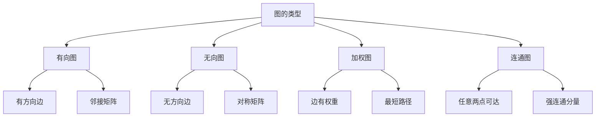

# 图论天地

## 📖 核心概念

**图**是由顶点和边组成的非线性数据结构。图论是计算机科学中的重要分支，广泛应用于网络、社交关系、路径规划等领域。

### 🏗️ 图的类型



## 🔧 图的表示

### 邻接矩阵

```cpp
class GraphMatrix {
private:
    vector<vector<int>> adjMatrix;
    int vertices;
    bool directed;
    
public:
    GraphMatrix(int v, bool dir = false) : vertices(v), directed(dir) {
        adjMatrix.resize(v, vector<int>(v, 0));
    }
    
    void addEdge(int from, int to, int weight = 1) {
        adjMatrix[from][to] = weight;
        if (!directed) {
            adjMatrix[to][from] = weight;
        }
    }
    
    void removeEdge(int from, int to) {
        adjMatrix[from][to] = 0;
        if (!directed) {
            adjMatrix[to][from] = 0;
        }
    }
    
    bool hasEdge(int from, int to) {
        return adjMatrix[from][to] != 0;
    }
    
    int getWeight(int from, int to) {
        return adjMatrix[from][to];
    }
    
    void display() {
        for (int i = 0; i < vertices; ++i) {
            for (int j = 0; j < vertices; ++j) {
                cout << adjMatrix[i][j] << " ";
            }
            cout << endl;
        }
    }
    
    vector<int> getNeighbors(int vertex) {
        vector<int> neighbors;
        for (int i = 0; i < vertices; ++i) {
            if (adjMatrix[vertex][i] != 0) {
                neighbors.push_back(i);
            }
        }
        return neighbors;
    }
};
```

### 邻接表

```cpp
class GraphList {
private:
    struct Edge {
        int to;
        int weight;
        Edge(int t, int w = 1) : to(t), weight(w) {}
    };
    
    vector<vector<Edge>> adjList;
    int vertices;
    bool directed;
    
public:
    GraphList(int v, bool dir = false) : vertices(v), directed(dir) {
        adjList.resize(v);
    }
    
    void addEdge(int from, int to, int weight = 1) {
        adjList[from].push_back(Edge(to, weight));
        if (!directed) {
            adjList[to].push_back(Edge(from, weight));
        }
    }
    
    void removeEdge(int from, int to) {
        for (auto it = adjList[from].begin(); it != adjList[from].end(); ++it) {
            if (it->to == to) {
                adjList[from].erase(it);
                break;
            }
        }
        
        if (!directed) {
            for (auto it = adjList[to].begin(); it != adjList[to].end(); ++it) {
                if (it->to == from) {
                    adjList[to].erase(it);
                    break;
                }
            }
        }
    }
    
    bool hasEdge(int from, int to) {
        for (const Edge& edge : adjList[from]) {
            if (edge.to == to) {
                return true;
            }
        }
        return false;
    }
    
    int getWeight(int from, int to) {
        for (const Edge& edge : adjList[from]) {
            if (edge.to == to) {
                return edge.weight;
            }
        }
        return 0;
    }
    
    void display() {
        for (int i = 0; i < vertices; ++i) {
            cout << "Vertex " << i << ": ";
            for (const Edge& edge : adjList[i]) {
                cout << "(" << edge.to << "," << edge.weight << ") ";
            }
            cout << endl;
        }
    }
    
    vector<int> getNeighbors(int vertex) {
        vector<int> neighbors;
        for (const Edge& edge : adjList[vertex]) {
            neighbors.push_back(edge.to);
        }
        return neighbors;
    }
};
```

## 🎯 图的遍历

### 深度优先搜索

```cpp
class DFS {
public:
    static vector<int> dfs(GraphList& graph, int start) {
        vector<int> result;
        vector<bool> visited(graph.vertices, false);
        
        dfsHelper(graph, start, visited, result);
        return result;
    }
    
    static void dfsHelper(GraphList& graph, int vertex, vector<bool>& visited, vector<int>& result) {
        visited[vertex] = true;
        result.push_back(vertex);
        
        vector<int> neighbors = graph.getNeighbors(vertex);
        for (int neighbor : neighbors) {
            if (!visited[neighbor]) {
                dfsHelper(graph, neighbor, visited, result);
            }
        }
    }
    
    static bool hasPath(GraphList& graph, int from, int to) {
        vector<bool> visited(graph.vertices, false);
        return hasPathHelper(graph, from, to, visited);
    }
    
    static bool hasPathHelper(GraphList& graph, int from, int to, vector<bool>& visited) {
        if (from == to) return true;
        
        visited[from] = true;
        vector<int> neighbors = graph.getNeighbors(from);
        
        for (int neighbor : neighbors) {
            if (!visited[neighbor] && hasPathHelper(graph, neighbor, to, visited)) {
                return true;
            }
        }
        
        return false;
    }
};
```

### 广度优先搜索

```cpp
class BFS {
public:
    static vector<int> bfs(GraphList& graph, int start) {
        vector<int> result;
        vector<bool> visited(graph.vertices, false);
        queue<int> q;
        
        q.push(start);
        visited[start] = true;
        
        while (!q.empty()) {
            int vertex = q.front();
            q.pop();
            result.push_back(vertex);
            
            vector<int> neighbors = graph.getNeighbors(vertex);
            for (int neighbor : neighbors) {
                if (!visited[neighbor]) {
                    visited[neighbor] = true;
                    q.push(neighbor);
                }
            }
        }
        
        return result;
    }
    
    static int shortestPath(GraphList& graph, int from, int to) {
        vector<bool> visited(graph.vertices, false);
        vector<int> distance(graph.vertices, -1);
        queue<int> q;
        
        q.push(from);
        visited[from] = true;
        distance[from] = 0;
        
        while (!q.empty()) {
            int vertex = q.front();
            q.pop();
            
            if (vertex == to) {
                return distance[vertex];
            }
            
            vector<int> neighbors = graph.getNeighbors(vertex);
            for (int neighbor : neighbors) {
                if (!visited[neighbor]) {
                    visited[neighbor] = true;
                    distance[neighbor] = distance[vertex] + 1;
                    q.push(neighbor);
                }
            }
        }
        
        return -1;
    }
};
```

## 📊 最短路径算法

### Dijkstra算法

```cpp
class Dijkstra {
public:
    static vector<int> shortestPath(GraphList& graph, int start) {
        vector<int> distance(graph.vertices, INT_MAX);
        vector<bool> visited(graph.vertices, false);
        priority_queue<pair<int, int>, vector<pair<int, int>>, greater<pair<int, int>>> pq;
        
        distance[start] = 0;
        pq.push({0, start});
        
        while (!pq.empty()) {
            int u = pq.top().second;
            pq.pop();
            
            if (visited[u]) continue;
            visited[u] = true;
            
            vector<int> neighbors = graph.getNeighbors(u);
            for (int v : neighbors) {
                int weight = graph.getWeight(u, v);
                if (!visited[v] && distance[u] + weight < distance[v]) {
                    distance[v] = distance[u] + weight;
                    pq.push({distance[v], v});
                }
            }
        }
        
        return distance;
    }
};
```

### Floyd-Warshall算法

```cpp
class FloydWarshall {
public:
    static vector<vector<int>> allPairsShortestPath(GraphMatrix& graph) {
        int n = graph.vertices;
        vector<vector<int>> dist(n, vector<int>(n, INT_MAX));
        
        // 初始化距离矩阵
        for (int i = 0; i < n; ++i) {
            for (int j = 0; j < n; ++j) {
                if (i == j) {
                    dist[i][j] = 0;
                } else if (graph.hasEdge(i, j)) {
                    dist[i][j] = graph.getWeight(i, j);
                }
            }
        }
        
        // Floyd-Warshall算法
        for (int k = 0; k < n; ++k) {
            for (int i = 0; i < n; ++i) {
                for (int j = 0; j < n; ++j) {
                    if (dist[i][k] != INT_MAX && dist[k][j] != INT_MAX) {
                        dist[i][j] = min(dist[i][j], dist[i][k] + dist[k][j]);
                    }
                }
            }
        }
        
        return dist;
    }
};
```

## 🎮 图的应用

### 1. 拓扑排序

```cpp
class TopologicalSort {
public:
    static vector<int> topologicalSort(GraphList& graph) {
        vector<int> result;
        vector<int> inDegree(graph.vertices, 0);
        queue<int> q;
        
        // 计算入度
        for (int i = 0; i < graph.vertices; ++i) {
            vector<int> neighbors = graph.getNeighbors(i);
            for (int neighbor : neighbors) {
                inDegree[neighbor]++;
            }
        }
        
        // 找到入度为0的顶点
        for (int i = 0; i < graph.vertices; ++i) {
            if (inDegree[i] == 0) {
                q.push(i);
            }
        }
        
        // 拓扑排序
        while (!q.empty()) {
            int vertex = q.front();
            q.pop();
            result.push_back(vertex);
            
            vector<int> neighbors = graph.getNeighbors(vertex);
            for (int neighbor : neighbors) {
                inDegree[neighbor]--;
                if (inDegree[neighbor] == 0) {
                    q.push(neighbor);
                }
            }
        }
        
        return result;
    }
};
```

### 2. 最小生成树

```cpp
class MinimumSpanningTree {
public:
    static vector<pair<int, int>> kruskal(GraphList& graph) {
        vector<pair<int, int>> result;
        vector<pair<int, pair<int, int>>> edges;
        
        // 收集所有边
        for (int i = 0; i < graph.vertices; ++i) {
            vector<int> neighbors = graph.getNeighbors(i);
            for (int neighbor : neighbors) {
                if (i < neighbor) {  // 避免重复
                    int weight = graph.getWeight(i, neighbor);
                    edges.push_back({weight, {i, neighbor}});
                }
            }
        }
        
        // 按权重排序
        sort(edges.begin(), edges.end());
        
        // Union-Find
        vector<int> parent(graph.vertices);
        iota(parent.begin(), parent.end(), 0);
        
        for (const auto& edge : edges) {
            int u = edge.second.first;
            int v = edge.second.second;
            
            int rootU = findRoot(parent, u);
            int rootV = findRoot(parent, v);
            
            if (rootU != rootV) {
                result.push_back({u, v});
                parent[rootU] = rootV;
            }
        }
        
        return result;
    }
    
private:
    static int findRoot(vector<int>& parent, int x) {
        if (parent[x] != x) {
            parent[x] = findRoot(parent, parent[x]);
        }
        return parent[x];
    }
};
```

## 🔗 相关链接

- [[01-树形基础|树形基础]]
- [[02-二叉树王国|二叉树王国]]
- [[03-堆与优先|堆与优先]]

## 💡 图论天地要点

1. **图表示**：邻接矩阵和邻接表两种表示方法
2. **图遍历**：DFS和BFS两种遍历算法
3. **最短路径**：Dijkstra和Floyd-Warshall算法
4. **图应用**：拓扑排序、最小生成树等

---

*📝 天地提示：图论是计算机科学的重要分支，掌握图算法对解决复杂问题很有帮助*
