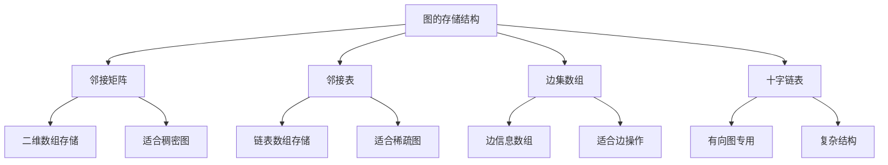

# 图的存储结构

## 📖 核心概念

**图的存储结构**是图论中的基础概念，不同的存储结构适用于不同的应用场景。选择合适的存储结构对算法的效率有重要影响。

### 🏗️ 图存储结构分类



## 🔧 图存储结构实现

### 邻接矩阵

```cpp
class AdjacencyMatrix {
private:
    vector<vector<int>> matrix;
    int vertices;
    bool directed;
    
public:
    AdjacencyMatrix(int v, bool dir = false) : vertices(v), directed(dir) {
        matrix.resize(vertices, vector<int>(vertices, 0));
    }
    
    // 添加边
    void addEdge(int from, int to, int weight = 1) {
        if (from >= 0 && from < vertices && to >= 0 && to < vertices) {
            matrix[from][to] = weight;
            if (!directed) {
                matrix[to][from] = weight;
            }
        }
    }
    
    // 删除边
    void removeEdge(int from, int to) {
        if (from >= 0 && from < vertices && to >= 0 && to < vertices) {
            matrix[from][to] = 0;
            if (!directed) {
                matrix[to][from] = 0;
            }
        }
    }
    
    // 检查边是否存在
    bool hasEdge(int from, int to) {
        if (from >= 0 && from < vertices && to >= 0 && to < vertices) {
            return matrix[from][to] != 0;
        }
        return false;
    }
    
    // 获取边的权重
    int getWeight(int from, int to) {
        if (from >= 0 && from < vertices && to >= 0 && to < vertices) {
            return matrix[from][to];
        }
        return 0;
    }
    
    // 获取顶点的度
    int getDegree(int vertex) {
        if (vertex < 0 || vertex >= vertices) return 0;
        
        int degree = 0;
        for (int i = 0; i < vertices; ++i) {
            if (matrix[vertex][i] != 0) degree++;
            if (!directed && matrix[i][vertex] != 0) degree++;
        }
        
        return directed ? degree : degree / 2;
    }
    
    // 获取顶点的邻居
    vector<int> getNeighbors(int vertex) {
        vector<int> neighbors;
        if (vertex >= 0 && vertex < vertices) {
            for (int i = 0; i < vertices; ++i) {
                if (matrix[vertex][i] != 0) {
                    neighbors.push_back(i);
                }
            }
        }
        return neighbors;
    }
    
    // 显示邻接矩阵
    void display() {
        cout << "Adjacency Matrix:" << endl;
        cout << "================" << endl;
        
        cout << "  ";
        for (int i = 0; i < vertices; ++i) {
            cout << i << " ";
        }
        cout << endl;
        
        for (int i = 0; i < vertices; ++i) {
            cout << i << " ";
            for (int j = 0; j < vertices; ++j) {
                cout << matrix[i][j] << " ";
            }
            cout << endl;
        }
    }
    
    // 获取顶点数量
    int getVertexCount() {
        return vertices;
    }
    
    // 获取边数量
    int getEdgeCount() {
        int count = 0;
        for (int i = 0; i < vertices; ++i) {
            for (int j = 0; j < vertices; ++j) {
                if (matrix[i][j] != 0) {
                    count++;
                }
            }
        }
        return directed ? count : count / 2;
    }
};
```

### 邻接表

```cpp
class AdjacencyList {
private:
    struct Edge {
        int destination;
        int weight;
        
        Edge(int dest, int w = 1) : destination(dest), weight(w) {}
    };
    
    vector<vector<Edge>> adjacencyList;
    int vertices;
    bool directed;
    
public:
    AdjacencyList(int v, bool dir = false) : vertices(v), directed(dir) {
        adjacencyList.resize(vertices);
    }
    
    // 添加边
    void addEdge(int from, int to, int weight = 1) {
        if (from >= 0 && from < vertices && to >= 0 && to < vertices) {
            adjacencyList[from].push_back(Edge(to, weight));
            if (!directed) {
                adjacencyList[to].push_back(Edge(from, weight));
            }
        }
    }
    
    // 删除边
    void removeEdge(int from, int to) {
        if (from >= 0 && from < vertices && to >= 0 && to < vertices) {
            // 删除from到to的边
            for (auto it = adjacencyList[from].begin(); it != adjacencyList[from].end(); ++it) {
                if (it->destination == to) {
                    adjacencyList[from].erase(it);
                    break;
                }
            }
            
            if (!directed) {
                // 删除to到from的边
                for (auto it = adjacencyList[to].begin(); it != adjacencyList[to].end(); ++it) {
                    if (it->destination == from) {
                        adjacencyList[to].erase(it);
                        break;
                    }
                }
            }
        }
    }
    
    // 检查边是否存在
    bool hasEdge(int from, int to) {
        if (from >= 0 && from < vertices && to >= 0 && to < vertices) {
            for (const Edge& edge : adjacencyList[from]) {
                if (edge.destination == to) {
                    return true;
                }
            }
        }
        return false;
    }
    
    // 获取边的权重
    int getWeight(int from, int to) {
        if (from >= 0 && from < vertices && to >= 0 && to < vertices) {
            for (const Edge& edge : adjacencyList[from]) {
                if (edge.destination == to) {
                    return edge.weight;
                }
            }
        }
        return 0;
    }
    
    // 获取顶点的度
    int getDegree(int vertex) {
        if (vertex < 0 || vertex >= vertices) return 0;
        return adjacencyList[vertex].size();
    }
    
    // 获取顶点的邻居
    vector<int> getNeighbors(int vertex) {
        vector<int> neighbors;
        if (vertex >= 0 && vertex < vertices) {
            for (const Edge& edge : adjacencyList[vertex]) {
                neighbors.push_back(edge.destination);
            }
        }
        return neighbors;
    }
    
    // 显示邻接表
    void display() {
        cout << "Adjacency List:" << endl;
        cout << "==============" << endl;
        
        for (int i = 0; i < vertices; ++i) {
            cout << i << ": ";
            for (const Edge& edge : adjacencyList[i]) {
                cout << "(" << edge.destination << ", " << edge.weight << ") ";
            }
            cout << endl;
        }
    }
    
    // 获取顶点数量
    int getVertexCount() {
        return vertices;
    }
    
    // 获取边数量
    int getEdgeCount() {
        int count = 0;
        for (int i = 0; i < vertices; ++i) {
            count += adjacencyList[i].size();
        }
        return directed ? count : count / 2;
    }
};
```

### 边集数组

```cpp
class EdgeSet {
private:
    struct Edge {
        int from;
        int to;
        int weight;
        
        Edge(int f, int t, int w = 1) : from(f), to(t), weight(w) {}
    };
    
    vector<Edge> edges;
    int vertices;
    bool directed;
    
public:
    EdgeSet(int v, bool dir = false) : vertices(v), directed(dir) {}
    
    // 添加边
    void addEdge(int from, int to, int weight = 1) {
        if (from >= 0 && from < vertices && to >= 0 && to < vertices) {
            edges.push_back(Edge(from, to, weight));
            if (!directed) {
                edges.push_back(Edge(to, from, weight));
            }
        }
    }
    
    // 删除边
    void removeEdge(int from, int to) {
        for (auto it = edges.begin(); it != edges.end(); ++it) {
            if (it->from == from && it->to == to) {
                edges.erase(it);
                if (!directed) {
                    // 删除反向边
                    for (auto it2 = edges.begin(); it2 != edges.end(); ++it2) {
                        if (it2->from == to && it2->to == from) {
                            edges.erase(it2);
                            break;
                        }
                    }
                }
                break;
            }
        }
    }
    
    // 检查边是否存在
    bool hasEdge(int from, int to) {
        for (const Edge& edge : edges) {
            if (edge.from == from && edge.to == to) {
                return true;
            }
        }
        return false;
    }
    
    // 获取边的权重
    int getWeight(int from, int to) {
        for (const Edge& edge : edges) {
            if (edge.from == from && edge.to == to) {
                return edge.weight;
            }
        }
        return 0;
    }
    
    // 获取顶点的度
    int getDegree(int vertex) {
        int degree = 0;
        for (const Edge& edge : edges) {
            if (edge.from == vertex) {
                degree++;
            }
        }
        return degree;
    }
    
    // 获取顶点的邻居
    vector<int> getNeighbors(int vertex) {
        vector<int> neighbors;
        for (const Edge& edge : edges) {
            if (edge.from == vertex) {
                neighbors.push_back(edge.to);
            }
        }
        return neighbors;
    }
    
    // 显示边集
    void display() {
        cout << "Edge Set:" << endl;
        cout << "=========" << endl;
        
        for (const Edge& edge : edges) {
            cout << "(" << edge.from << ", " << edge.to << ", " << edge.weight << ") ";
        }
        cout << endl;
    }
    
    // 获取顶点数量
    int getVertexCount() {
        return vertices;
    }
    
    // 获取边数量
    int getEdgeCount() {
        return directed ? edges.size() : edges.size() / 2;
    }
    
    // 获取所有边
    vector<Edge> getAllEdges() {
        return edges;
    }
};
```

### 十字链表

```cpp
class OrthogonalList {
private:
    struct EdgeNode {
        int from;
        int to;
        int weight;
        EdgeNode* fromNext;
        EdgeNode* toNext;
        
        EdgeNode(int f, int t, int w = 1) : from(f), to(t), weight(w), fromNext(nullptr), toNext(nullptr) {}
    };
    
    struct VertexNode {
        int vertex;
        EdgeNode* firstOut;
        EdgeNode* firstIn;
        
        VertexNode(int v) : vertex(v), firstOut(nullptr), firstIn(nullptr) {}
    };
    
    vector<VertexNode> vertices;
    int vertexCount;
    
public:
    OrthogonalList(int v) : vertexCount(v) {
        vertices.resize(vertexCount);
        for (int i = 0; i < vertexCount; ++i) {
            vertices[i] = VertexNode(i);
        }
    }
    
    // 添加边
    void addEdge(int from, int to, int weight = 1) {
        if (from >= 0 && from < vertexCount && to >= 0 && to < vertexCount) {
            EdgeNode* newEdge = new EdgeNode(from, to, weight);
            
            // 添加到出边链表
            newEdge->fromNext = vertices[from].firstOut;
            vertices[from].firstOut = newEdge;
            
            // 添加到入边链表
            newEdge->toNext = vertices[to].firstIn;
            vertices[to].firstIn = newEdge;
        }
    }
    
    // 删除边
    void removeEdge(int from, int to) {
        if (from >= 0 && from < vertexCount && to >= 0 && to < vertexCount) {
            // 从出边链表中删除
            EdgeNode* prev = nullptr;
            EdgeNode* current = vertices[from].firstOut;
            
            while (current && !(current->from == from && current->to == to)) {
                prev = current;
                current = current->fromNext;
            }
            
            if (current) {
                if (prev) {
                    prev->fromNext = current->fromNext;
                } else {
                    vertices[from].firstOut = current->fromNext;
                }
            }
            
            // 从入边链表中删除
            prev = nullptr;
            current = vertices[to].firstIn;
            
            while (current && !(current->from == from && current->to == to)) {
                prev = current;
                current = current->toNext;
            }
            
            if (current) {
                if (prev) {
                    prev->toNext = current->toNext;
                } else {
                    vertices[to].firstIn = current->toNext;
                }
                
                delete current;
            }
        }
    }
    
    // 检查边是否存在
    bool hasEdge(int from, int to) {
        if (from >= 0 && from < vertexCount && to >= 0 && to < vertexCount) {
            EdgeNode* current = vertices[from].firstOut;
            while (current) {
                if (current->to == to) {
                    return true;
                }
                current = current->fromNext;
            }
        }
        return false;
    }
    
    // 获取边的权重
    int getWeight(int from, int to) {
        if (from >= 0 && from < vertexCount && to >= 0 && to < vertexCount) {
            EdgeNode* current = vertices[from].firstOut;
            while (current) {
                if (current->to == to) {
                    return current->weight;
                }
                current = current->fromNext;
            }
        }
        return 0;
    }
    
    // 获取顶点的出度
    int getOutDegree(int vertex) {
        int degree = 0;
        EdgeNode* current = vertices[vertex].firstOut;
        while (current) {
            degree++;
            current = current->fromNext;
        }
        return degree;
    }
    
    // 获取顶点的入度
    int getInDegree(int vertex) {
        int degree = 0;
        EdgeNode* current = vertices[vertex].firstIn;
        while (current) {
            degree++;
            current = current->toNext;
        }
        return degree;
    }
    
    // 获取顶点的出边邻居
    vector<int> getOutNeighbors(int vertex) {
        vector<int> neighbors;
        EdgeNode* current = vertices[vertex].firstOut;
        while (current) {
            neighbors.push_back(current->to);
            current = current->fromNext;
        }
        return neighbors;
    }
    
    // 获取顶点的入边邻居
    vector<int> getInNeighbors(int vertex) {
        vector<int> neighbors;
        EdgeNode* current = vertices[vertex].firstIn;
        while (current) {
            neighbors.push_back(current->from);
            current = current->toNext;
        }
        return neighbors;
    }
    
    // 显示十字链表
    void display() {
        cout << "Orthogonal List:" << endl;
        cout << "===============" << endl;
        
        for (int i = 0; i < vertexCount; ++i) {
            cout << "Vertex " << i << ":" << endl;
            
            cout << "  Out edges: ";
            EdgeNode* current = vertices[i].firstOut;
            while (current) {
                cout << "(" << current->to << ", " << current->weight << ") ";
                current = current->fromNext;
            }
            cout << endl;
            
            cout << "  In edges: ";
            current = vertices[i].firstIn;
            while (current) {
                cout << "(" << current->from << ", " << current->weight << ") ";
                current = current->toNext;
            }
            cout << endl;
        }
    }
    
    // 获取顶点数量
    int getVertexCount() {
        return vertexCount;
    }
    
    // 获取边数量
    int getEdgeCount() {
        int count = 0;
        for (int i = 0; i < vertexCount; ++i) {
            EdgeNode* current = vertices[i].firstOut;
            while (current) {
                count++;
                current = current->fromNext;
            }
        }
        return count;
    }
};
```

## 🎯 图存储结构应用

### 图存储结构比较

```cpp
class GraphStorageComparison {
public:
    static void compareStorageStructures() {
        cout << "Graph Storage Structure Comparison:" << endl;
        cout << "=================================" << endl;
        
        cout << "1. Adjacency Matrix:" << endl;
        cout << "   - Space Complexity: O(V²)" << endl;
        cout << "   - Time Complexity:" << endl;
        cout << "     * Add Edge: O(1)" << endl;
        cout << "     * Remove Edge: O(1)" << endl;
        cout << "     * Check Edge: O(1)" << endl;
        cout << "     * Get Neighbors: O(V)" << endl;
        cout << "   - Advantages: Simple, fast edge operations" << endl;
        cout << "   - Disadvantages: High space complexity" << endl;
        cout << "   - Best for: Dense graphs, small graphs" << endl;
        
        cout << "2. Adjacency List:" << endl;
        cout << "   - Space Complexity: O(V + E)" << endl;
        cout << "   - Time Complexity:" << endl;
        cout << "     * Add Edge: O(1)" << endl;
        cout << "     * Remove Edge: O(degree)" << endl;
        cout << "     * Check Edge: O(degree)" << endl;
        cout << "     * Get Neighbors: O(degree)" << endl;
        cout << "   - Advantages: Space efficient, good for sparse graphs" << endl;
        cout << "   - Disadvantages: Slower edge operations" << endl;
        cout << "   - Best for: Sparse graphs, large graphs" << endl;
        
        cout << "3. Edge Set:" << endl;
        cout << "   - Space Complexity: O(E)" << endl;
        cout << "   - Time Complexity:" << endl;
        cout << "     * Add Edge: O(1)" << endl;
        cout << "     * Remove Edge: O(E)" << endl;
        cout << "     * Check Edge: O(E)" << endl;
        cout << "     * Get Neighbors: O(E)" << endl;
        cout << "   - Advantages: Simple, good for edge operations" << endl;
        cout << "   - Disadvantages: Slow vertex operations" << endl;
        cout << "   - Best for: Edge-centric algorithms" << endl;
        
        cout << "4. Orthogonal List:" << endl;
        cout << "   - Space Complexity: O(V + E)" << endl;
        cout << "   - Time Complexity:" << endl;
        cout << "     * Add Edge: O(1)" << endl;
        cout << "     * Remove Edge: O(degree)" << endl;
        cout << "     * Check Edge: O(degree)" << endl;
        cout << "     * Get Neighbors: O(degree)" << endl;
        cout << "   - Advantages: Efficient for directed graphs" << endl;
        cout << "   - Disadvantages: Complex implementation" << endl;
        cout << "   - Best for: Directed graphs, complex operations" << endl;
    }
    
    static void analyzePerformance() {
        cout << "Performance Analysis:" << endl;
        cout << "===================" << endl;
        
        cout << "1. Space Efficiency:" << endl;
        cout << "   - Sparse graphs: Adjacency List > Edge Set > Orthogonal List > Adjacency Matrix" << endl;
        cout << "   - Dense graphs: Adjacency Matrix > Adjacency List > Orthogonal List > Edge Set" << endl;
        
        cout << "2. Time Efficiency:" << endl;
        cout << "   - Edge operations: Adjacency Matrix > Adjacency List > Orthogonal List > Edge Set" << endl;
        cout << "   - Vertex operations: Adjacency List > Orthogonal List > Adjacency Matrix > Edge Set" << endl;
        
        cout << "3. Cache Performance:" << endl;
        cout << "   - Adjacency Matrix: Good (sequential access)" << endl;
        cout << "   - Adjacency List: Poor (random access)" << endl;
        cout << "   - Edge Set: Poor (random access)" << endl;
        cout << "   - Orthogonal List: Poor (random access)" << endl;
    }
};
```

### 图存储结构选择

```cpp
class GraphStorageSelection {
public:
    static void selectStorageStructure(int vertices, int edges, bool directed, string algorithm) {
        cout << "Graph Storage Structure Selection:" << endl;
        cout << "=================================" << endl;
        
        cout << "Graph properties:" << endl;
        cout << "  Vertices: " << vertices << endl;
        cout << "  Edges: " << edges << endl;
        cout << "  Directed: " << (directed ? "Yes" : "No") << endl;
        cout << "  Algorithm: " << algorithm << endl;
        
        double density = (double)edges / (vertices * (vertices - 1) / 2);
        cout << "  Density: " << density << endl;
        
        cout << "Recommendation:" << endl;
        
        if (density > 0.5) {
            cout << "  Use Adjacency Matrix (dense graph)" << endl;
            cout << "  Reason: High density, fast edge operations" << endl;
        } else if (algorithm == "BFS" || algorithm == "DFS") {
            cout << "  Use Adjacency List (traversal algorithms)" << endl;
            cout << "  Reason: Efficient neighbor access" << endl;
        } else if (algorithm == "Kruskal" || algorithm == "Prim") {
            cout << "  Use Edge Set (MST algorithms)" << endl;
            cout << "  Reason: Edge-centric operations" << endl;
        } else if (directed) {
            cout << "  Use Orthogonal List (directed graph)" << endl;
            cout << "  Reason: Efficient in/out degree operations" << endl;
        } else {
            cout << "  Use Adjacency List (general purpose)" << endl;
            cout << "  Reason: Balanced performance" << endl;
        }
    }
    
    static void analyzeMemoryUsage(int vertices, int edges, bool directed) {
        cout << "Memory Usage Analysis:" << endl;
        cout << "====================" << endl;
        
        int matrixMemory = vertices * vertices * sizeof(int);
        int listMemory = (vertices + edges) * sizeof(int);
        int edgeSetMemory = edges * sizeof(int) * 3;
        int orthogonalMemory = (vertices + edges) * sizeof(int) * 2;
        
        cout << "Adjacency Matrix: " << matrixMemory << " bytes" << endl;
        cout << "Adjacency List: " << listMemory << " bytes" << endl;
        cout << "Edge Set: " << edgeSetMemory << " bytes" << endl;
        cout << "Orthogonal List: " << orthogonalMemory << " bytes" << endl;
        
        cout << "Memory efficiency ranking:" << endl;
        if (matrixMemory < listMemory) {
            cout << "1. Adjacency Matrix" << endl;
            cout << "2. Adjacency List" << endl;
        } else {
            cout << "1. Adjacency List" << endl;
            cout << "2. Adjacency Matrix" << endl;
        }
    }
};
```

## 📊 图存储结构分析

### 时间复杂度分析

```cpp
class GraphStorageAnalysis {
public:
    static void analyzeTimeComplexity() {
        cout << "Graph Storage Time Complexity Analysis:" << endl;
        cout << "=====================================" << endl;
        
        cout << "1. Adjacency Matrix:" << endl;
        cout << "   - Add Edge: O(1)" << endl;
        cout << "   - Remove Edge: O(1)" << endl;
        cout << "   - Check Edge: O(1)" << endl;
        cout << "   - Get Neighbors: O(V)" << endl;
        cout << "   - Get Degree: O(V)" << endl;
        
        cout << "2. Adjacency List:" << endl;
        cout << "   - Add Edge: O(1)" << endl;
        cout << "   - Remove Edge: O(degree)" << endl;
        cout << "   - Check Edge: O(degree)" << endl;
        cout << "   - Get Neighbors: O(degree)" << endl;
        cout << "   - Get Degree: O(1)" << endl;
        
        cout << "3. Edge Set:" << endl;
        cout << "   - Add Edge: O(1)" << endl;
        cout << "   - Remove Edge: O(E)" << endl;
        cout << "   - Check Edge: O(E)" << endl;
        cout << "   - Get Neighbors: O(E)" << endl;
        cout << "   - Get Degree: O(E)" << endl;
        
        cout << "4. Orthogonal List:" << endl;
        cout << "   - Add Edge: O(1)" << endl;
        cout << "   - Remove Edge: O(degree)" << endl;
        cout << "   - Check Edge: O(degree)" << endl;
        cout << "   - Get Neighbors: O(degree)" << endl;
        cout << "   - Get Degree: O(degree)" << endl;
    }
    
    static void analyzeSpaceComplexity() {
        cout << "Graph Storage Space Complexity Analysis:" << endl;
        cout << "======================================" << endl;
        
        cout << "1. Adjacency Matrix:" << endl;
        cout << "   - Space Complexity: O(V²)" << endl;
        cout << "   - Independent of edge count" << endl;
        cout << "   - High memory usage for sparse graphs" << endl;
        
        cout << "2. Adjacency List:" << endl;
        cout << "   - Space Complexity: O(V + E)" << endl;
        cout << "   - Proportional to edge count" << endl;
        cout << "   - Efficient for sparse graphs" << endl;
        
        cout << "3. Edge Set:" << endl;
        cout << "   - Space Complexity: O(E)" << endl;
        cout << "   - Only stores edge information" << endl;
        cout << "   - Most space efficient" << endl;
        
        cout << "4. Orthogonal List:" << endl;
        cout << "   - Space Complexity: O(V + E)" << endl;
        cout << "   - Similar to adjacency list" << endl;
        cout << "   - Additional pointers for efficiency" << endl;
    }
};
```

## 🎮 图存储结构测试

### 1. 基础功能测试

```cpp
class GraphStorageTest {
public:
    static void testAdjacencyMatrix() {
        cout << "Testing Adjacency Matrix:" << endl;
        cout << "=======================" << endl;
        
        AdjacencyMatrix matrix(5, true);
        
        matrix.addEdge(0, 1, 5);
        matrix.addEdge(0, 2, 3);
        matrix.addEdge(1, 3, 2);
        matrix.addEdge(2, 4, 1);
        matrix.addEdge(3, 4, 4);
        
        matrix.display();
        
        cout << "Edge (0,1) exists: " << (matrix.hasEdge(0, 1) ? "Yes" : "No") << endl;
        cout << "Weight of (0,1): " << matrix.getWeight(0, 1) << endl;
        cout << "Degree of vertex 0: " << matrix.getDegree(0) << endl;
        
        vector<int> neighbors = matrix.getNeighbors(0);
        cout << "Neighbors of vertex 0: ";
        for (int neighbor : neighbors) {
            cout << neighbor << " ";
        }
        cout << endl;
    }
    
    static void testAdjacencyList() {
        cout << "Testing Adjacency List:" << endl;
        cout << "======================" << endl;
        
        AdjacencyList list(5, true);
        
        list.addEdge(0, 1, 5);
        list.addEdge(0, 2, 3);
        list.addEdge(1, 3, 2);
        list.addEdge(2, 4, 1);
        list.addEdge(3, 4, 4);
        
        list.display();
        
        cout << "Edge (0,1) exists: " << (list.hasEdge(0, 1) ? "Yes" : "No") << endl;
        cout << "Weight of (0,1): " << list.getWeight(0, 1) << endl;
        cout << "Degree of vertex 0: " << list.getDegree(0) << endl;
        
        vector<int> neighbors = list.getNeighbors(0);
        cout << "Neighbors of vertex 0: ";
        for (int neighbor : neighbors) {
            cout << neighbor << " ";
        }
        cout << endl;
    }
    
    static void testEdgeSet() {
        cout << "Testing Edge Set:" << endl;
        cout << "================" << endl;
        
        EdgeSet edgeSet(5, true);
        
        edgeSet.addEdge(0, 1, 5);
        edgeSet.addEdge(0, 2, 3);
        edgeSet.addEdge(1, 3, 2);
        edgeSet.addEdge(2, 4, 1);
        edgeSet.addEdge(3, 4, 4);
        
        edgeSet.display();
        
        cout << "Edge (0,1) exists: " << (edgeSet.hasEdge(0, 1) ? "Yes" : "No") << endl;
        cout << "Weight of (0,1): " << edgeSet.getWeight(0, 1) << endl;
        cout << "Degree of vertex 0: " << edgeSet.getDegree(0) << endl;
        
        vector<int> neighbors = edgeSet.getNeighbors(0);
        cout << "Neighbors of vertex 0: ";
        for (int neighbor : neighbors) {
            cout << neighbor << " ";
        }
        cout << endl;
    }
    
    static void testOrthogonalList() {
        cout << "Testing Orthogonal List:" << endl;
        cout << "======================" << endl;
        
        OrthogonalList orthogonal(5);
        
        orthogonal.addEdge(0, 1, 5);
        orthogonal.addEdge(0, 2, 3);
        orthogonal.addEdge(1, 3, 2);
        orthogonal.addEdge(2, 4, 1);
        orthogonal.addEdge(3, 4, 4);
        
        orthogonal.display();
        
        cout << "Edge (0,1) exists: " << (orthogonal.hasEdge(0, 1) ? "Yes" : "No") << endl;
        cout << "Weight of (0,1): " << orthogonal.getWeight(0, 1) << endl;
        cout << "Out degree of vertex 0: " << orthogonal.getOutDegree(0) << endl;
        cout << "In degree of vertex 1: " << orthogonal.getInDegree(1) << endl;
        
        vector<int> outNeighbors = orthogonal.getOutNeighbors(0);
        cout << "Out neighbors of vertex 0: ";
        for (int neighbor : outNeighbors) {
            cout << neighbor << " ";
        }
        cout << endl;
    }
    
    static void testStorageComparison() {
        cout << "Testing Storage Comparison:" << endl;
        cout << "=========================" << endl;
        
        GraphStorageComparison::compareStorageStructures();
        cout << endl;
        GraphStorageComparison::analyzePerformance();
        cout << endl;
        
        GraphStorageSelection::selectStorageStructure(1000, 5000, true, "BFS");
        cout << endl;
        GraphStorageSelection::analyzeMemoryUsage(1000, 5000, true);
    }
};
```

## 🔗 相关链接

- [[01-图的基本概念|图的基本概念]]
- [[03-图的遍历算法|图的遍历算法]]
- [[04-图的经典算法|图的经典算法]]

## 💡 图存储结构要点

1. **邻接矩阵**: 适合稠密图，空间复杂度O(V²)
2. **邻接表**: 适合稀疏图，空间复杂度O(V+E)
3. **边集数组**: 适合边操作，空间复杂度O(E)
4. **十字链表**: 适合有向图，空间复杂度O(V+E)

---

*📝 存储结构提示：选择合适的图存储结构对算法效率有重要影响*
