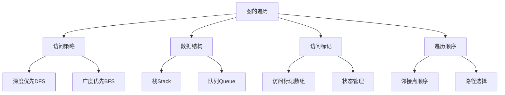

# 图的遍历算法

## 📖 核心概念

**图的遍历**是指按照某种规则访问图中的每个顶点，且每个顶点只访问一次的过程。图的遍历是图算法的基础，是解决图相关问题的重要工具。

### 🏗️ 遍历算法的组成要素



## 🔍 遍历算法分类

### 按访问策略分类

| 算法 | 访问策略 | 数据结构 | 特点 | 应用场景 |
|------|----------|----------|------|----------|
| **DFS** | 深度优先 | 栈/递归 | 尽可能深地搜索 | 路径查找、拓扑排序 |
| **BFS** | 广度优先 | 队列 | 逐层扩展搜索 | 最短路径、层次遍历 |

### 按实现方式分类

| 实现方式 | 优点 | 缺点 | 适用场景 |
|----------|------|------|----------|
| **递归实现** | 代码简洁、逻辑清晰 | 栈溢出风险 | 小规模图 |
| **迭代实现** | 避免栈溢出、可控性强 | 代码复杂 | 大规模图 |

## 💻 深度优先搜索（DFS）

### 递归实现

```cpp
template<typename T>
class DFSRecursive {
private:
    const AdjacencyList<T>& graph;
    vector<bool> visited;
    vector<int> traversalOrder;
    
public:
    DFSRecursive(const AdjacencyList<T>& g) : graph(g) {
        visited.resize(graph.getVertexCount(), false);
    }
    
    // 从指定顶点开始DFS
    void dfs(int start) {
        visited[start] = true;
        traversalOrder.push_back(start);
        
        // 访问所有未访问的邻接顶点
        for (const auto& edge : graph.getNeighbors(start)) {
            if (!visited[edge.to]) {
                dfs(edge.to);
            }
        }
    }
    
    // 遍历整个图（处理非连通图）
    void dfsAll() {
        fill(visited.begin(), visited.end(), false);
        traversalOrder.clear();
        
        for (int i = 0; i < graph.getVertexCount(); i++) {
            if (!visited[i]) {
                dfs(i);
            }
        }
    }
    
    // 获取遍历结果
    const vector<int>& getTraversalOrder() const {
        return traversalOrder;
    }
    
    // 重置状态
    void reset() {
        fill(visited.begin(), visited.end(), false);
        traversalOrder.clear();
    }
};
```

### 迭代实现

```cpp
template<typename T>
class DFSIterative {
private:
    const AdjacencyList<T>& graph;
    vector<bool> visited;
    vector<int> traversalOrder;
    
public:
    DFSIterative(const AdjacencyList<T>& g) : graph(g) {
        visited.resize(graph.getVertexCount(), false);
    }
    
    // 使用栈的迭代DFS
    void dfs(int start) {
        stack<int> stk;
        stk.push(start);
        
        while (!stk.empty()) {
            int current = stk.top();
            stk.pop();
            
            if (!visited[current]) {
                visited[current] = true;
                traversalOrder.push_back(current);
                
                // 将邻接顶点压入栈（逆序保证访问顺序）
                auto neighbors = graph.getNeighbors(current);
                for (auto it = neighbors.rbegin(); it != neighbors.rend(); ++it) {
                    if (!visited[*it]) {
                        stk.push(*it);
                    }
                }
            }
        }
    }
    
    // 遍历整个图
    void dfsAll() {
        fill(visited.begin(), visited.end(), false);
        traversalOrder.clear();
        
        for (int i = 0; i < graph.getVertexCount(); i++) {
            if (!visited[i]) {
                dfs(i);
            }
        }
    }
    
    // 获取遍历结果
    const vector<int>& getTraversalOrder() const {
        return traversalOrder;
    }
    
    // 重置状态
    void reset() {
        fill(visited.begin(), visited.end(), false);
        traversalOrder.clear();
    }
};
```

## 💻 广度优先搜索（BFS）

### 基础BFS实现

```cpp
template<typename T>
class BFS {
private:
    const AdjacencyList<T>& graph;
    vector<bool> visited;
    vector<int> traversalOrder;
    
public:
    BFS(const AdjacencyList<T>& g) : graph(g) {
        visited.resize(graph.getVertexCount(), false);
    }
    
    // 从指定顶点开始BFS
    void bfs(int start) {
        queue<int> q;
        q.push(start);
        visited[start] = true;
        
        while (!q.empty()) {
            int current = q.front();
            q.pop();
            traversalOrder.push_back(current);
            
            // 访问所有未访问的邻接顶点
            for (const auto& edge : graph.getNeighbors(current)) {
                if (!visited[edge.to]) {
                    visited[edge.to] = true;
                    q.push(edge.to);
                }
            }
        }
    }
    
    // 遍历整个图
    void bfsAll() {
        fill(visited.begin(), visited.end(), false);
        traversalOrder.clear();
        
        for (int i = 0; i < graph.getVertexCount(); i++) {
            if (!visited[i]) {
                bfs(i);
            }
        }
    }
    
    // 获取遍历结果
    const vector<int>& getTraversalOrder() const {
        return traversalOrder;
    }
    
    // 重置状态
    void reset() {
        fill(visited.begin(), visited.end(), false);
        traversalOrder.clear();
    }
};
```

### 带层次信息的BFS

```cpp
template<typename T>
class BFSWithLevels {
private:
    const AdjacencyList<T>& graph;
    vector<bool> visited;
    vector<int> levels;
    vector<vector<int>> levelOrder;
    
public:
    BFSWithLevels(const AdjacencyList<T>& g) : graph(g) {
        visited.resize(graph.getVertexCount(), false);
        levels.resize(graph.getVertexCount(), -1);
    }
    
    // 带层次信息的BFS
    void bfsWithLevels(int start) {
        queue<int> q;
        q.push(start);
        visited[start] = true;
        levels[start] = 0;
        
        while (!q.empty()) {
            int current = q.front();
            q.pop();
            
            // 确保levelOrder有足够的层
            while (levelOrder.size() <= levels[current]) {
                levelOrder.push_back(vector<int>());
            }
            levelOrder[levels[current]].push_back(current);
            
            // 访问邻接顶点
            for (const auto& edge : graph.getNeighbors(current)) {
                if (!visited[edge.to]) {
                    visited[edge.to] = true;
                    levels[edge.to] = levels[current] + 1;
                    q.push(edge.to);
                }
            }
        }
    }
    
    // 获取指定层的顶点
    const vector<int>& getLevel(int level) const {
        if (level < levelOrder.size()) {
            return levelOrder[level];
        }
        static vector<int> empty;
        return empty;
    }
    
    // 获取所有层次
    const vector<vector<int>>& getAllLevels() const {
        return levelOrder;
    }
    
    // 获取顶点的层次
    int getLevel(int vertex) const {
        return levels[vertex];
    }
};
```

## 🎯 遍历算法的应用

### 1. 路径查找

```cpp
template<typename T>
class PathFinder {
private:
    const AdjacencyList<T>& graph;
    
public:
    PathFinder(const AdjacencyList<T>& g) : graph(g) {}
    
    // 使用DFS查找路径
    vector<int> findPathDFS(int start, int end) {
        vector<bool> visited(graph.getVertexCount(), false);
        vector<int> path;
        
        if (dfsPath(start, end, visited, path)) {
            return path;
        }
        return vector<int>(); // 无路径
    }
    
private:
    bool dfsPath(int current, int end, vector<bool>& visited, vector<int>& path) {
        visited[current] = true;
        path.push_back(current);
        
        if (current == end) {
            return true; // 找到目标
        }
        
        for (const auto& edge : graph.getNeighbors(current)) {
            if (!visited[edge.to]) {
                if (dfsPath(edge.to, end, visited, path)) {
                    return true;
                }
            }
        }
        
        path.pop_back(); // 回溯
        return false;
    }
    
public:
    // 使用BFS查找最短路径（无权图）
    vector<int> findShortestPath(int start, int end) {
        vector<bool> visited(graph.getVertexCount(), false);
        vector<int> parent(graph.getVertexCount(), -1);
        queue<int> q;
        
        q.push(start);
        visited[start] = true;
        
        while (!q.empty()) {
            int current = q.front();
            q.pop();
            
            if (current == end) break;
            
            for (const auto& edge : graph.getNeighbors(current)) {
                if (!visited[edge.to]) {
                    visited[edge.to] = true;
                    parent[edge.to] = current;
                    q.push(edge.to);
                }
            }
        }
        
        // 重构路径
        vector<int> path;
        if (parent[end] != -1 || start == end) {
            int current = end;
            while (current != -1) {
                path.push_back(current);
                current = parent[current];
            }
            reverse(path.begin(), path.end());
        }
        
        return path;
    }
};
```

### 2. 连通性检测

```cpp
template<typename T>
class ConnectivityAnalyzer {
private:
    const AdjacencyList<T>& graph;
    
public:
    ConnectivityAnalyzer(const AdjacencyList<T>& g) : graph(g) {}
    
    // 检查图是否连通
    bool isConnected() {
        if (graph.getVertexCount() == 0) return true;
        
        vector<bool> visited(graph.getVertexCount(), false);
        DFSRecursive<T> dfs(graph);
        dfs.dfs(0);
        
        // 检查是否所有顶点都被访问
        for (int i = 0; i < graph.getVertexCount(); i++) {
            if (!visited[i]) return false;
        }
        return true;
    }
    
    // 获取所有连通分量
    vector<vector<int>> getConnectedComponents() {
        vector<vector<int>> components;
        vector<bool> visited(graph.getVertexCount(), false);
        
        for (int i = 0; i < graph.getVertexCount(); i++) {
            if (!visited[i]) {
                vector<int> component;
                DFSRecursive<T> dfs(graph);
                dfs.dfs(i);
                components.push_back(dfs.getTraversalOrder());
            }
        }
        
        return components;
    }
    
    // 计算连通分量数量
    int getComponentCount() {
        return getConnectedComponents().size();
    }
};
```

### 3. 环检测

```cpp
template<typename T>
class CycleDetector {
private:
    const AdjacencyList<T>& graph;
    
public:
    CycleDetector(const AdjacencyList<T>& g) : graph(g) {}
    
    // 检测无向图中的环
    bool hasCycleUndirected() {
        vector<bool> visited(graph.getVertexCount(), false);
        
        for (int i = 0; i < graph.getVertexCount(); i++) {
            if (!visited[i]) {
                if (hasCycleDFS(i, -1, visited)) {
                    return true;
                }
            }
        }
        return false;
    }
    
    // 检测有向图中的环
    bool hasCycleDirected() {
        vector<int> color(graph.getVertexCount(), 0); // 0: 白色, 1: 灰色, 2: 黑色
        
        for (int i = 0; i < graph.getVertexCount(); i++) {
            if (color[i] == 0) {
                if (hasCycleDFS(i, color)) {
                    return true;
                }
            }
        }
        return false;
    }
    
private:
    bool hasCycleDFS(int vertex, int parent, vector<bool>& visited) {
        visited[vertex] = true;
        
        for (const auto& edge : graph.getNeighbors(vertex)) {
            if (!visited[edge.to]) {
                if (hasCycleDFS(edge.to, vertex, visited)) {
                    return true;
                }
            } else if (edge.to != parent) {
                return true; // 发现回边
            }
        }
        return false;
    }
    
    bool hasCycleDFS(int vertex, vector<int>& color) {
        color[vertex] = 1; // 标记为灰色（正在访问）
        
        for (const auto& edge : graph.getNeighbors(vertex)) {
            if (color[edge.to] == 1) {
                return true; // 发现回边
            } else if (color[edge.to] == 0 && hasCycleDFS(edge.to, color)) {
                return true;
            }
        }
        
        color[vertex] = 2; // 标记为黑色（访问完成）
        return false;
    }
};
```

## ⚡ 复杂度分析

### 时间复杂度

| 算法 | 时间复杂度 | 说明 |
|------|------------|------|
| **DFS** | O(V + E) | 每个顶点和边访问一次 |
| **BFS** | O(V + E) | 每个顶点和边访问一次 |
| **路径查找** | O(V + E) | 最坏情况遍历整个图 |
| **连通性检测** | O(V + E) | 需要遍历所有顶点和边 |

### 空间复杂度

| 算法 | 空间复杂度 | 说明 |
|------|------------|------|
| **DFS递归** | O(V) | 递归栈深度 |
| **DFS迭代** | O(V) | 栈空间 |
| **BFS** | O(V) | 队列空间 |
| **路径查找** | O(V) | 路径存储空间 |

## 🔧 遍历算法优化

### 1. 双向BFS

```cpp
template<typename T>
class BidirectionalBFS {
private:
    const AdjacencyList<T>& graph;
    
public:
    BidirectionalBFS(const AdjacencyList<T>& g) : graph(g) {}
    
    // 双向BFS查找最短路径
    vector<int> findShortestPath(int start, int end) {
        if (start == end) return {start};
        
        queue<int> q1, q2;
        vector<int> parent1(graph.getVertexCount(), -1);
        vector<int> parent2(graph.getVertexCount(), -1);
        vector<bool> visited1(graph.getVertexCount(), false);
        vector<bool> visited2(graph.getVertexCount(), false);
        
        q1.push(start);
        q2.push(end);
        visited1[start] = true;
        visited2[end] = true;
        
        while (!q1.empty() && !q2.empty()) {
            // 从起点扩展
            int size1 = q1.size();
            for (int i = 0; i < size1; i++) {
                int current = q1.front();
                q1.pop();
                
                if (visited2[current]) {
                    return reconstructPath(start, end, current, parent1, parent2);
                }
                
                for (const auto& edge : graph.getNeighbors(current)) {
                    if (!visited1[edge.to]) {
                        visited1[edge.to] = true;
                        parent1[edge.to] = current;
                        q1.push(edge.to);
                    }
                }
            }
            
            // 从终点扩展
            int size2 = q2.size();
            for (int i = 0; i < size2; i++) {
                int current = q2.front();
                q2.pop();
                
                if (visited1[current]) {
                    return reconstructPath(start, end, current, parent1, parent2);
                }
                
                for (const auto& edge : graph.getNeighbors(current)) {
                    if (!visited2[edge.to]) {
                        visited2[edge.to] = true;
                        parent2[edge.to] = current;
                        q2.push(edge.to);
                    }
                }
            }
        }
        
        return vector<int>(); // 无路径
    }
    
private:
    vector<int> reconstructPath(int start, int end, int meet, 
                               const vector<int>& parent1, 
                               const vector<int>& parent2) {
        vector<int> path;
        
        // 从meet点向start重构
        int current = meet;
        while (current != start) {
            path.push_back(current);
            current = parent1[current];
        }
        path.push_back(start);
        reverse(path.begin(), path.end());
        
        // 从meet点向end重构
        current = parent2[meet];
        while (current != end) {
            path.push_back(current);
            current = parent2[current];
        }
        if (meet != end) {
            path.push_back(end);
        }
        
        return path;
    }
};
```

### 2. 迭代加深搜索

```cpp
template<typename T>
class IterativeDeepeningDFS {
private:
    const AdjacencyList<T>& graph;
    
public:
    IterativeDeepeningDFS(const AdjacencyList<T>& g) : graph(g) {}
    
    // 迭代加深DFS
    vector<int> findPath(int start, int end, int maxDepth = 10) {
        for (int depth = 1; depth <= maxDepth; depth++) {
            vector<bool> visited(graph.getVertexCount(), false);
            vector<int> path;
            
            if (dfsWithDepth(start, end, visited, path, depth)) {
                return path;
            }
        }
        return vector<int>(); // 无路径
    }
    
private:
    bool dfsWithDepth(int current, int end, vector<bool>& visited, 
                     vector<int>& path, int remainingDepth) {
        if (remainingDepth == 0) return false;
        
        visited[current] = true;
        path.push_back(current);
        
        if (current == end) return true;
        
        for (const auto& edge : graph.getNeighbors(current)) {
            if (!visited[edge.to]) {
                if (dfsWithDepth(edge.to, end, visited, path, remainingDepth - 1)) {
                    return true;
                }
            }
        }
        
        path.pop_back();
        return false;
    }
};
```

## 🎓 学习要点总结

### 核心理解

1. **DFS vs BFS**：理解两种遍历策略的本质区别
2. **递归 vs 迭代**：掌握两种实现方式的优缺点
3. **访问标记**：理解visited数组的作用和重要性
4. **路径重构**：掌握从parent数组重构路径的方法

### 实践要点

1. **边界检查**：注意顶点索引的合法性检查
2. **状态管理**：正确管理visited数组的状态
3. **回溯处理**：理解DFS中的回溯机制
4. **队列操作**：掌握BFS中队列的正确使用

### 应用思维

1. **路径查找**：理解遍历在路径搜索中的应用
2. **连通性分析**：掌握图连通性的判断方法
3. **环检测**：区分有向图和无向图的环检测
4. **优化策略**：理解双向搜索和迭代加深的原理

---

**相关链接：**
- [[03-层次宇宙/04-图论天地/01-图Graph基础|图Graph基础]] - 图的基本概念和存储
- [[03-层次宇宙/04-图论天地/03-最短路径算法|最短路径算法]] - Dijkstra和Floyd算法
- [[04-算法武器库/01-搜索技术/01-深度优先搜索|深度优先搜索]] - DFS的详细实现
- [[04-算法武器库/01-搜索技术/02-广度优先搜索|广度优先搜索]] - BFS的详细实现
