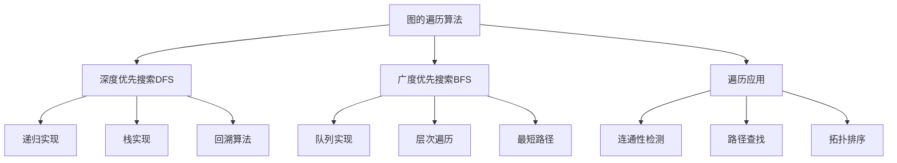

# 图的遍历算法

## 📖 核心概念

**图的遍历算法**是图论中的基础算法，用于访问图中的所有顶点。主要有两种遍历方式：深度优先搜索（DFS）和广度优先搜索（BFS）。

### 🏗️ 图遍历算法分类



## 🔧 图遍历算法实现

### 深度优先搜索（DFS）

```cpp
class DFS {
private:
    vector<vector<int>> graph;
    vector<bool> visited;
    int vertices;
    
public:
    DFS(int v) : vertices(v) {
        graph.resize(vertices);
        visited.resize(vertices, false);
    }
    
    void addEdge(int u, int v) {
        graph[u].push_back(v);
        graph[v].push_back(u); // 无向图
    }
    
    // 递归实现DFS
    void dfsRecursive(int vertex) {
        visited[vertex] = true;
        cout << vertex << " ";
        
        for (int neighbor : graph[vertex]) {
            if (!visited[neighbor]) {
                dfsRecursive(neighbor);
            }
        }
    }
    
    // 栈实现DFS
    void dfsStack(int start) {
        stack<int> s;
        s.push(start);
        
        while (!s.empty()) {
            int vertex = s.top();
            s.pop();
            
            if (!visited[vertex]) {
                visited[vertex] = true;
                cout << vertex << " ";
                
                for (int neighbor : graph[vertex]) {
                    if (!visited[neighbor]) {
                        s.push(neighbor);
                    }
                }
            }
        }
    }
    
    // 重置访问状态
    void resetVisited() {
        fill(visited.begin(), visited.end(), false);
    }
    
    // 遍历所有连通分量
    void dfsAllComponents() {
        resetVisited();
        
        for (int i = 0; i < vertices; ++i) {
            if (!visited[i]) {
                cout << "Component starting from " << i << ": ";
                dfsRecursive(i);
                cout << endl;
            }
        }
    }
    
    // 检查图的连通性
    bool isConnected() {
        resetVisited();
        dfsRecursive(0);
        
        for (int i = 0; i < vertices; ++i) {
            if (!visited[i]) {
                return false;
            }
        }
        return true;
    }
    
    // 计算连通分量数量
    int countConnectedComponents() {
        resetVisited();
        int count = 0;
        
        for (int i = 0; i < vertices; ++i) {
            if (!visited[i]) {
                dfsRecursive(i);
                count++;
            }
        }
        
        return count;
    }
    
    // 显示DFS遍历结果
    void displayDFS(int start) {
        cout << "DFS traversal starting from " << start << ": ";
        resetVisited();
        dfsRecursive(start);
        cout << endl;
    }
    
    // 显示图结构
    void displayGraph() {
        cout << "Graph structure:" << endl;
        for (int i = 0; i < vertices; ++i) {
            cout << i << ": ";
            for (int neighbor : graph[i]) {
                cout << neighbor << " ";
            }
            cout << endl;
        }
    }
};
```

### 广度优先搜索（BFS）

```cpp
class BFS {
private:
    vector<vector<int>> graph;
    vector<bool> visited;
    vector<int> distance;
    vector<int> parent;
    int vertices;
    
public:
    BFS(int v) : vertices(v) {
        graph.resize(vertices);
        visited.resize(vertices, false);
        distance.resize(vertices, -1);
        parent.resize(vertices, -1);
    }
    
    void addEdge(int u, int v) {
        graph[u].push_back(v);
        graph[v].push_back(u); // 无向图
    }
    
    // BFS遍历
    void bfs(int start) {
        queue<int> q;
        q.push(start);
        visited[start] = true;
        distance[start] = 0;
        
        while (!q.empty()) {
            int vertex = q.front();
            q.pop();
            cout << vertex << " ";
            
            for (int neighbor : graph[vertex]) {
                if (!visited[neighbor]) {
                    visited[neighbor] = true;
                    distance[neighbor] = distance[vertex] + 1;
                    parent[neighbor] = vertex;
                    q.push(neighbor);
                }
            }
        }
    }
    
    // 重置访问状态
    void resetVisited() {
        fill(visited.begin(), visited.end(), false);
        fill(distance.begin(), distance.end(), -1);
        fill(parent.begin(), parent.end(), -1);
    }
    
    // 最短路径（无权图）
    vector<int> shortestPath(int start, int end) {
        resetVisited();
        queue<int> q;
        q.push(start);
        visited[start] = true;
        distance[start] = 0;
        
        while (!q.empty()) {
            int vertex = q.front();
            q.pop();
            
            if (vertex == end) {
                break;
            }
            
            for (int neighbor : graph[vertex]) {
                if (!visited[neighbor]) {
                    visited[neighbor] = true;
                    distance[neighbor] = distance[vertex] + 1;
                    parent[neighbor] = vertex;
                    q.push(neighbor);
                }
            }
        }
        
        vector<int> path;
        if (visited[end]) {
            int current = end;
            while (current != -1) {
                path.push_back(current);
                current = parent[current];
            }
            reverse(path.begin(), path.end());
        }
        
        return path;
    }
    
    // 显示最短路径
    void displayShortestPath(int start, int end) {
        vector<int> path = shortestPath(start, end);
        
        if (path.empty()) {
            cout << "No path from " << start << " to " << end << endl;
        } else {
            cout << "Shortest path from " << start << " to " << end << ": ";
            for (int i = 0; i < path.size(); ++i) {
                cout << path[i];
                if (i < path.size() - 1) cout << " -> ";
            }
            cout << " (Distance: " << path.size() - 1 << ")" << endl;
        }
    }
    
    // 层次遍历
    void levelOrderTraversal(int start) {
        resetVisited();
        queue<int> q;
        q.push(start);
        visited[start] = true;
        distance[start] = 0;
        
        int currentLevel = 0;
        cout << "Level " << currentLevel << ": ";
        
        while (!q.empty()) {
            int vertex = q.front();
            q.pop();
            
            if (distance[vertex] > currentLevel) {
                currentLevel = distance[vertex];
                cout << endl << "Level " << currentLevel << ": ";
            }
            
            cout << vertex << " ";
            
            for (int neighbor : graph[vertex]) {
                if (!visited[neighbor]) {
                    visited[neighbor] = true;
                    distance[neighbor] = distance[vertex] + 1;
                    q.push(neighbor);
                }
            }
        }
        cout << endl;
    }
    
    // 显示BFS遍历结果
    void displayBFS(int start) {
        cout << "BFS traversal starting from " << start << ": ";
        resetVisited();
        bfs(start);
        cout << endl;
    }
    
    // 显示图结构
    void displayGraph() {
        cout << "Graph structure:" << endl;
        for (int i = 0; i < vertices; ++i) {
            cout << i << ": ";
            for (int neighbor : graph[i]) {
                cout << neighbor << " ";
            }
            cout << endl;
        }
    }
};
```

### 有向图的遍历

```cpp
class DirectedGraphTraversal {
private:
    vector<vector<int>> graph;
    vector<bool> visited;
    vector<bool> recStack;
    vector<int> finishTime;
    int vertices;
    int time;
    
public:
    DirectedGraphTraversal(int v) : vertices(v), time(0) {
        graph.resize(vertices);
        visited.resize(vertices, false);
        recStack.resize(vertices, false);
        finishTime.resize(vertices, 0);
    }
    
    void addEdge(int u, int v) {
        graph[u].push_back(v); // 有向图
    }
    
    // 有向图的DFS
    void dfsDirected(int vertex) {
        visited[vertex] = true;
        cout << vertex << " ";
        
        for (int neighbor : graph[vertex]) {
            if (!visited[neighbor]) {
                dfsDirected(neighbor);
            }
        }
    }
    
    // 检测环
    bool hasCycle() {
        resetVisited();
        
        for (int i = 0; i < vertices; ++i) {
            if (!visited[i]) {
                if (hasCycleDFS(i)) {
                    return true;
                }
            }
        }
        return false;
    }
    
    bool hasCycleDFS(int vertex) {
        visited[vertex] = true;
        recStack[vertex] = true;
        
        for (int neighbor : graph[vertex]) {
            if (!visited[neighbor]) {
                if (hasCycleDFS(neighbor)) {
                    return true;
                }
            } else if (recStack[neighbor]) {
                return true;
            }
        }
        
        recStack[vertex] = false;
        return false;
    }
    
    // 拓扑排序
    vector<int> topologicalSort() {
        if (hasCycle()) {
            cout << "Graph has cycle, cannot perform topological sort" << endl;
            return {};
        }
        
        resetVisited();
        vector<int> result;
        
        for (int i = 0; i < vertices; ++i) {
            if (!visited[i]) {
                topologicalDFS(i, result);
            }
        }
        
        reverse(result.begin(), result.end());
        return result;
    }
    
    void topologicalDFS(int vertex, vector<int>& result) {
        visited[vertex] = true;
        
        for (int neighbor : graph[vertex]) {
            if (!visited[neighbor]) {
                topologicalDFS(neighbor, result);
            }
        }
        
        result.push_back(vertex);
    }
    
    // 强连通分量
    vector<vector<int>> stronglyConnectedComponents() {
        // 第一步：计算完成时间
        resetVisited();
        for (int i = 0; i < vertices; ++i) {
            if (!visited[i]) {
                dfsFinishTime(i);
            }
        }
        
        // 第二步：反转图
        vector<vector<int>> reversedGraph(vertices);
        for (int i = 0; i < vertices; ++i) {
            for (int neighbor : graph[i]) {
                reversedGraph[neighbor].push_back(i);
            }
        }
        
        // 第三步：按完成时间降序DFS
        resetVisited();
        vector<vector<int>> scc;
        
        vector<pair<int, int>> finishTimes;
        for (int i = 0; i < vertices; ++i) {
            finishTimes.push_back({finishTime[i], i});
        }
        sort(finishTimes.rbegin(), finishTimes.rend());
        
        for (auto& pair : finishTimes) {
            int vertex = pair.second;
            if (!visited[vertex]) {
                vector<int> component;
                dfsSCC(vertex, reversedGraph, component);
                scc.push_back(component);
            }
        }
        
        return scc;
    }
    
    void dfsFinishTime(int vertex) {
        visited[vertex] = true;
        
        for (int neighbor : graph[vertex]) {
            if (!visited[neighbor]) {
                dfsFinishTime(neighbor);
            }
        }
        
        finishTime[vertex] = time++;
    }
    
    void dfsSCC(int vertex, vector<vector<int>>& reversedGraph, vector<int>& component) {
        visited[vertex] = true;
        component.push_back(vertex);
        
        for (int neighbor : reversedGraph[vertex]) {
            if (!visited[neighbor]) {
                dfsSCC(neighbor, reversedGraph, component);
            }
        }
    }
    
    void resetVisited() {
        fill(visited.begin(), visited.end(), false);
        fill(recStack.begin(), recStack.end(), false);
        time = 0;
    }
    
    void displayTopologicalSort() {
        vector<int> result = topologicalSort();
        if (!result.empty()) {
            cout << "Topological sort: ";
            for (int vertex : result) {
                cout << vertex << " ";
            }
            cout << endl;
        }
    }
    
    void displaySCC() {
        vector<vector<int>> scc = stronglyConnectedComponents();
        cout << "Strongly Connected Components:" << endl;
        for (int i = 0; i < scc.size(); ++i) {
            cout << "Component " << i << ": ";
            for (int vertex : scc[i]) {
                cout << vertex << " ";
            }
            cout << endl;
        }
    }
};
```

## 🎯 图遍历应用

### 路径查找

```cpp
class PathFinder {
private:
    vector<vector<int>> graph;
    vector<bool> visited;
    vector<int> path;
    int vertices;
    
public:
    PathFinder(int v) : vertices(v) {
        graph.resize(vertices);
        visited.resize(vertices, false);
    }
    
    void addEdge(int u, int v) {
        graph[u].push_back(v);
        graph[v].push_back(u);
    }
    
    // 查找所有路径
    vector<vector<int>> findAllPaths(int start, int end) {
        vector<vector<int>> allPaths;
        vector<int> currentPath;
        
        resetVisited();
        findAllPathsDFS(start, end, currentPath, allPaths);
        
        return allPaths;
    }
    
    void findAllPathsDFS(int current, int end, vector<int>& currentPath, vector<vector<int>>& allPaths) {
        visited[current] = true;
        currentPath.push_back(current);
        
        if (current == end) {
            allPaths.push_back(currentPath);
        } else {
            for (int neighbor : graph[current]) {
                if (!visited[neighbor]) {
                    findAllPathsDFS(neighbor, end, currentPath, allPaths);
                }
            }
        }
        
        visited[current] = false;
        currentPath.pop_back();
    }
    
    // 查找简单路径
    vector<vector<int>> findSimplePaths(int start, int end) {
        vector<vector<int>> simplePaths;
        vector<int> currentPath;
        
        resetVisited();
        findSimplePathsDFS(start, end, currentPath, simplePaths);
        
        return simplePaths;
    }
    
    void findSimplePathsDFS(int current, int end, vector<int>& currentPath, vector<vector<int>>& simplePaths) {
        currentPath.push_back(current);
        
        if (current == end) {
            simplePaths.push_back(currentPath);
        } else {
            for (int neighbor : graph[current]) {
                if (find(currentPath.begin(), currentPath.end(), neighbor) == currentPath.end()) {
                    findSimplePathsDFS(neighbor, end, currentPath, simplePaths);
                }
            }
        }
        
        currentPath.pop_back();
    }
    
    void resetVisited() {
        fill(visited.begin(), visited.end(), false);
    }
    
    void displayAllPaths(int start, int end) {
        vector<vector<int>> paths = findAllPaths(start, end);
        
        cout << "All paths from " << start << " to " << end << ":" << endl;
        for (int i = 0; i < paths.size(); ++i) {
            cout << "Path " << i + 1 << ": ";
            for (int j = 0; j < paths[i].size(); ++j) {
                cout << paths[i][j];
                if (j < paths[i].size() - 1) cout << " -> ";
            }
            cout << endl;
        }
    }
    
    void displaySimplePaths(int start, int end) {
        vector<vector<int>> paths = findSimplePaths(start, end);
        
        cout << "Simple paths from " << start << " to " << end << ":" << endl;
        for (int i = 0; i < paths.size(); ++i) {
            cout << "Path " << i + 1 << ": ";
            for (int j = 0; j < paths[i].size(); ++j) {
                cout << paths[i][j];
                if (j < paths[i].size() - 1) cout << " -> ";
            }
            cout << endl;
        }
    }
};
```

### 连通性检测

```cpp
class ConnectivityChecker {
private:
    vector<vector<int>> graph;
    vector<bool> visited;
    int vertices;
    
public:
    ConnectivityChecker(int v) : vertices(v) {
        graph.resize(vertices);
        visited.resize(vertices, false);
    }
    
    void addEdge(int u, int v) {
        graph[u].push_back(v);
        graph[v].push_back(u);
    }
    
    // 检查图的连通性
    bool isConnected() {
        resetVisited();
        dfs(0);
        
        for (int i = 0; i < vertices; ++i) {
            if (!visited[i]) {
                return false;
            }
        }
        return true;
    }
    
    // 计算连通分量
    int countConnectedComponents() {
        resetVisited();
        int count = 0;
        
        for (int i = 0; i < vertices; ++i) {
            if (!visited[i]) {
                dfs(i);
                count++;
            }
        }
        
        return count;
    }
    
    // 获取连通分量
    vector<vector<int>> getConnectedComponents() {
        resetVisited();
        vector<vector<int>> components;
        
        for (int i = 0; i < vertices; ++i) {
            if (!visited[i]) {
                vector<int> component;
                dfsComponent(i, component);
                components.push_back(component);
            }
        }
        
        return components;
    }
    
    // 检查两个顶点是否连通
    bool areConnected(int u, int v) {
        resetVisited();
        dfs(u);
        return visited[v];
    }
    
    // 检查图的强连通性（有向图）
    bool isStronglyConnected() {
        // 检查从任意顶点出发是否能到达所有顶点
        for (int i = 0; i < vertices; ++i) {
            resetVisited();
            dfs(i);
            
            for (int j = 0; j < vertices; ++j) {
                if (!visited[j]) {
                    return false;
                }
            }
        }
        return true;
    }
    
    void dfs(int vertex) {
        visited[vertex] = true;
        
        for (int neighbor : graph[vertex]) {
            if (!visited[neighbor]) {
                dfs(neighbor);
            }
        }
    }
    
    void dfsComponent(int vertex, vector<int>& component) {
        visited[vertex] = true;
        component.push_back(vertex);
        
        for (int neighbor : graph[vertex]) {
            if (!visited[neighbor]) {
                dfsComponent(neighbor, component);
            }
        }
    }
    
    void resetVisited() {
        fill(visited.begin(), visited.end(), false);
    }
    
    void displayConnectivity() {
        cout << "Connectivity Analysis:" << endl;
        cout << "====================" << endl;
        
        cout << "Is connected: " << (isConnected() ? "Yes" : "No") << endl;
        cout << "Number of connected components: " << countConnectedComponents() << endl;
        
        vector<vector<int>> components = getConnectedComponents();
        cout << "Connected components:" << endl;
        for (int i = 0; i < components.size(); ++i) {
            cout << "Component " << i << ": ";
            for (int vertex : components[i]) {
                cout << vertex << " ";
            }
            cout << endl;
        }
    }
};
```

## 📊 图遍历分析

### 时间复杂度分析

```cpp
class GraphTraversalAnalysis {
public:
    static void analyzeTimeComplexity() {
        cout << "Graph Traversal Time Complexity Analysis:" << endl;
        cout << "=======================================" << endl;
        
        cout << "1. DFS (Depth-First Search):" << endl;
        cout << "   - Time Complexity: O(V + E)" << endl;
        cout << "   - Space Complexity: O(V)" << endl;
        cout << "   - Recursion stack depth" << endl;
        
        cout << "2. BFS (Breadth-First Search):" << endl;
        cout << "   - Time Complexity: O(V + E)" << endl;
        cout << "   - Space Complexity: O(V)" << endl;
        cout << "   - Queue size" << endl;
        
        cout << "3. Topological Sort:" << endl;
        cout << "   - Time Complexity: O(V + E)" << endl;
        cout << "   - Space Complexity: O(V)" << endl;
        cout << "   - DFS-based" << endl;
        
        cout << "4. Strongly Connected Components:" << endl;
        cout << "   - Time Complexity: O(V + E)" << endl;
        cout << "   - Space Complexity: O(V)" << endl;
        cout << "   - Two DFS passes" << endl;
        
        cout << "5. Path Finding:" << endl;
        cout << "   - Time Complexity: O(V + E)" << endl;
        cout << "   - Space Complexity: O(V)" << endl;
        cout << "   - DFS-based" << endl;
    }
    
    static void analyzeSpaceComplexity() {
        cout << "Graph Traversal Space Complexity Analysis:" << endl;
        cout << "========================================" << endl;
        
        cout << "1. DFS:" << endl;
        cout << "   - Recursion stack: O(V)" << endl;
        cout << "   - Visited array: O(V)" << endl;
        cout << "   - Total: O(V)" << endl;
        
        cout << "2. BFS:" << endl;
        cout << "   - Queue: O(V)" << endl;
        cout << "   - Visited array: O(V)" << endl;
        cout << "   - Distance array: O(V)" << endl;
        cout << "   - Total: O(V)" << endl;
        
        cout << "3. Topological Sort:" << endl;
        cout << "   - Recursion stack: O(V)" << endl;
        cout << "   - Visited array: O(V)" << endl;
        cout << "   - Result array: O(V)" << endl;
        cout << "   - Total: O(V)" << endl;
        
        cout << "4. Strongly Connected Components:" << endl;
        cout << "   - Recursion stack: O(V)" << endl;
        cout << "   - Visited array: O(V)" << endl;
        cout << "   - Finish time array: O(V)" << endl;
        cout << "   - Total: O(V)" << endl;
    }
};
```

## 🎮 图遍历测试

### 1. 基础功能测试

```cpp
class GraphTraversalTest {
public:
    static void testDFS() {
        cout << "Testing DFS:" << endl;
        cout << "===========" << endl;
        
        DFS dfs(6);
        dfs.addEdge(0, 1);
        dfs.addEdge(0, 2);
        dfs.addEdge(1, 3);
        dfs.addEdge(2, 4);
        dfs.addEdge(3, 5);
        
        dfs.displayGraph();
        dfs.displayDFS(0);
        
        cout << "Is connected: " << (dfs.isConnected() ? "Yes" : "No") << endl;
        cout << "Number of connected components: " << dfs.countConnectedComponents() << endl;
    }
    
    static void testBFS() {
        cout << "Testing BFS:" << endl;
        cout << "===========" << endl;
        
        BFS bfs(6);
        bfs.addEdge(0, 1);
        bfs.addEdge(0, 2);
        bfs.addEdge(1, 3);
        bfs.addEdge(2, 4);
        bfs.addEdge(3, 5);
        
        bfs.displayGraph();
        bfs.displayBFS(0);
        bfs.displayShortestPath(0, 5);
        bfs.levelOrderTraversal(0);
    }
    
    static void testDirectedGraph() {
        cout << "Testing Directed Graph:" << endl;
        cout << "=====================" << endl;
        
        DirectedGraphTraversal dgt(6);
        dgt.addEdge(0, 1);
        dgt.addEdge(0, 2);
        dgt.addEdge(1, 3);
        dgt.addEdge(2, 4);
        dgt.addEdge(3, 5);
        dgt.addEdge(5, 0); // 创建环
        
        cout << "Has cycle: " << (dgt.hasCycle() ? "Yes" : "No") << endl;
        dgt.displayTopologicalSort();
        dgt.displaySCC();
    }
    
    static void testPathFinder() {
        cout << "Testing Path Finder:" << endl;
        cout << "==================" << endl;
        
        PathFinder pf(6);
        pf.addEdge(0, 1);
        pf.addEdge(0, 2);
        pf.addEdge(1, 3);
        pf.addEdge(2, 4);
        pf.addEdge(3, 5);
        pf.addEdge(4, 5);
        
        pf.displayAllPaths(0, 5);
        pf.displaySimplePaths(0, 5);
    }
    
    static void testConnectivityChecker() {
        cout << "Testing Connectivity Checker:" << endl;
        cout << "===========================" << endl;
        
        ConnectivityChecker cc(6);
        cc.addEdge(0, 1);
        cc.addEdge(0, 2);
        cc.addEdge(1, 3);
        cc.addEdge(2, 4);
        cc.addEdge(3, 5);
        
        cc.displayConnectivity();
    }
};
```

## 🔗 相关链接

- [[01-图的基本概念|图的基本概念]]
- [[02-图的存储结构|图的存储结构]]
- [[04-图的经典算法|图的经典算法]]

## 💡 图遍历要点

1. **DFS**: 深度优先，使用栈或递归
2. **BFS**: 广度优先，使用队列
3. **应用**: 路径查找、连通性检测、拓扑排序
4. **时间复杂度**: O(V + E)

---

*📝 图遍历提示：图遍历是图算法的基础，掌握DFS和BFS是理解图算法的关键*
