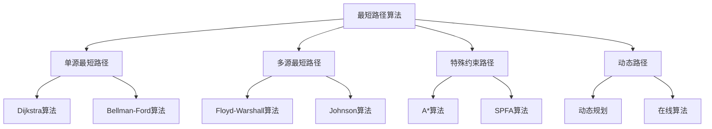

# 最短路径算法

## 📖 核心概念

**最短路径算法**是图论中用于寻找两个顶点之间最短路径的算法集合。根据图的类型（有向/无向、加权/无权）和需求，有多种不同的算法可以选择。

### 🏗️ 最短路径算法的组成要素



## 🔍 算法分类体系

### 按问题类型分类

| 算法类型 | 适用场景 | 时间复杂度 | 空间复杂度 | 特点 |
|----------|----------|------------|------------|------|
| **单源最短路径** | 从一个起点到所有其他点 | O(V²) 或 O(E log V) | O(V) | 适合单起点查询 |
| **多源最短路径** | 任意两点间最短路径 | O(V³) | O(V²) | 适合多起点查询 |
| **特殊约束路径** | 带约束条件的最短路径 | 变化 | 变化 | 考虑额外约束 |

### 按图类型分类

| 图类型 | 推荐算法 | 时间复杂度 | 特点 |
|--------|----------|------------|------|
| **无权图** | BFS | O(V + E) | 简单高效 |
| **非负权图** | Dijkstra | O(E log V) | 贪心策略 |
| **负权图** | Bellman-Ford | O(VE) | 可检测负环 |
| **稠密图** | Floyd-Warshall | O(V³) | 预处理所有路径 |

## 💻 Dijkstra算法

### 基础实现

```cpp
template<typename T>
class Dijkstra {
private:
    const AdjacencyList<T>& graph;
    vector<T> distances;
    vector<int> previous;
    vector<bool> visited;
    
public:
    Dijkstra(const AdjacencyList<T>& g) : graph(g) {
        distances.resize(graph.getVertexCount(), numeric_limits<T>::max());
        previous.resize(graph.getVertexCount(), -1);
        visited.resize(graph.getVertexCount(), false);
    }
    
    // Dijkstra算法实现
    void dijkstra(int start) {
        // 初始化
        fill(distances.begin(), distances.end(), numeric_limits<T>::max());
        fill(previous.begin(), previous.end(), -1);
        fill(visited.begin(), visited.end(), false);
        
        distances[start] = 0;
        
        // 使用优先队列（最小堆）
        priority_queue<pair<T, int>, vector<pair<T, int>>, greater<pair<T, int>>> pq;
        pq.push({0, start});
        
        while (!pq.empty()) {
            int current = pq.top().second;
            pq.pop();
            
            if (visited[current]) continue;
            visited[current] = true;
            
            // 更新邻接顶点的距离
            for (const auto& edge : graph.getNeighbors(current)) {
                T newDistance = distances[current] + edge.weight;
                
                if (newDistance < distances[edge.to]) {
                    distances[edge.to] = newDistance;
                    previous[edge.to] = current;
                    pq.push({newDistance, edge.to});
                }
            }
        }
    }
    
    // 获取最短距离
    T getDistance(int vertex) const {
        return distances[vertex];
    }
    
    // 获取最短路径
    vector<int> getPath(int start, int end) const {
        vector<int> path;
        
        if (distances[end] == numeric_limits<T>::max()) {
            return path; // 无路径
        }
        
        int current = end;
        while (current != -1) {
            path.push_back(current);
            current = previous[current];
        }
        
        reverse(path.begin(), path.end());
        return path;
    }
    
    // 检查是否存在路径
    bool hasPath(int vertex) const {
        return distances[vertex] != numeric_limits<T>::max();
    }
};
```

### 优化版本（使用自定义堆）

```cpp
template<typename T>
class OptimizedDijkstra {
private:
    const AdjacencyList<T>& graph;
    vector<T> distances;
    vector<int> previous;
    
    // 自定义堆节点
    struct HeapNode {
        int vertex;
        T distance;
        
        HeapNode(int v, T d) : vertex(v), distance(d) {}
        
        bool operator>(const HeapNode& other) const {
            return distance > other.distance;
        }
    };
    
public:
    OptimizedDijkstra(const AdjacencyList<T>& g) : graph(g) {
        distances.resize(graph.getVertexCount(), numeric_limits<T>::max());
        previous.resize(graph.getVertexCount(), -1);
    }
    
    // 优化的Dijkstra算法
    void dijkstra(int start) {
        // 初始化
        fill(distances.begin(), distances.end(), numeric_limits<T>::max());
        fill(previous.begin(), previous.end(), -1);
        
        distances[start] = 0;
        
        // 使用自定义堆
        priority_queue<HeapNode, vector<HeapNode>, greater<HeapNode>> pq;
        pq.push(HeapNode(start, 0));
        
        while (!pq.empty()) {
            HeapNode current = pq.top();
            pq.pop();
            
            // 如果当前距离已经过时，跳过
            if (current.distance > distances[current.vertex]) {
                continue;
            }
            
            // 更新邻接顶点
            for (const auto& edge : graph.getNeighbors(current.vertex)) {
                T newDistance = distances[current.vertex] + edge.weight;
                
                if (newDistance < distances[edge.to]) {
                    distances[edge.to] = newDistance;
                    previous[edge.to] = current.vertex;
                    pq.push(HeapNode(edge.to, newDistance));
                }
            }
        }
    }
    
    // 获取所有最短距离
    const vector<T>& getAllDistances() const {
        return distances;
    }
    
    // 获取最短路径
    vector<int> getPath(int start, int end) const {
        vector<int> path;
        
        if (distances[end] == numeric_limits<T>::max()) {
            return path;
        }
        
        int current = end;
        while (current != -1) {
            path.push_back(current);
            current = previous[current];
        }
        
        reverse(path.begin(), path.end());
        return path;
    }
};
```

## 💻 Bellman-Ford算法

### 基础实现

```cpp
template<typename T>
class BellmanFord {
private:
    const AdjacencyList<T>& graph;
    vector<T> distances;
    vector<int> previous;
    
public:
    BellmanFord(const AdjacencyList<T>& g) : graph(g) {
        distances.resize(graph.getVertexCount(), numeric_limits<T>::max());
        previous.resize(graph.getVertexCount(), -1);
    }
    
    // Bellman-Ford算法实现
    bool bellmanFord(int start) {
        // 初始化
        fill(distances.begin(), distances.end(), numeric_limits<T>::max());
        fill(previous.begin(), previous.end(), -1);
        
        distances[start] = 0;
        
        // 松弛操作：进行V-1轮
        for (int i = 0; i < graph.getVertexCount() - 1; i++) {
            bool relaxed = false;
            
            // 遍历所有边
            for (int u = 0; u < graph.getVertexCount(); u++) {
                if (distances[u] == numeric_limits<T>::max()) continue;
                
                for (const auto& edge : graph.getNeighbors(u)) {
                    T newDistance = distances[u] + edge.weight;
                    
                    if (newDistance < distances[edge.to]) {
                        distances[edge.to] = newDistance;
                        previous[edge.to] = u;
                        relaxed = true;
                    }
                }
            }
            
            // 如果没有松弛操作，提前结束
            if (!relaxed) break;
        }
        
        // 检查负环
        for (int u = 0; u < graph.getVertexCount(); u++) {
            if (distances[u] == numeric_limits<T>::max()) continue;
            
            for (const auto& edge : graph.getNeighbors(u)) {
                if (distances[u] + edge.weight < distances[edge.to]) {
                    return false; // 存在负环
                }
            }
        }
        
        return true; // 无负环
    }
    
    // 检测负环
    bool hasNegativeCycle() {
        return !bellmanFord(0);
    }
    
    // 获取最短距离
    T getDistance(int vertex) const {
        return distances[vertex];
    }
    
    // 获取最短路径
    vector<int> getPath(int start, int end) const {
        vector<int> path;
        
        if (distances[end] == numeric_limits<T>::max()) {
            return path;
        }
        
        int current = end;
        while (current != -1) {
            path.push_back(current);
            current = previous[current];
        }
        
        reverse(path.begin(), path.end());
        return path;
    }
};
```

## 💻 Floyd-Warshall算法

### 多源最短路径

```cpp
template<typename T>
class FloydWarshall {
private:
    const AdjacencyList<T>& graph;
    vector<vector<T>> distances;
    vector<vector<int>> next;
    
public:
    FloydWarshall(const AdjacencyList<T>& g) : graph(g) {
        int n = graph.getVertexCount();
        distances.resize(n, vector<T>(n, numeric_limits<T>::max()));
        next.resize(n, vector<int>(n, -1));
        
        initialize();
    }
    
    // 初始化距离矩阵
    void initialize() {
        int n = graph.getVertexCount();
        
        // 初始化对角线为0
        for (int i = 0; i < n; i++) {
            distances[i][i] = 0;
        }
        
        // 初始化邻接边
        for (int i = 0; i < n; i++) {
            for (const auto& edge : graph.getNeighbors(i)) {
                distances[i][edge.to] = edge.weight;
                next[i][edge.to] = edge.to;
            }
        }
    }
    
    // Floyd-Warshall算法
    void floydWarshall() {
        int n = graph.getVertexCount();
        
        // 三重循环：k, i, j
        for (int k = 0; k < n; k++) {
            for (int i = 0; i < n; i++) {
                for (int j = 0; j < n; j++) {
                    // 避免溢出
                    if (distances[i][k] != numeric_limits<T>::max() &&
                        distances[k][j] != numeric_limits<T>::max()) {
                        
                        T newDistance = distances[i][k] + distances[k][j];
                        
                        if (newDistance < distances[i][j]) {
                            distances[i][j] = newDistance;
                            next[i][j] = next[i][k];
                        }
                    }
                }
            }
        }
    }
    
    // 获取最短距离
    T getDistance(int from, int to) const {
        return distances[from][to];
    }
    
    // 获取最短路径
    vector<int> getPath(int from, int to) const {
        vector<int> path;
        
        if (distances[from][to] == numeric_limits<T>::max()) {
            return path; // 无路径
        }
        
        int current = from;
        while (current != to) {
            path.push_back(current);
            current = next[current][to];
        }
        path.push_back(to);
        
        return path;
    }
    
    // 检测负环
    bool hasNegativeCycle() const {
        int n = graph.getVertexCount();
        for (int i = 0; i < n; i++) {
            if (distances[i][i] < 0) {
                return true;
            }
        }
        return false;
    }
    
    // 获取所有最短距离
    const vector<vector<T>>& getAllDistances() const {
        return distances;
    }
};
```

## 🎯 特殊应用场景

### 1. A*算法（启发式搜索）

```cpp
template<typename T>
class AStar {
private:
    const AdjacencyList<T>& graph;
    
    // 启发式函数（曼哈顿距离）
    T heuristic(int from, int to) const {
        // 这里需要根据具体问题实现启发式函数
        return 0; // 简化实现
    }
    
public:
    AStar(const AdjacencyList<T>& g) : graph(g) {}
    
    // A*算法实现
    vector<int> findPath(int start, int end) {
        int n = graph.getVertexCount();
        vector<T> gScore(n, numeric_limits<T>::max());
        vector<T> fScore(n, numeric_limits<T>::max());
        vector<int> previous(n, -1);
        vector<bool> visited(n, false);
        
        gScore[start] = 0;
        fScore[start] = heuristic(start, end);
        
        priority_queue<pair<T, int>, vector<pair<T, int>>, greater<pair<T, int>>> pq;
        pq.push({fScore[start], start});
        
        while (!pq.empty()) {
            int current = pq.top().second;
            pq.pop();
            
            if (visited[current]) continue;
            visited[current] = true;
            
            if (current == end) break;
            
            for (const auto& edge : graph.getNeighbors(current)) {
                T tentativeGScore = gScore[current] + edge.weight;
                
                if (tentativeGScore < gScore[edge.to]) {
                    previous[edge.to] = current;
                    gScore[edge.to] = tentativeGScore;
                    fScore[edge.to] = gScore[edge.to] + heuristic(edge.to, end);
                    
                    if (!visited[edge.to]) {
                        pq.push({fScore[edge.to], edge.to});
                    }
                }
            }
        }
        
        // 重构路径
        vector<int> path;
        if (gScore[end] != numeric_limits<T>::max()) {
            int current = end;
            while (current != -1) {
                path.push_back(current);
                current = previous[current];
            }
            reverse(path.begin(), path.end());
        }
        
        return path;
    }
};
```

### 2. SPFA算法（队列优化的Bellman-Ford）

```cpp
template<typename T>
class SPFA {
private:
    const AdjacencyList<T>& graph;
    vector<T> distances;
    vector<int> previous;
    vector<bool> inQueue;
    vector<int> count; // 记录入队次数
    
public:
    SPFA(const AdjacencyList<T>& g) : graph(g) {
        distances.resize(graph.getVertexCount(), numeric_limits<T>::max());
        previous.resize(graph.getVertexCount(), -1);
        inQueue.resize(graph.getVertexCount(), false);
        count.resize(graph.getVertexCount(), 0);
    }
    
    // SPFA算法实现
    bool spfa(int start) {
        // 初始化
        fill(distances.begin(), distances.end(), numeric_limits<T>::max());
        fill(previous.begin(), previous.end(), -1);
        fill(inQueue.begin(), inQueue.end(), false);
        fill(count.begin(), count.end(), 0);
        
        distances[start] = 0;
        
        queue<int> q;
        q.push(start);
        inQueue[start] = true;
        count[start]++;
        
        while (!q.empty()) {
            int current = q.front();
            q.pop();
            inQueue[current] = false;
            
            for (const auto& edge : graph.getNeighbors(current)) {
                T newDistance = distances[current] + edge.weight;
                
                if (newDistance < distances[edge.to]) {
                    distances[edge.to] = newDistance;
                    previous[edge.to] = current;
                    
                    if (!inQueue[edge.to]) {
                        q.push(edge.to);
                        inQueue[edge.to] = true;
                        count[edge.to]++;
                        
                        // 检测负环
                        if (count[edge.to] >= graph.getVertexCount()) {
                            return false; // 存在负环
                        }
                    }
                }
            }
        }
        
        return true; // 无负环
    }
    
    // 获取最短距离
    T getDistance(int vertex) const {
        return distances[vertex];
    }
    
    // 获取最短路径
    vector<int> getPath(int start, int end) const {
        vector<int> path;
        
        if (distances[end] == numeric_limits<T>::max()) {
            return path;
        }
        
        int current = end;
        while (current != -1) {
            path.push_back(current);
            current = previous[current];
        }
        
        reverse(path.begin(), path.end());
        return path;
    }
};
```

## ⚡ 算法复杂度对比

### 时间复杂度

| 算法 | 时间复杂度 | 适用场景 | 特点 |
|------|------------|----------|------|
| **Dijkstra** | O(E log V) | 非负权图 | 贪心策略，效率高 |
| **Bellman-Ford** | O(VE) | 任意权图 | 可检测负环 |
| **Floyd-Warshall** | O(V³) | 多源最短路径 | 预处理所有路径 |
| **SPFA** | O(VE) 平均 | 稀疏图 | 队列优化 |
| **A*** | O(b^d) | 启发式搜索 | 需要好的启发函数 |

### 空间复杂度

| 算法 | 空间复杂度 | 说明 |
|------|------------|------|
| **Dijkstra** | O(V) | 距离数组和优先队列 |
| **Bellman-Ford** | O(V) | 距离数组 |
| **Floyd-Warshall** | O(V²) | 距离矩阵 |
| **SPFA** | O(V) | 距离数组和队列 |
| **A*** | O(V) | 距离数组和优先队列 |

## 🔧 算法选择指南

### 选择标准

| 场景 | 推荐算法 | 理由 |
|------|----------|------|
| **单源非负权** | Dijkstra | 效率最高 |
| **单源负权** | Bellman-Ford | 可处理负权 |
| **多源查询** | Floyd-Warshall | 预处理后O(1)查询 |
| **稀疏图** | SPFA | 队列优化效果好 |
| **启发式搜索** | A* | 有好的启发函数时效率高 |

### 实际应用

```cpp
class PathFindingSystem {
private:
    AdjacencyList<double> graph;
    
public:
    PathFindingSystem(int vertexCount) : graph(vertexCount, true) {}
    
    // 根据场景选择算法
    vector<int> findOptimalPath(int start, int end, const string& algorithm = "dijkstra") {
        if (algorithm == "dijkstra") {
            Dijkstra<double> dijkstra(graph);
            dijkstra.dijkstra(start);
            return dijkstra.getPath(start, end);
        } else if (algorithm == "bellman-ford") {
            BellmanFord<double> bf(graph);
            if (bf.bellmanFord(start)) {
                return bf.getPath(start, end);
            }
        } else if (algorithm == "floyd-warshall") {
            FloydWarshall<double> fw(graph);
            fw.floydWarshall();
            return fw.getPath(start, end);
        }
        
        return vector<int>();
    }
    
    // 添加边
    void addEdge(int from, int to, double weight) {
        graph.addEdge(from, to, weight);
    }
};
```

## 🎓 学习要点总结

### 核心理解

1. **算法选择**：根据图的特点选择合适的算法
2. **松弛操作**：理解距离更新的核心机制
3. **负环检测**：掌握负环的检测方法
4. **路径重构**：理解从距离数组重构路径的过程

### 实践要点

1. **边界处理**：注意无穷大值的处理
2. **溢出预防**：避免整数溢出问题
3. **数据结构选择**：选择合适的优先队列实现
4. **内存管理**：注意大数组的内存使用

### 应用思维

1. **网络路由**：理解最短路径在网络中的应用
2. **地图导航**：掌握路径规划的基本原理
3. **资源分配**：理解最短路径在优化中的应用
4. **图分析**：掌握图结构分析的基本方法

---

**相关链接：**
- [[03-层次宇宙/04-图论天地/01-图Graph基础|图Graph基础]] - 图的基本概念和存储
- [[03-层次宇宙/04-图论天地/02-图的遍历算法|图的遍历算法]] - DFS和BFS基础
- [[03-层次宇宙/04-图论天地/04-最小生成树算法|最小生成树算法]] - Kruskal和Prim算法
- [[04-算法武器库/01-搜索技术/03-启发式搜索|启发式搜索]] - A*算法的详细实现
