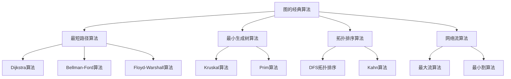

# 图的经典算法

## 📖 核心概念

**图的经典算法**是图论中的重要算法，包括最短路径算法、最小生成树算法、拓扑排序等。这些算法在计算机科学中有广泛的应用。

### 🏗️ 图经典算法分类



## 🔧 图经典算法实现

### Dijkstra算法

```cpp
class DijkstraAlgorithm {
private:
    struct Edge {
        int destination;
        int weight;
        
        Edge(int dest, int w) : destination(dest), weight(w) {}
    };
    
    struct Vertex {
        int id;
        int distance;
        
        Vertex(int i, int d) : id(i), distance(d) {}
    };
    
    vector<vector<Edge>> graph;
    vector<int> distances;
    vector<int> previous;
    int vertices;
    
public:
    DijkstraAlgorithm(int v) : vertices(v) {
        graph.resize(vertices);
        distances.resize(vertices, INT_MAX);
        previous.resize(vertices, -1);
    }
    
    void addEdge(int source, int destination, int weight) {
        graph[source].push_back(Edge(destination, weight));
    }
    
    void dijkstra(int source) {
        distances[source] = 0;
        
        priority_queue<Vertex, vector<Vertex>, function<bool(const Vertex&, const Vertex&)>> pq(
            [](const Vertex& a, const Vertex& b) {
                return a.distance > b.distance; // 最小堆
            }
        );
        
        pq.push(Vertex(source, 0));
        
        while (!pq.empty()) {
            Vertex current = pq.top();
            pq.pop();
            
            int u = current.id;
            
            if (current.distance > distances[u]) {
                continue; // 已经处理过更短的路径
            }
            
            for (const Edge& edge : graph[u]) {
                int v = edge.destination;
                int weight = edge.weight;
                
                if (distances[u] + weight < distances[v]) {
                    distances[v] = distances[u] + weight;
                    previous[v] = u;
                    pq.push(Vertex(v, distances[v]));
                }
            }
        }
    }
    
    vector<int> getShortestPath(int source, int destination) {
        dijkstra(source);
        
        vector<int> path;
        if (distances[destination] == INT_MAX) {
            return path; // 没有路径
        }
        
        int current = destination;
        while (current != -1) {
            path.push_back(current);
            current = previous[current];
        }
        
        reverse(path.begin(), path.end());
        return path;
    }
    
    void displayShortestPaths(int source) {
        dijkstra(source);
        
        cout << "Shortest paths from vertex " << source << ":" << endl;
        cout << "================================" << endl;
        
        for (int i = 0; i < vertices; ++i) {
            if (distances[i] == INT_MAX) {
                cout << "Vertex " << i << ": No path" << endl;
            } else {
                cout << "Vertex " << i << ": Distance = " << distances[i] << ", Path = ";
                vector<int> path = getShortestPath(source, i);
                for (int j = 0; j < path.size(); ++j) {
                    cout << path[j];
                    if (j < path.size() - 1) cout << " -> ";
                }
                cout << endl;
            }
        }
    }
};
```

### Bellman-Ford算法

```cpp
class BellmanFordAlgorithm {
private:
    struct Edge {
        int source;
        int destination;
        int weight;
        
        Edge(int s, int d, int w) : source(s), destination(d), weight(w) {}
    };
    
    vector<Edge> edges;
    vector<int> distances;
    vector<int> previous;
    int vertices;
    
public:
    BellmanFordAlgorithm(int v) : vertices(v) {
        distances.resize(vertices, INT_MAX);
        previous.resize(vertices, -1);
    }
    
    void addEdge(int source, int destination, int weight) {
        edges.push_back(Edge(source, destination, weight));
    }
    
    bool bellmanFord(int source) {
        distances[source] = 0;
        
        // 松弛操作
        for (int i = 0; i < vertices - 1; ++i) {
            for (const Edge& edge : edges) {
                int u = edge.source;
                int v = edge.destination;
                int w = edge.weight;
                
                if (distances[u] != INT_MAX && distances[u] + w < distances[v]) {
                    distances[v] = distances[u] + w;
                    previous[v] = u;
                }
            }
        }
        
        // 检测负权环
        for (const Edge& edge : edges) {
            int u = edge.source;
            int v = edge.destination;
            int w = edge.weight;
            
            if (distances[u] != INT_MAX && distances[u] + w < distances[v]) {
                return false; // 存在负权环
            }
        }
        
        return true; // 没有负权环
    }
    
    vector<int> getShortestPath(int source, int destination) {
        if (!bellmanFord(source)) {
            cout << "Graph contains negative weight cycle" << endl;
            return {};
        }
        
        vector<int> path;
        if (distances[destination] == INT_MAX) {
            return path; // 没有路径
        }
        
        int current = destination;
        while (current != -1) {
            path.push_back(current);
            current = previous[current];
        }
        
        reverse(path.begin(), path.end());
        return path;
    }
    
    void displayShortestPaths(int source) {
        if (!bellmanFord(source)) {
            cout << "Graph contains negative weight cycle" << endl;
            return;
        }
        
        cout << "Shortest paths from vertex " << source << ":" << endl;
        cout << "================================" << endl;
        
        for (int i = 0; i < vertices; ++i) {
            if (distances[i] == INT_MAX) {
                cout << "Vertex " << i << ": No path" << endl;
            } else {
                cout << "Vertex " << i << ": Distance = " << distances[i] << ", Path = ";
                vector<int> path = getShortestPath(source, i);
                for (int j = 0; j < path.size(); ++j) {
                    cout << path[j];
                    if (j < path.size() - 1) cout << " -> ";
                }
                cout << endl;
            }
        }
    }
};
```

### Floyd-Warshall算法

```cpp
class FloydWarshallAlgorithm {
private:
    vector<vector<int>> distances;
    vector<vector<int>> next;
    int vertices;
    
public:
    FloydWarshallAlgorithm(int v) : vertices(v) {
        distances.resize(vertices, vector<int>(vertices, INT_MAX));
        next.resize(vertices, vector<int>(vertices, -1));
        
        // 初始化对角线为0
        for (int i = 0; i < vertices; ++i) {
            distances[i][i] = 0;
        }
    }
    
    void addEdge(int source, int destination, int weight) {
        distances[source][destination] = weight;
        next[source][destination] = destination;
    }
    
    void floydWarshall() {
        for (int k = 0; k < vertices; ++k) {
            for (int i = 0; i < vertices; ++i) {
                for (int j = 0; j < vertices; ++j) {
                    if (distances[i][k] != INT_MAX && distances[k][j] != INT_MAX) {
                        if (distances[i][k] + distances[k][j] < distances[i][j]) {
                            distances[i][j] = distances[i][k] + distances[k][j];
                            next[i][j] = next[i][k];
                        }
                    }
                }
            }
        }
    }
    
    vector<int> getShortestPath(int source, int destination) {
        vector<int> path;
        
        if (distances[source][destination] == INT_MAX) {
            return path; // 没有路径
        }
        
        int current = source;
        while (current != destination) {
            path.push_back(current);
            current = next[current][destination];
        }
        path.push_back(destination);
        
        return path;
    }
    
    void displayAllPairsShortestPaths() {
        floydWarshall();
        
        cout << "All pairs shortest paths:" << endl;
        cout << "=========================" << endl;
        
        for (int i = 0; i < vertices; ++i) {
            for (int j = 0; j < vertices; ++j) {
                if (distances[i][j] == INT_MAX) {
                    cout << "INF ";
                } else {
                    cout << distances[i][j] << " ";
                }
            }
            cout << endl;
        }
    }
    
    void displayShortestPath(int source, int destination) {
        floydWarshall();
        
        vector<int> path = getShortestPath(source, destination);
        
        if (path.empty()) {
            cout << "No path from " << source << " to " << destination << endl;
        } else {
            cout << "Shortest path from " << source << " to " << destination << ": ";
            for (int i = 0; i < path.size(); ++i) {
                cout << path[i];
                if (i < path.size() - 1) cout << " -> ";
            }
            cout << " (Distance: " << distances[source][destination] << ")" << endl;
        }
    }
};
```

### Kruskal算法

```cpp
class KruskalAlgorithm {
private:
    struct Edge {
        int source;
        int destination;
        int weight;
        
        Edge(int s, int d, int w) : source(s), destination(d), weight(w) {}
    };
    
    struct UnionFind {
        vector<int> parent;
        vector<int> rank;
        
        UnionFind(int n) : parent(n), rank(n, 0) {
            for (int i = 0; i < n; ++i) {
                parent[i] = i;
            }
        }
        
        int find(int x) {
            if (parent[x] != x) {
                parent[x] = find(parent[x]);
            }
            return parent[x];
        }
        
        void unite(int x, int y) {
            int px = find(x);
            int py = find(y);
            
            if (px == py) return;
            
            if (rank[px] < rank[py]) {
                parent[px] = py;
            } else if (rank[px] > rank[py]) {
                parent[py] = px;
            } else {
                parent[py] = px;
                rank[px]++;
            }
        }
    };
    
    vector<Edge> edges;
    int vertices;
    
public:
    KruskalAlgorithm(int v) : vertices(v) {}
    
    void addEdge(int source, int destination, int weight) {
        edges.push_back(Edge(source, destination, weight));
    }
    
    vector<Edge> kruskalMST() {
        // 按权重排序
        sort(edges.begin(), edges.end(), [](const Edge& a, const Edge& b) {
            return a.weight < b.weight;
        });
        
        UnionFind uf(vertices);
        vector<Edge> mst;
        
        for (const Edge& edge : edges) {
            if (uf.find(edge.source) != uf.find(edge.destination)) {
                mst.push_back(edge);
                uf.unite(edge.source, edge.destination);
            }
        }
        
        return mst;
    }
    
    void displayMST() {
        vector<Edge> mst = kruskalMST();
        
        cout << "Minimum Spanning Tree (Kruskal):" << endl;
        cout << "=================================" << endl;
        
        int totalWeight = 0;
        for (const Edge& edge : mst) {
            cout << edge.source << " - " << edge.destination << " : " << edge.weight << endl;
            totalWeight += edge.weight;
        }
        
        cout << "Total weight: " << totalWeight << endl;
    }
};
```

### Prim算法

```cpp
class PrimAlgorithm {
private:
    struct Edge {
        int destination;
        int weight;
        
        Edge(int dest, int w) : destination(dest), weight(w) {}
    };
    
    struct Vertex {
        int id;
        int key;
        
        Vertex(int i, int k) : id(i), key(k) {}
    };
    
    vector<vector<Edge>> graph;
    vector<int> key;
    vector<bool> inMST;
    vector<int> parent;
    int vertices;
    
public:
    PrimAlgorithm(int v) : vertices(v) {
        graph.resize(vertices);
        key.resize(vertices, INT_MAX);
        inMST.resize(vertices, false);
        parent.resize(vertices, -1);
    }
    
    void addEdge(int source, int destination, int weight) {
        graph[source].push_back(Edge(destination, weight));
        graph[destination].push_back(Edge(source, weight)); // 无向图
    }
    
    vector<Edge> primMST() {
        key[0] = 0;
        
        priority_queue<Vertex, vector<Vertex>, function<bool(const Vertex&, const Vertex&)>> pq(
            [](const Vertex& a, const Vertex& b) {
                return a.key > b.key; // 最小堆
            }
        );
        
        pq.push(Vertex(0, 0));
        
        vector<Edge> mst;
        
        while (!pq.empty()) {
            Vertex current = pq.top();
            pq.pop();
            
            int u = current.id;
            
            if (inMST[u]) {
                continue;
            }
            
            inMST[u] = true;
            
            if (parent[u] != -1) {
                mst.push_back(Edge(parent[u], key[u]));
            }
            
            for (const Edge& edge : graph[u]) {
                int v = edge.destination;
                int weight = edge.weight;
                
                if (!inMST[v] && weight < key[v]) {
                    key[v] = weight;
                    parent[v] = u;
                    pq.push(Vertex(v, key[v]));
                }
            }
        }
        
        return mst;
    }
    
    void displayMST() {
        vector<Edge> mst = primMST();
        
        cout << "Minimum Spanning Tree (Prim):" << endl;
        cout << "=============================" << endl;
        
        int totalWeight = 0;
        for (const Edge& edge : mst) {
            cout << parent[edge.destination] << " - " << edge.destination << " : " << edge.weight << endl;
            totalWeight += edge.weight;
        }
        
        cout << "Total weight: " << totalWeight << endl;
    }
};
```

### 拓扑排序

```cpp
class TopologicalSort {
private:
    vector<vector<int>> graph;
    vector<int> inDegree;
    vector<bool> visited;
    vector<int> finishTime;
    int vertices;
    int time;
    
public:
    TopologicalSort(int v) : vertices(v), time(0) {
        graph.resize(vertices);
        inDegree.resize(vertices, 0);
        visited.resize(vertices, false);
        finishTime.resize(vertices, 0);
    }
    
    void addEdge(int source, int destination) {
        graph[source].push_back(destination);
        inDegree[destination]++;
    }
    
    // Kahn算法
    vector<int> kahnTopologicalSort() {
        vector<int> result;
        queue<int> q;
        
        // 找到所有入度为0的顶点
        for (int i = 0; i < vertices; ++i) {
            if (inDegree[i] == 0) {
                q.push(i);
            }
        }
        
        while (!q.empty()) {
            int u = q.front();
            q.pop();
            result.push_back(u);
            
            for (int v : graph[u]) {
                inDegree[v]--;
                if (inDegree[v] == 0) {
                    q.push(v);
                }
            }
        }
        
        return result;
    }
    
    // DFS拓扑排序
    vector<int> dfsTopologicalSort() {
        resetVisited();
        vector<int> result;
        
        for (int i = 0; i < vertices; ++i) {
            if (!visited[i]) {
                dfsTopological(i, result);
            }
        }
        
        reverse(result.begin(), result.end());
        return result;
    }
    
    void dfsTopological(int vertex, vector<int>& result) {
        visited[vertex] = true;
        
        for (int neighbor : graph[vertex]) {
            if (!visited[neighbor]) {
                dfsTopological(neighbor, result);
            }
        }
        
        result.push_back(vertex);
    }
    
    // 检测环
    bool hasCycle() {
        vector<int> result = kahnTopologicalSort();
        return result.size() != vertices;
    }
    
    void resetVisited() {
        fill(visited.begin(), visited.end(), false);
    }
    
    void displayTopologicalSort() {
        cout << "Topological Sort:" << endl;
        cout << "================" << endl;
        
        if (hasCycle()) {
            cout << "Graph has cycle, cannot perform topological sort" << endl;
            return;
        }
        
        vector<int> kahnResult = kahnTopologicalSort();
        vector<int> dfsResult = dfsTopologicalSort();
        
        cout << "Kahn algorithm: ";
        for (int vertex : kahnResult) {
            cout << vertex << " ";
        }
        cout << endl;
        
        cout << "DFS algorithm: ";
        for (int vertex : dfsResult) {
            cout << vertex << " ";
        }
        cout << endl;
    }
};
```

## 🎯 图经典算法应用

### 网络路由

```cpp
class NetworkRouting {
private:
    DijkstraAlgorithm dijkstra;
    FloydWarshallAlgorithm floydWarshall;
    int vertices;
    
public:
    NetworkRouting(int v) : vertices(v), dijkstra(v), floydWarshall(v) {}
    
    void addLink(int source, int destination, int latency) {
        dijkstra.addEdge(source, destination, latency);
        floydWarshall.addEdge(source, destination, latency);
    }
    
    void findOptimalRoute(int source, int destination) {
        cout << "Finding optimal route from " << source << " to " << destination << ":" << endl;
        cout << "=================================================" << endl;
        
        // 使用Dijkstra算法
        dijkstra.displayShortestPaths(source);
        
        // 使用Floyd-Warshall算法
        floydWarshall.displayShortestPath(source, destination);
    }
    
    void analyzeNetworkTopology() {
        cout << "Network Topology Analysis:" << endl;
        cout << "=========================" << endl;
        
        floydWarshall.displayAllPairsShortestPaths();
    }
};
```

### 任务调度

```cpp
class TaskScheduler {
private:
    TopologicalSort topologicalSort;
    int vertices;
    
public:
    TaskScheduler(int v) : vertices(v), topologicalSort(v) {}
    
    void addDependency(int task, int dependency) {
        topologicalSort.addEdge(dependency, task);
    }
    
    void scheduleTasks() {
        cout << "Task Scheduling:" << endl;
        cout << "===============" << endl;
        
        if (topologicalSort.hasCycle()) {
            cout << "Circular dependencies detected! Cannot schedule tasks." << endl;
            return;
        }
        
        topologicalSort.displayTopologicalSort();
    }
    
    void displayTaskDependencies() {
        cout << "Task Dependencies:" << endl;
        cout << "=================" << endl;
        
        // 这里可以添加显示依赖关系的代码
        cout << "Dependencies added successfully" << endl;
    }
};
```

## 📊 图经典算法分析

### 时间复杂度分析

```cpp
class GraphAlgorithmAnalysis {
public:
    static void analyzeTimeComplexity() {
        cout << "Graph Algorithm Time Complexity Analysis:" << endl;
        cout << "=======================================" << endl;
        
        cout << "1. Dijkstra Algorithm:" << endl;
        cout << "   - Time Complexity: O((V + E) log V)" << endl;
        cout << "   - Space Complexity: O(V)" << endl;
        cout << "   - Best for: Single source shortest path" << endl;
        
        cout << "2. Bellman-Ford Algorithm:" << endl;
        cout << "   - Time Complexity: O(VE)" << endl;
        cout << "   - Space Complexity: O(V)" << endl;
        cout << "   - Best for: Negative weight edges" << endl;
        
        cout << "3. Floyd-Warshall Algorithm:" << endl;
        cout << "   - Time Complexity: O(V³)" << endl;
        cout << "   - Space Complexity: O(V²)" << endl;
        cout << "   - Best for: All pairs shortest path" << endl;
        
        cout << "4. Kruskal Algorithm:" << endl;
        cout << "   - Time Complexity: O(E log E)" << endl;
        cout << "   - Space Complexity: O(V)" << endl;
        cout << "   - Best for: Sparse graphs" << endl;
        
        cout << "5. Prim Algorithm:" << endl;
        cout << "   - Time Complexity: O((V + E) log V)" << endl;
        cout << "   - Space Complexity: O(V)" << endl;
        cout << "   - Best for: Dense graphs" << endl;
        
        cout << "6. Topological Sort:" << endl;
        cout << "   - Time Complexity: O(V + E)" << endl;
        cout << "   - Space Complexity: O(V)" << endl;
        cout << "   - Best for: DAG scheduling" << endl;
    }
    
    static void analyzeSpaceComplexity() {
        cout << "Graph Algorithm Space Complexity Analysis:" << endl;
        cout << "========================================" << endl;
        
        cout << "1. Dijkstra Algorithm:" << endl;
        cout << "   - Priority queue: O(V)" << endl;
        cout << "   - Distance array: O(V)" << endl;
        cout << "   - Total: O(V)" << endl;
        
        cout << "2. Bellman-Ford Algorithm:" << endl;
        cout << "   - Distance array: O(V)" << endl;
        cout << "   - Edge list: O(E)" << endl;
        cout << "   - Total: O(V + E)" << endl;
        
        cout << "3. Floyd-Warshall Algorithm:" << endl;
        cout << "   - Distance matrix: O(V²)" << endl;
        cout << "   - Next matrix: O(V²)" << endl;
        cout << "   - Total: O(V²)" << endl;
        
        cout << "4. Kruskal Algorithm:" << endl;
        cout << "   - Union-Find: O(V)" << endl;
        cout << "   - Edge list: O(E)" << endl;
        cout << "   - Total: O(V + E)" << endl;
        
        cout << "5. Prim Algorithm:" << endl;
        cout << "   - Priority queue: O(V)" << endl;
        cout << "   - Key array: O(V)" << endl;
        cout << "   - Total: O(V)" << endl;
        
        cout << "6. Topological Sort:" << endl;
        cout << "   - In-degree array: O(V)" << endl;
        cout << "   - Queue: O(V)" << endl;
        cout << "   - Total: O(V)" << endl;
    }
};
```

## 🎮 图经典算法测试

### 1. 基础功能测试

```cpp
class GraphAlgorithmTest {
public:
    static void testDijkstra() {
        cout << "Testing Dijkstra Algorithm:" << endl;
        cout << "=========================" << endl;
        
        DijkstraAlgorithm dijkstra(6);
        dijkstra.addEdge(0, 1, 4);
        dijkstra.addEdge(0, 2, 2);
        dijkstra.addEdge(1, 3, 5);
        dijkstra.addEdge(2, 4, 10);
        dijkstra.addEdge(3, 5, 6);
        dijkstra.addEdge(4, 5, 3);
        
        dijkstra.displayShortestPaths(0);
    }
    
    static void testBellmanFord() {
        cout << "Testing Bellman-Ford Algorithm:" << endl;
        cout << "==============================" << endl;
        
        BellmanFordAlgorithm bellmanFord(6);
        bellmanFord.addEdge(0, 1, 4);
        bellmanFord.addEdge(0, 2, 2);
        bellmanFord.addEdge(1, 3, 5);
        bellmanFord.addEdge(2, 4, 10);
        bellmanFord.addEdge(3, 5, 6);
        bellmanFord.addEdge(4, 5, 3);
        
        bellmanFord.displayShortestPaths(0);
    }
    
    static void testFloydWarshall() {
        cout << "Testing Floyd-Warshall Algorithm:" << endl;
        cout << "===============================" << endl;
        
        FloydWarshallAlgorithm floydWarshall(6);
        floydWarshall.addEdge(0, 1, 4);
        floydWarshall.addEdge(0, 2, 2);
        floydWarshall.addEdge(1, 3, 5);
        floydWarshall.addEdge(2, 4, 10);
        floydWarshall.addEdge(3, 5, 6);
        floydWarshall.addEdge(4, 5, 3);
        
        floydWarshall.displayAllPairsShortestPaths();
        floydWarshall.displayShortestPath(0, 5);
    }
    
    static void testKruskal() {
        cout << "Testing Kruskal Algorithm:" << endl;
        cout << "=========================" << endl;
        
        KruskalAlgorithm kruskal(6);
        kruskal.addEdge(0, 1, 4);
        kruskal.addEdge(0, 2, 2);
        kruskal.addEdge(1, 3, 5);
        kruskal.addEdge(2, 4, 10);
        kruskal.addEdge(3, 5, 6);
        kruskal.addEdge(4, 5, 3);
        
        kruskal.displayMST();
    }
    
    static void testPrim() {
        cout << "Testing Prim Algorithm:" << endl;
        cout << "======================" << endl;
        
        PrimAlgorithm prim(6);
        prim.addEdge(0, 1, 4);
        prim.addEdge(0, 2, 2);
        prim.addEdge(1, 3, 5);
        prim.addEdge(2, 4, 10);
        prim.addEdge(3, 5, 6);
        prim.addEdge(4, 5, 3);
        
        prim.displayMST();
    }
    
    static void testTopologicalSort() {
        cout << "Testing Topological Sort:" << endl;
        cout << "========================" << endl;
        
        TopologicalSort topologicalSort(6);
        topologicalSort.addEdge(0, 1);
        topologicalSort.addEdge(0, 2);
        topologicalSort.addEdge(1, 3);
        topologicalSort.addEdge(2, 4);
        topologicalSort.addEdge(3, 5);
        topologicalSort.addEdge(4, 5);
        
        topologicalSort.displayTopologicalSort();
    }
    
    static void testNetworkRouting() {
        cout << "Testing Network Routing:" << endl;
        cout << "=======================" << endl;
        
        NetworkRouting routing(6);
        routing.addLink(0, 1, 4);
        routing.addLink(0, 2, 2);
        routing.addLink(1, 3, 5);
        routing.addLink(2, 4, 10);
        routing.addLink(3, 5, 6);
        routing.addLink(4, 5, 3);
        
        routing.findOptimalRoute(0, 5);
    }
    
    static void testTaskScheduler() {
        cout << "Testing Task Scheduler:" << endl;
        cout << "======================" << endl;
        
        TaskScheduler scheduler(6);
        scheduler.addDependency(1, 0);
        scheduler.addDependency(2, 0);
        scheduler.addDependency(3, 1);
        scheduler.addDependency(4, 2);
        scheduler.addDependency(5, 3);
        scheduler.addDependency(5, 4);
        
        scheduler.scheduleTasks();
    }
};
```

## 🔗 相关链接

- [[01-图的基本概念|图的基本概念]]
- [[02-图的存储结构|图的存储结构]]
- [[03-图的遍历算法|图的遍历算法]]

## 💡 图经典算法要点

1. **最短路径**: Dijkstra、Bellman-Ford、Floyd-Warshall
2. **最小生成树**: Kruskal、Prim
3. **拓扑排序**: Kahn、DFS
4. **应用场景**: 网络路由、任务调度、资源分配

---

*📝 图算法提示：图经典算法是图论的核心，掌握这些算法有助于解决复杂的图问题*
