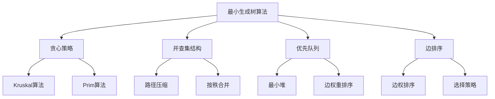

# 最小生成树算法

## 📖 核心概念

**最小生成树（Minimum Spanning Tree, MST）**是连接图中所有顶点的边权值和最小的树。最小生成树算法是图论中的重要算法，广泛应用于网络设计、电路设计、城市规划等领域。

### 🏗️ 最小生成树算法的组成要素



## 🔍 算法分类体系

### 按策略分类

| 算法 | 策略 | 时间复杂度 | 空间复杂度 | 特点 |
|------|------|------------|------------|------|
| **Kruskal** | 按边权排序，贪心选择 | O(E log E) | O(V) | 适合稀疏图 |
| **Prim** | 从顶点开始，逐步扩展 | O(E log V) | O(V) | 适合稠密图 |
| **Borůvka** | 并行处理连通分量 | O(E log V) | O(V) | 适合并行计算 |

### 按实现方式分类

| 实现方式 | 优点 | 缺点 | 适用场景 |
|----------|------|------|----------|
| **并查集** | 高效合并集合 | 需要额外空间 | Kruskal算法 |
| **优先队列** | 动态选择最小边 | 需要堆操作 | Prim算法 |
| **数组排序** | 简单直观 | 需要排序所有边 | 小规模图 |

## 💻 Kruskal算法

### 基础实现

```cpp
template<typename T>
class Kruskal {
private:
    const AdjacencyList<T>& graph;
    
    // 边结构
    struct Edge {
        int from, to;
        T weight;
        
        Edge(int f, int t, T w) : from(f), to(t), weight(w) {}
        
        bool operator<(const Edge& other) const {
            return weight < other.weight;
        }
    };
    
    // 并查集
    class UnionFind {
    private:
        vector<int> parent;
        vector<int> rank;
        
    public:
        UnionFind(int n) : parent(n), rank(n, 0) {
            for (int i = 0; i < n; i++) {
                parent[i] = i;
            }
        }
        
        int find(int x) {
            if (parent[x] != x) {
                parent[x] = find(parent[x]); // 路径压缩
            }
            return parent[x];
        }
        
        bool unite(int x, int y) {
            int rootX = find(x);
            int rootY = find(y);
            
            if (rootX == rootY) return false;
            
            // 按秩合并
            if (rank[rootX] < rank[rootY]) {
                parent[rootX] = rootY;
            } else if (rank[rootX] > rank[rootY]) {
                parent[rootY] = rootX;
            } else {
                parent[rootY] = rootX;
                rank[rootX]++;
            }
            
            return true;
        }
        
        bool connected(int x, int y) {
            return find(x) == find(y);
        }
    };
    
public:
    Kruskal(const AdjacencyList<T>& g) : graph(g) {}
    
    // Kruskal算法实现
    vector<Edge> findMST() {
        vector<Edge> mst;
        vector<Edge> edges;
        
        // 收集所有边
        for (int i = 0; i < graph.getVertexCount(); i++) {
            for (const auto& edge : graph.getNeighbors(i)) {
                if (edge.to > i) { // 避免重复添加无向边
                    edges.push_back(Edge(i, edge.to, edge.weight));
                }
            }
        }
        
        // 按权重排序
        sort(edges.begin(), edges.end());
        
        // 使用并查集
        UnionFind uf(graph.getVertexCount());
        
        // 贪心选择边
        for (const Edge& edge : edges) {
            if (!uf.connected(edge.from, edge.to)) {
                uf.unite(edge.from, edge.to);
                mst.push_back(edge);
                
                // 如果已经选择了V-1条边，可以提前结束
                if (mst.size() == graph.getVertexCount() - 1) {
                    break;
                }
            }
        }
        
        return mst;
    }
    
    // 计算MST的总权重
    T getMSTWeight() {
        vector<Edge> mst = findMST();
        T totalWeight = 0;
        
        for (const Edge& edge : mst) {
            totalWeight += edge.weight;
        }
        
        return totalWeight;
    }
    
    // 检查图是否连通
    bool isConnected() {
        vector<Edge> mst = findMST();
        return mst.size() == graph.getVertexCount() - 1;
    }
};
```

### 优化版本（使用路径压缩和按秩合并）

```cpp
template<typename T>
class OptimizedKruskal {
private:
    const AdjacencyList<T>& graph;
    
    struct Edge {
        int from, to;
        T weight;
        
        Edge(int f, int t, T w) : from(f), to(t), weight(w) {}
        
        bool operator<(const Edge& other) const {
            return weight < other.weight;
        }
    };
    
    // 优化的并查集
    class OptimizedUnionFind {
    private:
        vector<int> parent;
        vector<int> rank;
        int components;
        
    public:
        OptimizedUnionFind(int n) : parent(n), rank(n, 0), components(n) {
            iota(parent.begin(), parent.end(), 0);
        }
        
        int find(int x) {
            if (parent[x] != x) {
                parent[x] = find(parent[x]); // 路径压缩
            }
            return parent[x];
        }
        
        bool unite(int x, int y) {
            int rootX = find(x);
            int rootY = find(y);
            
            if (rootX == rootY) return false;
            
            // 按秩合并
            if (rank[rootX] < rank[rootY]) {
                parent[rootX] = rootY;
            } else if (rank[rootX] > rank[rootY]) {
                parent[rootY] = rootX;
            } else {
                parent[rootY] = rootX;
                rank[rootX]++;
            }
            
            components--;
            return true;
        }
        
        bool connected(int x, int y) {
            return find(x) == find(y);
        }
        
        int getComponentCount() const {
            return components;
        }
    };
    
public:
    OptimizedKruskal(const AdjacencyList<T>& g) : graph(g) {}
    
    // 优化的Kruskal算法
    vector<Edge> findMST() {
        vector<Edge> mst;
        vector<Edge> edges;
        
        // 收集所有边
        for (int i = 0; i < graph.getVertexCount(); i++) {
            for (const auto& edge : graph.getNeighbors(i)) {
                if (edge.to > i) {
                    edges.push_back(Edge(i, edge.to, edge.weight));
                }
            }
        }
        
        // 按权重排序
        sort(edges.begin(), edges.end());
        
        // 使用优化的并查集
        OptimizedUnionFind uf(graph.getVertexCount());
        
        // 贪心选择边
        for (const Edge& edge : edges) {
            if (uf.unite(edge.from, edge.to)) {
                mst.push_back(edge);
                
                // 如果只有一个连通分量，可以提前结束
                if (uf.getComponentCount() == 1) {
                    break;
                }
            }
        }
        
        return mst;
    }
};
```

## 💻 Prim算法

### 基础实现

```cpp
template<typename T>
class Prim {
private:
    const AdjacencyList<T>& graph;
    
    // 边结构
    struct Edge {
        int from, to;
        T weight;
        
        Edge(int f, int t, T w) : from(f), to(t), weight(w) {}
        
        bool operator>(const Edge& other) const {
            return weight > other.weight;
        }
    };
    
public:
    Prim(const AdjacencyList<T>& g) : graph(g) {}
    
    // Prim算法实现
    vector<Edge> findMST(int start = 0) {
        vector<Edge> mst;
        vector<bool> inMST(graph.getVertexCount(), false);
        priority_queue<Edge, vector<Edge>, greater<Edge>> pq;
        
        // 从起始顶点开始
        inMST[start] = true;
        
        // 将起始顶点的所有邻接边加入优先队列
        for (const auto& edge : graph.getNeighbors(start)) {
            pq.push(Edge(start, edge.to, edge.weight));
        }
        
        while (!pq.empty() && mst.size() < graph.getVertexCount() - 1) {
            Edge current = pq.top();
            pq.pop();
            
            // 如果目标顶点已经在MST中，跳过
            if (inMST[current.to]) continue;
            
            // 将边加入MST
            mst.push_back(current);
            inMST[current.to] = true;
            
            // 将新加入顶点的所有邻接边加入优先队列
            for (const auto& edge : graph.getNeighbors(current.to)) {
                if (!inMST[edge.to]) {
                    pq.push(Edge(current.to, edge.to, edge.weight));
                }
            }
        }
        
        return mst;
    }
    
    // 计算MST的总权重
    T getMSTWeight(int start = 0) {
        vector<Edge> mst = findMST(start);
        T totalWeight = 0;
        
        for (const Edge& edge : mst) {
            totalWeight += edge.weight;
        }
        
        return totalWeight;
    }
};
```

### 优化版本（使用索引优先队列）

```cpp
template<typename T>
class OptimizedPrim {
private:
    const AdjacencyList<T>& graph;
    
    // 索引优先队列
    class IndexedPriorityQueue {
    private:
        vector<T> keys;
        vector<int> heap;
        vector<int> index;
        int size;
        
    public:
        IndexedPriorityQueue(int n) : keys(n, numeric_limits<T>::max()), 
                                      heap(n), index(n, -1), size(0) {}
        
        void insert(int i, T key) {
            keys[i] = key;
            heap[size] = i;
            index[i] = size;
            size++;
            swim(size - 1);
        }
        
        void decreaseKey(int i, T key) {
            keys[i] = key;
            swim(index[i]);
        }
        
        int extractMin() {
            int min = heap[0];
            swap(heap[0], heap[size - 1]);
            index[heap[0]] = 0;
            index[min] = -1;
            size--;
            sink(0);
            return min;
        }
        
        bool contains(int i) const {
            return index[i] != -1;
        }
        
        bool isEmpty() const {
            return size == 0;
        }
        
        T getKey(int i) const {
            return keys[i];
        }
        
    private:
        void swim(int k) {
            while (k > 0 && keys[heap[k]] < keys[heap[(k - 1) / 2]]) {
                swap(heap[k], heap[(k - 1) / 2]);
                index[heap[k]] = k;
                index[heap[(k - 1) / 2]] = (k - 1) / 2;
                k = (k - 1) / 2;
            }
        }
        
        void sink(int k) {
            while (2 * k + 1 < size) {
                int j = 2 * k + 1;
                if (j + 1 < size && keys[heap[j + 1]] < keys[heap[j]]) {
                    j++;
                }
                if (keys[heap[k]] <= keys[heap[j]]) break;
                swap(heap[k], heap[j]);
                index[heap[k]] = k;
                index[heap[j]] = j;
                k = j;
            }
        }
    };
    
public:
    OptimizedPrim(const AdjacencyList<T>& g) : graph(g) {}
    
    // 优化的Prim算法
    vector<pair<int, int>> findMST(int start = 0) {
        vector<pair<int, int>> mst;
        vector<bool> inMST(graph.getVertexCount(), false);
        vector<int> parent(graph.getVertexCount(), -1);
        IndexedPriorityQueue pq(graph.getVertexCount());
        
        // 初始化
        pq.insert(start, 0);
        
        while (!pq.isEmpty()) {
            int current = pq.extractMin();
            inMST[current] = true;
            
            // 添加边到MST（除了起始顶点）
            if (parent[current] != -1) {
                mst.push_back({parent[current], current});
            }
            
            // 更新邻接顶点的键值
            for (const auto& edge : graph.getNeighbors(current)) {
                if (!inMST[edge.to]) {
                    if (!pq.contains(edge.to)) {
                        pq.insert(edge.to, edge.weight);
                        parent[edge.to] = current;
                    } else if (edge.weight < pq.getKey(edge.to)) {
                        pq.decreaseKey(edge.to, edge.weight);
                        parent[edge.to] = current;
                    }
                }
            }
        }
        
        return mst;
    }
};
```

## 🎯 算法应用场景

### 1. 网络设计

```cpp
class NetworkDesigner {
private:
    AdjacencyList<double> graph;
    
public:
    NetworkDesigner(int nodeCount) : graph(nodeCount, false) {}
    
    // 设计最小成本网络
    double designMinimumCostNetwork() {
        Kruskal<double> kruskal(graph);
        return kruskal.getMSTWeight();
    }
    
    // 获取网络拓扑
    vector<pair<int, int>> getNetworkTopology() {
        Kruskal<double> kruskal(graph);
        auto mst = kruskal.findMST();
        
        vector<pair<int, int>> topology;
        for (const auto& edge : mst) {
            topology.push_back({edge.from, edge.to});
        }
        
        return topology;
    }
    
    // 添加连接
    void addConnection(int from, int to, double cost) {
        graph.addEdge(from, to, cost);
    }
    
    // 计算网络可靠性
    double calculateReliability() {
        Kruskal<double> kruskal(graph);
        return kruskal.isConnected() ? 1.0 : 0.0;
    }
};
```

### 2. 电路设计

```cpp
class CircuitDesigner {
private:
    AdjacencyList<int> graph;
    
public:
    CircuitDesigner(int componentCount) : graph(componentCount, false) {}
    
    // 设计最小成本电路
    int designMinimumCostCircuit() {
        Prim<int> prim(graph);
        return prim.getMSTWeight();
    }
    
    // 获取电路连接
    vector<pair<int, int>> getCircuitConnections() {
        Prim<int> prim(graph);
        auto mst = prim.findMST();
        
        vector<pair<int, int>> connections;
        for (const auto& edge : mst) {
            connections.push_back({edge.from, edge.to});
        }
        
        return connections;
    }
    
    // 添加组件连接
    void addConnection(int from, int to, int cost) {
        graph.addEdge(from, to, cost);
    }
};
```

### 3. 城市规划

```cpp
class UrbanPlanner {
private:
    AdjacencyList<double> graph;
    vector<string> locations;
    
public:
    UrbanPlanner(int locationCount) : graph(locationCount, false) {
        locations.resize(locationCount);
    }
    
    // 规划最小成本交通网络
    double planMinimumCostTransportation() {
        Kruskal<double> kruskal(graph);
        return kruskal.getMSTWeight();
    }
    
    // 获取交通路线
    vector<pair<string, string>> getTransportationRoutes() {
        Kruskal<double> kruskal(graph);
        auto mst = kruskal.findMST();
        
        vector<pair<string, string>> routes;
        for (const auto& edge : mst) {
            routes.push_back({locations[edge.from], locations[edge.to]});
        }
        
        return routes;
    }
    
    // 设置地点名称
    void setLocationName(int index, const string& name) {
        if (index >= 0 && index < locations.size()) {
            locations[index] = name;
        }
    }
    
    // 添加道路连接
    void addRoad(int from, int to, double distance) {
        graph.addEdge(from, to, distance);
    }
};
```

## ⚡ 算法复杂度对比

### 时间复杂度

| 算法 | 时间复杂度 | 适用场景 | 特点 |
|------|------------|----------|------|
| **Kruskal** | O(E log E) | 稀疏图 | 按边排序，适合边少的情况 |
| **Prim** | O(E log V) | 稠密图 | 按顶点扩展，适合边多的情况 |
| **Borůvka** | O(E log V) | 并行计算 | 适合并行处理 |

### 空间复杂度

| 算法 | 空间复杂度 | 说明 |
|------|------------|------|
| **Kruskal** | O(V) | 并查集空间 |
| **Prim** | O(V) | 优先队列空间 |
| **Borůvka** | O(V) | 连通分量标记空间 |

## 🔧 算法优化技巧

### 1. 边排序优化

```cpp
template<typename T>
class OptimizedEdgeSorting {
private:
    vector<pair<T, int>> edges; // (weight, edge_index)
    
public:
    void addEdge(T weight, int edgeIndex) {
        edges.push_back({weight, edgeIndex});
    }
    
    void sortEdges() {
        // 使用计数排序（如果权重范围较小）
        if (edges.size() > 0) {
            T maxWeight = edges[0].first;
            for (const auto& edge : edges) {
                maxWeight = max(maxWeight, edge.first);
            }
            
            if (maxWeight < 1000) { // 小范围使用计数排序
                countingSort();
            } else {
                sort(edges.begin(), edges.end());
            }
        }
    }
    
private:
    void countingSort() {
        T maxWeight = 0;
        for (const auto& edge : edges) {
            maxWeight = max(maxWeight, edge.first);
        }
        
        vector<vector<int>> count(maxWeight + 1);
        for (int i = 0; i < edges.size(); i++) {
            count[edges[i].first].push_back(i);
        }
        
        vector<pair<T, int>> sorted;
        for (int w = 0; w <= maxWeight; w++) {
            for (int idx : count[w]) {
                sorted.push_back(edges[idx]);
            }
        }
        
        edges = sorted;
    }
};
```

### 2. 并查集优化

```cpp
template<typename T>
class OptimizedUnionFind {
private:
    vector<int> parent;
    vector<int> rank;
    vector<T> weight; // 存储到根节点的权重
    
public:
    OptimizedUnionFind(int n) : parent(n), rank(n, 0), weight(n, 0) {
        iota(parent.begin(), parent.end(), 0);
    }
    
    int find(int x) {
        if (parent[x] != x) {
            int oldParent = parent[x];
            parent[x] = find(parent[x]);
            weight[x] += weight[oldParent]; // 路径压缩时更新权重
        }
        return parent[x];
    }
    
    bool unite(int x, int y, T w) {
        int rootX = find(x);
        int rootY = find(y);
        
        if (rootX == rootY) return false;
        
        // 按秩合并
        if (rank[rootX] < rank[rootY]) {
            parent[rootX] = rootY;
            weight[rootX] = w - weight[x] + weight[y];
        } else if (rank[rootX] > rank[rootY]) {
            parent[rootY] = rootX;
            weight[rootY] = w - weight[y] + weight[x];
        } else {
            parent[rootY] = rootX;
            weight[rootY] = w - weight[y] + weight[x];
            rank[rootX]++;
        }
        
        return true;
    }
    
    T getWeight(int x, int y) {
        if (find(x) != find(y)) return -1;
        return weight[x] - weight[y];
    }
};
```

## 🎓 学习要点总结

### 核心理解

1. **贪心策略**：理解MST算法的贪心选择原理
2. **并查集**：掌握并查集在Kruskal算法中的作用
3. **优先队列**：理解优先队列在Prim算法中的应用
4. **边排序**：掌握边权重排序的重要性

### 实践要点

1. **数据结构选择**：根据图的特点选择合适的算法
2. **边界处理**：注意空图和单顶点图的处理
3. **权重类型**：支持不同数据类型的权重
4. **连通性检查**：确保图是连通的

### 应用思维

1. **网络设计**：理解MST在网络设计中的应用
2. **电路设计**：掌握MST在电路设计中的作用
3. **城市规划**：理解MST在城市规划中的应用
4. **优化问题**：掌握MST在优化问题中的价值

---

**相关链接：**
- [[03-层次宇宙/04-图论天地/01-图Graph基础|图Graph基础]] - 图的基本概念和存储
- [[03-层次宇宙/04-图论天地/02-图的遍历算法|图的遍历算法]] - DFS和BFS基础
- [[03-层次宇宙/04-图论天地/03-最短路径算法|最短路径算法]] - Dijkstra和Floyd算法
- [[04-算法武器库/02-排序艺术/01-堆排序算法|堆排序算法]] - 优先队列的实现基础
