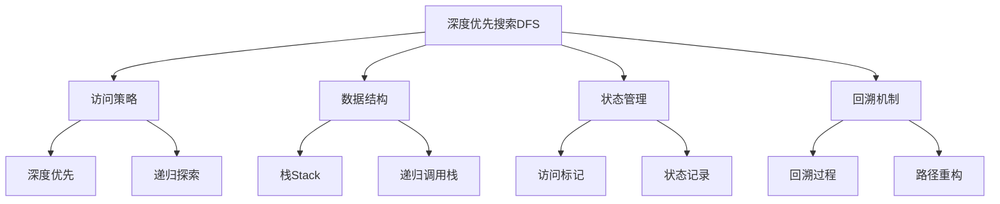

# 深度优先搜索

## 📖 核心概念

**深度优先搜索（Depth-First Search, DFS）**是一种用于遍历或搜索树或图的算法。它沿着树的深度遍历树的节点，尽可能深地搜索树的分支。当节点的所有边都已被探索过，搜索将回溯到发现该节点的边的起始节点。

### 🏗️ DFS的组成要素



## 🔍 DFS算法分类

### 按实现方式分类

| 实现方式 | 优点 | 缺点 | 适用场景 |
|----------|------|------|----------|
| **递归实现** | 代码简洁、逻辑清晰 | 栈溢出风险 | 小规模问题 |
| **迭代实现** | 避免栈溢出、可控性强 | 代码复杂 | 大规模问题 |
| **显式栈实现** | 完全控制栈操作 | 实现复杂 | 特殊需求 |

### 按应用场景分类

| 应用场景 | 算法变种 | 特点 | 时间复杂度 |
|----------|----------|------|------------|
| **图遍历** | 基础DFS | 访问所有节点 | O(V + E) |
| **路径查找** | 回溯DFS | 寻找特定路径 | O(b^d) |
| **连通性检测** | 连通分量DFS | 检测连通分量 | O(V + E) |
| **拓扑排序** | 拓扑DFS | 有向无环图排序 | O(V + E) |

## 💻 DFS基础实现

### 递归实现

```cpp
template<typename T>
class DFSRecursive {
private:
    const AdjacencyList<T>& graph;
    vector<bool> visited;
    vector<int> traversalOrder;
    
public:
    DFSRecursive(const AdjacencyList<T>& g) : graph(g) {
        visited.resize(graph.getVertexCount(), false);
    }
    
    // 基础DFS递归实现
    void dfs(int start) {
        visited[start] = true;
        traversalOrder.push_back(start);
        
        // 访问所有未访问的邻接顶点
        for (const auto& edge : graph.getNeighbors(start)) {
            if (!visited[edge.to]) {
                dfs(edge.to);
            }
        }
    }
    
    // 遍历整个图（处理非连通图）
    void dfsAll() {
        fill(visited.begin(), visited.end(), false);
        traversalOrder.clear();
        
        for (int i = 0; i < graph.getVertexCount(); i++) {
            if (!visited[i]) {
                dfs(i);
            }
        }
    }
    
    // 获取遍历结果
    const vector<int>& getTraversalOrder() const {
        return traversalOrder;
    }
    
    // 重置状态
    void reset() {
        fill(visited.begin(), visited.end(), false);
        traversalOrder.clear();
    }
    
    // 检查是否已访问
    bool isVisited(int vertex) const {
        return visited[vertex];
    }
};
```

### 迭代实现

```cpp
template<typename T>
class DFSIterative {
private:
    const AdjacencyList<T>& graph;
    vector<bool> visited;
    vector<int> traversalOrder;
    
public:
    DFSIterative(const AdjacencyList<T>& g) : graph(g) {
        visited.resize(graph.getVertexCount(), false);
    }
    
    // 使用栈的迭代DFS
    void dfs(int start) {
        stack<int> stk;
        stk.push(start);
        
        while (!stk.empty()) {
            int current = stk.top();
            stk.pop();
            
            if (!visited[current]) {
                visited[current] = true;
                traversalOrder.push_back(current);
                
                // 将邻接顶点压入栈（逆序保证访问顺序）
                auto neighbors = graph.getNeighbors(current);
                for (auto it = neighbors.rbegin(); it != neighbors.rend(); ++it) {
                    if (!visited[*it]) {
                        stk.push(*it);
                    }
                }
            }
        }
    }
    
    // 遍历整个图
    void dfsAll() {
        fill(visited.begin(), visited.end(), false);
        traversalOrder.clear();
        
        for (int i = 0; i < graph.getVertexCount(); i++) {
            if (!visited[i]) {
                dfs(i);
            }
        }
    }
    
    // 获取遍历结果
    const vector<int>& getTraversalOrder() const {
        return traversalOrder;
    }
    
    // 重置状态
    void reset() {
        fill(visited.begin(), visited.end(), false);
        traversalOrder.clear();
    }
};
```

## 🎯 DFS高级应用

### 1. 路径查找

```cpp
template<typename T>
class PathFinder {
private:
    const AdjacencyList<T>& graph;
    
public:
    PathFinder(const AdjacencyList<T>& g) : graph(g) {}
    
    // 使用DFS查找路径
    vector<int> findPath(int start, int end) {
        vector<bool> visited(graph.getVertexCount(), false);
        vector<int> path;
        
        if (dfsPath(start, end, visited, path)) {
            return path;
        }
        return vector<int>(); // 无路径
    }
    
    // 查找所有路径
    vector<vector<int>> findAllPaths(int start, int end) {
        vector<bool> visited(graph.getVertexCount(), false);
        vector<vector<int>> allPaths;
        vector<int> currentPath;
        
        dfsAllPaths(start, end, visited, currentPath, allPaths);
        return allPaths;
    }
    
private:
    bool dfsPath(int current, int end, vector<bool>& visited, vector<int>& path) {
        visited[current] = true;
        path.push_back(current);
        
        if (current == end) {
            return true; // 找到目标
        }
        
        for (const auto& edge : graph.getNeighbors(current)) {
            if (!visited[edge.to]) {
                if (dfsPath(edge.to, end, visited, path)) {
                    return true;
                }
            }
        }
        
        path.pop_back(); // 回溯
        visited[current] = false; // 重置访问状态
        return false;
    }
    
    void dfsAllPaths(int current, int end, vector<bool>& visited, 
                    vector<int>& currentPath, vector<vector<int>>& allPaths) {
        visited[current] = true;
        currentPath.push_back(current);
        
        if (current == end) {
            allPaths.push_back(currentPath);
        } else {
            for (const auto& edge : graph.getNeighbors(current)) {
                if (!visited[edge.to]) {
                    dfsAllPaths(edge.to, end, visited, currentPath, allPaths);
                }
            }
        }
        
        currentPath.pop_back(); // 回溯
        visited[current] = false; // 重置访问状态
    }
};
```

### 2. 连通分量检测

```cpp
template<typename T>
class ConnectedComponents {
private:
    const AdjacencyList<T>& graph;
    
public:
    ConnectedComponents(const AdjacencyList<T>& g) : graph(g) {}
    
    // 获取所有连通分量
    vector<vector<int>> getConnectedComponents() {
        vector<vector<int>> components;
        vector<bool> visited(graph.getVertexCount(), false);
        
        for (int i = 0; i < graph.getVertexCount(); i++) {
            if (!visited[i]) {
                vector<int> component;
                dfsComponent(i, visited, component);
                components.push_back(component);
            }
        }
        
        return components;
    }
    
    // 检查两个顶点是否连通
    bool isConnected(int start, int end) {
        vector<bool> visited(graph.getVertexCount(), false);
        return dfsConnectivity(start, end, visited);
    }
    
    // 计算连通分量数量
    int getComponentCount() {
        return getConnectedComponents().size();
    }
    
private:
    void dfsComponent(int start, vector<bool>& visited, vector<int>& component) {
        visited[start] = true;
        component.push_back(start);
        
        for (const auto& edge : graph.getNeighbors(start)) {
            if (!visited[edge.to]) {
                dfsComponent(edge.to, visited, component);
            }
        }
    }
    
    bool dfsConnectivity(int current, int end, vector<bool>& visited) {
        if (current == end) return true;
        
        visited[current] = true;
        
        for (const auto& edge : graph.getNeighbors(current)) {
            if (!visited[edge.to]) {
                if (dfsConnectivity(edge.to, end, visited)) {
                    return true;
                }
            }
        }
        
        return false;
    }
};
```

### 3. 环检测

```cpp
template<typename T>
class CycleDetector {
private:
    const AdjacencyList<T>& graph;
    
public:
    CycleDetector(const AdjacencyList<T>& g) : graph(g) {}
    
    // 检测无向图中的环
    bool hasCycleUndirected() {
        vector<bool> visited(graph.getVertexCount(), false);
        
        for (int i = 0; i < graph.getVertexCount(); i++) {
            if (!visited[i]) {
                if (hasCycleDFS(i, -1, visited)) {
                    return true;
                }
            }
        }
        return false;
    }
    
    // 检测有向图中的环
    bool hasCycleDirected() {
        vector<int> color(graph.getVertexCount(), 0); // 0: 白色, 1: 灰色, 2: 黑色
        
        for (int i = 0; i < graph.getVertexCount(); i++) {
            if (color[i] == 0) {
                if (hasCycleDFS(i, color)) {
                    return true;
                }
            }
        }
        return false;
    }
    
    // 获取环路径
    vector<int> getCyclePath() {
        vector<int> color(graph.getVertexCount(), 0);
        vector<int> parent(graph.getVertexCount(), -1);
        vector<int> cyclePath;
        
        for (int i = 0; i < graph.getVertexCount(); i++) {
            if (color[i] == 0) {
                if (dfsCyclePath(i, color, parent, cyclePath)) {
                    return cyclePath;
                }
            }
        }
        
        return vector<int>();
    }
    
private:
    bool hasCycleDFS(int vertex, int parent, vector<bool>& visited) {
        visited[vertex] = true;
        
        for (const auto& edge : graph.getNeighbors(vertex)) {
            if (!visited[edge.to]) {
                if (hasCycleDFS(edge.to, vertex, visited)) {
                    return true;
                }
            } else if (edge.to != parent) {
                return true; // 发现回边
            }
        }
        return false;
    }
    
    bool hasCycleDFS(int vertex, vector<int>& color) {
        color[vertex] = 1; // 标记为灰色（正在访问）
        
        for (const auto& edge : graph.getNeighbors(vertex)) {
            if (color[edge.to] == 1) {
                return true; // 发现回边
            } else if (color[edge.to] == 0 && hasCycleDFS(edge.to, color)) {
                return true;
            }
        }
        
        color[vertex] = 2; // 标记为黑色（访问完成）
        return false;
    }
    
    bool dfsCyclePath(int vertex, vector<int>& color, vector<int>& parent, vector<int>& cyclePath) {
        color[vertex] = 1; // 灰色
        
        for (const auto& edge : graph.getNeighbors(vertex)) {
            if (color[edge.to] == 1) {
                // 发现回边，重构环路径
                int current = vertex;
                while (current != edge.to) {
                    cyclePath.push_back(current);
                    current = parent[current];
                }
                cyclePath.push_back(edge.to);
                cyclePath.push_back(vertex);
                return true;
            } else if (color[edge.to] == 0) {
                parent[edge.to] = vertex;
                if (dfsCyclePath(edge.to, color, parent, cyclePath)) {
                    return true;
                }
            }
        }
        
        color[vertex] = 2; // 黑色
        return false;
    }
};
```

## 🔧 DFS优化技巧

### 1. 记忆化搜索

```cpp
template<typename T>
class MemoizedDFS {
private:
    const AdjacencyList<T>& graph;
    vector<bool> visited;
    vector<T> memo;
    
public:
    MemoizedDFS(const AdjacencyList<T>& g) : graph(g) {
        visited.resize(graph.getVertexCount(), false);
        memo.resize(graph.getVertexCount(), -1);
    }
    
    // 带记忆化的DFS
    T dfsWithMemo(int start, int end) {
        if (memo[start] != -1) {
            return memo[start]; // 返回记忆化结果
        }
        
        visited[start] = true;
        T result = 0;
        
        if (start == end) {
            result = 1; // 找到目标
        } else {
            for (const auto& edge : graph.getNeighbors(start)) {
                if (!visited[edge.to]) {
                    result += dfsWithMemo(edge.to, end);
                }
            }
        }
        
        visited[start] = false; // 回溯
        memo[start] = result; // 记忆化
        return result;
    }
    
    // 重置记忆化
    void resetMemo() {
        fill(memo.begin(), memo.end(), -1);
        fill(visited.begin(), visited.end(), false);
    }
};
```

### 2. 深度限制搜索

```cpp
template<typename T>
class LimitedDepthDFS {
private:
    const AdjacencyList<T>& graph;
    
public:
    LimitedDepthDFS(const AdjacencyList<T>& g) : graph(g) {}
    
    // 限制深度的DFS
    vector<int> findPathWithDepthLimit(int start, int end, int maxDepth) {
        vector<bool> visited(graph.getVertexCount(), false);
        vector<int> path;
        
        if (dfsWithDepthLimit(start, end, visited, path, maxDepth)) {
            return path;
        }
        return vector<int>();
    }
    
    // 迭代加深搜索
    vector<int> iterativeDeepeningSearch(int start, int end, int maxDepth = 10) {
        for (int depth = 1; depth <= maxDepth; depth++) {
            vector<bool> visited(graph.getVertexCount(), false);
            vector<int> path;
            
            if (dfsWithDepthLimit(start, end, visited, path, depth)) {
                return path;
            }
        }
        return vector<int>();
    }
    
private:
    bool dfsWithDepthLimit(int current, int end, vector<bool>& visited, 
                          vector<int>& path, int remainingDepth) {
        if (remainingDepth == 0) return false;
        
        visited[current] = true;
        path.push_back(current);
        
        if (current == end) return true;
        
        for (const auto& edge : graph.getNeighbors(current)) {
            if (!visited[edge.to]) {
                if (dfsWithDepthLimit(edge.to, end, visited, path, remainingDepth - 1)) {
                    return true;
                }
            }
        }
        
        path.pop_back();
        visited[current] = false;
        return false;
    }
};
```

### 3. 双向DFS

```cpp
template<typename T>
class BidirectionalDFS {
private:
    const AdjacencyList<T>& graph;
    
public:
    BidirectionalDFS(const AdjacencyList<T>& g) : graph(g) {}
    
    // 双向DFS搜索
    vector<int> bidirectionalSearch(int start, int end) {
        if (start == end) return {start};
        
        vector<bool> visited1(graph.getVertexCount(), false);
        vector<bool> visited2(graph.getVertexCount(), false);
        vector<int> parent1(graph.getVertexCount(), -1);
        vector<int> parent2(graph.getVertexCount(), -1);
        
        stack<int> stack1, stack2;
        stack1.push(start);
        stack2.push(end);
        visited1[start] = true;
        visited2[end] = true;
        
        while (!stack1.empty() && !stack2.empty()) {
            // 从起点扩展
            if (!stack1.empty()) {
                int current = stack1.top();
                stack1.pop();
                
                if (visited2[current]) {
                    return reconstructPath(start, end, current, parent1, parent2);
                }
                
                for (const auto& edge : graph.getNeighbors(current)) {
                    if (!visited1[edge.to]) {
                        visited1[edge.to] = true;
                        parent1[edge.to] = current;
                        stack1.push(edge.to);
                    }
                }
            }
            
            // 从终点扩展
            if (!stack2.empty()) {
                int current = stack2.top();
                stack2.pop();
                
                if (visited1[current]) {
                    return reconstructPath(start, end, current, parent1, parent2);
                }
                
                for (const auto& edge : graph.getNeighbors(current)) {
                    if (!visited2[edge.to]) {
                        visited2[edge.to] = true;
                        parent2[edge.to] = current;
                        stack2.push(edge.to);
                    }
                }
            }
        }
        
        return vector<int>();
    }
    
private:
    vector<int> reconstructPath(int start, int end, int meet, 
                               const vector<int>& parent1, 
                               const vector<int>& parent2) {
        vector<int> path;
        
        // 从meet点向start重构
        int current = meet;
        while (current != start) {
            path.push_back(current);
            current = parent1[current];
        }
        path.push_back(start);
        reverse(path.begin(), path.end());
        
        // 从meet点向end重构
        current = parent2[meet];
        while (current != end) {
            path.push_back(current);
            current = parent2[current];
        }
        if (meet != end) {
            path.push_back(end);
        }
        
        return path;
    }
};
```

## ⚡ 复杂度分析

### 时间复杂度

| 应用场景 | 时间复杂度 | 说明 |
|----------|------------|------|
| **图遍历** | O(V + E) | 每个顶点和边访问一次 |
| **路径查找** | O(b^d) | b为分支因子，d为深度 |
| **连通分量** | O(V + E) | 遍历所有顶点和边 |
| **环检测** | O(V + E) | 最坏情况遍历整个图 |

### 空间复杂度

| 实现方式 | 空间复杂度 | 说明 |
|----------|------------|------|
| **递归实现** | O(V) | 递归栈深度 |
| **迭代实现** | O(V) | 显式栈空间 |
| **记忆化** | O(V) | 记忆化数组空间 |

## 🎯 DFS实际应用

### 1. 迷宫求解

```cpp
class MazeSolver {
private:
    vector<vector<int>> maze;
    int rows, cols;
    
public:
    MazeSolver(const vector<vector<int>>& m) : maze(m) {
        rows = maze.size();
        cols = maze[0].size();
    }
    
    // 使用DFS求解迷宫
    vector<pair<int, int>> solveMaze(pair<int, int> start, pair<int, int> end) {
        vector<vector<bool>> visited(rows, vector<bool>(cols, false));
        vector<pair<int, int>> path;
        
        if (dfsMaze(start.first, start.second, end.first, end.second, visited, path)) {
            return path;
        }
        return vector<pair<int, int>>();
    }
    
private:
    bool dfsMaze(int x, int y, int endX, int endY, 
                 vector<vector<bool>>& visited, 
                 vector<pair<int, int>>& path) {
        if (x < 0 || x >= rows || y < 0 || y >= cols || 
            maze[x][y] == 1 || visited[x][y]) {
            return false;
        }
        
        visited[x][y] = true;
        path.push_back({x, y});
        
        if (x == endX && y == endY) {
            return true;
        }
        
        // 四个方向搜索
        int dx[] = {-1, 1, 0, 0};
        int dy[] = {0, 0, -1, 1};
        
        for (int i = 0; i < 4; i++) {
            if (dfsMaze(x + dx[i], y + dy[i], endX, endY, visited, path)) {
                return true;
            }
        }
        
        path.pop_back();
        visited[x][y] = false;
        return false;
    }
};
```

### 2. 数独求解

```cpp
class SudokuSolver {
private:
    vector<vector<int>> board;
    
public:
    SudokuSolver(vector<vector<int>>& b) : board(b) {}
    
    // 使用DFS求解数独
    bool solveSudoku() {
        for (int i = 0; i < 9; i++) {
            for (int j = 0; j < 9; j++) {
                if (board[i][j] == 0) {
                    for (int num = 1; num <= 9; num++) {
                        if (isValid(i, j, num)) {
                            board[i][j] = num;
                            if (solveSudoku()) {
                                return true;
                            }
                            board[i][j] = 0; // 回溯
                        }
                    }
                    return false;
                }
            }
        }
        return true;
    }
    
private:
    bool isValid(int row, int col, int num) {
        // 检查行
        for (int j = 0; j < 9; j++) {
            if (board[row][j] == num) return false;
        }
        
        // 检查列
        for (int i = 0; i < 9; i++) {
            if (board[i][col] == num) return false;
        }
        
        // 检查3x3宫格
        int startRow = (row / 3) * 3;
        int startCol = (col / 3) * 3;
        for (int i = startRow; i < startRow + 3; i++) {
            for (int j = startCol; j < startCol + 3; j++) {
                if (board[i][j] == num) return false;
            }
        }
        
        return true;
    }
};
```

## 🎓 学习要点总结

### 核心理解

1. **递归思想**：理解DFS的递归本质和回溯机制
2. **栈的应用**：掌握栈在DFS中的重要作用
3. **状态管理**：理解visited数组和状态重置的重要性
4. **路径重构**：掌握从搜索过程重构路径的方法

### 实践要点

1. **边界检查**：注意数组越界和空图检查
2. **状态重置**：正确管理visited数组的状态
3. **回溯处理**：理解回溯时的状态恢复
4. **栈溢出**：注意递归深度限制

### 应用思维

1. **路径搜索**：理解DFS在路径查找中的应用
2. **连通性分析**：掌握DFS在连通性检测中的作用
3. **环检测**：理解DFS在环检测中的应用
4. **优化策略**：掌握记忆化和深度限制等优化技巧

---

**相关链接：**
- [[03-层次宇宙/04-图论天地/01-图Graph基础|图Graph基础]] - 图的基本概念和存储
- [[03-层次宇宙/04-图论天地/02-图的遍历算法|图的遍历算法]] - DFS和BFS对比
- [[04-算法武器库/01-搜索技术/02-广度优先搜索|广度优先搜索]] - BFS的详细实现
- [[04-算法武器库/01-搜索技术/03-启发式搜索|启发式搜索]] - A*算法
