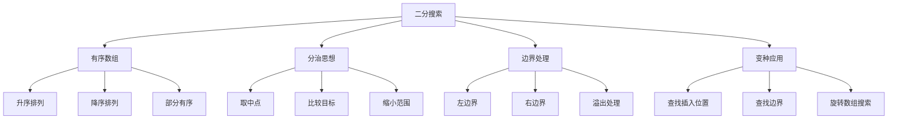

# 二分搜索算法

## 📖 核心概念

**二分搜索算法**是一种高效的搜索算法，适用于有序数组。它通过每次将搜索范围减半来快速定位目标值，时间复杂度为O(log n)。

### 🏗️ 二分搜索原理



## 🔧 基础实现

### 标准二分搜索

```cpp
class BinarySearch {
public:
    // 基础二分搜索
    int search(const vector<int>& arr, int target) {
        int left = 0;
        int right = arr.size() - 1;
        
        while (left <= right) {
            int mid = left + (right - left) / 2;  // 避免溢出
            
            if (arr[mid] == target) {
                return mid;
            } else if (arr[mid] < target) {
                left = mid + 1;
            } else {
                right = mid - 1;
            }
        }
        
        return -1;  // 未找到
    }
    
    // 递归版本
    int searchRecursive(const vector<int>& arr, int target) {
        return searchRecursiveHelper(arr, target, 0, arr.size() - 1);
    }
    
private:
    int searchRecursiveHelper(const vector<int>& arr, int target, int left, int right) {
        if (left > right) {
            return -1;
        }
        
        int mid = left + (right - left) / 2;
        
        if (arr[mid] == target) {
            return mid;
        } else if (arr[mid] < target) {
            return searchRecursiveHelper(arr, target, mid + 1, right);
        } else {
            return searchRecursiveHelper(arr, target, left, mid - 1);
        }
    }
};
```

### 变种实现

```cpp
class BinarySearchVariants {
public:
    // 查找第一个等于目标的位置
    int findFirst(const vector<int>& arr, int target) {
        int left = 0;
        int right = arr.size() - 1;
        int result = -1;
        
        while (left <= right) {
            int mid = left + (right - left) / 2;
            
            if (arr[mid] == target) {
                result = mid;
                right = mid - 1;  // 继续在左半部分查找
            } else if (arr[mid] < target) {
                left = mid + 1;
            } else {
                right = mid - 1;
            }
        }
        
        return result;
    }
    
    // 查找最后一个等于目标的位置
    int findLast(const vector<int>& arr, int target) {
        int left = 0;
        int right = arr.size() - 1;
        int result = -1;
        
        while (left <= right) {
            int mid = left + (right - left) / 2;
            
            if (arr[mid] == target) {
                result = mid;
                left = mid + 1;  // 继续在右半部分查找
            } else if (arr[mid] < target) {
                left = mid + 1;
            } else {
                right = mid - 1;
            }
        }
        
        return result;
    }
    
    // 查找插入位置
    int searchInsert(const vector<int>& arr, int target) {
        int left = 0;
        int right = arr.size();
        
        while (left < right) {
            int mid = left + (right - left) / 2;
            
            if (arr[mid] < target) {
                left = mid + 1;
            } else {
                right = mid;
            }
        }
        
        return left;
    }
    
    // 查找第一个大于等于目标的位置
    int findFirstGreaterOrEqual(const vector<int>& arr, int target) {
        int left = 0;
        int right = arr.size();
        
        while (left < right) {
            int mid = left + (right - left) / 2;
            
            if (arr[mid] < target) {
                left = mid + 1;
            } else {
                right = mid;
            }
        }
        
        return left;
    }
    
    // 查找第一个大于目标的位置
    int findFirstGreater(const vector<int>& arr, int target) {
        int left = 0;
        int right = arr.size();
        
        while (left < right) {
            int mid = left + (right - left) / 2;
            
            if (arr[mid] <= target) {
                left = mid + 1;
            } else {
                right = mid;
            }
        }
        
        return left;
    }
};
```

## 🎯 高级应用

### 1. 旋转数组搜索

```cpp
class RotatedArraySearch {
public:
    // 搜索旋转排序数组
    int searchRotated(const vector<int>& arr, int target) {
        int left = 0;
        int right = arr.size() - 1;
        
        while (left <= right) {
            int mid = left + (right - left) / 2;
            
            if (arr[mid] == target) {
                return mid;
            }
            
            // 判断哪一半是有序的
            if (arr[left] <= arr[mid]) {
                // 左半部分有序
                if (target >= arr[left] && target < arr[mid]) {
                    right = mid - 1;
                } else {
                    left = mid + 1;
                }
            } else {
                // 右半部分有序
                if (target > arr[mid] && target <= arr[right]) {
                    left = mid + 1;
                } else {
                    right = mid - 1;
                }
            }
        }
        
        return -1;
    }
    
    // 查找旋转数组的最小值
    int findMin(const vector<int>& arr) {
        int left = 0;
        int right = arr.size() - 1;
        
        while (left < right) {
            int mid = left + (right - left) / 2;
            
            if (arr[mid] > arr[right]) {
                left = mid + 1;
            } else {
                right = mid;
            }
        }
        
        return arr[left];
    }
    
    // 查找旋转数组的最大值
    int findMax(const vector<int>& arr) {
        int left = 0;
        int right = arr.size() - 1;
        
        while (left < right) {
            int mid = left + (right - left) / 2;
            
            if (arr[mid] < arr[left]) {
                right = mid - 1;
            } else {
                left = mid;
            }
        }
        
        return arr[left];
    }
};
```

### 2. 二维矩阵搜索

```cpp
class MatrixSearch {
public:
    // 搜索二维矩阵（每行每列都递增）
    bool searchMatrix(const vector<vector<int>>& matrix, int target) {
        if (matrix.empty() || matrix[0].empty()) return false;
        
        int m = matrix.size();
        int n = matrix[0].size();
        
        int left = 0;
        int right = m * n - 1;
        
        while (left <= right) {
            int mid = left + (right - left) / 2;
            int row = mid / n;
            int col = mid % n;
            
            if (matrix[row][col] == target) {
                return true;
            } else if (matrix[row][col] < target) {
                left = mid + 1;
            } else {
                right = mid - 1;
            }
        }
        
        return false;
    }
    
    // 搜索二维矩阵II（每行递增，每列递增）
    bool searchMatrixII(const vector<vector<int>>& matrix, int target) {
        if (matrix.empty() || matrix[0].empty()) return false;
        
        int m = matrix.size();
        int n = matrix[0].size();
        
        int row = 0;
        int col = n - 1;
        
        while (row < m && col >= 0) {
            if (matrix[row][col] == target) {
                return true;
            } else if (matrix[row][col] < target) {
                ++row;
            } else {
                --col;
            }
        }
        
        return false;
    }
};
```

### 3. 峰值搜索

```cpp
class PeakSearch {
public:
    // 寻找峰值（比相邻元素都大）
    int findPeakElement(const vector<int>& arr) {
        int left = 0;
        int right = arr.size() - 1;
        
        while (left < right) {
            int mid = left + (right - left) / 2;
            
            if (arr[mid] > arr[mid + 1]) {
                right = mid;
            } else {
                left = mid + 1;
            }
        }
        
        return left;
    }
    
    // 寻找山脉数组的峰值
    int peakIndexInMountainArray(const vector<int>& arr) {
        int left = 0;
        int right = arr.size() - 1;
        
        while (left < right) {
            int mid = left + (right - left) / 2;
            
            if (arr[mid] < arr[mid + 1]) {
                left = mid + 1;
            } else {
                right = mid;
            }
        }
        
        return left;
    }
};
```

## 📊 性能分析

### 时间复杂度分析

```cpp
class BinarySearchAnalysis {
public:
    // 时间复杂度分析
    void analyzeTimeComplexity() {
        // 每次比较后，搜索范围减半
        // 最坏情况：需要 log₂(n) 次比较
        // 时间复杂度：O(log n)
    }
    
    // 空间复杂度分析
    void analyzeSpaceComplexity() {
        // 迭代版本：O(1)
        // 递归版本：O(log n) 递归栈空间
    }
    
    // 与线性搜索对比
    void compareWithLinearSearch() {
        // 线性搜索：O(n)
        // 二分搜索：O(log n)
        // 当n=1000时，线性搜索最多1000次，二分搜索最多10次
    }
};
```

### 性能对比

| 搜索算法 | 时间复杂度 | 空间复杂度 | 前提条件 | 优点 | 缺点 |
|----------|------------|------------|----------|------|------|
| **线性搜索** | O(n) | O(1) | 无 | 简单、通用 | 效率低 |
| **二分搜索** | O(log n) | O(1) | 有序数组 | 效率高 | 需要排序 |
| **插值搜索** | O(log log n) | O(1) | 均匀分布 | 更快 | 分布要求高 |

## 🔧 优化技巧

### 1. 边界优化

```cpp
class BinarySearchOptimization {
public:
    // 避免整数溢出
    int searchSafe(const vector<int>& arr, int target) {
        int left = 0;
        int right = arr.size() - 1;
        
        while (left <= right) {
            // 使用位运算避免溢出
            int mid = left + ((right - left) >> 1);
            
            if (arr[mid] == target) {
                return mid;
            } else if (arr[mid] < target) {
                left = mid + 1;
            } else {
                right = mid - 1;
            }
        }
        
        return -1;
    }
    
    // 早期终止优化
    int searchWithEarlyTermination(const vector<int>& arr, int target) {
        int left = 0;
        int right = arr.size() - 1;
        
        while (left <= right) {
            int mid = left + (right - left) / 2;
            
            if (arr[mid] == target) {
                return mid;
            }
            
            // 检查边界条件
            if (left == right) {
                return arr[left] == target ? left : -1;
            }
            
            if (arr[mid] < target) {
                left = mid + 1;
            } else {
                right = mid - 1;
            }
        }
        
        return -1;
    }
};
```

### 2. 模板化实现

```cpp
class BinarySearchTemplate {
public:
    // 通用二分搜索模板
    template<typename T, typename Predicate>
    int binarySearch(T left, T right, Predicate predicate) {
        while (left < right) {
            T mid = left + (right - left) / 2;
            
            if (predicate(mid)) {
                right = mid;
            } else {
                left = mid + 1;
            }
        }
        
        return left;
    }
    
    // 使用模板查找第一个满足条件的元素
    int findFirstCondition(const vector<int>& arr, function<bool(int)> condition) {
        return binarySearch(0, arr.size(), [&](int mid) {
            return condition(arr[mid]);
        });
    }
};
```

## 🔗 相关链接

- [[01-线性搜索详解|线性搜索]]
- [[03-三分搜索与插值搜索|三分搜索]]
- [[04-搜索优化技巧|搜索优化]]

## 💡 二分搜索要点

1. **有序前提**：数组必须是有序的
2. **分治思想**：每次将搜索范围减半
3. **边界处理**：注意左右边界的更新
4. **变种应用**：查找边界、插入位置等

---

*📝 搜索提示：二分搜索是分治算法的典型应用，掌握其变种有助于解决复杂问题*
