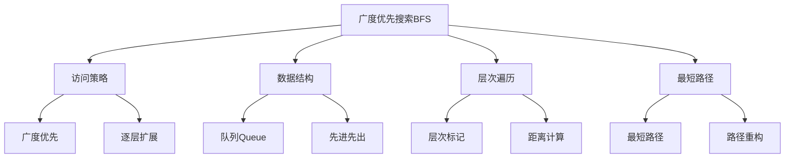

# 广度优先搜索

## 📖 核心概念

**广度优先搜索（Breadth-First Search, BFS）**是一种用于遍历或搜索树或图的算法。它从根节点开始，逐层访问节点，先访问距离根节点最近的节点，然后访问距离根节点较远的节点。BFS使用队列数据结构来实现。

### 🏗️ BFS的组成要素



## 🔍 BFS算法分类

### 按实现方式分类

| 实现方式 | 优点 | 缺点 | 适用场景 |
|----------|------|------|----------|
| **队列实现** | 标准实现、逻辑清晰 | 需要额外空间 | 一般应用 |
| **双端队列** | 支持双向扩展 | 实现复杂 | 特殊需求 |
| **层次队列** | 支持层次信息 | 空间开销大 | 需要层次信息 |

### 按应用场景分类

| 应用场景 | 算法变种 | 特点 | 时间复杂度 |
|----------|----------|------|------------|
| **图遍历** | 基础BFS | 访问所有节点 | O(V + E) |
| **最短路径** | 无权图BFS | 寻找最短路径 | O(V + E) |
| **层次遍历** | 带层次BFS | 按层次访问 | O(V + E) |
| **双向搜索** | 双向BFS | 从两端同时搜索 | O(b^(d/2)) |

## 💻 BFS基础实现

### 标准实现

```cpp
template<typename T>
class BFS {
private:
    const AdjacencyList<T>& graph;
    vector<bool> visited;
    vector<int> traversalOrder;
    
public:
    BFS(const AdjacencyList<T>& g) : graph(g) {
        visited.resize(graph.getVertexCount(), false);
    }
    
    // 基础BFS实现
    void bfs(int start) {
        queue<int> q;
        q.push(start);
        visited[start] = true;
        
        while (!q.empty()) {
            int current = q.front();
            q.pop();
            traversalOrder.push_back(current);
            
            // 访问所有未访问的邻接顶点
            for (const auto& edge : graph.getNeighbors(current)) {
                if (!visited[edge.to]) {
                    visited[edge.to] = true;
                    q.push(edge.to);
                }
            }
        }
    }
    
    // 遍历整个图
    void bfsAll() {
        fill(visited.begin(), visited.end(), false);
        traversalOrder.clear();
        
        for (int i = 0; i < graph.getVertexCount(); i++) {
            if (!visited[i]) {
                bfs(i);
            }
        }
    }
    
    // 获取遍历结果
    const vector<int>& getTraversalOrder() const {
        return traversalOrder;
    }
    
    // 重置状态
    void reset() {
        fill(visited.begin(), visited.end(), false);
        traversalOrder.clear();
    }
    
    // 检查是否已访问
    bool isVisited(int vertex) const {
        return visited[vertex];
    }
};
```

### 带层次信息的BFS

```cpp
template<typename T>
class BFSWithLevels {
private:
    const AdjacencyList<T>& graph;
    vector<bool> visited;
    vector<int> levels;
    vector<vector<int>> levelOrder;
    
public:
    BFSWithLevels(const AdjacencyList<T>& g) : graph(g) {
        visited.resize(graph.getVertexCount(), false);
        levels.resize(graph.getVertexCount(), -1);
    }
    
    // 带层次信息的BFS
    void bfsWithLevels(int start) {
        queue<int> q;
        q.push(start);
        visited[start] = true;
        levels[start] = 0;
        
        while (!q.empty()) {
            int current = q.front();
            q.pop();
            
            // 确保levelOrder有足够的层
            while (levelOrder.size() <= levels[current]) {
                levelOrder.push_back(vector<int>());
            }
            levelOrder[levels[current]].push_back(current);
            
            // 访问邻接顶点
            for (const auto& edge : graph.getNeighbors(current)) {
                if (!visited[edge.to]) {
                    visited[edge.to] = true;
                    levels[edge.to] = levels[current] + 1;
                    q.push(edge.to);
                }
            }
        }
    }
    
    // 获取指定层的顶点
    const vector<int>& getLevel(int level) const {
        if (level < levelOrder.size()) {
            return levelOrder[level];
        }
        static vector<int> empty;
        return empty;
    }
    
    // 获取所有层次
    const vector<vector<int>>& getAllLevels() const {
        return levelOrder;
    }
    
    // 获取顶点的层次
    int getLevel(int vertex) const {
        return levels[vertex];
    }
    
    // 获取最大层次
    int getMaxLevel() const {
        return levelOrder.size() - 1;
    }
};
```

## 🎯 BFS高级应用

### 1. 最短路径查找

```cpp
template<typename T>
class ShortestPathBFS {
private:
    const AdjacencyList<T>& graph;
    
public:
    ShortestPathBFS(const AdjacencyList<T>& g) : graph(g) {}
    
    // 无权图最短路径
    vector<int> findShortestPath(int start, int end) {
        vector<bool> visited(graph.getVertexCount(), false);
        vector<int> parent(graph.getVertexCount(), -1);
        queue<int> q;
        
        q.push(start);
        visited[start] = true;
        
        while (!q.empty()) {
            int current = q.front();
            q.pop();
            
            if (current == end) break;
            
            for (const auto& edge : graph.getNeighbors(current)) {
                if (!visited[edge.to]) {
                    visited[edge.to] = true;
                    parent[edge.to] = current;
                    q.push(edge.to);
                }
            }
        }
        
        // 重构路径
        vector<int> path;
        if (parent[end] != -1 || start == end) {
            int current = end;
            while (current != -1) {
                path.push_back(current);
                current = parent[current];
            }
            reverse(path.begin(), path.end());
        }
        
        return path;
    }
    
    // 计算最短距离
    int getShortestDistance(int start, int end) {
        vector<bool> visited(graph.getVertexCount(), false);
        vector<int> distance(graph.getVertexCount(), -1);
        queue<int> q;
        
        q.push(start);
        visited[start] = true;
        distance[start] = 0;
        
        while (!q.empty()) {
            int current = q.front();
            q.pop();
            
            if (current == end) break;
            
            for (const auto& edge : graph.getNeighbors(current)) {
                if (!visited[edge.to]) {
                    visited[edge.to] = true;
                    distance[edge.to] = distance[current] + 1;
                    q.push(edge.to);
                }
            }
        }
        
        return distance[end];
    }
    
    // 获取所有最短距离
    vector<int> getAllShortestDistances(int start) {
        vector<bool> visited(graph.getVertexCount(), false);
        vector<int> distance(graph.getVertexCount(), -1);
        queue<int> q;
        
        q.push(start);
        visited[start] = true;
        distance[start] = 0;
        
        while (!q.empty()) {
            int current = q.front();
            q.pop();
            
            for (const auto& edge : graph.getNeighbors(current)) {
                if (!visited[edge.to]) {
                    visited[edge.to] = true;
                    distance[edge.to] = distance[current] + 1;
                    q.push(edge.to);
                }
            }
        }
        
        return distance;
    }
};
```

### 2. 双向BFS

```cpp
template<typename T>
class BidirectionalBFS {
private:
    const AdjacencyList<T>& graph;
    
public:
    BidirectionalBFS(const AdjacencyList<T>& g) : graph(g) {}
    
    // 双向BFS搜索
    vector<int> bidirectionalSearch(int start, int end) {
        if (start == end) return {start};
        
        vector<bool> visited1(graph.getVertexCount(), false);
        vector<bool> visited2(graph.getVertexCount(), false);
        vector<int> parent1(graph.getVertexCount(), -1);
        vector<int> parent2(graph.getVertexCount(), -1);
        
        queue<int> q1, q2;
        q1.push(start);
        q2.push(end);
        visited1[start] = true;
        visited2[end] = true;
        
        while (!q1.empty() && !q2.empty()) {
            // 从起点扩展
            int size1 = q1.size();
            for (int i = 0; i < size1; i++) {
                int current = q1.front();
                q1.pop();
                
                if (visited2[current]) {
                    return reconstructPath(start, end, current, parent1, parent2);
                }
                
                for (const auto& edge : graph.getNeighbors(current)) {
                    if (!visited1[edge.to]) {
                        visited1[edge.to] = true;
                        parent1[edge.to] = current;
                        q1.push(edge.to);
                    }
                }
            }
            
            // 从终点扩展
            int size2 = q2.size();
            for (int i = 0; i < size2; i++) {
                int current = q2.front();
                q2.pop();
                
                if (visited1[current]) {
                    return reconstructPath(start, end, current, parent1, parent2);
                }
                
                for (const auto& edge : graph.getNeighbors(current)) {
                    if (!visited2[edge.to]) {
                        visited2[edge.to] = true;
                        parent2[edge.to] = current;
                        q2.push(edge.to);
                    }
                }
            }
        }
        
        return vector<int>();
    }
    
private:
    vector<int> reconstructPath(int start, int end, int meet, 
                               const vector<int>& parent1, 
                               const vector<int>& parent2) {
        vector<int> path;
        
        // 从meet点向start重构
        int current = meet;
        while (current != start) {
            path.push_back(current);
            current = parent1[current];
        }
        path.push_back(start);
        reverse(path.begin(), path.end());
        
        // 从meet点向end重构
        current = parent2[meet];
        while (current != end) {
            path.push_back(current);
            current = parent2[current];
        }
        if (meet != end) {
            path.push_back(end);
        }
        
        return path;
    }
};
```

### 3. 多源BFS

```cpp
template<typename T>
class MultiSourceBFS {
private:
    const AdjacencyList<T>& graph;
    
public:
    MultiSourceBFS(const AdjacencyList<T>& g) : graph(g) {}
    
    // 多源BFS
    vector<int> multiSourceBFS(const vector<int>& sources) {
        vector<bool> visited(graph.getVertexCount(), false);
        vector<int> distance(graph.getVertexCount(), -1);
        queue<int> q;
        
        // 将所有源点加入队列
        for (int source : sources) {
            q.push(source);
            visited[source] = true;
            distance[source] = 0;
        }
        
        while (!q.empty()) {
            int current = q.front();
            q.pop();
            
            for (const auto& edge : graph.getNeighbors(current)) {
                if (!visited[edge.to]) {
                    visited[edge.to] = true;
                    distance[edge.to] = distance[current] + 1;
                    q.push(edge.to);
                }
            }
        }
        
        return distance;
    }
    
    // 找到最近的源点
    int findNearestSource(int target, const vector<int>& sources) {
        vector<bool> visited(graph.getVertexCount(), false);
        vector<int> distance(graph.getVertexCount(), -1);
        queue<int> q;
        
        // 将所有源点加入队列
        for (int source : sources) {
            q.push(source);
            visited[source] = true;
            distance[source] = 0;
        }
        
        while (!q.empty()) {
            int current = q.front();
            q.pop();
            
            if (current == target) {
                return distance[current];
            }
            
            for (const auto& edge : graph.getNeighbors(current)) {
                if (!visited[edge.to]) {
                    visited[edge.to] = true;
                    distance[edge.to] = distance[current] + 1;
                    q.push(edge.to);
                }
            }
        }
        
        return -1; // 不可达
    }
};
```

## 🔧 BFS优化技巧

### 1. 双端队列BFS

```cpp
template<typename T>
class DequeBFS {
private:
    const AdjacencyList<T>& graph;
    
public:
    DequeBFS(const AdjacencyList<T>& g) : graph(g) {}
    
    // 使用双端队列的BFS（0-1 BFS）
    vector<int> zeroOneBFS(int start) {
        vector<int> distance(graph.getVertexCount(), -1);
        deque<int> dq;
        
        dq.push_back(start);
        distance[start] = 0;
        
        while (!dq.empty()) {
            int current = dq.front();
            dq.pop_front();
            
            for (const auto& edge : graph.getNeighbors(current)) {
                int newDistance = distance[current] + edge.weight;
                
                if (distance[edge.to] == -1 || newDistance < distance[edge.to]) {
                    distance[edge.to] = newDistance;
                    
                    if (edge.weight == 0) {
                        dq.push_front(edge.to); // 权重为0，加入队首
                    } else {
                        dq.push_back(edge.to);  // 权重为1，加入队尾
                    }
                }
            }
        }
        
        return distance;
    }
};
```

### 2. 层次BFS优化

```cpp
template<typename T>
class OptimizedLevelBFS {
private:
    const AdjacencyList<T>& graph;
    
public:
    OptimizedLevelBFS(const AdjacencyList<T>& g) : graph(g) {}
    
    // 优化的层次BFS
    vector<vector<int>> levelOrderTraversal(int start) {
        vector<vector<int>> levels;
        vector<bool> visited(graph.getVertexCount(), false);
        queue<int> q;
        
        q.push(start);
        visited[start] = true;
        
        while (!q.empty()) {
            int levelSize = q.size();
            vector<int> currentLevel;
            
            // 处理当前层的所有节点
            for (int i = 0; i < levelSize; i++) {
                int current = q.front();
                q.pop();
                currentLevel.push_back(current);
                
                // 添加下一层的节点
                for (const auto& edge : graph.getNeighbors(current)) {
                    if (!visited[edge.to]) {
                        visited[edge.to] = true;
                        q.push(edge.to);
                    }
                }
            }
            
            levels.push_back(currentLevel);
        }
        
        return levels;
    }
    
    // 锯齿形层次遍历
    vector<vector<int>> zigzagLevelOrder(int start) {
        vector<vector<int>> levels;
        vector<bool> visited(graph.getVertexCount(), false);
        queue<int> q;
        bool leftToRight = true;
        
        q.push(start);
        visited[start] = true;
        
        while (!q.empty()) {
            int levelSize = q.size();
            vector<int> currentLevel(levelSize);
            
            for (int i = 0; i < levelSize; i++) {
                int current = q.front();
                q.pop();
                
                int index = leftToRight ? i : levelSize - 1 - i;
                currentLevel[index] = current;
                
                for (const auto& edge : graph.getNeighbors(current)) {
                    if (!visited[edge.to]) {
                        visited[edge.to] = true;
                        q.push(edge.to);
                    }
                }
            }
            
            levels.push_back(currentLevel);
            leftToRight = !leftToRight;
        }
        
        return levels;
    }
};
```

### 3. 记忆化BFS

```cpp
template<typename T>
class MemoizedBFS {
private:
    const AdjacencyList<T>& graph;
    vector<int> memo;
    
public:
    MemoizedBFS(const AdjacencyList<T>& g) : graph(g) {
        memo.resize(graph.getVertexCount(), -1);
    }
    
    // 带记忆化的BFS
    int bfsWithMemo(int start, int end) {
        if (memo[start] != -1) {
            return memo[start];
        }
        
        vector<bool> visited(graph.getVertexCount(), false);
        vector<int> distance(graph.getVertexCount(), -1);
        queue<int> q;
        
        q.push(start);
        visited[start] = true;
        distance[start] = 0;
        
        while (!q.empty()) {
            int current = q.front();
            q.pop();
            
            if (current == end) {
                memo[start] = distance[current];
                return distance[current];
            }
            
            for (const auto& edge : graph.getNeighbors(current)) {
                if (!visited[edge.to]) {
                    visited[edge.to] = true;
                    distance[edge.to] = distance[current] + 1;
                    q.push(edge.to);
                }
            }
        }
        
        memo[start] = -1;
        return -1;
    }
    
    // 重置记忆化
    void resetMemo() {
        fill(memo.begin(), memo.end(), -1);
    }
};
```

## ⚡ 复杂度分析

### 时间复杂度

| 应用场景 | 时间复杂度 | 说明 |
|----------|------------|------|
| **图遍历** | O(V + E) | 每个顶点和边访问一次 |
| **最短路径** | O(V + E) | 无权图最短路径 |
| **双向搜索** | O(b^(d/2)) | b为分支因子，d为深度 |
| **多源BFS** | O(V + E) | 从多个源点同时搜索 |

### 空间复杂度

| 实现方式 | 空间复杂度 | 说明 |
|----------|------------|------|
| **标准BFS** | O(V) | 队列和访问数组空间 |
| **层次BFS** | O(V) | 额外存储层次信息 |
| **双向BFS** | O(V) | 两个方向的搜索空间 |
| **记忆化BFS** | O(V) | 记忆化数组空间 |

## 🎯 BFS实际应用

### 1. 社交网络分析

```cpp
class SocialNetworkAnalyzer {
private:
    AdjacencyList<int> graph;
    
public:
    SocialNetworkAnalyzer(int userCount) : graph(userCount, false) {}
    
    // 计算用户影响力（六度分离）
    int calculateInfluence(int user, int maxDistance = 6) {
        vector<bool> visited(graph.getVertexCount(), false);
        vector<int> distance(graph.getVertexCount(), -1);
        queue<int> q;
        
        q.push(user);
        visited[user] = true;
        distance[user] = 0;
        
        int influence = 0;
        
        while (!q.empty()) {
            int current = q.front();
            q.pop();
            
            if (distance[current] <= maxDistance) {
                influence++;
            }
            
            for (const auto& edge : graph.getNeighbors(current)) {
                if (!visited[edge.to] && distance[current] < maxDistance) {
                    visited[edge.to] = true;
                    distance[edge.to] = distance[current] + 1;
                    q.push(edge.to);
                }
            }
        }
        
        return influence - 1; // 减去自己
    }
    
    // 查找共同好友
    vector<int> findCommonFriends(int user1, int user2) {
        vector<int> friends1 = graph.getNeighbors(user1);
        vector<int> friends2 = graph.getNeighbors(user2);
        
        vector<int> common;
        set_intersection(friends1.begin(), friends1.end(),
                        friends2.begin(), friends2.end(),
                        back_inserter(common));
        return common;
    }
    
    // 添加好友关系
    void addFriendship(int user1, int user2) {
        graph.addEdge(user1, user2);
    }
};
```

### 2. 网络爬虫

```cpp
class WebCrawler {
private:
    AdjacencyList<string> graph;
    set<string> visited;
    
public:
    WebCrawler() : graph(1000, true) {} // 假设最多1000个网页
    
    // 使用BFS爬取网页
    vector<string> crawlWeb(const string& startUrl, int maxPages = 100) {
        queue<string> q;
        vector<string> crawledPages;
        
        q.push(startUrl);
        visited.insert(startUrl);
        
        while (!q.empty() && crawledPages.size() < maxPages) {
            string currentUrl = q.front();
            q.pop();
            crawledPages.push_back(currentUrl);
            
            // 模拟获取页面链接
            vector<string> links = getPageLinks(currentUrl);
            
            for (const string& link : links) {
                if (visited.find(link) == visited.end()) {
                    visited.insert(link);
                    q.push(link);
                }
            }
        }
        
        return crawledPages;
    }
    
private:
    // 模拟获取页面链接
    vector<string> getPageLinks(const string& url) {
        // 这里应该实现真实的网页解析
        vector<string> links;
        // 模拟返回一些链接
        return links;
    }
};
```

### 3. 游戏AI

```cpp
class GameAI {
private:
    vector<vector<int>> board;
    int rows, cols;
    
public:
    GameAI(const vector<vector<int>>& b) : board(b) {
        rows = board.size();
        cols = board[0].size();
    }
    
    // 使用BFS找到最短路径
    vector<pair<int, int>> findShortestPath(pair<int, int> start, pair<int, int> end) {
        vector<vector<bool>> visited(rows, vector<bool>(cols, false));
        vector<vector<pair<int, int>>> parent(rows, vector<pair<int, int>>(cols, {-1, -1}));
        queue<pair<int, int>> q;
        
        q.push(start);
        visited[start.first][start.second] = true;
        
        int dx[] = {-1, 1, 0, 0};
        int dy[] = {0, 0, -1, 1};
        
        while (!q.empty()) {
            auto current = q.front();
            q.pop();
            
            if (current == end) break;
            
            for (int i = 0; i < 4; i++) {
                int nx = current.first + dx[i];
                int ny = current.second + dy[i];
                
                if (nx >= 0 && nx < rows && ny >= 0 && ny < cols && 
                    !visited[nx][ny] && board[nx][ny] != 1) { // 1表示障碍
                    visited[nx][ny] = true;
                    parent[nx][ny] = current;
                    q.push({nx, ny});
                }
            }
        }
        
        // 重构路径
        vector<pair<int, int>> path;
        if (visited[end.first][end.second]) {
            pair<int, int> current = end;
            while (current != make_pair(-1, -1)) {
                path.push_back(current);
                current = parent[current.first][current.second];
            }
            reverse(path.begin(), path.end());
        }
        
        return path;
    }
};
```

## 🎓 学习要点总结

### 核心理解

1. **队列应用**：理解队列在BFS中的核心作用
2. **层次遍历**：掌握BFS的层次访问特性
3. **最短路径**：理解BFS在无权图中的最短路径应用
4. **双向搜索**：掌握双向BFS的优化原理

### 实践要点

1. **队列操作**：正确使用队列的push和pop操作
2. **访问标记**：及时标记已访问的节点
3. **路径重构**：掌握从parent数组重构路径的方法
4. **边界检查**：注意队列为空的情况

### 应用思维

1. **最短路径**：理解BFS在路径查找中的优势
2. **层次分析**：掌握BFS在层次结构分析中的应用
3. **网络分析**：理解BFS在社交网络分析中的作用
4. **优化策略**：掌握双向搜索和记忆化等优化技巧

---

**相关链接：**
- [[03-层次宇宙/04-图论天地/01-图Graph基础|图Graph基础]] - 图的基本概念和存储
- [[03-层次宇宙/04-图论天地/02-图的遍历算法|图的遍历算法]] - DFS和BFS对比
- [[04-算法武器库/01-搜索技术/01-深度优先搜索|深度优先搜索]] - DFS的详细实现
- [[04-算法武器库/01-搜索技术/03-启发式搜索|启发式搜索]] - A*算法
