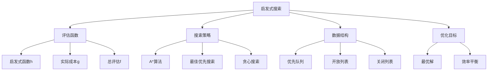

# 启发式搜索

## 📖 核心概念

**启发式搜索（Heuristic Search）**是一种使用启发式函数来指导搜索方向的搜索算法。它通过评估函数来估计从当前状态到目标状态的成本，从而选择最有希望的搜索路径。A*算法是最著名的启发式搜索算法。

### 🏗️ 启发式搜索的组成要素



## 🔍 启发式搜索分类

### 按搜索策略分类

| 算法 | 评估函数 | 特点 | 适用场景 |
|------|----------|------|----------|
| **A*** | f(n) = g(n) + h(n) | 最优且高效 | 路径规划 |
| **最佳优先搜索** | f(n) = h(n) | 快速但不保证最优 | 快速搜索 |
| **贪心搜索** | f(n) = h(n) | 最快但可能不最优 | 近似解 |

### 按启发式函数分类

| 启发式类型 | 特点 | 优点 | 缺点 |
|------------|------|------|------|
| **可容许启发式** | h(n) ≤ h*(n) | 保证最优解 | 可能较慢 |
| **一致性启发式** | h(n) ≤ c(n,n') + h(n') | 更高效 | 要求更严格 |
| **不可容许启发式** | h(n) > h*(n) | 更快 | 不保证最优 |

## 💻 A*算法实现

### 基础A*算法

```cpp
template<typename T>
class AStar {
private:
    const AdjacencyList<T>& graph;
    
    // 节点结构
    struct Node {
        int vertex;
        T gCost;  // 从起点到当前节点的实际成本
        T hCost;  // 从当前节点到终点的启发式成本
        T fCost;  // 总成本 f = g + h
        int parent;
        
        Node(int v, T g, T h, int p) : vertex(v), gCost(g), hCost(h), fCost(g + h), parent(p) {}
        
        bool operator>(const Node& other) const {
            return fCost > other.fCost;
        }
    };
    
    // 启发式函数（曼哈顿距离）
    T heuristic(int from, int end) const {
        // 这里需要根据具体问题实现启发式函数
        // 例如：曼哈顿距离、欧几里得距离等
        return 0; // 简化实现
    }
    
public:
    AStar(const AdjacencyList<T>& g) : graph(g) {}
    
    // A*算法实现
    vector<int> findPath(int start, int end) {
        int n = graph.getVertexCount();
        vector<T> gScore(n, numeric_limits<T>::max());
        vector<T> fScore(n, numeric_limits<T>::max());
        vector<int> parent(n, -1);
        vector<bool> inOpenSet(n, false);
        vector<bool> inClosedSet(n, false);
        
        gScore[start] = 0;
        fScore[start] = heuristic(start, end);
        
        priority_queue<Node, vector<Node>, greater<Node>> openSet;
        openSet.push(Node(start, 0, fScore[start], -1));
        inOpenSet[start] = true;
        
        while (!openSet.empty()) {
            Node current = openSet.top();
            openSet.pop();
            
            if (inClosedSet[current.vertex]) continue;
            
            inClosedSet[current.vertex] = true;
            inOpenSet[current.vertex] = false;
            
            if (current.vertex == end) {
                return reconstructPath(start, end, parent);
            }
            
            for (const auto& edge : graph.getNeighbors(current.vertex)) {
                if (inClosedSet[edge.to]) continue;
                
                T tentativeGScore = gScore[current.vertex] + edge.weight;
                
                if (tentativeGScore < gScore[edge.to]) {
                    parent[edge.to] = current.vertex;
                    gScore[edge.to] = tentativeGScore;
                    fScore[edge.to] = gScore[edge.to] + heuristic(edge.to, end);
                    
                    if (!inOpenSet[edge.to]) {
                        openSet.push(Node(edge.to, gScore[edge.to], heuristic(edge.to, end), current.vertex));
                        inOpenSet[edge.to] = true;
                    }
                }
            }
        }
        
        return vector<int>(); // 无路径
    }
    
private:
    vector<int> reconstructPath(int start, int end, const vector<int>& parent) {
        vector<int> path;
        int current = end;
        
        while (current != -1) {
            path.push_back(current);
            current = parent[current];
        }
        
        reverse(path.begin(), path.end());
        return path;
    }
};
```

### 优化版A*算法

```cpp
template<typename T>
class OptimizedAStar {
private:
    const AdjacencyList<T>& graph;
    
    struct Node {
        int vertex;
        T gCost, hCost, fCost;
        int parent;
        
        Node(int v, T g, T h, int p) : vertex(v), gCost(g), hCost(h), fCost(g + h), parent(p) {}
        
        bool operator>(const Node& other) const {
            if (fCost != other.fCost) return fCost > other.fCost;
            return hCost > other.hCost; // 打破平局
        }
    };
    
    // 曼哈顿距离启发式
    T manhattanDistance(int from, int end) const {
        // 假设顶点有坐标信息
        int fromX = from % 10, fromY = from / 10;
        int endX = end % 10, endY = end / 10;
        return abs(fromX - endX) + abs(fromY - endY);
    }
    
    // 欧几里得距离启发式
    T euclideanDistance(int from, int end) const {
        int fromX = from % 10, fromY = from / 10;
        int endX = end % 10, endY = end / 10;
        return sqrt((fromX - endX) * (fromX - endX) + (fromY - endY) * (fromY - endY));
    }
    
public:
    OptimizedAStar(const AdjacencyList<T>& g) : graph(g) {}
    
    // 优化的A*算法
    vector<int> findPath(int start, int end, const string& heuristicType = "manhattan") {
        int n = graph.getVertexCount();
        vector<T> gScore(n, numeric_limits<T>::max());
        vector<int> parent(n, -1);
        vector<bool> inOpenSet(n, false);
        vector<bool> inClosedSet(n, false);
        
        gScore[start] = 0;
        
        priority_queue<Node, vector<Node>, greater<Node>> openSet;
        T hStart = (heuristicType == "manhattan") ? manhattanDistance(start, end) : euclideanDistance(start, end);
        openSet.push(Node(start, 0, hStart, -1));
        inOpenSet[start] = true;
        
        while (!openSet.empty()) {
            Node current = openSet.top();
            openSet.pop();
            
            if (inClosedSet[current.vertex]) continue;
            
            inClosedSet[current.vertex] = true;
            inOpenSet[current.vertex] = false;
            
            if (current.vertex == end) {
                return reconstructPath(start, end, parent);
            }
            
            for (const auto& edge : graph.getNeighbors(current.vertex)) {
                if (inClosedSet[edge.to]) continue;
                
                T tentativeGScore = gScore[current.vertex] + edge.weight;
                
                if (tentativeGScore < gScore[edge.to]) {
                    parent[edge.to] = current.vertex;
                    gScore[edge.to] = tentativeGScore;
                    
                    T hCost = (heuristicType == "manhattan") ? 
                              manhattanDistance(edge.to, end) : 
                              euclideanDistance(edge.to, end);
                    
                    if (!inOpenSet[edge.to]) {
                        openSet.push(Node(edge.to, gScore[edge.to], hCost, current.vertex));
                        inOpenSet[edge.to] = true;
                    }
                }
            }
        }
        
        return vector<int>();
    }
    
private:
    vector<int> reconstructPath(int start, int end, const vector<int>& parent) {
        vector<int> path;
        int current = end;
        
        while (current != -1) {
            path.push_back(current);
            current = parent[current];
        }
        
        reverse(path.begin(), path.end());
        return path;
    }
};
```

## 🎯 其他启发式搜索算法

### 1. 最佳优先搜索

```cpp
template<typename T>
class BestFirstSearch {
private:
    const AdjacencyList<T>& graph;
    
    struct Node {
        int vertex;
        T hCost;
        int parent;
        
        Node(int v, T h, int p) : vertex(v), hCost(h), parent(p) {}
        
        bool operator>(const Node& other) const {
            return hCost > other.hCost;
        }
    };
    
    T heuristic(int from, int end) const {
        // 实现启发式函数
        return 0;
    }
    
public:
    BestFirstSearch(const AdjacencyList<T>& g) : graph(g) {}
    
    // 最佳优先搜索
    vector<int> findPath(int start, int end) {
        int n = graph.getVertexCount();
        vector<bool> visited(n, false);
        vector<int> parent(n, -1);
        
        priority_queue<Node, vector<Node>, greater<Node>> pq;
        pq.push(Node(start, heuristic(start, end), -1));
        
        while (!pq.empty()) {
            Node current = pq.top();
            pq.pop();
            
            if (visited[current.vertex]) continue;
            visited[current.vertex] = true;
            parent[current.vertex] = current.parent;
            
            if (current.vertex == end) {
                return reconstructPath(start, end, parent);
            }
            
            for (const auto& edge : graph.getNeighbors(current.vertex)) {
                if (!visited[edge.to]) {
                    pq.push(Node(edge.to, heuristic(edge.to, end), current.vertex));
                }
            }
        }
        
        return vector<int>();
    }
    
private:
    vector<int> reconstructPath(int start, int end, const vector<int>& parent) {
        vector<int> path;
        int current = end;
        
        while (current != -1) {
            path.push_back(current);
            current = parent[current];
        }
        
        reverse(path.begin(), path.end());
        return path;
    }
};
```

### 2. 贪心搜索

```cpp
template<typename T>
class GreedySearch {
private:
    const AdjacencyList<T>& graph;
    
    T heuristic(int from, int end) const {
        // 实现启发式函数
        return 0;
    }
    
public:
    GreedySearch(const AdjacencyList<T>& g) : graph(g) {}
    
    // 贪心搜索
    vector<int> findPath(int start, int end) {
        int n = graph.getVertexCount();
        vector<bool> visited(n, false);
        vector<int> parent(n, -1);
        
        int current = start;
        visited[current] = true;
        
        while (current != end) {
            int bestNext = -1;
            T bestHeuristic = numeric_limits<T>::max();
            
            for (const auto& edge : graph.getNeighbors(current)) {
                if (!visited[edge.to]) {
                    T h = heuristic(edge.to, end);
                    if (h < bestHeuristic) {
                        bestHeuristic = h;
                        bestNext = edge.to;
                    }
                }
            }
            
            if (bestNext == -1) {
                return vector<int>(); // 无路径
            }
            
            parent[bestNext] = current;
            visited[bestNext] = true;
            current = bestNext;
        }
        
        return reconstructPath(start, end, parent);
    }
    
private:
    vector<int> reconstructPath(int start, int end, const vector<int>& parent) {
        vector<int> path;
        int current = end;
        
        while (current != -1) {
            path.push_back(current);
            current = parent[current];
        }
        
        reverse(path.begin(), path.end());
        return path;
    }
};
```

### 3. 双向A*搜索

```cpp
template<typename T>
class BidirectionalAStar {
private:
    const AdjacencyList<T>& graph;
    
    struct Node {
        int vertex;
        T gCost, hCost, fCost;
        int parent;
        
        Node(int v, T g, T h, int p) : vertex(v), gCost(g), hCost(h), fCost(g + h), parent(p) {}
        
        bool operator>(const Node& other) const {
            return fCost > other.fCost;
        }
    };
    
    T heuristic(int from, int end) const {
        return 0; // 实现启发式函数
    }
    
public:
    BidirectionalAStar(const AdjacencyList<T>& g) : graph(g) {}
    
    // 双向A*搜索
    vector<int> findPath(int start, int end) {
        if (start == end) return {start};
        
        int n = graph.getVertexCount();
        
        // 正向搜索
        vector<T> gScore1(n, numeric_limits<T>::max());
        vector<int> parent1(n, -1);
        vector<bool> inOpenSet1(n, false);
        vector<bool> inClosedSet1(n, false);
        
        // 反向搜索
        vector<T> gScore2(n, numeric_limits<T>::max());
        vector<int> parent2(n, -1);
        vector<bool> inOpenSet2(n, false);
        vector<bool> inClosedSet2(n, false);
        
        gScore1[start] = 0;
        gScore2[end] = 0;
        
        priority_queue<Node, vector<Node>, greater<Node>> openSet1, openSet2;
        
        openSet1.push(Node(start, 0, heuristic(start, end), -1));
        openSet2.push(Node(end, 0, heuristic(end, start), -1));
        
        inOpenSet1[start] = true;
        inOpenSet2[end] = true;
        
        while (!openSet1.empty() && !openSet2.empty()) {
            // 正向搜索
            if (!openSet1.empty()) {
                Node current1 = openSet1.top();
                openSet1.pop();
                
                if (inClosedSet1[current1.vertex]) continue;
                inClosedSet1[current1.vertex] = true;
                inOpenSet1[current1.vertex] = false;
                
                if (inClosedSet2[current1.vertex]) {
                    return reconstructBidirectionalPath(start, end, current1.vertex, parent1, parent2);
                }
                
                for (const auto& edge : graph.getNeighbors(current1.vertex)) {
                    if (inClosedSet1[edge.to]) continue;
                    
                    T tentativeGScore = gScore1[current1.vertex] + edge.weight;
                    
                    if (tentativeGScore < gScore1[edge.to]) {
                        parent1[edge.to] = current1.vertex;
                        gScore1[edge.to] = tentativeGScore;
                        
                        if (!inOpenSet1[edge.to]) {
                            openSet1.push(Node(edge.to, gScore1[edge.to], heuristic(edge.to, end), current1.vertex));
                            inOpenSet1[edge.to] = true;
                        }
                    }
                }
            }
            
            // 反向搜索
            if (!openSet2.empty()) {
                Node current2 = openSet2.top();
                openSet2.pop();
                
                if (inClosedSet2[current2.vertex]) continue;
                inClosedSet2[current2.vertex] = true;
                inOpenSet2[current2.vertex] = false;
                
                if (inClosedSet1[current2.vertex]) {
                    return reconstructBidirectionalPath(start, end, current2.vertex, parent1, parent2);
                }
                
                for (const auto& edge : graph.getNeighbors(current2.vertex)) {
                    if (inClosedSet2[edge.to]) continue;
                    
                    T tentativeGScore = gScore2[current2.vertex] + edge.weight;
                    
                    if (tentativeGScore < gScore2[edge.to]) {
                        parent2[edge.to] = current2.vertex;
                        gScore2[edge.to] = tentativeGScore;
                        
                        if (!inOpenSet2[edge.to]) {
                            openSet2.push(Node(edge.to, gScore2[edge.to], heuristic(edge.to, start), current2.vertex));
                            inOpenSet2[edge.to] = true;
                        }
                    }
                }
            }
        }
        
        return vector<int>();
    }
    
private:
    vector<int> reconstructBidirectionalPath(int start, int end, int meet, 
                                            const vector<int>& parent1, 
                                            const vector<int>& parent2) {
        vector<int> path;
        
        // 从meet点向start重构
        int current = meet;
        while (current != -1) {
            path.push_back(current);
            current = parent1[current];
        }
        reverse(path.begin(), path.end());
        
        // 从meet点向end重构
        current = parent2[meet];
        while (current != -1) {
            path.push_back(current);
            current = parent2[current];
        }
        
        return path;
    }
};
```

## 🔧 启发式函数设计

### 1. 曼哈顿距离

```cpp
class ManhattanHeuristic {
public:
    static int calculate(int x1, int y1, int x2, int y2) {
        return abs(x1 - x2) + abs(y1 - y2);
    }
    
    static int calculate(int from, int end, int width) {
        int fromX = from % width, fromY = from / width;
        int endX = end % width, endY = end / width;
        return abs(fromX - endX) + abs(fromY - endY);
    }
};
```

### 2. 欧几里得距离

```cpp
class EuclideanHeuristic {
public:
    static double calculate(int x1, int y1, int x2, int y2) {
        return sqrt((x1 - x2) * (x1 - x2) + (y1 - y2) * (y1 - y2));
    }
    
    static double calculate(int from, int end, int width) {
        int fromX = from % width, fromY = from / width;
        int endX = end % width, endY = end / width;
        return sqrt((fromX - endX) * (fromX - endX) + (fromY - endY) * (fromY - endY));
    }
};
```

### 3. 切比雪夫距离

```cpp
class ChebyshevHeuristic {
public:
    static int calculate(int x1, int y1, int x2, int y2) {
        return max(abs(x1 - x2), abs(y1 - y2));
    }
    
    static int calculate(int from, int end, int width) {
        int fromX = from % width, fromY = from / width;
        int endX = end % width, endY = end / width;
        return max(abs(fromX - endX), abs(fromY - endY));
    }
};
```

## ⚡ 复杂度分析

### 时间复杂度

| 算法 | 时间复杂度 | 说明 |
|------|------------|------|
| **A*** | O(b^d) | b为分支因子，d为解深度 |
| **最佳优先搜索** | O(b^d) | 最坏情况与A*相同 |
| **贪心搜索** | O(b^d) | 可能更快但不保证最优 |
| **双向A*** | O(b^(d/2)) | 理论上更快 |

### 空间复杂度

| 算法 | 空间复杂度 | 说明 |
|------|------------|------|
| **A*** | O(b^d) | 优先队列空间 |
| **最佳优先搜索** | O(b^d) | 优先队列空间 |
| **贪心搜索** | O(b^d) | 搜索空间 |
| **双向A*** | O(b^(d/2)) | 两个方向的搜索空间 |

## 🎯 实际应用

### 1. 游戏AI路径规划

```cpp
class GamePathPlanner {
private:
    vector<vector<int>> gameMap;
    int width, height;
    
public:
    GamePathPlanner(const vector<vector<int>>& map) : gameMap(map) {
        height = map.size();
        width = map[0].size();
    }
    
    // 使用A*算法规划路径
    vector<pair<int, int>> planPath(pair<int, int> start, pair<int, int> end) {
        // 将2D坐标转换为1D索引
        int startIdx = start.first * width + start.second;
        int endIdx = end.first * width + end.second;
        
        // 创建图
        AdjacencyList<int> graph(width * height, false);
        
        // 添加边（只连接相邻的可行走格子）
        for (int i = 0; i < height; i++) {
            for (int j = 0; j < width; j++) {
                if (gameMap[i][j] == 0) { // 0表示可行走
                    int current = i * width + j;
                    
                    // 检查四个方向
                    int dx[] = {-1, 1, 0, 0};
                    int dy[] = {0, 0, -1, 1};
                    
                    for (int k = 0; k < 4; k++) {
                        int ni = i + dx[k];
                        int nj = j + dy[k];
                        
                        if (ni >= 0 && ni < height && nj >= 0 && nj < width && 
                            gameMap[ni][nj] == 0) {
                            int neighbor = ni * width + nj;
                            graph.addEdge(current, neighbor, 1);
                        }
                    }
                }
            }
        }
        
        // 使用A*算法
        AStar<int> astar(graph);
        vector<int> path = astar.findPath(startIdx, endIdx);
        
        // 转换回2D坐标
        vector<pair<int, int>> result;
        for (int idx : path) {
            result.push_back({idx / width, idx % width});
        }
        
        return result;
    }
};
```

### 2. 机器人导航

```cpp
class RobotNavigator {
private:
    vector<vector<double>> costMap;
    int width, height;
    
public:
    RobotNavigator(const vector<vector<double>>& map) : costMap(map) {
        height = map.size();
        width = map[0].size();
    }
    
    // 使用A*算法导航
    vector<pair<int, int>> navigate(pair<int, int> start, pair<int, int> end) {
        int startIdx = start.first * width + start.second;
        int endIdx = end.first * width + end.second;
        
        AdjacencyList<double> graph(width * height, false);
        
        // 添加带权重的边
        for (int i = 0; i < height; i++) {
            for (int j = 0; j < width; j++) {
                int current = i * width + j;
                
                int dx[] = {-1, -1, -1, 0, 0, 1, 1, 1};
                int dy[] = {-1, 0, 1, -1, 1, -1, 0, 1};
                
                for (int k = 0; k < 8; k++) {
                    int ni = i + dx[k];
                    int nj = j + dy[k];
                    
                    if (ni >= 0 && ni < height && nj >= 0 && nj < width) {
                        int neighbor = ni * width + nj;
                        double cost = (k < 4) ? costMap[ni][nj] : costMap[ni][nj] * 1.414; // 对角线距离
                        graph.addEdge(current, neighbor, cost);
                    }
                }
            }
        }
        
        AStar<double> astar(graph);
        vector<int> path = astar.findPath(startIdx, endIdx);
        
        vector<pair<int, int>> result;
        for (int idx : path) {
            result.push_back({idx / width, idx % width});
        }
        
        return result;
    }
};
```

## 🎓 学习要点总结

### 核心理解

1. **启发式函数**：理解h(n)函数的作用和设计要求
2. **评估函数**：掌握f(n) = g(n) + h(n)的含义
3. **可容许性**：理解可容许启发式保证最优解的原理
4. **一致性**：掌握一致性启发式的优势

### 实践要点

1. **启发式设计**：根据问题特点设计合适的启发式函数
2. **数据结构选择**：正确使用优先队列管理开放列表
3. **状态管理**：区分开放列表和关闭列表
4. **路径重构**：掌握从parent数组重构路径的方法

### 应用思维

1. **路径规划**：理解A*在游戏AI中的应用
2. **机器人导航**：掌握启发式搜索在机器人路径规划中的作用
3. **优化问题**：理解启发式搜索在优化问题中的应用
4. **算法选择**：根据问题特点选择合适的搜索算法

---

**相关链接：**
- [[04-算法武器库/01-搜索技术/01-深度优先搜索|深度优先搜索]] - DFS的详细实现
- [[04-算法武器库/01-搜索技术/02-广度优先搜索|广度优先搜索]] - BFS的详细实现
- [[03-层次宇宙/04-图论天地/03-最短路径算法|最短路径算法]] - Dijkstra算法
- [[04-算法武器库/03-图论算法/01-拓扑排序算法|拓扑排序算法]] - 有向图排序
