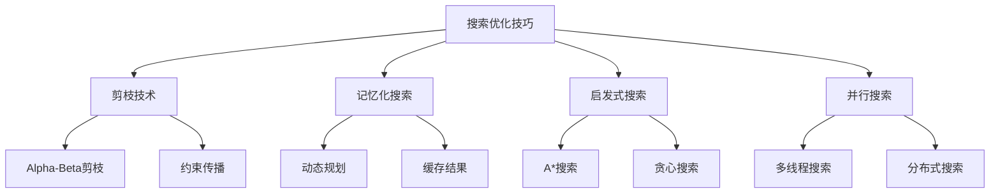

# 搜索优化技巧

## 📖 核心概念

**搜索优化技巧**是提高搜索算法效率的重要方法，包括剪枝、记忆化、启发式搜索等技术。掌握这些技巧能够显著提高搜索算法的性能。

### 🏗️ 搜索优化分类



## 🔧 搜索优化实现

### 剪枝技术

```cpp
class PruningTechniques {
public:
    // Alpha-Beta剪枝
    int alphaBetaPruning(vector<vector<int>>& board, int depth, int alpha, int beta, bool maximizingPlayer) {
        if (depth == 0 || isGameOver(board)) {
            return evaluateBoard(board);
        }
        
        if (maximizingPlayer) {
            int maxEval = INT_MIN;
            for (auto move : getPossibleMoves(board)) {
                makeMove(board, move);
                int eval = alphaBetaPruning(board, depth - 1, alpha, beta, false);
                undoMove(board, move);
                
                maxEval = max(maxEval, eval);
                alpha = max(alpha, eval);
                
                if (beta <= alpha) {
                    break; // Beta剪枝
                }
            }
            return maxEval;
        } else {
            int minEval = INT_MAX;
            for (auto move : getPossibleMoves(board)) {
                makeMove(board, move);
                int eval = alphaBetaPruning(board, depth - 1, alpha, beta, true);
                undoMove(board, move);
                
                minEval = min(minEval, eval);
                beta = min(beta, eval);
                
                if (beta <= alpha) {
                    break; // Alpha剪枝
                }
            }
            return minEval;
        }
    }
    
    // 约束传播
    bool constraintPropagation(vector<vector<int>>& board) {
        bool changed = true;
        while (changed) {
            changed = false;
            
            for (int i = 0; i < 9; ++i) {
                for (int j = 0; j < 9; ++j) {
                    if (board[i][j] == 0) {
                        vector<int> possibleValues = getPossibleValues(board, i, j);
                        if (possibleValues.size() == 1) {
                            board[i][j] = possibleValues[0];
                            changed = true;
                        }
                    }
                }
            }
        }
        
        return isValidBoard(board);
    }
    
    // 回溯搜索 with 剪枝
    bool backtrackWithPruning(vector<vector<int>>& board, int row, int col) {
        if (row == 9) {
            return true; // 找到解
        }
        
        if (col == 9) {
            return backtrackWithPruning(board, row + 1, 0);
        }
        
        if (board[row][col] != 0) {
            return backtrackWithPruning(board, row, col + 1);
        }
        
        vector<int> possibleValues = getPossibleValues(board, row, col);
        
        for (int value : possibleValues) {
            board[row][col] = value;
            
            if (isValidMove(board, row, col) && backtrackWithPruning(board, row, col + 1)) {
                return true;
            }
            
            board[row][col] = 0; // 回溯
        }
        
        return false;
    }
    
private:
    bool isGameOver(vector<vector<int>>& board) {
        // 检查游戏是否结束
        return false;
    }
    
    int evaluateBoard(vector<vector<int>>& board) {
        // 评估棋盘状态
        return 0;
    }
    
    vector<pair<int, int>> getPossibleMoves(vector<vector<int>>& board) {
        // 获取可能的移动
        return {};
    }
    
    void makeMove(vector<vector<int>>& board, pair<int, int> move) {
        // 执行移动
    }
    
    void undoMove(vector<vector<int>>& board, pair<int, int> move) {
        // 撤销移动
    }
    
    vector<int> getPossibleValues(vector<vector<int>>& board, int row, int col) {
        vector<int> possible;
        for (int value = 1; value <= 9; ++value) {
            if (isValidValue(board, row, col, value)) {
                possible.push_back(value);
            }
        }
        return possible;
    }
    
    bool isValidValue(vector<vector<int>>& board, int row, int col, int value) {
        // 检查行
        for (int j = 0; j < 9; ++j) {
            if (board[row][j] == value) return false;
        }
        
        // 检查列
        for (int i = 0; i < 9; ++i) {
            if (board[i][col] == value) return false;
        }
        
        // 检查3x3方格
        int startRow = (row / 3) * 3;
        int startCol = (col / 3) * 3;
        for (int i = startRow; i < startRow + 3; ++i) {
            for (int j = startCol; j < startCol + 3; ++j) {
                if (board[i][j] == value) return false;
            }
        }
        
        return true;
    }
    
    bool isValidMove(vector<vector<int>>& board, int row, int col) {
        return isValidValue(board, row, col, board[row][col]);
    }
    
    bool isValidBoard(vector<vector<int>>& board) {
        for (int i = 0; i < 9; ++i) {
            for (int j = 0; j < 9; ++j) {
                if (board[i][j] != 0 && !isValidMove(board, i, j)) {
                    return false;
                }
            }
        }
        return true;
    }
};
```

### 记忆化搜索

```cpp
class MemoizationSearch {
private:
    map<string, int> memo;
    
public:
    // 记忆化斐波那契
    int fibonacciMemo(int n) {
        if (n <= 1) return n;
        
        string key = to_string(n);
        if (memo.find(key) != memo.end()) {
            return memo[key];
        }
        
        int result = fibonacciMemo(n - 1) + fibonacciMemo(n - 2);
        memo[key] = result;
        return result;
    }
    
    // 记忆化路径计数
    int uniquePathsMemo(int m, int n) {
        if (m == 1 || n == 1) return 1;
        
        string key = to_string(m) + "," + to_string(n);
        if (memo.find(key) != memo.end()) {
            return memo[key];
        }
        
        int result = uniquePathsMemo(m - 1, n) + uniquePathsMemo(m, n - 1);
        memo[key] = result;
        return result;
    }
    
    // 记忆化最长公共子序列
    int lcsMemo(string& s1, string& s2, int i, int j) {
        if (i == 0 || j == 0) return 0;
        
        string key = to_string(i) + "," + to_string(j);
        if (memo.find(key) != memo.end()) {
            return memo[key];
        }
        
        int result;
        if (s1[i - 1] == s2[j - 1]) {
            result = 1 + lcsMemo(s1, s2, i - 1, j - 1);
        } else {
            result = max(lcsMemo(s1, s2, i - 1, j), lcsMemo(s1, s2, i, j - 1));
        }
        
        memo[key] = result;
        return result;
    }
    
    // 记忆化背包问题
    int knapsackMemo(vector<int>& weights, vector<int>& values, int capacity, int index) {
        if (index < 0 || capacity <= 0) return 0;
        
        string key = to_string(index) + "," + to_string(capacity);
        if (memo.find(key) != memo.end()) {
            return memo[key];
        }
        
        int result;
        if (weights[index] > capacity) {
            result = knapsackMemo(weights, values, capacity, index - 1);
        } else {
            int include = values[index] + knapsackMemo(weights, values, capacity - weights[index], index - 1);
            int exclude = knapsackMemo(weights, values, capacity, index - 1);
            result = max(include, exclude);
        }
        
        memo[key] = result;
        return result;
    }
    
    // 清除记忆
    void clearMemo() {
        memo.clear();
    }
    
    // 显示记忆状态
    void displayMemo() {
        cout << "Memoization cache:" << endl;
        for (auto& pair : memo) {
            cout << pair.first << " -> " << pair.second << endl;
        }
    }
};
```

### 启发式搜索

```cpp
class HeuristicSearch {
private:
    struct Node {
        int x, y;
        int g, h, f;
        Node* parent;
        
        Node(int x, int y, int g, int h, Node* parent = nullptr) 
            : x(x), y(y), g(g), h(h), f(g + h), parent(parent) {}
    };
    
    struct CompareNode {
        bool operator()(Node* a, Node* b) {
            return a->f > b->f; // 最小堆
        }
    };
    
public:
    // A*搜索
    vector<pair<int, int>> aStarSearch(vector<vector<int>>& grid, pair<int, int> start, pair<int, int> goal) {
        int rows = grid.size();
        int cols = grid[0].size();
        
        priority_queue<Node*, vector<Node*>, CompareNode> openSet;
        set<pair<int, int>> closedSet;
        map<pair<int, int>, Node*> nodeMap;
        
        Node* startNode = new Node(start.first, start.second, 0, heuristic(start, goal));
        openSet.push(startNode);
        nodeMap[start] = startNode;
        
        while (!openSet.empty()) {
            Node* current = openSet.top();
            openSet.pop();
            
            pair<int, int> currentPos = {current->x, current->y};
            
            if (currentPos == goal) {
                vector<pair<int, int>> path;
                Node* node = current;
                while (node) {
                    path.push_back({node->x, node->y});
                    node = node->parent;
                }
                reverse(path.begin(), path.end());
                return path;
            }
            
            closedSet.insert(currentPos);
            
            vector<pair<int, int>> neighbors = getNeighbors(currentPos, rows, cols);
            for (auto& neighbor : neighbors) {
                if (closedSet.find(neighbor) != closedSet.end() || grid[neighbor.first][neighbor.second] == 1) {
                    continue; // 障碍物或已访问
                }
                
                int tentativeG = current->g + 1;
                
                if (nodeMap.find(neighbor) == nodeMap.end()) {
                    Node* neighborNode = new Node(neighbor.first, neighbor.second, tentativeG, heuristic(neighbor, goal), current);
                    openSet.push(neighborNode);
                    nodeMap[neighbor] = neighborNode;
                } else {
                    Node* neighborNode = nodeMap[neighbor];
                    if (tentativeG < neighborNode->g) {
                        neighborNode->g = tentativeG;
                        neighborNode->f = neighborNode->g + neighborNode->h;
                        neighborNode->parent = current;
                    }
                }
            }
        }
        
        return {}; // 没有找到路径
    }
    
    // 贪心搜索
    vector<pair<int, int>> greedySearch(vector<vector<int>>& grid, pair<int, int> start, pair<int, int> goal) {
        int rows = grid.size();
        int cols = grid[0].size();
        
        priority_queue<Node*, vector<Node*>, CompareNode> openSet;
        set<pair<int, int>> closedSet;
        
        Node* startNode = new Node(start.first, start.second, 0, heuristic(start, goal));
        openSet.push(startNode);
        
        while (!openSet.empty()) {
            Node* current = openSet.top();
            openSet.pop();
            
            pair<int, int> currentPos = {current->x, current->y};
            
            if (currentPos == goal) {
                vector<pair<int, int>> path;
                Node* node = current;
                while (node) {
                    path.push_back({node->x, node->y});
                    node = node->parent;
                }
                reverse(path.begin(), path.end());
                return path;
            }
            
            closedSet.insert(currentPos);
            
            vector<pair<int, int>> neighbors = getNeighbors(currentPos, rows, cols);
            for (auto& neighbor : neighbors) {
                if (closedSet.find(neighbor) != closedSet.end() || grid[neighbor.first][neighbor.second] == 1) {
                    continue;
                }
                
                Node* neighborNode = new Node(neighbor.first, neighbor.second, 0, heuristic(neighbor, goal), current);
                openSet.push(neighborNode);
            }
        }
        
        return {};
    }
    
    // 最佳优先搜索
    vector<pair<int, int>> bestFirstSearch(vector<vector<int>>& grid, pair<int, int> start, pair<int, int> goal) {
        int rows = grid.size();
        int cols = grid[0].size();
        
        priority_queue<Node*, vector<Node*>, CompareNode> openSet;
        set<pair<int, int>> closedSet;
        
        Node* startNode = new Node(start.first, start.second, 0, heuristic(start, goal));
        openSet.push(startNode);
        
        while (!openSet.empty()) {
            Node* current = openSet.top();
            openSet.pop();
            
            pair<int, int> currentPos = {current->x, current->y};
            
            if (currentPos == goal) {
                vector<pair<int, int>> path;
                Node* node = current;
                while (node) {
                    path.push_back({node->x, node->y});
                    node = node->parent;
                }
                reverse(path.begin(), path.end());
                return path;
            }
            
            closedSet.insert(currentPos);
            
            vector<pair<int, int>> neighbors = getNeighbors(currentPos, rows, cols);
            for (auto& neighbor : neighbors) {
                if (closedSet.find(neighbor) != closedSet.end() || grid[neighbor.first][neighbor.second] == 1) {
                    continue;
                }
                
                Node* neighborNode = new Node(neighbor.first, neighbor.second, 0, heuristic(neighbor, goal), current);
                openSet.push(neighborNode);
            }
        }
        
        return {};
    }
    
private:
    int heuristic(pair<int, int> a, pair<int, int> b) {
        return abs(a.first - b.first) + abs(a.second - b.second); // 曼哈顿距离
    }
    
    vector<pair<int, int>> getNeighbors(pair<int, int> pos, int rows, int cols) {
        vector<pair<int, int>> neighbors;
        int dx[] = {-1, 1, 0, 0};
        int dy[] = {0, 0, -1, 1};
        
        for (int i = 0; i < 4; ++i) {
            int newX = pos.first + dx[i];
            int newY = pos.second + dy[i];
            
            if (newX >= 0 && newX < rows && newY >= 0 && newY < cols) {
                neighbors.push_back({newX, newY});
            }
        }
        
        return neighbors;
    }
};
```

### 并行搜索

```cpp
class ParallelSearch {
private:
    mutex mtx;
    atomic<bool> found;
    atomic<int> bestResult;
    
public:
    // 并行深度优先搜索
    void parallelDFS(vector<vector<int>>& graph, int start, int target, int depth, int maxDepth) {
        if (found.load()) return;
        
        if (start == target) {
            lock_guard<mutex> lock(mtx);
            if (!found.load()) {
                found.store(true);
                bestResult.store(depth);
            }
            return;
        }
        
        if (depth >= maxDepth) return;
        
        vector<thread> threads;
        for (int neighbor : graph[start]) {
            if (!found.load()) {
                threads.emplace_back([this, &graph, neighbor, target, depth, maxDepth]() {
                    parallelDFS(graph, neighbor, target, depth + 1, maxDepth);
                });
            }
        }
        
        for (auto& t : threads) {
            t.join();
        }
    }
    
    // 并行广度优先搜索
    void parallelBFS(vector<vector<int>>& graph, int start, int target) {
        queue<int> q;
        vector<bool> visited(graph.size(), false);
        vector<int> distance(graph.size(), -1);
        
        q.push(start);
        visited[start] = true;
        distance[start] = 0;
        
        while (!q.empty() && !found.load()) {
            int levelSize = q.size();
            vector<thread> threads;
            
            for (int i = 0; i < levelSize; ++i) {
                int current = q.front();
                q.pop();
                
                if (current == target) {
                    found.store(true);
                    bestResult.store(distance[current]);
                    return;
                }
                
                threads.emplace_back([this, &graph, &q, &visited, &distance, current]() {
                    for (int neighbor : graph[current]) {
                        if (!visited[neighbor]) {
                            lock_guard<mutex> lock(mtx);
                            if (!visited[neighbor]) {
                                visited[neighbor] = true;
                                distance[neighbor] = distance[current] + 1;
                                q.push(neighbor);
                            }
                        }
                    }
                });
            }
            
            for (auto& t : threads) {
                t.join();
            }
        }
    }
    
    // 并行搜索优化
    int parallelSearchOptimized(vector<vector<int>>& graph, int start, int target) {
        found.store(false);
        bestResult.store(-1);
        
        int maxDepth = graph.size();
        parallelDFS(graph, start, target, 0, maxDepth);
        
        return bestResult.load();
    }
    
    // 重置状态
    void reset() {
        found.store(false);
        bestResult.store(-1);
    }
};
```

## 🎯 搜索优化应用

### 游戏AI

```cpp
class GameAI {
private:
    PruningTechniques pruning;
    
public:
    // 井字游戏AI
    int ticTacToeAI(vector<vector<char>>& board, char player) {
        int bestScore = (player == 'X') ? INT_MIN : INT_MAX;
        pair<int, int> bestMove = {-1, -1};
        
        for (int i = 0; i < 3; ++i) {
            for (int j = 0; j < 3; ++j) {
                if (board[i][j] == ' ') {
                    board[i][j] = player;
                    int score = minimax(board, 0, false, player);
                    board[i][j] = ' ';
                    
                    if (player == 'X') {
                        if (score > bestScore) {
                            bestScore = score;
                            bestMove = {i, j};
                        }
                    } else {
                        if (score < bestScore) {
                            bestScore = score;
                            bestMove = {i, j};
                        }
                    }
                }
            }
        }
        
        return bestMove.first * 3 + bestMove.second;
    }
    
    int minimax(vector<vector<char>>& board, int depth, bool isMaximizing, char player) {
        char result = checkWinner(board);
        if (result != ' ') {
            return (result == player) ? 10 - depth : depth - 10;
        }
        
        if (isBoardFull(board)) {
            return 0;
        }
        
        if (isMaximizing) {
            int bestScore = INT_MIN;
            for (int i = 0; i < 3; ++i) {
                for (int j = 0; j < 3; ++j) {
                    if (board[i][j] == ' ') {
                        board[i][j] = player;
                        int score = minimax(board, depth + 1, false, player);
                        board[i][j] = ' ';
                        bestScore = max(bestScore, score);
                    }
                }
            }
            return bestScore;
        } else {
            int bestScore = INT_MAX;
            for (int i = 0; i < 3; ++i) {
                for (int j = 0; j < 3; ++j) {
                    if (board[i][j] == ' ') {
                        board[i][j] = (player == 'X') ? 'O' : 'X';
                        int score = minimax(board, depth + 1, true, player);
                        board[i][j] = ' ';
                        bestScore = min(bestScore, score);
                    }
                }
            }
            return bestScore;
        }
    }
    
private:
    char checkWinner(vector<vector<char>>& board) {
        // 检查行
        for (int i = 0; i < 3; ++i) {
            if (board[i][0] == board[i][1] && board[i][1] == board[i][2] && board[i][0] != ' ') {
                return board[i][0];
            }
        }
        
        // 检查列
        for (int j = 0; j < 3; ++j) {
            if (board[0][j] == board[1][j] && board[1][j] == board[2][j] && board[0][j] != ' ') {
                return board[0][j];
            }
        }
        
        // 检查对角线
        if (board[0][0] == board[1][1] && board[1][1] == board[2][2] && board[0][0] != ' ') {
            return board[0][0];
        }
        if (board[0][2] == board[1][1] && board[1][1] == board[2][0] && board[0][2] != ' ') {
            return board[0][2];
        }
        
        return ' ';
    }
    
    bool isBoardFull(vector<vector<char>>& board) {
        for (int i = 0; i < 3; ++i) {
            for (int j = 0; j < 3; ++j) {
                if (board[i][j] == ' ') {
                    return false;
                }
            }
        }
        return true;
    }
};
```

### 路径规划

```cpp
class PathPlanning {
private:
    HeuristicSearch heuristicSearch;
    
public:
    // 路径规划
    vector<pair<int, int>> planPath(vector<vector<int>>& grid, pair<int, int> start, pair<int, int> goal) {
        return heuristicSearch.aStarSearch(grid, start, goal);
    }
    
    // 多目标路径规划
    vector<vector<pair<int, int>>> planMultiplePaths(vector<vector<int>>& grid, vector<pair<int, int>>& starts, vector<pair<int, int>>& goals) {
        vector<vector<pair<int, int>>> paths;
        
        for (int i = 0; i < starts.size(); ++i) {
            vector<pair<int, int>> path = planPath(grid, starts[i], goals[i]);
            paths.push_back(path);
        }
        
        return paths;
    }
    
    // 动态路径规划
    vector<pair<int, int>> planDynamicPath(vector<vector<int>>& grid, pair<int, int> start, pair<int, int> goal, vector<pair<int, int>>& obstacles) {
        // 更新网格中的障碍物
        for (auto& obstacle : obstacles) {
            grid[obstacle.first][obstacle.second] = 1;
        }
        
        return planPath(grid, start, goal);
    }
    
    // 显示路径
    void displayPath(vector<vector<int>>& grid, vector<pair<int, int>>& path) {
        cout << "Path Planning Result:" << endl;
        cout << "===================" << endl;
        
        for (int i = 0; i < grid.size(); ++i) {
            for (int j = 0; j < grid[0].size(); ++j) {
                bool isPath = false;
                for (auto& pos : path) {
                    if (pos.first == i && pos.second == j) {
                        isPath = true;
                        break;
                    }
                }
                
                if (isPath) {
                    cout << "* ";
                } else if (grid[i][j] == 1) {
                    cout << "# ";
                } else {
                    cout << ". ";
                }
            }
            cout << endl;
        }
    }
};
```

## 📊 搜索优化分析

### 性能分析

```cpp
class SearchOptimizationAnalysis {
public:
    static void analyzePerformance() {
        cout << "Search Optimization Performance Analysis:" << endl;
        cout << "=======================================" << endl;
        
        cout << "1. Pruning Techniques:" << endl;
        cout << "   - Alpha-Beta剪枝: 减少50-90%的节点" << endl;
        cout << "   - 约束传播: 提前发现冲突" << endl;
        cout << "   - 启发式剪枝: 基于估计值剪枝" << endl;
        
        cout << "2. Memoization:" << endl;
        cout << "   - 时间复杂度: 从指数降到多项式" << endl;
        cout << "   - 空间复杂度: O(n)额外空间" << endl;
        cout << "   - 适用: 重叠子问题" << endl;
        
        cout << "3. Heuristic Search:" << endl;
        cout << "   - A*搜索: 最优解" << endl;
        cout << "   - 贪心搜索: 快速但不一定最优" << endl;
        cout << "   - 最佳优先: 平衡速度和最优性" << endl;
        
        cout << "4. Parallel Search:" << endl;
        cout << "   - 时间复杂度: O(n/p)" << endl;
        cout << "   - 空间复杂度: O(n)" << endl;
        cout << "   - 适用: 独立子问题" << endl;
    }
    
    static void analyzeSpaceComplexity() {
        cout << "Search Optimization Space Complexity Analysis:" << endl;
        cout << "=============================================" << endl;
        
        cout << "1. Pruning: O(1)额外空间" << endl;
        cout << "2. Memoization: O(n)缓存空间" << endl;
        cout << "3. Heuristic Search: O(n)开放集空间" << endl;
        cout << "4. Parallel Search: O(n)线程空间" << endl;
    }
};
```

## 🎮 搜索优化测试

### 1. 基础功能测试

```cpp
class SearchOptimizationTest {
public:
    static void testPruning() {
        cout << "Testing Pruning Techniques:" << endl;
        cout << "=========================" << endl;
        
        PruningTechniques pruning;
        vector<vector<int>> board(9, vector<int>(9, 0));
        
        bool result = pruning.backtrackWithPruning(board, 0, 0);
        cout << "Sudoku solved: " << (result ? "Yes" : "No") << endl;
    }
    
    static void testMemoization() {
        cout << "Testing Memoization:" << endl;
        cout << "==================" << endl;
        
        MemoizationSearch memo;
        
        int fib = memo.fibonacciMemo(10);
        cout << "Fibonacci(10): " << fib << endl;
        
        int paths = memo.uniquePathsMemo(3, 3);
        cout << "Unique paths(3,3): " << paths << endl;
        
        memo.displayMemo();
    }
    
    static void testHeuristicSearch() {
        cout << "Testing Heuristic Search:" << endl;
        cout << "========================" << endl;
        
        HeuristicSearch heuristic;
        vector<vector<int>> grid = {
            {0, 0, 0, 0},
            {0, 1, 0, 0},
            {0, 0, 0, 0},
            {0, 0, 0, 0}
        };
        
        vector<pair<int, int>> path = heuristic.aStarSearch(grid, {0, 0}, {3, 3});
        cout << "A* path length: " << path.size() << endl;
    }
    
    static void testParallelSearch() {
        cout << "Testing Parallel Search:" << endl;
        cout << "======================" << endl;
        
        ParallelSearch parallel;
        vector<vector<int>> graph = {
            {1, 2},
            {0, 3},
            {0, 3},
            {1, 2}
        };
        
        int result = parallel.parallelSearchOptimized(graph, 0, 3);
        cout << "Parallel search result: " << result << endl;
    }
    
    static void testGameAI() {
        cout << "Testing Game AI:" << endl;
        cout << "===============" << endl;
        
        GameAI gameAI;
        vector<vector<char>> board = {
            {' ', ' ', ' '},
            {' ', ' ', ' '},
            {' ', ' ', ' '}
        };
        
        int move = gameAI.ticTacToeAI(board, 'X');
        cout << "AI move: " << move << endl;
    }
    
    static void testPathPlanning() {
        cout << "Testing Path Planning:" << endl;
        cout << "====================" << endl;
        
        PathPlanning pathPlanning;
        vector<vector<int>> grid = {
            {0, 0, 0, 0},
            {0, 1, 0, 0},
            {0, 0, 0, 0},
            {0, 0, 0, 0}
        };
        
        vector<pair<int, int>> path = pathPlanning.planPath(grid, {0, 0}, {3, 3});
        pathPlanning.displayPath(grid, path);
    }
};
```

## 🔗 相关链接

- [[01-二分搜索基础|二分搜索基础]]
- [[02-三-分搜索与插值搜索|三-分搜索与插值搜索]]

## 💡 搜索优化要点

1. **剪枝技术**: 减少搜索空间，提高效率
2. **记忆化**: 避免重复计算，空间换时间
3. **启发式搜索**: 智能引导搜索方向
4. **并行搜索**: 利用多核提高性能

---

*📝 搜索优化提示：搜索优化技巧是提高算法效率的重要方法，掌握这些技巧有助于解决复杂问题*
