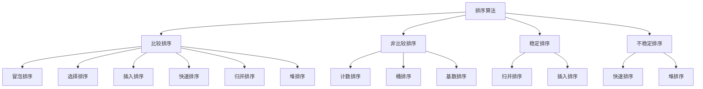

# 排序艺术

## 📖 核心概念

**排序算法**是计算机科学中的经典问题，将数据按照特定顺序重新排列。不同的排序算法有不同的时间复杂度和适用场景。

### 🏗️ 排序分类



## 🔧 基本排序算法

### 冒泡排序

```cpp
class BubbleSort {
public:
    static void bubbleSort(vector<int>& arr) {
        int n = arr.size();
        
        for (int i = 0; i < n - 1; ++i) {
            bool swapped = false;
            
            for (int j = 0; j < n - i - 1; ++j) {
                if (arr[j] > arr[j + 1]) {
                    swap(arr[j], arr[j + 1]);
                    swapped = true;
                }
            }
            
            if (!swapped) break;  // 优化：如果没交换则已有序
        }
    }
    
    static void bubbleSortRecursive(vector<int>& arr, int n) {
        if (n <= 1) return;
        
        for (int i = 0; i < n - 1; ++i) {
            if (arr[i] > arr[i + 1]) {
                swap(arr[i], arr[i + 1]);
            }
        }
        
        bubbleSortRecursive(arr, n - 1);
    }
};
```

### 选择排序

```cpp
class SelectionSort {
public:
    static void selectionSort(vector<int>& arr) {
        int n = arr.size();
        
        for (int i = 0; i < n - 1; ++i) {
            int minIndex = i;
            
            for (int j = i + 1; j < n; ++j) {
                if (arr[j] < arr[minIndex]) {
                    minIndex = j;
                }
            }
            
            if (minIndex != i) {
                swap(arr[i], arr[minIndex]);
            }
        }
    }
    
    static void selectionSortRecursive(vector<int>& arr, int start, int n) {
        if (start >= n - 1) return;
        
        int minIndex = start;
        for (int i = start + 1; i < n; ++i) {
            if (arr[i] < arr[minIndex]) {
                minIndex = i;
            }
        }
        
        if (minIndex != start) {
            swap(arr[start], arr[minIndex]);
        }
        
        selectionSortRecursive(arr, start + 1, n);
    }
};
```

### 插入排序

```cpp
class InsertionSort {
public:
    static void insertionSort(vector<int>& arr) {
        int n = arr.size();
        
        for (int i = 1; i < n; ++i) {
            int key = arr[i];
            int j = i - 1;
            
            while (j >= 0 && arr[j] > key) {
                arr[j + 1] = arr[j];
                j--;
            }
            
            arr[j + 1] = key;
        }
    }
    
    static void insertionSortRecursive(vector<int>& arr, int n) {
        if (n <= 1) return;
        
        insertionSortRecursive(arr, n - 1);
        
        int last = arr[n - 1];
        int j = n - 2;
        
        while (j >= 0 && arr[j] > last) {
            arr[j + 1] = arr[j];
            j--;
        }
        
        arr[j + 1] = last;
    }
    
    static void binaryInsertionSort(vector<int>& arr) {
        int n = arr.size();
        
        for (int i = 1; i < n; ++i) {
            int key = arr[i];
            int pos = binarySearch(arr, key, 0, i - 1);
            
            for (int j = i - 1; j >= pos; --j) {
                arr[j + 1] = arr[j];
            }
            
            arr[pos] = key;
        }
    }
    
private:
    static int binarySearch(const vector<int>& arr, int key, int left, int right) {
        while (left <= right) {
            int mid = left + (right - left) / 2;
            
            if (arr[mid] <= key) {
                left = mid + 1;
            } else {
                right = mid - 1;
            }
        }
        
        return left;
    }
};
```

## 🎯 高级排序算法

### 快速排序

```cpp
class QuickSort {
public:
    static void quickSort(vector<int>& arr, int low, int high) {
        if (low < high) {
            int pivotIndex = partition(arr, low, high);
            quickSort(arr, low, pivotIndex - 1);
            quickSort(arr, pivotIndex + 1, high);
        }
    }
    
    static int partition(vector<int>& arr, int low, int high) {
        int pivot = arr[high];
        int i = low - 1;
        
        for (int j = low; j < high; ++j) {
            if (arr[j] <= pivot) {
                i++;
                swap(arr[i], arr[j]);
            }
        }
        
        swap(arr[i + 1], arr[high]);
        return i + 1;
    }
    
    static void quickSort3Way(vector<int>& arr, int low, int high) {
        if (low >= high) return;
        
        int lt = low, gt = high;
        int pivot = arr[low];
        int i = low;
        
        while (i <= gt) {
            if (arr[i] < pivot) {
                swap(arr[lt++], arr[i++]);
            } else if (arr[i] > pivot) {
                swap(arr[i], arr[gt--]);
            } else {
                i++;
            }
        }
        
        quickSort3Way(arr, low, lt - 1);
        quickSort3Way(arr, gt + 1, high);
    }
};
```

### 归并排序

```cpp
class MergeSort {
public:
    static void mergeSort(vector<int>& arr, int left, int right) {
        if (left < right) {
            int mid = left + (right - left) / 2;
            mergeSort(arr, left, mid);
            mergeSort(arr, mid + 1, right);
            merge(arr, left, mid, right);
        }
    }
    
    static void merge(vector<int>& arr, int left, int mid, int right) {
        vector<int> temp(right - left + 1);
        int i = left, j = mid + 1, k = 0;
        
        while (i <= mid && j <= right) {
            if (arr[i] <= arr[j]) {
                temp[k++] = arr[i++];
            } else {
                temp[k++] = arr[j++];
            }
        }
        
        while (i <= mid) {
            temp[k++] = arr[i++];
        }
        
        while (j <= right) {
            temp[k++] = arr[j++];
        }
        
        for (int i = 0; i < temp.size(); ++i) {
            arr[left + i] = temp[i];
        }
    }
    
    static void mergeSortIterative(vector<int>& arr) {
        int n = arr.size();
        
        for (int size = 1; size < n; size *= 2) {
            for (int left = 0; left < n - 1; left += 2 * size) {
                int mid = min(left + size - 1, n - 1);
                int right = min(left + 2 * size - 1, n - 1);
                merge(arr, left, mid, right);
            }
        }
    }
};
```

### 堆排序

```cpp
class HeapSort {
public:
    static void heapSort(vector<int>& arr) {
        int n = arr.size();
        
        // 构建最大堆
        for (int i = n / 2 - 1; i >= 0; --i) {
            heapify(arr, n, i);
        }
        
        // 逐个提取元素
        for (int i = n - 1; i > 0; --i) {
            swap(arr[0], arr[i]);
            heapify(arr, i, 0);
        }
    }
    
    static void heapify(vector<int>& arr, int n, int i) {
        int largest = i;
        int left = 2 * i + 1;
        int right = 2 * i + 2;
        
        if (left < n && arr[left] > arr[largest]) {
            largest = left;
        }
        
        if (right < n && arr[right] > arr[largest]) {
            largest = right;
        }
        
        if (largest != i) {
            swap(arr[i], arr[largest]);
            heapify(arr, n, largest);
        }
    }
};
```

## 📊 非比较排序

### 计数排序

```cpp
class CountingSort {
public:
    static void countingSort(vector<int>& arr) {
        if (arr.empty()) return;
        
        int maxVal = *max_element(arr.begin(), arr.end());
        int minVal = *min_element(arr.begin(), arr.end());
        int range = maxVal - minVal + 1;
        
        vector<int> count(range, 0);
        vector<int> output(arr.size());
        
        // 计数
        for (int num : arr) {
            count[num - minVal]++;
        }
        
        // 累加计数
        for (int i = 1; i < range; ++i) {
            count[i] += count[i - 1];
        }
        
        // 构建输出数组
        for (int i = arr.size() - 1; i >= 0; --i) {
            output[count[arr[i] - minVal] - 1] = arr[i];
            count[arr[i] - minVal]--;
        }
        
        arr = output;
    }
};
```

### 桶排序

```cpp
class BucketSort {
public:
    static void bucketSort(vector<int>& arr) {
        if (arr.empty()) return;
        
        int maxVal = *max_element(arr.begin(), arr.end());
        int minVal = *min_element(arr.begin(), arr.end());
        int bucketCount = arr.size();
        
        vector<vector<int>> buckets(bucketCount);
        
        // 分配到桶
        for (int num : arr) {
            int bucketIndex = (num - minVal) * bucketCount / (maxVal - minVal + 1);
            buckets[bucketIndex].push_back(num);
        }
        
        // 对每个桶排序
        for (auto& bucket : buckets) {
            sort(bucket.begin(), bucket.end());
        }
        
        // 合并桶
        int index = 0;
        for (const auto& bucket : buckets) {
            for (int num : bucket) {
                arr[index++] = num;
            }
        }
    }
};
```

### 基数排序

```cpp
class RadixSort {
public:
    static void radixSort(vector<int>& arr) {
        if (arr.empty()) return;
        
        int maxVal = *max_element(arr.begin(), arr.end());
        
        for (int exp = 1; maxVal / exp > 0; exp *= 10) {
            countingSortByDigit(arr, exp);
        }
    }
    
private:
    static void countingSortByDigit(vector<int>& arr, int exp) {
        vector<int> output(arr.size());
        vector<int> count(10, 0);
        
        // 计数
        for (int num : arr) {
            count[(num / exp) % 10]++;
        }
        
        // 累加计数
        for (int i = 1; i < 10; ++i) {
            count[i] += count[i - 1];
        }
        
        // 构建输出数组
        for (int i = arr.size() - 1; i >= 0; --i) {
            output[count[(arr[i] / exp) % 10] - 1] = arr[i];
            count[(arr[i] / exp) % 10]--;
        }
        
        arr = output;
    }
};
```

## 🎮 排序应用

### 1. Top K问题

```cpp
class TopK {
public:
    static vector<int> findTopK(vector<int>& nums, int k) {
        // 使用堆排序
        vector<int> result;
        priority_queue<int, vector<int>, greater<int>> minHeap;
        
        for (int num : nums) {
            if (minHeap.size() < k) {
                minHeap.push(num);
            } else if (num > minHeap.top()) {
                minHeap.pop();
                minHeap.push(num);
            }
        }
        
        while (!minHeap.empty()) {
            result.push_back(minHeap.top());
            minHeap.pop();
        }
        
        return result;
    }
};
```

### 2. 排序稳定性测试

```cpp
class SortStability {
public:
    static bool isStable(vector<pair<int, int>>& arr) {
        // 测试排序稳定性
        vector<pair<int, int>> original = arr;
        sort(arr.begin(), arr.end());
        
        // 检查相同值的相对位置
        for (int i = 0; i < arr.size() - 1; ++i) {
            if (arr[i].first == arr[i + 1].first) {
                // 找到原始位置
                int pos1 = -1, pos2 = -1;
                for (int j = 0; j < original.size(); ++j) {
                    if (original[j] == arr[i]) pos1 = j;
                    if (original[j] == arr[i + 1]) pos2 = j;
                }
                
                if (pos1 > pos2) return false;
            }
        }
        
        return true;
    }
};
```

## 🔗 相关链接

- [[01-搜索技术|搜索技术]]
- [[03-图论算法|图论算法]]
- [[04-动态规划|动态规划]]

## 💡 排序艺术要点

1. **时间复杂度**：从O(n²)到O(n log n)到O(n)
2. **空间复杂度**：原地排序vs需要额外空间
3. **稳定性**：相同元素的相对位置是否改变
4. **适用场景**：不同排序算法适合不同场景

---

*📝 艺术提示：排序是算法设计的基础，掌握各种排序算法对理解算法复杂度很重要*
