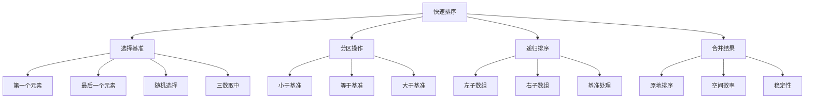

# 快速排序算法

## 📖 核心概念

**快速排序算法**是一种高效的排序算法，采用分治策略。它选择一个基准元素，将数组分为两部分，然后递归排序。

### 🏗️ 快速排序原理



## 🔧 基础实现

### 标准快速排序

```cpp
class QuickSort {
private:
    // 分区操作
    int partition(vector<int>& arr, int low, int high) {
        int pivot = arr[high];  // 选择最后一个元素作为基准
        int i = low - 1;        // 小于基准的元素的索引
        
        for (int j = low; j < high; ++j) {
            if (arr[j] <= pivot) {
                ++i;
                swap(arr[i], arr[j]);
            }
        }
        
        swap(arr[i + 1], arr[high]);
        return i + 1;
    }
    
    // 三路分区（处理重复元素）
    pair<int, int> partition3Way(vector<int>& arr, int low, int high) {
        int pivot = arr[low];
        int lt = low;      // arr[low..lt-1] < pivot
        int gt = high;     // arr[gt+1..high] > pivot
        int i = low + 1;   // arr[lt..i-1] == pivot
        
        while (i <= gt) {
            if (arr[i] < pivot) {
                swap(arr[lt++], arr[i++]);
            } else if (arr[i] > pivot) {
                swap(arr[i], arr[gt--]);
            } else {
                ++i;
            }
        }
        
        return {lt, gt};
    }
    
public:
    // 基础快速排序
    void quickSort(vector<int>& arr, int low, int high) {
        if (low < high) {
            int pivotIndex = partition(arr, low, high);
            
            quickSort(arr, low, pivotIndex - 1);
            quickSort(arr, pivotIndex + 1, high);
        }
    }
    
    // 三路快速排序
    void quickSort3Way(vector<int>& arr, int low, int high) {
        if (low < high) {
            auto [lt, gt] = partition3Way(arr, low, high);
            
            quickSort3Way(arr, low, lt - 1);
            quickSort3Way(arr, gt + 1, high);
        }
    }
    
    // 公共接口
    void sort(vector<int>& arr) {
        if (arr.empty()) return;
        quickSort(arr, 0, arr.size() - 1);
    }
    
    void sort3Way(vector<int>& arr) {
        if (arr.empty()) return;
        quickSort3Way(arr, 0, arr.size() - 1);
    }
};
```

### 优化版本

```cpp
class OptimizedQuickSort {
private:
    // 随机选择基准
    int randomPartition(vector<int>& arr, int low, int high) {
        int randomIndex = low + rand() % (high - low + 1);
        swap(arr[randomIndex], arr[high]);
        return partition(arr, low, high);
    }
    
    // 三数取中法选择基准
    int medianOfThree(vector<int>& arr, int low, int mid, int high) {
        if (arr[low] > arr[mid]) swap(arr[low], arr[mid]);
        if (arr[mid] > arr[high]) swap(arr[mid], arr[high]);
        if (arr[low] > arr[mid]) swap(arr[low], arr[mid]);
        return mid;
    }
    
    int partition(vector<int>& arr, int low, int high) {
        // 三数取中
        int mid = low + (high - low) / 2;
        int pivotIndex = medianOfThree(arr, low, mid, high);
        swap(arr[pivotIndex], arr[high]);
        
        int pivot = arr[high];
        int i = low - 1;
        
        for (int j = low; j < high; ++j) {
            if (arr[j] <= pivot) {
                ++i;
                swap(arr[i], arr[j]);
            }
        }
        
        swap(arr[i + 1], arr[high]);
        return i + 1;
    }
    
    // 插入排序（小数组优化）
    void insertionSort(vector<int>& arr, int low, int high) {
        for (int i = low + 1; i <= high; ++i) {
            int key = arr[i];
            int j = i - 1;
            
            while (j >= low && arr[j] > key) {
                arr[j + 1] = arr[j];
                --j;
            }
            
            arr[j + 1] = key;
        }
    }
    
public:
    // 优化的快速排序
    void quickSortOptimized(vector<int>& arr, int low, int high) {
        const int INSERTION_THRESHOLD = 10;
        
        if (low < high) {
            // 小数组使用插入排序
            if (high - low + 1 < INSERTION_THRESHOLD) {
                insertionSort(arr, low, high);
                return;
            }
            
            int pivotIndex = randomPartition(arr, low, high);
            
            quickSortOptimized(arr, low, pivotIndex - 1);
            quickSortOptimized(arr, pivotIndex + 1, high);
        }
    }
    
    // 尾递归优化
    void quickSortTailRecursive(vector<int>& arr, int low, int high) {
        while (low < high) {
            int pivotIndex = partition(arr, low, high);
            
            // 总是先处理较小的子数组
            if (pivotIndex - low < high - pivotIndex) {
                quickSortTailRecursive(arr, low, pivotIndex - 1);
                low = pivotIndex + 1;
            } else {
                quickSortTailRecursive(arr, pivotIndex + 1, high);
                high = pivotIndex - 1;
            }
        }
    }
    
    void sort(vector<int>& arr) {
        if (arr.empty()) return;
        quickSortOptimized(arr, 0, arr.size() - 1);
    }
};
```

## 📊 性能分析

### 时间复杂度分析

```cpp
class QuickSortAnalysis {
public:
    // 最好情况分析
    void analyzeBestCase() {
        // 每次分区都平衡，基准总是中位数
        // T(n) = 2T(n/2) + O(n) = O(n log n)
    }
    
    // 平均情况分析
    void analyzeAverageCase() {
        // 随机选择基准，期望平衡
        // T(n) = O(n log n)
    }
    
    // 最坏情况分析
    void analyzeWorstCase() {
        // 每次选择的基准都是最大或最小值
        // T(n) = T(n-1) + O(n) = O(n²)
        // 例如：已排序数组，选择第一个元素作为基准
    }
    
    // 空间复杂度分析
    void analyzeSpaceComplexity() {
        // 递归栈空间：O(log n) 到 O(n)
        // 最好情况：O(log n)
        // 最坏情况：O(n)
    }
};
```

### 性能对比

| 排序算法 | 最好情况 | 平均情况 | 最坏情况 | 空间复杂度 | 稳定性 |
|----------|----------|----------|----------|------------|--------|
| **快速排序** | O(n log n) | O(n log n) | O(n²) | O(log n) | 不稳定 |
| **归并排序** | O(n log n) | O(n log n) | O(n log n) | O(n) | 稳定 |
| **堆排序** | O(n log n) | O(n log n) | O(n log n) | O(1) | 不稳定 |
| **插入排序** | O(n) | O(n²) | O(n²) | O(1) | 稳定 |

## 🎯 应用场景

### 1. 大数据排序

```cpp
class LargeDataSorting {
public:
    // 外部排序（分块处理）
    void externalSort(const string& inputFile, const string& outputFile, int chunkSize) {
        vector<string> chunkFiles;
        
        // 分块读取和排序
        ifstream input(inputFile);
        string line;
        vector<int> chunk;
        
        int chunkIndex = 0;
        while (getline(input, line)) {
            chunk.push_back(stoi(line));
            
            if (chunk.size() >= chunkSize) {
                QuickSort qs;
                qs.sort(chunk);
                
                string chunkFile = "chunk_" + to_string(chunkIndex++) + ".txt";
                chunkFiles.push_back(chunkFile);
                
                ofstream output(chunkFile);
                for (int value : chunk) {
                    output << value << endl;
                }
                output.close();
                
                chunk.clear();
            }
        }
        
        // 处理最后一个块
        if (!chunk.empty()) {
            QuickSort qs;
            qs.sort(chunk);
            
            string chunkFile = "chunk_" + to_string(chunkIndex++) + ".txt";
            chunkFiles.push_back(chunkFile);
            
            ofstream output(chunkFile);
            for (int value : chunk) {
                output << value << endl;
            }
            output.close();
        }
        
        // 合并排序后的块
        mergeChunks(chunkFiles, outputFile);
        
        // 清理临时文件
        for (const string& file : chunkFiles) {
            remove(file.c_str());
        }
    }
    
private:
    void mergeChunks(const vector<string>& chunkFiles, const string& outputFile) {
        // 使用优先队列合并多个有序文件
        priority_queue<pair<int, int>, vector<pair<int, int>>, greater<pair<int, int>>> pq;
        vector<ifstream> files;
        
        // 打开所有文件
        for (int i = 0; i < chunkFiles.size(); ++i) {
            files.emplace_back(chunkFiles[i]);
            int value;
            if (files[i] >> value) {
                pq.push({value, i});
            }
        }
        
        // 合并到输出文件
        ofstream output(outputFile);
        while (!pq.empty()) {
            auto [value, fileIndex] = pq.top();
            pq.pop();
            
            output << value << endl;
            
            int nextValue;
            if (files[fileIndex] >> nextValue) {
                pq.push({nextValue, fileIndex});
            }
        }
        
        output.close();
        
        // 关闭所有文件
        for (auto& file : files) {
            file.close();
        }
    }
};
```

### 2. 选择算法

```cpp
class SelectionAlgorithm {
public:
    // 快速选择（找第k小元素）
    int quickSelect(vector<int>& arr, int k) {
        return quickSelectHelper(arr, 0, arr.size() - 1, k - 1);
    }
    
private:
    int quickSelectHelper(vector<int>& arr, int low, int high, int k) {
        if (low == high) {
            return arr[low];
        }
        
        int pivotIndex = partition(arr, low, high);
        
        if (k == pivotIndex) {
            return arr[k];
        } else if (k < pivotIndex) {
            return quickSelectHelper(arr, low, pivotIndex - 1, k);
        } else {
            return quickSelectHelper(arr, pivotIndex + 1, high, k);
        }
    }
    
    int partition(vector<int>& arr, int low, int high) {
        int pivot = arr[high];
        int i = low - 1;
        
        for (int j = low; j < high; ++j) {
            if (arr[j] <= pivot) {
                ++i;
                swap(arr[i], arr[j]);
            }
        }
        
        swap(arr[i + 1], arr[high]);
        return i + 1;
    }
    
public:
    // 找中位数
    int findMedian(vector<int>& arr) {
        int n = arr.size();
        if (n % 2 == 1) {
            return quickSelect(arr, n / 2 + 1);
        } else {
            int mid1 = quickSelect(arr, n / 2);
            int mid2 = quickSelect(arr, n / 2 + 1);
            return (mid1 + mid2) / 2;
        }
    }
    
    // 找前k个最小元素
    vector<int> findTopKSmallest(vector<int>& arr, int k) {
        vector<int> result;
        vector<int> temp = arr;
        
        for (int i = 1; i <= k; ++i) {
            result.push_back(quickSelect(temp, i));
        }
        
        return result;
    }
};
```

## 🔧 优化技巧

### 1. 混合排序

```cpp
class HybridSort {
public:
    // 快速排序 + 插入排序
    void hybridSort(vector<int>& arr, int low, int high) {
        const int THRESHOLD = 10;
        
        if (low < high) {
            if (high - low + 1 < THRESHOLD) {
                insertionSort(arr, low, high);
            } else {
                int pivotIndex = partition(arr, low, high);
                hybridSort(arr, low, pivotIndex - 1);
                hybridSort(arr, pivotIndex + 1, high);
            }
        }
    }
    
private:
    void insertionSort(vector<int>& arr, int low, int high) {
        for (int i = low + 1; i <= high; ++i) {
            int key = arr[i];
            int j = i - 1;
            
            while (j >= low && arr[j] > key) {
                arr[j + 1] = arr[j];
                --j;
            }
            
            arr[j + 1] = key;
        }
    }
    
    int partition(vector<int>& arr, int low, int high) {
        int pivot = arr[high];
        int i = low - 1;
        
        for (int j = low; j < high; ++j) {
            if (arr[j] <= pivot) {
                ++i;
                swap(arr[i], arr[j]);
            }
        }
        
        swap(arr[i + 1], arr[high]);
        return i + 1;
    }
};
```

### 2. 并行优化

```cpp
class ParallelQuickSort {
public:
    // 并行快速排序
    void parallelQuickSort(vector<int>& arr, int low, int high) {
        if (low < high) {
            int pivotIndex = partition(arr, low, high);
            
            // 并行处理两个子数组
            future<void> leftFuture = async(launch::async, 
                [&]() { parallelQuickSort(arr, low, pivotIndex - 1); });
            future<void> rightFuture = async(launch::async, 
                [&]() { parallelQuickSort(arr, pivotIndex + 1, high); });
            
            leftFuture.wait();
            rightFuture.wait();
        }
    }
    
private:
    int partition(vector<int>& arr, int low, int high) {
        int pivot = arr[high];
        int i = low - 1;
        
        for (int j = low; j < high; ++j) {
            if (arr[j] <= pivot) {
                ++i;
                swap(arr[i], arr[j]);
            }
        }
        
        swap(arr[i + 1], arr[high]);
        return i + 1;
    }
};
```

## 🔗 相关链接

- [[01-归并排序算法|归并排序]]
- [[03-堆排序算法|堆排序]]
- [[04-排序算法对比|排序对比]]

## 💡 快速排序要点

1. **分治策略**：选择基准，分区，递归
2. **原地排序**：空间复杂度O(log n)
3. **不稳定**：相等元素的相对位置可能改变
4. **优化重要**：基准选择、小数组优化、尾递归

---

*📝 排序提示：快速排序是实际应用中最常用的排序算法，掌握其优化技巧很重要*