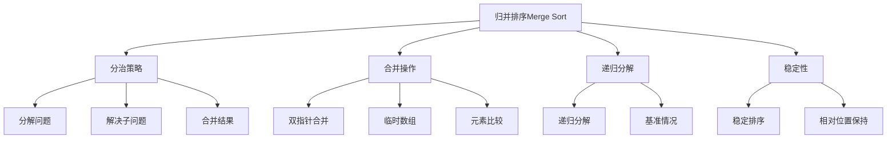

# 归并排序算法

## 📖 核心概念

**归并排序（Merge Sort）**是一种基于分治策略的稳定排序算法。它将数组递归地分成两半，分别排序，然后将两个有序的子数组合并成一个有序数组。归并排序具有O(n log n)的时间复杂度，是稳定的排序算法。

### 🏗️ 归并排序的组成要素



## 🔍 归并排序分类

### 按实现方式分类

| 实现方式 | 特点 | 优点 | 缺点 |
|----------|------|------|------|
| **递归实现** | 代码简洁 | 逻辑清晰 | 栈溢出风险 |
| **迭代实现** | 避免递归 | 可控性强 | 代码复杂 |
| **原地归并** | 空间效率高 | 节省空间 | 实现复杂 |

### 按合并策略分类

| 策略 | 特点 | 适用场景 |
|------|------|----------|
| **标准合并** | 使用临时数组 | 一般应用 |
| **原地合并** | 不使用额外空间 | 内存受限 |
| **多路合并** | 一次合并多个数组 | 外部排序 |

## 💻 归并排序基础实现

### 递归实现

```cpp
template<typename T>
class MergeSort {
private:
    vector<T>& arr;
    int size;
    
    // 合并两个有序子数组
    void merge(int left, int mid, int right) {
        int n1 = mid - left + 1;
        int n2 = right - mid;
        
        // 创建临时数组
        vector<T> leftArray(n1);
        vector<T> rightArray(n2);
        
        // 复制数据到临时数组
        for (int i = 0; i < n1; i++) {
            leftArray[i] = arr[left + i];
        }
        for (int j = 0; j < n2; j++) {
            rightArray[j] = arr[mid + 1 + j];
        }
        
        // 合并临时数组
        int i = 0, j = 0, k = left;
        
        while (i < n1 && j < n2) {
            if (leftArray[i] <= rightArray[j]) {
                arr[k] = leftArray[i];
                i++;
            } else {
                arr[k] = rightArray[j];
                j++;
            }
            k++;
        }
        
        // 复制剩余元素
        while (i < n1) {
            arr[k] = leftArray[i];
            i++;
            k++;
        }
        
        while (j < n2) {
            arr[k] = rightArray[j];
            j++;
            k++;
        }
    }
    
    // 递归归并排序
    void mergeSortRecursive(int left, int right) {
        if (left < right) {
            int mid = left + (right - left) / 2;
            
            // 递归排序左半部分
            mergeSortRecursive(left, mid);
            
            // 递归排序右半部分
            mergeSortRecursive(mid + 1, right);
            
            // 合并两个有序子数组
            merge(left, mid, right);
        }
    }
    
public:
    MergeSort(vector<T>& array) : arr(array), size(array.size()) {}
    
    // 归并排序主函数
    void mergeSort() {
        if (size <= 1) return;
        mergeSortRecursive(0, size - 1);
    }
    
    // 获取排序结果
    const vector<T>& getSortedArray() const {
        return arr;
    }
    
    // 检查数组是否已排序
    bool isSorted() const {
        for (int i = 1; i < size; i++) {
            if (arr[i] < arr[i - 1]) {
                return false;
            }
        }
        return true;
    }
};
```

### 迭代实现

```cpp
template<typename T>
class IterativeMergeSort {
private:
    vector<T>& arr;
    int size;
    
    // 合并两个有序子数组
    void merge(int left, int mid, int right) {
        int n1 = mid - left + 1;
        int n2 = right - mid;
        
        vector<T> leftArray(n1);
        vector<T> rightArray(n2);
        
        for (int i = 0; i < n1; i++) {
            leftArray[i] = arr[left + i];
        }
        for (int j = 0; j < n2; j++) {
            rightArray[j] = arr[mid + 1 + j];
        }
        
        int i = 0, j = 0, k = left;
        
        while (i < n1 && j < n2) {
            if (leftArray[i] <= rightArray[j]) {
                arr[k] = leftArray[i];
                i++;
            } else {
                arr[k] = rightArray[j];
                j++;
            }
            k++;
        }
        
        while (i < n1) {
            arr[k] = leftArray[i];
            i++;
            k++;
        }
        
        while (j < n2) {
            arr[k] = rightArray[j];
            j++;
            k++;
        }
    }
    
public:
    IterativeMergeSort(vector<T>& array) : arr(array), size(array.size()) {}
    
    // 迭代归并排序
    void mergeSort() {
        if (size <= 1) return;
        
        // 从下往上合并
        for (int currentSize = 1; currentSize < size; currentSize *= 2) {
            for (int left = 0; left < size - 1; left += 2 * currentSize) {
                int mid = min(left + currentSize - 1, size - 1);
                int right = min(left + 2 * currentSize - 1, size - 1);
                
                merge(left, mid, right);
            }
        }
    }
    
    const vector<T>& getSortedArray() const {
        return arr;
    }
};
```

## 🎯 归并排序优化实现

### 1. 原地归并排序

```cpp
template<typename T>
class InPlaceMergeSort {
private:
    vector<T>& arr;
    int size;
    
    // 原地合并（使用旋转）
    void inPlaceMerge(int left, int mid, int right) {
        int i = left, j = mid + 1;
        
        while (i <= mid && j <= right) {
            if (arr[i] <= arr[j]) {
                i++;
            } else {
                // 将arr[j]插入到arr[i]之前
                T value = arr[j];
                int index = j;
                
                // 向右移动元素
                while (index > i) {
                    arr[index] = arr[index - 1];
                    index--;
                }
                arr[i] = value;
                
                i++;
                mid++;
                j++;
            }
        }
    }
    
    void mergeSortRecursive(int left, int right) {
        if (left < right) {
            int mid = left + (right - left) / 2;
            
            mergeSortRecursive(left, mid);
            mergeSortRecursive(mid + 1, right);
            
            inPlaceMerge(left, mid, right);
        }
    }
    
public:
    InPlaceMergeSort(vector<T>& array) : arr(array), size(array.size()) {}
    
    void mergeSort() {
        if (size <= 1) return;
        mergeSortRecursive(0, size - 1);
    }
    
    const vector<T>& getSortedArray() const {
        return arr;
    }
};
```

### 2. 混合归并排序

```cpp
template<typename T>
class HybridMergeSort {
private:
    vector<T>& arr;
    int size;
    static const int INSERTION_THRESHOLD = 10;
    
    // 插入排序（用于小数组）
    void insertionSort(int left, int right) {
        for (int i = left + 1; i <= right; i++) {
            T key = arr[i];
            int j = i - 1;
            
            while (j >= left && arr[j] > key) {
                arr[j + 1] = arr[j];
                j--;
            }
            arr[j + 1] = key;
        }
    }
    
    void merge(int left, int mid, int right) {
        int n1 = mid - left + 1;
        int n2 = right - mid;
        
        vector<T> leftArray(n1);
        vector<T> rightArray(n2);
        
        for (int i = 0; i < n1; i++) {
            leftArray[i] = arr[left + i];
        }
        for (int j = 0; j < n2; j++) {
            rightArray[j] = arr[mid + 1 + j];
        }
        
        int i = 0, j = 0, k = left;
        
        while (i < n1 && j < n2) {
            if (leftArray[i] <= rightArray[j]) {
                arr[k] = leftArray[i];
                i++;
            } else {
                arr[k] = rightArray[j];
                j++;
            }
            k++;
        }
        
        while (i < n1) {
            arr[k] = leftArray[i];
            i++;
            k++;
        }
        
        while (j < n2) {
            arr[k] = rightArray[j];
            j++;
            k++;
        }
    }
    
    void mergeSortRecursive(int left, int right) {
        if (left < right) {
            // 小数组使用插入排序
            if (right - left + 1 < INSERTION_THRESHOLD) {
                insertionSort(left, right);
                return;
            }
            
            int mid = left + (right - left) / 2;
            
            mergeSortRecursive(left, mid);
            mergeSortRecursive(mid + 1, right);
            
            merge(left, mid, right);
        }
    }
    
public:
    HybridMergeSort(vector<T>& array) : arr(array), size(array.size()) {}
    
    void mergeSort() {
        if (size <= 1) return;
        mergeSortRecursive(0, size - 1);
    }
    
    const vector<T>& getSortedArray() const {
        return arr;
    }
};
```

### 3. 并行归并排序

```cpp
template<typename T>
class ParallelMergeSort {
private:
    vector<T>& arr;
    int size;
    
    void merge(int left, int mid, int right) {
        int n1 = mid - left + 1;
        int n2 = right - mid;
        
        vector<T> leftArray(n1);
        vector<T> rightArray(n2);
        
        for (int i = 0; i < n1; i++) {
            leftArray[i] = arr[left + i];
        }
        for (int j = 0; j < n2; j++) {
            rightArray[j] = arr[mid + 1 + j];
        }
        
        int i = 0, j = 0, k = left;
        
        while (i < n1 && j < n2) {
            if (leftArray[i] <= rightArray[j]) {
                arr[k] = leftArray[i];
                i++;
            } else {
                arr[k] = rightArray[j];
                j++;
            }
            k++;
        }
        
        while (i < n1) {
            arr[k] = leftArray[i];
            i++;
            k++;
        }
        
        while (j < n2) {
            arr[k] = rightArray[j];
            j++;
            k++;
        }
    }
    
    void mergeSortRecursive(int left, int right) {
        if (left < right) {
            int mid = left + (right - left) / 2;
            
            // 并行处理左右两部分
            if (right - left > 1000) { // 只对大数组使用并行
                thread leftThread([this, left, mid]() {
                    mergeSortRecursive(left, mid);
                });
                
                thread rightThread([this, mid, right]() {
                    mergeSortRecursive(mid + 1, right);
                });
                
                leftThread.join();
                rightThread.join();
            } else {
                mergeSortRecursive(left, mid);
                mergeSortRecursive(mid + 1, right);
            }
            
            merge(left, mid, right);
        }
    }
    
public:
    ParallelMergeSort(vector<T>& array) : arr(array), size(array.size()) {}
    
    void parallelMergeSort() {
        if (size <= 1) return;
        mergeSortRecursive(0, size - 1);
    }
    
    const vector<T>& getSortedArray() const {
        return arr;
    }
};
```

## 🔧 归并排序应用场景

### 1. 外部排序

```cpp
template<typename T>
class ExternalMergeSort {
private:
    string inputFile;
    string outputFile;
    int bufferSize;
    
public:
    ExternalMergeSort(const string& input, const string& output, int buffer) 
        : inputFile(input), outputFile(output), bufferSize(buffer) {}
    
    // 外部归并排序
    void externalMergeSort() {
        // 第一阶段：将大文件分成小文件并排序
        vector<string> tempFiles = createSortedRuns();
        
        // 第二阶段：多路归并
        mergeSortedRuns(tempFiles);
        
        // 清理临时文件
        for (const string& file : tempFiles) {
            remove(file.c_str());
        }
    }
    
private:
    // 创建排序后的运行文件
    vector<string> createSortedRuns() {
        vector<string> tempFiles;
        ifstream input(inputFile);
        int runCount = 0;
        
        while (!input.eof()) {
            vector<T> buffer;
            T value;
            
            // 读取缓冲区大小的数据
            for (int i = 0; i < bufferSize && input >> value; i++) {
                buffer.push_back(value);
            }
            
            if (!buffer.empty()) {
                // 对缓冲区进行归并排序
                MergeSort<T> mergeSort(buffer);
                mergeSort.mergeSort();
                
                // 写入临时文件
                string tempFile = "temp_run_" + to_string(runCount++) + ".txt";
                ofstream output(tempFile);
                
                for (const T& val : buffer) {
                    output << val << " ";
                }
                
                output.close();
                tempFiles.push_back(tempFile);
            }
        }
        
        input.close();
        return tempFiles;
    }
    
    // 多路归并
    void mergeSortedRuns(const vector<string>& tempFiles) {
        ofstream output(outputFile);
        vector<ifstream> inputs;
        vector<T> currentValues;
        
        // 打开所有临时文件
        for (const string& file : tempFiles) {
            inputs.emplace_back(file);
            T value;
            if (inputs.back() >> value) {
                currentValues.push_back(value);
            } else {
                currentValues.push_back(numeric_limits<T>::max());
            }
        }
        
        // 使用最小堆进行多路归并
        priority_queue<pair<T, int>, vector<pair<T, int>>, greater<pair<T, int>>> minHeap;
        
        for (int i = 0; i < currentValues.size(); i++) {
            if (currentValues[i] != numeric_limits<T>::max()) {
                minHeap.push({currentValues[i], i});
            }
        }
        
        while (!minHeap.empty()) {
            auto [value, fileIndex] = minHeap.top();
            minHeap.pop();
            output << value << " ";
            
            if (inputs[fileIndex] >> currentValues[fileIndex]) {
                minHeap.push({currentValues[fileIndex], fileIndex});
            }
        }
        
        output.close();
        
        // 关闭所有输入文件
        for (auto& input : inputs) {
            input.close();
        }
    }
};
```

### 2. 链表排序

```cpp
template<typename T>
class LinkedListMergeSort {
private:
    struct ListNode {
        T val;
        ListNode* next;
        ListNode(T x) : val(x), next(nullptr) {}
    };
    
    ListNode* head;
    
    // 找到链表中点
    ListNode* findMiddle(ListNode* head) {
        if (head == nullptr) return nullptr;
        
        ListNode* slow = head;
        ListNode* fast = head->next;
        
        while (fast != nullptr && fast->next != nullptr) {
            slow = slow->next;
            fast = fast->next->next;
        }
        
        return slow;
    }
    
    // 合并两个有序链表
    ListNode* merge(ListNode* left, ListNode* right) {
        ListNode dummy(0);
        ListNode* current = &dummy;
        
        while (left != nullptr && right != nullptr) {
            if (left->val <= right->val) {
                current->next = left;
                left = left->next;
            } else {
                current->next = right;
                right = right->next;
            }
            current = current->next;
        }
        
        // 连接剩余节点
        if (left != nullptr) {
            current->next = left;
        }
        if (right != nullptr) {
            current->next = right;
        }
        
        return dummy.next;
    }
    
    // 递归归并排序
    ListNode* mergeSortRecursive(ListNode* head) {
        if (head == nullptr || head->next == nullptr) {
            return head;
        }
        
        // 找到中点并分割链表
        ListNode* mid = findMiddle(head);
        ListNode* right = mid->next;
        mid->next = nullptr;
        
        // 递归排序
        ListNode* leftSorted = mergeSortRecursive(head);
        ListNode* rightSorted = mergeSortRecursive(right);
        
        // 合并
        return merge(leftSorted, rightSorted);
    }
    
public:
    LinkedListMergeSort(ListNode* h) : head(h) {}
    
    // 链表归并排序
    ListNode* mergeSort() {
        return mergeSortRecursive(head);
    }
    
    // 将链表转换为数组
    vector<T> toArray() {
        vector<T> result;
        ListNode* current = head;
        
        while (current != nullptr) {
            result.push_back(current->val);
            current = current->next;
        }
        
        return result;
    }
};
```

### 3. 多路归并

```cpp
template<typename T>
class MultiWayMerge {
private:
    vector<vector<T>> arrays;
    
public:
    MultiWayMerge(const vector<vector<T>>& inputArrays) : arrays(inputArrays) {}
    
    // 多路归并
    vector<T> multiWayMerge() {
        vector<T> result;
        priority_queue<pair<T, int>, vector<pair<T, int>>, greater<pair<T, int>>> minHeap;
        vector<int> indices(arrays.size(), 0);
        
        // 初始化堆
        for (int i = 0; i < arrays.size(); i++) {
            if (!arrays[i].empty()) {
                minHeap.push({arrays[i][0], i});
                indices[i] = 1;
            }
        }
        
        // 多路归并
        while (!minHeap.empty()) {
            auto [value, arrayIndex] = minHeap.top();
            minHeap.pop();
            
            result.push_back(value);
            
            // 添加下一个元素
            if (indices[arrayIndex] < arrays[arrayIndex].size()) {
                minHeap.push({arrays[arrayIndex][indices[arrayIndex]], arrayIndex});
                indices[arrayIndex]++;
            }
        }
        
        return result;
    }
    
    // 分治多路归并
    vector<T> divideAndConquerMerge() {
        if (arrays.empty()) return vector<T>();
        if (arrays.size() == 1) return arrays[0];
        
        // 递归合并
        return mergeRecursive(0, arrays.size() - 1);
    }
    
private:
    vector<T> mergeRecursive(int left, int right) {
        if (left == right) {
            return arrays[left];
        }
        
        int mid = left + (right - left) / 2;
        vector<T> leftResult = mergeRecursive(left, mid);
        vector<T> rightResult = mergeRecursive(mid + 1, right);
        
        // 合并两个结果
        vector<T> result;
        int i = 0, j = 0;
        
        while (i < leftResult.size() && j < rightResult.size()) {
            if (leftResult[i] <= rightResult[j]) {
                result.push_back(leftResult[i]);
                i++;
            } else {
                result.push_back(rightResult[j]);
                j++;
            }
        }
        
        while (i < leftResult.size()) {
            result.push_back(leftResult[i]);
            i++;
        }
        
        while (j < rightResult.size()) {
            result.push_back(rightResult[j]);
            j++;
        }
        
        return result;
    }
};
```

## ⚡ 复杂度分析

### 时间复杂度

| 情况 | 时间复杂度 | 说明 |
|------|------------|------|
| **最好情况** | O(n log n) | 每次合并都平衡 |
| **平均情况** | O(n log n) | 一般情况 |
| **最坏情况** | O(n log n) | 性能稳定 |
| **外部排序** | O(n log n) | 多路归并 |

### 空间复杂度

| 实现方式 | 空间复杂度 | 说明 |
|----------|------------|------|
| **标准实现** | O(n) | 临时数组空间 |
| **原地实现** | O(log n) | 递归栈空间 |
| **迭代实现** | O(n) | 临时数组空间 |
| **外部排序** | O(k) | k为缓冲区大小 |

### 性能特点

| 特点 | 描述 | 影响 |
|------|------|------|
| **稳定性** | 稳定 | 相同元素的相对位置保持不变 |
| **原地性** | 非原地 | 需要额外空间 |
| **适应性** | 非自适应 | 性能与输入顺序无关 |
| **缓存性能** | 较好 | 顺序访问模式 |

## 🎓 学习要点总结

### 核心理解

1. **分治策略**：理解归并排序的分治思想
2. **合并操作**：掌握两个有序数组合并的方法
3. **递归过程**：理解递归分解和合并的过程
4. **稳定性**：理解归并排序的稳定性保证

### 实践要点

1. **临时数组**：正确使用临时数组进行合并
2. **边界处理**：注意数组越界和空数组检查
3. **合并实现**：正确实现双指针合并
4. **空间管理**：注意临时数组的内存使用

### 应用思维

1. **外部排序**：理解归并排序在外部排序中的优势
2. **链表排序**：掌握归并排序在链表中的应用
3. **多路归并**：理解多路归并的实现
4. **算法选择**：根据需求选择合适的排序算法

---

**相关链接：**
- [[04-算法武器库/02-排序艺术/01-堆排序算法|堆排序算法]] - 基于堆的排序
- [[04-算法武器库/02-排序艺术/02-快速排序算法|快速排序算法]] - 分治排序算法
- [[01-理论根基/04-算法思想/01-递归思想|递归思想]] - 分治策略基础
- [[03-层次宇宙/02-二叉树王国/01-二叉树基础|二叉树基础]] - 递归结构基础
