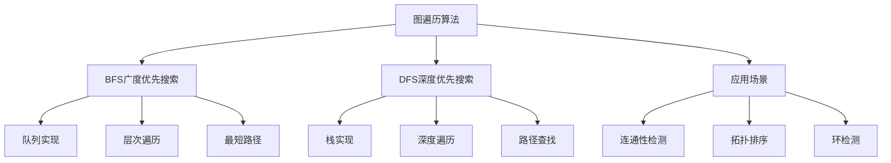

# BFS与DFS详解

## 📖 核心概念

**BFS（广度优先搜索）**和**DFS（深度优先搜索）**是图遍历的两种基本算法。BFS按层次遍历，DFS按深度遍历，它们在解决不同问题时各有优势。

### 🏗️ BFS与DFS特征



## 🔧 BFS与DFS实现

### BFS实现

```cpp
class BFS {
private:
    vector<vector<int>> graph;
    vector<bool> visited;
    vector<int> distance;
    vector<int> parent;
    int vertices;
    
public:
    BFS(int v) : vertices(v) {
        graph.resize(vertices);
        visited.resize(vertices, false);
        distance.resize(vertices, -1);
        parent.resize(vertices, -1);
    }
    
    void addEdge(int u, int v) {
        graph[u].push_back(v);
        graph[v].push_back(u); // 无向图
    }
    
    // BFS遍历
    void bfs(int start) {
        queue<int> q;
        q.push(start);
        visited[start] = true;
        distance[start] = 0;
        
        while (!q.empty()) {
            int vertex = q.front();
            q.pop();
            cout << vertex << " ";
            
            for (int neighbor : graph[vertex]) {
                if (!visited[neighbor]) {
                    visited[neighbor] = true;
                    distance[neighbor] = distance[vertex] + 1;
                    parent[neighbor] = vertex;
                    q.push(neighbor);
                }
            }
        }
    }
    
    // 最短路径（无权图）
    vector<int> shortestPath(int start, int end) {
        resetVisited();
        queue<int> q;
        q.push(start);
        visited[start] = true;
        distance[start] = 0;
        
        while (!q.empty()) {
            int vertex = q.front();
            q.pop();
            
            if (vertex == end) {
                break;
            }
            
            for (int neighbor : graph[vertex]) {
                if (!visited[neighbor]) {
                    visited[neighbor] = true;
                    distance[neighbor] = distance[vertex] + 1;
                    parent[neighbor] = vertex;
                    q.push(neighbor);
                }
            }
        }
        
        vector<int> path;
        if (visited[end]) {
            int current = end;
            while (current != -1) {
                path.push_back(current);
                current = parent[current];
            }
            reverse(path.begin(), path.end());
        }
        
        return path;
    }
    
    // 层次遍历
    void levelOrderTraversal(int start) {
        resetVisited();
        queue<int> q;
        q.push(start);
        visited[start] = true;
        distance[start] = 0;
        
        int currentLevel = 0;
        cout << "Level " << currentLevel << ": ";
        
        while (!q.empty()) {
            int vertex = q.front();
            q.pop();
            
            if (distance[vertex] > currentLevel) {
                currentLevel = distance[vertex];
                cout << endl << "Level " << currentLevel << ": ";
            }
            
            cout << vertex << " ";
            
            for (int neighbor : graph[vertex]) {
                if (!visited[neighbor]) {
                    visited[neighbor] = true;
                    distance[neighbor] = distance[vertex] + 1;
                    q.push(neighbor);
                }
            }
        }
        cout << endl;
    }
    
    // 检查连通性
    bool isConnected() {
        resetVisited();
        bfs(0);
        
        for (int i = 0; i < vertices; ++i) {
            if (!visited[i]) {
                return false;
            }
        }
        return true;
    }
    
    // 计算连通分量
    int countConnectedComponents() {
        resetVisited();
        int count = 0;
        
        for (int i = 0; i < vertices; ++i) {
            if (!visited[i]) {
                bfs(i);
                count++;
            }
        }
        
        return count;
    }
    
    void resetVisited() {
        fill(visited.begin(), visited.end(), false);
        fill(distance.begin(), distance.end(), -1);
        fill(parent.begin(), parent.end(), -1);
    }
    
    void displayBFS(int start) {
        cout << "BFS traversal starting from " << start << ": ";
        resetVisited();
        bfs(start);
        cout << endl;
    }
    
    void displayShortestPath(int start, int end) {
        vector<int> path = shortestPath(start, end);
        
        if (path.empty()) {
            cout << "No path from " << start << " to " << end << endl;
        } else {
            cout << "Shortest path from " << start << " to " << end << ": ";
            for (int i = 0; i < path.size(); ++i) {
                cout << path[i];
                if (i < path.size() - 1) cout << " -> ";
            }
            cout << " (Distance: " << path.size() - 1 << ")" << endl;
        }
    }
};
```

### DFS实现

```cpp
class DFS {
private:
    vector<vector<int>> graph;
    vector<bool> visited;
    vector<int> discoveryTime;
    vector<int> finishTime;
    vector<int> parent;
    int vertices;
    int time;
    
public:
    DFS(int v) : vertices(v), time(0) {
        graph.resize(vertices);
        visited.resize(vertices, false);
        discoveryTime.resize(vertices, 0);
        finishTime.resize(vertices, 0);
        parent.resize(vertices, -1);
    }
    
    void addEdge(int u, int v) {
        graph[u].push_back(v);
        graph[v].push_back(u); // 无向图
    }
    
    // DFS遍历（递归）
    void dfsRecursive(int vertex) {
        visited[vertex] = true;
        discoveryTime[vertex] = ++time;
        cout << vertex << " ";
        
        for (int neighbor : graph[vertex]) {
            if (!visited[neighbor]) {
                parent[neighbor] = vertex;
                dfsRecursive(neighbor);
            }
        }
        
        finishTime[vertex] = ++time;
    }
    
    // DFS遍历（迭代）
    void dfsIterative(int start) {
        stack<int> s;
        s.push(start);
        
        while (!s.empty()) {
            int vertex = s.top();
            s.pop();
            
            if (!visited[vertex]) {
                visited[vertex] = true;
                cout << vertex << " ";
                
                for (int neighbor : graph[vertex]) {
                    if (!visited[neighbor]) {
                        s.push(neighbor);
                    }
                }
            }
        }
    }
    
    // 路径查找
    bool findPath(int start, int end) {
        resetVisited();
        return findPathDFS(start, end);
    }
    
    bool findPathDFS(int current, int end) {
        if (current == end) {
            return true;
        }
        
        visited[current] = true;
        
        for (int neighbor : graph[current]) {
            if (!visited[neighbor]) {
                if (findPathDFS(neighbor, end)) {
                    return true;
                }
            }
        }
        
        return false;
    }
    
    // 获取路径
    vector<int> getPath(int start, int end) {
        resetVisited();
        vector<int> path;
        
        if (getPathDFS(start, end, path)) {
            return path;
        }
        
        return {};
    }
    
    bool getPathDFS(int current, int end, vector<int>& path) {
        path.push_back(current);
        
        if (current == end) {
            return true;
        }
        
        visited[current] = true;
        
        for (int neighbor : graph[current]) {
            if (!visited[neighbor]) {
                if (getPathDFS(neighbor, end, path)) {
                    return true;
                }
            }
        }
        
        path.pop_back();
        return false;
    }
    
    // 检测环
    bool hasCycle() {
        resetVisited();
        
        for (int i = 0; i < vertices; ++i) {
            if (!visited[i]) {
                if (hasCycleDFS(i, -1)) {
                    return true;
                }
            }
        }
        
        return false;
    }
    
    bool hasCycleDFS(int vertex, int parent) {
        visited[vertex] = true;
        
        for (int neighbor : graph[vertex]) {
            if (!visited[neighbor]) {
                if (hasCycleDFS(neighbor, vertex)) {
                    return true;
                }
            } else if (neighbor != parent) {
                return true;
            }
        }
        
        return false;
    }
    
    // 拓扑排序
    vector<int> topologicalSort() {
        resetVisited();
        vector<int> result;
        
        for (int i = 0; i < vertices; ++i) {
            if (!visited[i]) {
                topologicalDFS(i, result);
            }
        }
        
        reverse(result.begin(), result.end());
        return result;
    }
    
    void topologicalDFS(int vertex, vector<int>& result) {
        visited[vertex] = true;
        
        for (int neighbor : graph[vertex]) {
            if (!visited[neighbor]) {
                topologicalDFS(neighbor, result);
            }
        }
        
        result.push_back(vertex);
    }
    
    void resetVisited() {
        fill(visited.begin(), visited.end(), false);
        fill(discoveryTime.begin(), discoveryTime.end(), 0);
        fill(finishTime.begin(), finishTime.end(), 0);
        fill(parent.begin(), parent.end(), -1);
        time = 0;
    }
    
    void displayDFS(int start) {
        cout << "DFS traversal starting from " << start << ": ";
        resetVisited();
        dfsRecursive(start);
        cout << endl;
    }
    
    void displayPath(int start, int end) {
        vector<int> path = getPath(start, end);
        
        if (path.empty()) {
            cout << "No path from " << start << " to " << end << endl;
        } else {
            cout << "Path from " << start << " to " << end << ": ";
            for (int i = 0; i < path.size(); ++i) {
                cout << path[i];
                if (i < path.size() - 1) cout << " -> ";
            }
            cout << endl;
        }
    }
    
    void displayTimestamps() {
        cout << "DFS Timestamps:" << endl;
        cout << "==============" << endl;
        
        for (int i = 0; i < vertices; ++i) {
            cout << "Vertex " << i << ": Discovery=" << discoveryTime[i] 
                 << ", Finish=" << finishTime[i] << endl;
        }
    }
};
```

### 有向图的BFS和DFS

```cpp
class DirectedGraphTraversal {
private:
    vector<vector<int>> graph;
    vector<bool> visited;
    vector<bool> recStack;
    vector<int> inDegree;
    int vertices;
    
public:
    DirectedGraphTraversal(int v) : vertices(v) {
        graph.resize(vertices);
        visited.resize(vertices, false);
        recStack.resize(vertices, false);
        inDegree.resize(vertices, 0);
    }
    
    void addEdge(int u, int v) {
        graph[u].push_back(v);
        inDegree[v]++;
    }
    
    // 有向图的BFS
    void bfsDirected(int start) {
        queue<int> q;
        q.push(start);
        visited[start] = true;
        
        while (!q.empty()) {
            int vertex = q.front();
            q.pop();
            cout << vertex << " ";
            
            for (int neighbor : graph[vertex]) {
                if (!visited[neighbor]) {
                    visited[neighbor] = true;
                    q.push(neighbor);
                }
            }
        }
    }
    
    // 有向图的DFS
    void dfsDirected(int vertex) {
        visited[vertex] = true;
        cout << vertex << " ";
        
        for (int neighbor : graph[vertex]) {
            if (!visited[neighbor]) {
                dfsDirected(neighbor);
            }
        }
    }
    
    // 检测有向图中的环
    bool hasCycleDirected() {
        resetVisited();
        
        for (int i = 0; i < vertices; ++i) {
            if (!visited[i]) {
                if (hasCycleDirectedDFS(i)) {
                    return true;
                }
            }
        }
        
        return false;
    }
    
    bool hasCycleDirectedDFS(int vertex) {
        visited[vertex] = true;
        recStack[vertex] = true;
        
        for (int neighbor : graph[vertex]) {
            if (!visited[neighbor]) {
                if (hasCycleDirectedDFS(neighbor)) {
                    return true;
                }
            } else if (recStack[neighbor]) {
                return true;
            }
        }
        
        recStack[vertex] = false;
        return false;
    }
    
    // 拓扑排序（Kahn算法）
    vector<int> topologicalSortKahn() {
        vector<int> result;
        queue<int> q;
        
        // 找到所有入度为0的顶点
        for (int i = 0; i < vertices; ++i) {
            if (inDegree[i] == 0) {
                q.push(i);
            }
        }
        
        while (!q.empty()) {
            int vertex = q.front();
            q.pop();
            result.push_back(vertex);
            
            for (int neighbor : graph[vertex]) {
                inDegree[neighbor]--;
                if (inDegree[neighbor] == 0) {
                    q.push(neighbor);
                }
            }
        }
        
        return result;
    }
    
    // 强连通分量
    vector<vector<int>> stronglyConnectedComponents() {
        // 第一步：计算完成时间
        resetVisited();
        vector<int> finishTime(vertices, 0);
        int time = 0;
        
        for (int i = 0; i < vertices; ++i) {
            if (!visited[i]) {
                dfsFinishTime(i, finishTime, time);
            }
        }
        
        // 第二步：反转图
        vector<vector<int>> reversedGraph(vertices);
        for (int i = 0; i < vertices; ++i) {
            for (int neighbor : graph[i]) {
                reversedGraph[neighbor].push_back(i);
            }
        }
        
        // 第三步：按完成时间降序DFS
        resetVisited();
        vector<vector<int>> scc;
        
        vector<pair<int, int>> finishTimes;
        for (int i = 0; i < vertices; ++i) {
            finishTimes.push_back({finishTime[i], i});
        }
        sort(finishTimes.rbegin(), finishTimes.rend());
        
        for (auto& pair : finishTimes) {
            int vertex = pair.second;
            if (!visited[vertex]) {
                vector<int> component;
                dfsSCC(vertex, reversedGraph, component);
                scc.push_back(component);
            }
        }
        
        return scc;
    }
    
    void dfsFinishTime(int vertex, vector<int>& finishTime, int& time) {
        visited[vertex] = true;
        
        for (int neighbor : graph[vertex]) {
            if (!visited[neighbor]) {
                dfsFinishTime(neighbor, finishTime, time);
            }
        }
        
        finishTime[vertex] = ++time;
    }
    
    void dfsSCC(int vertex, vector<vector<int>>& reversedGraph, vector<int>& component) {
        visited[vertex] = true;
        component.push_back(vertex);
        
        for (int neighbor : reversedGraph[vertex]) {
            if (!visited[neighbor]) {
                dfsSCC(neighbor, reversedGraph, component);
            }
        }
    }
    
    void resetVisited() {
        fill(visited.begin(), visited.end(), false);
        fill(recStack.begin(), recStack.end(), false);
    }
    
    void displayTopologicalSort() {
        vector<int> result = topologicalSortKahn();
        
        if (result.size() != vertices) {
            cout << "Graph has cycle, cannot perform topological sort" << endl;
        } else {
            cout << "Topological sort: ";
            for (int vertex : result) {
                cout << vertex << " ";
            }
            cout << endl;
        }
    }
    
    void displaySCC() {
        vector<vector<int>> scc = stronglyConnectedComponents();
        cout << "Strongly Connected Components:" << endl;
        for (int i = 0; i < scc.size(); ++i) {
            cout << "Component " << i << ": ";
            for (int vertex : scc[i]) {
                cout << vertex << " ";
            }
            cout << endl;
        }
    }
};
```

## 🎯 BFS与DFS应用

### 图算法应用

```cpp
class GraphAlgorithmApplications {
private:
    BFS bfs;
    DFS dfs;
    
public:
    GraphAlgorithmApplications(int v) : bfs(v), dfs(v) {}
    
    void addEdge(int u, int v) {
        bfs.addEdge(u, v);
        dfs.addEdge(u, v);
    }
    
    // 最短路径应用
    void shortestPathApplication(int start, int end) {
        cout << "Shortest Path Application:" << endl;
        cout << "========================" << endl;
        
        bfs.displayShortestPath(start, end);
    }
    
    // 路径查找应用
    void pathFindingApplication(int start, int end) {
        cout << "Path Finding Application:" << endl;
        cout << "=======================" << endl;
        
        dfs.displayPath(start, end);
    }
    
    // 连通性检测应用
    void connectivityApplication() {
        cout << "Connectivity Application:" << endl;
        cout << "=======================" << endl;
        
        cout << "Is connected: " << (bfs.isConnected() ? "Yes" : "No") << endl;
        cout << "Number of connected components: " << bfs.countConnectedComponents() << endl;
    }
    
    // 环检测应用
    void cycleDetectionApplication() {
        cout << "Cycle Detection Application:" << endl;
        cout << "==========================" << endl;
        
        cout << "Has cycle: " << (dfs.hasCycle() ? "Yes" : "No") << endl;
    }
    
    // 拓扑排序应用
    void topologicalSortApplication() {
        cout << "Topological Sort Application:" << endl;
        cout << "============================" << endl;
        
        vector<int> result = dfs.topologicalSort();
        cout << "Topological sort: ";
        for (int vertex : result) {
            cout << vertex << " ";
        }
        cout << endl;
    }
};
```

### 实际应用场景

```cpp
class RealWorldApplications {
public:
    // 社交网络分析
    void socialNetworkAnalysis() {
        cout << "Social Network Analysis:" << endl;
        cout << "======================" << endl;
        
        BFS socialNetwork(6);
        socialNetwork.addEdge(0, 1);
        socialNetwork.addEdge(0, 2);
        socialNetwork.addEdge(1, 3);
        socialNetwork.addEdge(2, 4);
        socialNetwork.addEdge(3, 5);
        
        cout << "Friend connections:" << endl;
        socialNetwork.displayBFS(0);
        
        cout << "Shortest path between users:" << endl;
        socialNetwork.displayShortestPath(0, 5);
    }
    
    // 网络爬虫
    void webCrawler() {
        cout << "Web Crawler:" << endl;
        cout << "===========" << endl;
        
        DFS crawler(6);
        crawler.addEdge(0, 1);
        crawler.addEdge(0, 2);
        crawler.addEdge(1, 3);
        crawler.addEdge(2, 4);
        crawler.addEdge(3, 5);
        
        cout << "Crawling order:" << endl;
        crawler.displayDFS(0);
    }
    
    // 任务调度
    void taskScheduling() {
        cout << "Task Scheduling:" << endl;
        cout << "===============" << endl;
        
        DirectedGraphTraversal scheduler(6);
        scheduler.addEdge(0, 1);
        scheduler.addEdge(0, 2);
        scheduler.addEdge(1, 3);
        scheduler.addEdge(2, 4);
        scheduler.addEdge(3, 5);
        scheduler.addEdge(4, 5);
        
        cout << "Task dependencies:" << endl;
        scheduler.displayTopologicalSort();
    }
    
    // 编译器优化
    void compilerOptimization() {
        cout << "Compiler Optimization:" << endl;
        cout << "====================" << endl;
        
        DirectedGraphTraversal compiler(6);
        compiler.addEdge(0, 1);
        compiler.addEdge(0, 2);
        compiler.addEdge(1, 3);
        compiler.addEdge(2, 4);
        compiler.addEdge(3, 5);
        compiler.addEdge(4, 5);
        
        cout << "Dependency analysis:" << endl;
        compiler.displaySCC();
    }
};
```

## 📊 BFS与DFS分析

### 性能分析

```cpp
class BFSDFSAnalysis {
public:
    static void analyzePerformance() {
        cout << "BFS and DFS Performance Analysis:" << endl;
        cout << "=================================" << endl;
        
        cout << "1. Time Complexity:" << endl;
        cout << "   - BFS: O(V + E)" << endl;
        cout << "   - DFS: O(V + E)" << endl;
        cout << "   - Both visit each vertex and edge once" << endl;
        
        cout << "2. Space Complexity:" << endl;
        cout << "   - BFS: O(V) for queue" << endl;
        cout << "   - DFS: O(V) for recursion stack" << endl;
        cout << "   - Both use O(V) extra space" << endl;
        
        cout << "3. Memory Usage:" << endl;
        cout << "   - BFS: Queue size depends on graph width" << endl;
        cout << "   - DFS: Stack depth depends on graph depth" << endl;
        cout << "   - BFS uses more memory for wide graphs" << endl;
        cout << "   - DFS uses more memory for deep graphs" << endl;
    }
    
    static void analyzeApplications() {
        cout << "BFS and DFS Application Analysis:" << endl;
        cout << "===============================" << endl;
        
        cout << "1. BFS Applications:" << endl;
        cout << "   - Shortest path in unweighted graphs" << endl;
        cout << "   - Level order traversal" << endl;
        cout << "   - Social network analysis" << endl;
        cout << "   - Web crawling" << endl;
        
        cout << "2. DFS Applications:" << endl;
        cout << "   - Path finding" << endl;
        cout << "   - Cycle detection" << endl;
        cout << "   - Topological sorting" << endl;
        cout << "   - Strongly connected components" << endl;
        
        cout << "3. When to Use BFS:" << endl;
        cout << "   - Need shortest path" << endl;
        cout << "   - Graph is not too deep" << endl;
        cout << "   - Need level-by-level processing" << endl;
        
        cout << "4. When to Use DFS:" << endl;
        cout << "   - Need to explore all paths" << endl;
        cout << "   - Graph is not too wide" << endl;
        cout << "   - Need to detect cycles" << endl;
    }
    
    static void compareAlgorithms() {
        cout << "BFS vs DFS Comparison:" << endl;
        cout << "=====================" << endl;
        
        cout << "1. Traversal Order:" << endl;
        cout << "   - BFS: Level by level" << endl;
        cout << "   - DFS: Depth first" << endl;
        
        cout << "2. Memory Usage:" << endl;
        cout << "   - BFS: O(b^d) where b is branching factor, d is depth" << endl;
        cout << "   - DFS: O(bd) where b is branching factor, d is depth" << endl;
        
        cout << "3. Completeness:" << endl;
        cout << "   - BFS: Complete (finds solution if exists)" << endl;
        cout << "   - DFS: Not complete (may get stuck in infinite path)" << endl;
        
        cout << "4. Optimality:" << endl;
        cout << "   - BFS: Optimal (finds shortest path)" << endl;
        cout << "   - DFS: Not optimal (may find longer path)" << endl;
    }
};
```

## 🎮 BFS与DFS测试

### 1. 基础功能测试

```cpp
class BFSDFSTest {
public:
    static void testBFS() {
        cout << "Testing BFS:" << endl;
        cout << "===========" << endl;
        
        BFS bfs(6);
        bfs.addEdge(0, 1);
        bfs.addEdge(0, 2);
        bfs.addEdge(1, 3);
        bfs.addEdge(2, 4);
        bfs.addEdge(3, 5);
        
        bfs.displayBFS(0);
        bfs.displayShortestPath(0, 5);
        bfs.levelOrderTraversal(0);
    }
    
    static void testDFS() {
        cout << "Testing DFS:" << endl;
        cout << "===========" << endl;
        
        DFS dfs(6);
        dfs.addEdge(0, 1);
        dfs.addEdge(0, 2);
        dfs.addEdge(1, 3);
        dfs.addEdge(2, 4);
        dfs.addEdge(3, 5);
        
        dfs.displayDFS(0);
        dfs.displayPath(0, 5);
        dfs.displayTimestamps();
    }
    
    static void testDirectedGraph() {
        cout << "Testing Directed Graph:" << endl;
        cout << "=====================" << endl;
        
        DirectedGraphTraversal dgt(6);
        dgt.addEdge(0, 1);
        dgt.addEdge(0, 2);
        dgt.addEdge(1, 3);
        dgt.addEdge(2, 4);
        dgt.addEdge(3, 5);
        dgt.addEdge(4, 5);
        
        cout << "Has cycle: " << (dgt.hasCycleDirected() ? "Yes" : "No") << endl;
        dgt.displayTopologicalSort();
        dgt.displaySCC();
    }
    
    static void testApplications() {
        cout << "Testing Applications:" << endl;
        cout << "===================" << endl;
        
        GraphAlgorithmApplications app(6);
        app.addEdge(0, 1);
        app.addEdge(0, 2);
        app.addEdge(1, 3);
        app.addEdge(2, 4);
        app.addEdge(3, 5);
        
        app.shortestPathApplication(0, 5);
        app.pathFindingApplication(0, 5);
        app.connectivityApplication();
        app.cycleDetectionApplication();
    }
    
    static void testRealWorld() {
        cout << "Testing Real-World Applications:" << endl;
        cout << "==============================" << endl;
        
        RealWorldApplications realWorld;
        realWorld.socialNetworkAnalysis();
        realWorld.webCrawler();
        realWorld.taskScheduling();
        realWorld.compilerOptimization();
    }
    
    static void testAnalysis() {
        cout << "Testing Analysis:" << endl;
        cout << "===============" << endl;
        
        BFSDFSAnalysis::analyzePerformance();
        BFSDFSAnalysis::analyzeApplications();
        BFSDFSAnalysis::compareAlgorithms();
    }
};
```

## 🔗 相关链接

- [[01-图的基本概念|图的基本概念]]
- [[02-图的存储结构|图的存储结构]]
- [[03-图的遍历算法|图的遍历算法]]

## 💡 BFS与DFS要点

1. **BFS**: 广度优先，使用队列，适合最短路径
2. **DFS**: 深度优先，使用栈，适合路径查找
3. **时间复杂度**: 都是O(V + E)
4. **空间复杂度**: 都是O(V)

---

*📝 BFS与DFS提示：BFS和DFS是图遍历的基础算法，掌握它们有助于理解更复杂的图算法*
