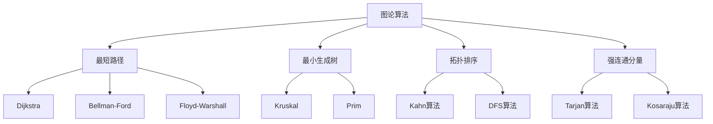

# 图论算法

## 📖 核心概念

**图论算法**是处理图结构数据的重要算法集合，包括最短路径、最小生成树、拓扑排序、强连通分量等经典算法。

### 🏗️ 算法分类



## 🔧 最短路径算法

### Dijkstra算法

```cpp
class DijkstraAlgorithm {
public:
    static vector<int> shortestPath(vector<vector<pair<int, int>>>& graph, int start) {
        int n = graph.size();
        vector<int> distance(n, INT_MAX);
        vector<bool> visited(n, false);
        priority_queue<pair<int, int>, vector<pair<int, int>>, greater<pair<int, int>>> pq;
        
        distance[start] = 0;
        pq.push({0, start});
        
        while (!pq.empty()) {
            int u = pq.top().second;
            pq.pop();
            
            if (visited[u]) continue;
            visited[u] = true;
            
            for (const auto& edge : graph[u]) {
                int v = edge.first;
                int weight = edge.second;
                
                if (!visited[v] && distance[u] + weight < distance[v]) {
                    distance[v] = distance[u] + weight;
                    pq.push({distance[v], v});
                }
            }
        }
        
        return distance;
    }
    
    static vector<int> shortestPathWithPath(vector<vector<pair<int, int>>>& graph, int start, int end) {
        int n = graph.size();
        vector<int> distance(n, INT_MAX);
        vector<int> parent(n, -1);
        vector<bool> visited(n, false);
        priority_queue<pair<int, int>, vector<pair<int, int>>, greater<pair<int, int>>> pq;
        
        distance[start] = 0;
        pq.push({0, start});
        
        while (!pq.empty()) {
            int u = pq.top().second;
            pq.pop();
            
            if (visited[u]) continue;
            visited[u] = true;
            
            if (u == end) break;
            
            for (const auto& edge : graph[u]) {
                int v = edge.first;
                int weight = edge.second;
                
                if (!visited[v] && distance[u] + weight < distance[v]) {
                    distance[v] = distance[u] + weight;
                    parent[v] = u;
                    pq.push({distance[v], v});
                }
            }
        }
        
        // 重构路径
        vector<int> path;
        if (distance[end] != INT_MAX) {
            int current = end;
            while (current != -1) {
                path.push_back(current);
                current = parent[current];
            }
            reverse(path.begin(), path.end());
        }
        
        return path;
    }
};
```

### Bellman-Ford算法

```cpp
class BellmanFordAlgorithm {
public:
    static vector<int> shortestPath(vector<vector<pair<int, int>>>& graph, int start) {
        int n = graph.size();
        vector<int> distance(n, INT_MAX);
        distance[start] = 0;
        
        // 松弛操作
        for (int i = 0; i < n - 1; ++i) {
            for (int u = 0; u < n; ++u) {
                if (distance[u] != INT_MAX) {
                    for (const auto& edge : graph[u]) {
                        int v = edge.first;
                        int weight = edge.second;
                        
                        if (distance[u] + weight < distance[v]) {
                            distance[v] = distance[u] + weight;
                        }
                    }
                }
            }
        }
        
        // 检测负权环
        for (int u = 0; u < n; ++u) {
            if (distance[u] != INT_MAX) {
                for (const auto& edge : graph[u]) {
                    int v = edge.first;
                    int weight = edge.second;
                    
                    if (distance[u] + weight < distance[v]) {
                        // 存在负权环
                        return vector<int>();
                    }
                }
            }
        }
        
        return distance;
    }
    
    static bool hasNegativeCycle(vector<vector<pair<int, int>>>& graph) {
        int n = graph.size();
        vector<int> distance(n, 0);
        
        // 松弛操作
        for (int i = 0; i < n; ++i) {
            for (int u = 0; u < n; ++u) {
                for (const auto& edge : graph[u]) {
                    int v = edge.first;
                    int weight = edge.second;
                    
                    if (distance[u] + weight < distance[v]) {
                        distance[v] = distance[u] + weight;
                        
                        if (i == n - 1) {
                            return true;  // 存在负权环
                        }
                    }
                }
            }
        }
        
        return false;
    }
};
```

### Floyd-Warshall算法

```cpp
class FloydWarshallAlgorithm {
public:
    static vector<vector<int>> allPairsShortestPath(vector<vector<int>>& graph) {
        int n = graph.size();
        vector<vector<int>> dist = graph;
        
        // 初始化距离矩阵
        for (int i = 0; i < n; ++i) {
            for (int j = 0; j < n; ++j) {
                if (i == j) {
                    dist[i][j] = 0;
                } else if (graph[i][j] == 0) {
                    dist[i][j] = INT_MAX;
                }
            }
        }
        
        // Floyd-Warshall算法
        for (int k = 0; k < n; ++k) {
            for (int i = 0; i < n; ++i) {
                for (int j = 0; j < n; ++j) {
                    if (dist[i][k] != INT_MAX && dist[k][j] != INT_MAX) {
                        dist[i][j] = min(dist[i][j], dist[i][k] + dist[k][j]);
                    }
                }
            }
        }
        
        return dist;
    }
    
    static vector<vector<int>> reconstructPath(vector<vector<int>>& graph) {
        int n = graph.size();
        vector<vector<int>> dist = graph;
        vector<vector<int>> next(n, vector<int>(n, -1));
        
        // 初始化
        for (int i = 0; i < n; ++i) {
            for (int j = 0; j < n; ++j) {
                if (i == j) {
                    dist[i][j] = 0;
                } else if (graph[i][j] == 0) {
                    dist[i][j] = INT_MAX;
                } else {
                    next[i][j] = j;
                }
            }
        }
        
        // Floyd-Warshall算法
        for (int k = 0; k < n; ++k) {
            for (int i = 0; i < n; ++i) {
                for (int j = 0; j < n; ++j) {
                    if (dist[i][k] != INT_MAX && dist[k][j] != INT_MAX) {
                        if (dist[i][k] + dist[k][j] < dist[i][j]) {
                            dist[i][j] = dist[i][k] + dist[k][j];
                            next[i][j] = next[i][k];
                        }
                    }
                }
            }
        }
        
        return next;
    }
};
```

## 🎯 最小生成树算法

### Kruskal算法

```cpp
class KruskalAlgorithm {
public:
    static vector<pair<int, int>> minimumSpanningTree(vector<vector<pair<int, int>>>& graph) {
        vector<pair<int, pair<int, int>>> edges;
        int n = graph.size();
        
        // 收集所有边
        for (int u = 0; u < n; ++u) {
            for (const auto& edge : graph[u]) {
                int v = edge.first;
                int weight = edge.second;
                if (u < v) {  // 避免重复
                    edges.push_back({weight, {u, v}});
                }
            }
        }
        
        // 按权重排序
        sort(edges.begin(), edges.end());
        
        // Union-Find
        vector<int> parent(n);
        iota(parent.begin(), parent.end(), 0);
        
        vector<pair<int, int>> mst;
        
        for (const auto& edge : edges) {
            int weight = edge.first;
            int u = edge.second.first;
            int v = edge.second.second;
            
            int rootU = findRoot(parent, u);
            int rootV = findRoot(parent, v);
            
            if (rootU != rootV) {
                mst.push_back({u, v});
                parent[rootU] = rootV;
            }
        }
        
        return mst;
    }
    
private:
    static int findRoot(vector<int>& parent, int x) {
        if (parent[x] != x) {
            parent[x] = findRoot(parent, parent[x]);
        }
        return parent[x];
    }
};
```

### Prim算法

```cpp
class PrimAlgorithm {
public:
    static vector<pair<int, int>> minimumSpanningTree(vector<vector<pair<int, int>>>& graph) {
        int n = graph.size();
        vector<bool> inMST(n, false);
        vector<int> key(n, INT_MAX);
        vector<int> parent(n, -1);
        priority_queue<pair<int, int>, vector<pair<int, int>>, greater<pair<int, int>>> pq;
        
        key[0] = 0;
        pq.push({0, 0});
        
        while (!pq.empty()) {
            int u = pq.top().second;
            pq.pop();
            
            if (inMST[u]) continue;
            inMST[u] = true;
            
            for (const auto& edge : graph[u]) {
                int v = edge.first;
                int weight = edge.second;
                
                if (!inMST[v] && weight < key[v]) {
                    key[v] = weight;
                    parent[v] = u;
                    pq.push({key[v], v});
                }
            }
        }
        
        vector<pair<int, int>> mst;
        for (int i = 1; i < n; ++i) {
            if (parent[i] != -1) {
                mst.push_back({parent[i], i});
            }
        }
        
        return mst;
    }
};
```

## 📊 拓扑排序

### Kahn算法

```cpp
class TopologicalSort {
public:
    static vector<int> kahnAlgorithm(vector<vector<int>>& graph) {
        int n = graph.size();
        vector<int> inDegree(n, 0);
        queue<int> q;
        vector<int> result;
        
        // 计算入度
        for (int u = 0; u < n; ++u) {
            for (int v : graph[u]) {
                inDegree[v]++;
            }
        }
        
        // 找到入度为0的顶点
        for (int i = 0; i < n; ++i) {
            if (inDegree[i] == 0) {
                q.push(i);
            }
        }
        
        // 拓扑排序
        while (!q.empty()) {
            int u = q.front();
            q.pop();
            result.push_back(u);
            
            for (int v : graph[u]) {
                inDegree[v]--;
                if (inDegree[v] == 0) {
                    q.push(v);
                }
            }
        }
        
        return result;
    }
    
    static vector<int> dfsAlgorithm(vector<vector<int>>& graph) {
        int n = graph.size();
        vector<int> result;
        vector<bool> visited(n, false);
        vector<bool> recStack(n, false);
        
        for (int i = 0; i < n; ++i) {
            if (!visited[i]) {
                if (!dfsHelper(graph, i, visited, recStack, result)) {
                    return vector<int>();  // 存在环
                }
            }
        }
        
        reverse(result.begin(), result.end());
        return result;
    }
    
private:
    static bool dfsHelper(vector<vector<int>>& graph, int u, vector<bool>& visited, 
                         vector<bool>& recStack, vector<int>& result) {
        visited[u] = true;
        recStack[u] = true;
        
        for (int v : graph[u]) {
            if (!visited[v]) {
                if (!dfsHelper(graph, v, visited, recStack, result)) {
                    return false;
                }
            } else if (recStack[v]) {
                return false;  // 存在环
            }
        }
        
        recStack[u] = false;
        result.push_back(u);
        return true;
    }
};
```

## 🎮 强连通分量

### Tarjan算法

```cpp
class TarjanAlgorithm {
public:
    static vector<vector<int>> findStronglyConnectedComponents(vector<vector<int>>& graph) {
        int n = graph.size();
        vector<int> ids(n, -1);
        vector<int> low(n, -1);
        vector<bool> onStack(n, false);
        stack<int> stk;
        vector<vector<int>> sccs;
        int id = 0;
        
        for (int i = 0; i < n; ++i) {
            if (ids[i] == -1) {
                tarjanDFS(graph, i, ids, low, onStack, stk, sccs, id);
            }
        }
        
        return sccs;
    }
    
private:
    static void tarjanDFS(vector<vector<int>>& graph, int u, vector<int>& ids, 
                         vector<int>& low, vector<bool>& onStack, stack<int>& stk,
                         vector<vector<int>>& sccs, int& id) {
        ids[u] = low[u] = id++;
        stk.push(u);
        onStack[u] = true;
        
        for (int v : graph[u]) {
            if (ids[v] == -1) {
                tarjanDFS(graph, v, ids, low, onStack, stk, sccs, id);
            }
            
            if (onStack[v]) {
                low[u] = min(low[u], low[v]);
            }
        }
        
        if (ids[u] == low[u]) {
            vector<int> scc;
            while (true) {
                int v = stk.top();
                stk.pop();
                onStack[v] = false;
                scc.push_back(v);
                
                if (v == u) break;
            }
            sccs.push_back(scc);
        }
    }
};
```

### Kosaraju算法

```cpp
class KosarajuAlgorithm {
public:
    static vector<vector<int>> findStronglyConnectedComponents(vector<vector<int>>& graph) {
        int n = graph.size();
        vector<bool> visited(n, false);
        stack<int> stk;
        
        // 第一次DFS，记录完成时间
        for (int i = 0; i < n; ++i) {
            if (!visited[i]) {
                dfs1(graph, i, visited, stk);
            }
        }
        
        // 构建反向图
        vector<vector<int>> reverseGraph(n);
        for (int u = 0; u < n; ++u) {
            for (int v : graph[u]) {
                reverseGraph[v].push_back(u);
            }
        }
        
        // 第二次DFS，按完成时间逆序
        visited.assign(n, false);
        vector<vector<int>> sccs;
        
        while (!stk.empty()) {
            int u = stk.top();
            stk.pop();
            
            if (!visited[u]) {
                vector<int> scc;
                dfs2(reverseGraph, u, visited, scc);
                sccs.push_back(scc);
            }
        }
        
        return sccs;
    }
    
private:
    static void dfs1(vector<vector<int>>& graph, int u, vector<bool>& visited, stack<int>& stk) {
        visited[u] = true;
        
        for (int v : graph[u]) {
            if (!visited[v]) {
                dfs1(graph, v, visited, stk);
            }
        }
        
        stk.push(u);
    }
    
    static void dfs2(vector<vector<int>>& graph, int u, vector<bool>& visited, vector<int>& scc) {
        visited[u] = true;
        scc.push_back(u);
        
        for (int v : graph[u]) {
            if (!visited[v]) {
                dfs2(graph, v, visited, scc);
            }
        }
    }
};
```

## 🔗 相关链接

- [[01-搜索技术|搜索技术]]
- [[02-排序艺术|排序艺术]]
- [[04-动态规划|动态规划]]

## 💡 图论算法要点

1. **最短路径**：Dijkstra、Bellman-Ford、Floyd-Warshall
2. **最小生成树**：Kruskal、Prim算法
3. **拓扑排序**：Kahn、DFS算法
4. **强连通分量**：Tarjan、Kosaraju算法

---

*📝 算法提示：图论算法是解决复杂网络问题的重要工具*
