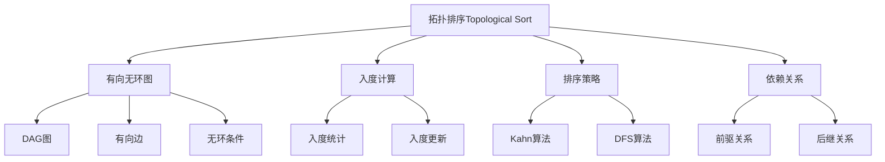

# 拓扑排序算法

## 📖 核心概念

**拓扑排序（Topological Sort）**是对有向无环图（DAG）的顶点进行线性排序的算法，使得对于图中的每一条有向边(u,v)，u在排序中都出现在v之前。拓扑排序常用于任务调度、依赖关系分析等场景。

### 🏗️ 拓扑排序的组成要素



## 🔍 拓扑排序分类

### 按算法策略分类

| 算法 | 策略 | 时间复杂度 | 空间复杂度 | 特点 |
|------|------|------------|------------|------|
| **Kahn算法** | 基于入度 | O(V + E) | O(V) | 直观易懂 |
| **DFS算法** | 深度优先 | O(V + E) | O(V) | 递归实现 |
| **BFS算法** | 广度优先 | O(V + E) | O(V) | 层次遍历 |

### 按应用场景分类

| 场景 | 特点 | 应用 |
|------|------|------|
| **任务调度** | 依赖关系 | 项目管理 |
| **编译顺序** | 模块依赖 | 编译器 |
| **课程安排** | 先修关系 | 教育系统 |
| **包管理** | 依赖解析 | 软件包管理 |

## 💻 Kahn算法实现

### 基础Kahn算法

```cpp
template<typename T>
class TopologicalSortKahn {
private:
    const AdjacencyList<T>& graph;
    vector<int> inDegree;
    vector<int> result;
    
public:
    TopologicalSortKahn(const AdjacencyList<T>& g) : graph(g) {
        inDegree.resize(graph.getVertexCount(), 0);
    }
    
    // Kahn算法实现
    vector<int> topologicalSort() {
        // 计算所有顶点的入度
        calculateInDegree();
        
        // 找到所有入度为0的顶点
        queue<int> zeroInDegreeQueue;
        for (int i = 0; i < graph.getVertexCount(); i++) {
            if (inDegree[i] == 0) {
                zeroInDegreeQueue.push(i);
            }
        }
        
        // 处理队列中的顶点
        while (!zeroInDegreeQueue.empty()) {
            int current = zeroInDegreeQueue.front();
            zeroInDegreeQueue.pop();
            result.push_back(current);
            
            // 更新邻接顶点的入度
            for (const auto& edge : graph.getNeighbors(current)) {
                inDegree[edge.to]--;
                if (inDegree[edge.to] == 0) {
                    zeroInDegreeQueue.push(edge.to);
                }
            }
        }
        
        // 检查是否存在环
        if (result.size() != graph.getVertexCount()) {
            return vector<int>(); // 存在环，无法拓扑排序
        }
        
        return result;
    }
    
    // 检查图是否为DAG
    bool isDAG() {
        vector<int> sortResult = topologicalSort();
        return !sortResult.empty();
    }
    
    // 获取拓扑排序结果
    const vector<int>& getResult() const {
        return result;
    }
    
private:
    void calculateInDegree() {
        fill(inDegree.begin(), inDegree.end(), 0);
        
        for (int i = 0; i < graph.getVertexCount(); i++) {
            for (const auto& edge : graph.getNeighbors(i)) {
                inDegree[edge.to]++;
            }
        }
    }
};
```

### 优化版Kahn算法

```cpp
template<typename T>
class OptimizedTopologicalSort {
private:
    const AdjacencyList<T>& graph;
    vector<int> inDegree;
    vector<int> result;
    
public:
    OptimizedTopologicalSort(const AdjacencyList<T>& g) : graph(g) {
        inDegree.resize(graph.getVertexCount(), 0);
    }
    
    // 优化的Kahn算法
    vector<int> topologicalSort() {
        calculateInDegree();
        
        // 使用优先队列保证字典序
        priority_queue<int, vector<int>, greater<int>> pq;
        
        for (int i = 0; i < graph.getVertexCount(); i++) {
            if (inDegree[i] == 0) {
                pq.push(i);
            }
        }
        
        while (!pq.empty()) {
            int current = pq.top();
            pq.pop();
            result.push_back(current);
            
            for (const auto& edge : graph.getNeighbors(current)) {
                inDegree[edge.to]--;
                if (inDegree[edge.to] == 0) {
                    pq.push(edge.to);
                }
            }
        }
        
        if (result.size() != graph.getVertexCount()) {
            return vector<int>();
        }
        
        return result;
    }
    
    // 获取所有可能的拓扑排序
    vector<vector<int>> getAllTopologicalSorts() {
        vector<vector<int>> allSorts;
        vector<int> currentSort;
        vector<bool> visited(graph.getVertexCount(), false);
        
        getAllSortsRecursive(currentSort, visited, allSorts);
        return allSorts;
    }
    
private:
    void calculateInDegree() {
        fill(inDegree.begin(), inDegree.end(), 0);
        
        for (int i = 0; i < graph.getVertexCount(); i++) {
            for (const auto& edge : graph.getNeighbors(i)) {
                inDegree[edge.to]++;
            }
        }
    }
    
    void getAllSortsRecursive(vector<int>& currentSort, vector<bool>& visited, 
                             vector<vector<int>>& allSorts) {
        if (currentSort.size() == graph.getVertexCount()) {
            allSorts.push_back(currentSort);
            return;
        }
        
        for (int i = 0; i < graph.getVertexCount(); i++) {
            if (!visited[i] && inDegree[i] == 0) {
                visited[i] = true;
                currentSort.push_back(i);
                
                // 更新入度
                for (const auto& edge : graph.getNeighbors(i)) {
                    inDegree[edge.to]--;
                }
                
                getAllSortsRecursive(currentSort, visited, allSorts);
                
                // 回溯
                for (const auto& edge : graph.getNeighbors(i)) {
                    inDegree[edge.to]++;
                }
                
                currentSort.pop_back();
                visited[i] = false;
            }
        }
    }
};
```

## 💻 DFS算法实现

### DFS拓扑排序

```cpp
template<typename T>
class TopologicalSortDFS {
private:
    const AdjacencyList<T>& graph;
    vector<int> result;
    vector<int> color; // 0: 白色, 1: 灰色, 2: 黑色
    
public:
    TopologicalSortDFS(const AdjacencyList<T>& g) : graph(g) {
        color.resize(graph.getVertexCount(), 0);
    }
    
    // DFS拓扑排序
    vector<int> topologicalSort() {
        fill(color.begin(), color.end(), 0);
        result.clear();
        
        for (int i = 0; i < graph.getVertexCount(); i++) {
            if (color[i] == 0) {
                if (!dfsVisit(i)) {
                    return vector<int>(); // 存在环
                }
            }
        }
        
        reverse(result.begin(), result.end());
        return result;
    }
    
    // 检查图是否为DAG
    bool isDAG() {
        vector<int> sortResult = topologicalSort();
        return !sortResult.empty();
    }
    
    // 获取拓扑排序结果
    const vector<int>& getResult() const {
        return result;
    }
    
private:
    bool dfsVisit(int vertex) {
        color[vertex] = 1; // 标记为灰色（正在访问）
        
        for (const auto& edge : graph.getNeighbors(vertex)) {
            if (color[edge.to] == 1) {
                return false; // 发现回边，存在环
            } else if (color[edge.to] == 0) {
                if (!dfsVisit(edge.to)) {
                    return false;
                }
            }
        }
        
        color[vertex] = 2; // 标记为黑色（访问完成）
        result.push_back(vertex);
        return true;
    }
};
```

### 迭代DFS拓扑排序

```cpp
template<typename T>
class IterativeTopologicalSort {
private:
    const AdjacencyList<T>& graph;
    vector<int> result;
    
public:
    IterativeTopologicalSort(const AdjacencyList<T>& g) : graph(g) {}
    
    // 迭代DFS拓扑排序
    vector<int> topologicalSort() {
        vector<int> color(graph.getVertexCount(), 0);
        stack<int> stk;
        
        for (int i = 0; i < graph.getVertexCount(); i++) {
            if (color[i] == 0) {
                if (!dfsIterative(i, color, stk)) {
                    return vector<int>(); // 存在环
                }
            }
        }
        
        // 从栈中取出结果
        while (!stk.empty()) {
            result.push_back(stk.top());
            stk.pop();
        }
        
        return result;
    }
    
private:
    bool dfsIterative(int start, vector<int>& color, stack<int>& stk) {
        stack<int> dfsStack;
        dfsStack.push(start);
        
        while (!dfsStack.empty()) {
            int current = dfsStack.top();
            
            if (color[current] == 0) {
                color[current] = 1; // 灰色
                
                // 将邻接顶点压入栈
                for (const auto& edge : graph.getNeighbors(current)) {
                    if (color[edge.to] == 1) {
                        return false; // 发现环
                    } else if (color[edge.to] == 0) {
                        dfsStack.push(edge.to);
                    }
                }
            } else if (color[current] == 1) {
                color[current] = 2; // 黑色
                stk.push(current);
                dfsStack.pop();
            } else {
                dfsStack.pop();
            }
        }
        
        return true;
    }
};
```

## 🎯 拓扑排序应用场景

### 1. 任务调度系统

```cpp
class TaskScheduler {
private:
    AdjacencyList<string> graph;
    map<string, int> taskToIndex;
    map<int, string> indexToTask;
    int taskCount;
    
public:
    TaskScheduler() : graph(1000, true), taskCount(0) {}
    
    // 添加任务
    void addTask(const string& taskName) {
        if (taskToIndex.find(taskName) == taskToIndex.end()) {
            taskToIndex[taskName] = taskCount;
            indexToTask[taskCount] = taskName;
            taskCount++;
        }
    }
    
    // 添加依赖关系
    void addDependency(const string& from, const string& to) {
        addTask(from);
        addTask(to);
        
        int fromIndex = taskToIndex[from];
        int toIndex = taskToIndex[to];
        
        graph.addEdge(fromIndex, toIndex);
    }
    
    // 获取任务执行顺序
    vector<string> getExecutionOrder() {
        TopologicalSortKahn<string> topoSort(graph);
        vector<int> sortResult = topoSort.topologicalSort();
        
        vector<string> executionOrder;
        for (int index : sortResult) {
            if (indexToTask.find(index) != indexToTask.end()) {
                executionOrder.push_back(indexToTask[index]);
            }
        }
        
        return executionOrder;
    }
    
    // 检查是否存在循环依赖
    bool hasCircularDependency() {
        TopologicalSortKahn<string> topoSort(graph);
        return !topoSort.isDAG();
    }
    
    // 获取所有可能的执行顺序
    vector<vector<string>> getAllExecutionOrders() {
        OptimizedTopologicalSort<string> topoSort(graph);
        vector<vector<int>> allSorts = topoSort.getAllTopologicalSorts();
        
        vector<vector<string>> allOrders;
        for (const auto& sort : allSorts) {
            vector<string> order;
            for (int index : sort) {
                if (indexToTask.find(index) != indexToTask.end()) {
                    order.push_back(indexToTask[index]);
                }
            }
            allOrders.push_back(order);
        }
        
        return allOrders;
    }
};
```

### 2. 课程安排系统

```cpp
class CourseScheduler {
private:
    AdjacencyList<string> graph;
    map<string, int> courseToIndex;
    map<int, string> indexToCourse;
    int courseCount;
    
public:
    CourseScheduler() : graph(1000, true), courseCount(0) {}
    
    // 添加课程
    void addCourse(const string& courseName) {
        if (courseToIndex.find(courseName) == courseToIndex.end()) {
            courseToIndex[courseName] = courseCount;
            indexToCourse[courseCount] = courseName;
            courseCount++;
        }
    }
    
    // 添加先修关系
    void addPrerequisite(const string& prerequisite, const string& course) {
        addCourse(prerequisite);
        addCourse(course);
        
        int prereqIndex = courseToIndex[prerequisite];
        int courseIndex = courseToIndex[course];
        
        graph.addEdge(prereqIndex, courseIndex);
    }
    
    // 获取课程学习顺序
    vector<string> getStudyOrder() {
        TopologicalSortDFS<string> topoSort(graph);
        vector<int> sortResult = topoSort.topologicalSort();
        
        vector<string> studyOrder;
        for (int index : sortResult) {
            if (indexToCourse.find(index) != indexToCourse.end()) {
                studyOrder.push_back(indexToCourse[index]);
            }
        }
        
        return studyOrder;
    }
    
    // 检查是否可以完成所有课程
    bool canFinishAllCourses() {
        TopologicalSortDFS<string> topoSort(graph);
        return topoSort.isDAG();
    }
    
    // 获取课程依赖层次
    map<int, vector<string>> getCourseLevels() {
        TopologicalSortKahn<string> topoSort(graph);
        vector<int> sortResult = topoSort.topologicalSort();
        
        map<int, vector<string>> levels;
        vector<int> inDegree(courseCount, 0);
        
        // 计算入度
        for (int i = 0; i < courseCount; i++) {
            for (const auto& edge : graph.getNeighbors(i)) {
                inDegree[edge.to]++;
            }
        }
        
        // 按层次分组
        queue<pair<int, int>> q; // {courseIndex, level}
        for (int i = 0; i < courseCount; i++) {
            if (inDegree[i] == 0) {
                q.push({i, 0});
            }
        }
        
        while (!q.empty()) {
            auto [courseIndex, level] = q.front();
            q.pop();
            
            if (indexToCourse.find(courseIndex) != indexToCourse.end()) {
                levels[level].push_back(indexToCourse[courseIndex]);
            }
            
            for (const auto& edge : graph.getNeighbors(courseIndex)) {
                inDegree[edge.to]--;
                if (inDegree[edge.to] == 0) {
                    q.push({edge.to, level + 1});
                }
            }
        }
        
        return levels;
    }
};
```

### 3. 包依赖解析

```cpp
class PackageDependencyResolver {
private:
    AdjacencyList<string> graph;
    map<string, int> packageToIndex;
    map<int, string> indexToPackage;
    int packageCount;
    
public:
    PackageDependencyResolver() : graph(1000, true), packageCount(0) {}
    
    // 添加包
    void addPackage(const string& packageName) {
        if (packageToIndex.find(packageName) == packageToIndex.end()) {
            packageToIndex[packageName] = packageCount;
            indexToPackage[packageCount] = packageName;
            packageCount++;
        }
    }
    
    // 添加依赖关系
    void addDependency(const string& package, const string& dependency) {
        addPackage(package);
        addPackage(dependency);
        
        int packageIndex = packageToIndex[package];
        int depIndex = packageToIndex[dependency];
        
        graph.addEdge(depIndex, packageIndex); // 依赖指向被依赖的包
    }
    
    // 获取安装顺序
    vector<string> getInstallationOrder() {
        TopologicalSortKahn<string> topoSort(graph);
        vector<int> sortResult = topoSort.topologicalSort();
        
        vector<string> installationOrder;
        for (int index : sortResult) {
            if (indexToPackage.find(index) != indexToPackage.end()) {
                installationOrder.push_back(indexToPackage[index]);
            }
        }
        
        return installationOrder;
    }
    
    // 检查是否存在循环依赖
    bool hasCircularDependency() {
        TopologicalSortKahn<string> topoSort(graph);
        return !topoSort.isDAG();
    }
    
    // 获取包的依赖层次
    map<int, vector<string>> getDependencyLevels() {
        TopologicalSortKahn<string> topoSort(graph);
        vector<int> sortResult = topoSort.topologicalSort();
        
        map<int, vector<string>> levels;
        vector<int> inDegree(packageCount, 0);
        
        // 计算入度
        for (int i = 0; i < packageCount; i++) {
            for (const auto& edge : graph.getNeighbors(i)) {
                inDegree[edge.to]++;
            }
        }
        
        // 按层次分组
        queue<pair<int, int>> q;
        for (int i = 0; i < packageCount; i++) {
            if (inDegree[i] == 0) {
                q.push({i, 0});
            }
        }
        
        while (!q.empty()) {
            auto [packageIndex, level] = q.front();
            q.pop();
            
            if (indexToPackage.find(packageIndex) != indexToPackage.end()) {
                levels[level].push_back(indexToPackage[packageIndex]);
            }
            
            for (const auto& edge : graph.getNeighbors(packageIndex)) {
                inDegree[edge.to]--;
                if (inDegree[edge.to] == 0) {
                    q.push({edge.to, level + 1});
                }
            }
        }
        
        return levels;
    }
};
```

## ⚡ 复杂度分析

### 时间复杂度

| 算法 | 时间复杂度 | 说明 |
|------|------------|------|
| **Kahn算法** | O(V + E) | 每个顶点和边访问一次 |
| **DFS算法** | O(V + E) | 深度优先遍历 |
| **BFS算法** | O(V + E) | 广度优先遍历 |
| **所有排序** | O(V! × E) | 指数级复杂度 |

### 空间复杂度

| 算法 | 空间复杂度 | 说明 |
|------|------------|------|
| **Kahn算法** | O(V) | 队列和入度数组 |
| **DFS算法** | O(V) | 递归栈和颜色数组 |
| **BFS算法** | O(V) | 队列和访问数组 |
| **所有排序** | O(V) | 递归栈空间 |

### 性能特点

| 特点 | 描述 | 影响 |
|------|------|------|
| **唯一性** | 不唯一 | 可能存在多种拓扑排序 |
| **稳定性** | 稳定 | 相同优先级的元素相对位置固定 |
| **环检测** | 可检测 | 能发现图中的环 |
| **并行性** | 可并行 | 同一层的任务可以并行执行 |

## 🎓 学习要点总结

### 核心理解

1. **DAG性质**：理解有向无环图的特点
2. **入度概念**：掌握入度在拓扑排序中的作用
3. **算法选择**：理解Kahn和DFS算法的区别
4. **环检测**：掌握如何检测图中的环

### 实践要点

1. **入度计算**：正确计算和更新顶点的入度
2. **边界处理**：注意空图和单顶点图的处理
3. **环检测**：及时检测和报告循环依赖
4. **结果处理**：正确处理多种拓扑排序结果

### 应用思维

1. **任务调度**：理解拓扑排序在任务调度中的应用
2. **依赖解析**：掌握拓扑排序在依赖关系分析中的作用
3. **课程安排**：理解拓扑排序在教育系统中的应用
4. **系统设计**：掌握拓扑排序在系统架构设计中的价值

---

**相关链接：**
- [[03-层次宇宙/04-图论天地/01-图Graph基础|图Graph基础]] - 图的基本概念
- [[03-层次宇宙/04-图论天地/02-图的遍历算法|图的遍历算法]] - DFS和BFS基础
- [[04-算法武器库/01-搜索技术/01-深度优先搜索|深度优先搜索]] - DFS的详细实现
- [[04-算法武器库/03-图论算法/02-强连通分量算法|强连通分量算法]] - 图的高级算法
